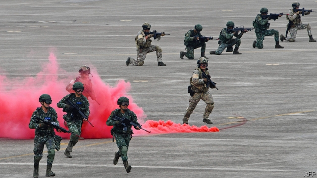

###### Dire straits

# China’s might is forcing Taiwan to rethink its military strategy 

##### It wants to become an indigestible “porcupine” 

 

> Jan 26th 2019 

 

TAIWAN “MUST and will” be reunited with the mainland, declared Xi Jinping, China’s president, on January 2nd. Chinese leaders have been saying such things since the retreating Nationalists separated the island from the rest of the country after losing the civil war to the Communists in 1949. But Mr Xi has done more than just talk: he has sent bombers and warships to circle the island, held live-fire drills in the narrow Taiwan Strait and, Taiwanese generals say, instructed the People’s Liberation Army (PLA) to be capable of seizing Taiwan by force by next year. Back in 1996, the most recent cross-strait crisis, China’s military spending was barely twice Taiwan’s. Now it is 15 times greater. That has left Taiwanese leaders rushing to rethink their defences. 

Taiwan already does a great deal to make itself indigestible to invaders. The island is “honeycombed with bunkers”, says Ian Easton of the Project 2049 Institute, an American think-tank. Tanks are hidden away in bustling neighbourhoods of Taipei. The Sun Yat-sen Memorial Highway Number One was built to handle not only rush-hour traffic, but also ten-tonne fighter jets, since the island’s airfields would quickly be destroyed by Chinese missiles should war break out. 

America, Taiwan’s closest military ally, has urged the island to move further towards a “porcupine strategy”. It wants Taiwan to acquire smaller, cheaper and more mobile weapons that could wear down Chinese forces close to Taiwan’s shores, in the place of big, lumbering and expensive kit such as warplanes and battleships, which are better suited to projecting firepower onto China’s mainland. 

Taiwanese planners have taken note. In 2017 the country’s top military officer launched the “Overall Defence Concept”. That strategy, endorsed by Tsai Ing-wen, the president, embraces the porcupine ethos. One priority is intelligent sea mines, which can scoot around and so evade sweeping. Some are more advanced than anything in America’s arsenal. Another focus is unmanned platforms, such as remote-controlled sentry guns to guard outlying islands and armed drones to patrol the coastline. Third is an emphasis on missiles. Taiwan is churning out Hsiung Feng cruise missiles by the hundreds. These can be placed not only on small, zippy speedboats rather than bulky destroyers, but also in unmarked lorries. Such rocket-laden vehicles are hidden “in places you cannot imagine”, says one official, and could continue to operate from anywhere on the road network long after invaders had obliterated Taiwan’s fighter jets. Better yet, they are far cheaper than warplanes. 

Yet not everyone is willing to jettison traditional ways of war. The new defence policy appeals to the president and her staff not only for its military virtues, but also because it favours the smaller systems that Taiwan can build itself. But the top brass has reasons beyond vanity to defend their shiny objects. 

They concede that heavy tanks, big ships and fancy warplanes may not survive a head-to-head conflict with China. But they act as a deterrent and boost morale. Missiles cannot fend off prowling Chinese bombers nor speedboats patrol stormy oceans. “Parades are a form of deterrence, certainly in Asia,” notes Drew Thompson, who used to help shape policy on Taiwan at America’s Department of Defence. “Big-ticket items parade well.” 

They also let Taiwan take the fight to China. Taiwan’s American-made frigates would eventually be blown out of the water, but not before their potent torpedoes might inflict serious damage on Chinese ships. That would not only boost the morale of islanders facing a hailstorm of missiles, it might also induce caution in Mr Xi. 

The problem is that showcase weapons are expensive. Even domestically built submarines—Taiwan hopes to make eight—cost more than $1bn apiece; the entire annual defence budget is just $11bn. Money is even tighter because Taiwan is scrapping conscription and shifting to an all-volunteer force. And since salaried soldiers are pricier, their numbers are fewer. Taiwan’s armed forces have shed more than 150,000 people since China’s cross-strait muscle-flexing in 1996, leaving 215,000. The country’s reserve force, its second line of defence, will also shrink with every passing year. Even so, any return to compulsory enlistment would be electoral suicide, politicians say. 

American arms, even big, expensive ones at odds with the porcupine philosophy, also serve a diplomatic purpose. America’s involvement in a war could be the difference between Taiwan’s survival and extinction. Just eight American submarines could sink 40% of China’s amphibious fleet in the first week of fighting, according to computer simulations by the RAND Corporation, a think-tank. 

Although America does not have diplomatic relations with Taiwan, it maintains close ties. Some 3,500-4,000 Pentagon officials travel to Taiwan every year, an average of more than ten per day. Arms sales have totalled more than $15bn since 2010. The relationship is deepening in some respects. Arms transfers were previously bundled into big packages that reliably aroused Chinese anger; they are now growing more routine. 

The administration of Donald Trump is stacked with senior officials who know Taiwan well and sympathise with its plight. Mr Trump delighted Taiwan’s leaders by holding a taboo-busting phone call with Ms Tsai when he was president-elect. Last year he also signed the Taiwan Travel Act, which encourages senior American officials to visit the island and vice versa. If arms sales help bolster America’s commitment to Taiwan, so much the better. 

Though Mr Xi clearly feels obliged to continue to hound Taiwan about reunification, he has thus far avoided laying down a firm timeline. The relatively slow growth of China’s amphibious fleet casts doubt on the idea that the PLA is working flat out to be ready to invade. Nor has it been conducting big amphibious exercises. There is still time for Taiwan to sharpen its quills. 

Correction (January 24th 2019): The original version of this article said that an average of more than 100 Pentagon officials travelled to Taiwan each day. Our maths let us down. Daily visitors from the Pentagon number “more than ten”. This has been corrected. 

-- 

 单词注释:

1.dire[daiә]:a. 可怕的, 悲惨的, 阴沉的, 极端的 

2.taiwan['tai'wɑ:n]:n. 台湾 

3.rethink[ri:'θiŋk]:v. 再想, 重想 

4.indigestible[.indi'dʒestәbl]:a. 不消化的, 难消化的, 难理解的 [医] 不消化的 

5.porcupine['pɒ:kjupain]:n. 豪猪 

6.Jan[dʒæn]:n. 一月 

7.taiwan['tai'wɑ:n]:n. 台湾 

8.reunite[.ri:ju:'nait]:v. (使)再联合 

9.xi[sai. zai. ksai. ksi:]:n. 希腊字母的第14个字母；粒子（等于xi particle） 

10.jinping[]:[网络] 锦屏县；习；锦屏网 

11.nationalist['næʃәnәlist]:n. 国家主义者, 民族主义者 

12.bomber['bɒmә]:n. 轰炸机, 投弹手 

13.warship['wɒ:ʃip]:n. 军舰, 战船 

14.taiwanese[,taiwɑ:'ni:z, -'ni:s]:a. 台湾人的；台湾的 

15.PLA[]:中国人民解放军 [计] 可编程序逻辑阵列 

16.invader[in'veidә]:n. 侵略者 [化] 侵入物 

17.honeycomb['hʌnikәum]:n. 蜂巢, 蜂房, 蜂窝 a. 蜂巢的 vt. 使成蜂巢状 vi. 变成蜂巢状 

18.bunker['bʌŋkә]:n. 煤仓, 沙坑, 暗堡 vt. 击入沙坑, 使陷入困境 

19.ian[iәn]:n. 伊恩（男子名） 

20.Easton['i:stən]:n. 伊斯顿（人名）；伊斯顿（美国地名） 

21.bustle['bʌsl]:n. 喧闹, 裙撑 vi. 奔忙, 喧闹 vt. 使忙碌, 催促 

22.taipei['tai'pei, -'bei]:n. 台北 

23.airfield['єәfi:ld]:n. 飞机场 

24.quickly['kwikli]:adv. 很快地 

25.ally['ælai. ә'lai]:n. 同盟者, 同盟国, 助手 vt. 使联盟, 使联合, 使有关系 vi. 结盟 

26.kit[kit]:n. 装备, 工具箱, 成套工具 [计] 成套部件; 成套零件 

27.warplane['wɒ:plein]:n. 军用飞机 

28.battleship['bætlʃip]:n. 战列舰, 主力舰 

29.firepower['faiәpauә]:n. 火力 

30.planner['plænә]:n. 计划者, 设计者, 安排者 [机] 刨床机 

31.endorse[in'dɒ:s]:vt. 支持, 赞同, 背书于, 签署 [经] 赞成, 背书 

32.tsai[]:n. 蔡（姓氏） 

33.ethos['i:θɔs]:n. 气质；民族精神；社会思潮 

34.scoot[sku:t]:vi. 快跑, 奔跑 

35.evade[i'veid]:v. (巧妙地)逃脱, 规避, 逃避 

36.arsenal['ɑ:snәl]:n. 兵工厂, 军械库 [机] 兵工厂 

37.unman[.ʌn'mæn]:vt. 使失去男子气概, 使怯懦, 使气馁 

38.sentry['sentri]:n. 哨兵, 看守 vt. 设岗哨 vi. 站岗, 放哨 

39.outlying['aut.laiiŋ]:a. 在外的, 边远的, 偏僻的, 题外的 

40.drone[drәun]:n. 雄蜂, 懒惰者, 嗡嗡的声音, 无人驾驶飞机(或船) vi. 嗡嗡作声, 混日子 vt. 低沉地说 

41.patrol[pә'trәul]:n. 巡逻, 巡逻员, 侦察队 v. 巡逻, 巡视 

42.coastline['kәustlain]:n. 海岸线 

43.churn[tʃә:n]:n. 搅乳器 v. 搅拌, 搅动 

44.hsiung[]:[网络] 熊；雄；熊姓 

45.feng[]:n. 冯（中文姓氏） 

46.cruise[kru:z]:n. 巡航, 巡弋, 漫游 v. 巡航, 巡弋, 漫游 

47.zippy['zipi]:a. 元气旺盛的, 敏捷的, 活泼的 

48.speedboat['spi:dbәut]:n. 高速游艇 

49.bulky['bʌlki]:a. 庞大的 [机] 庞大, 笨重 

50.destroyer[di'strɒiә]:n. 破坏者, 消灭者, 起破坏作用的东西, 驱逐舰 

51.unmarked[.ʌn'mɑ:kt]:a. 未被注意的, 无记号的, 无标志的 

52.cannot['kænɒt]:aux. 无法, 不能 

53.obliterate[ә'blitәreit]:vt. 擦去, 冲刷(掉), 消灭, 忘掉, 盖销(邮票等) [法] 灭迹, 消灭, 涂抹 

54.jettison['dʒetisәn]:n. 投弃, 投弃货物 [经] 抛弃, 船货投海 

55.shiny['ʃaini]:a. 有光泽的, 发光的, 辉煌的, 磨光的, 磨损的 

56.concede[kәn'si:d]:vt. 承认, 退让 vi. 让步 

57.deterrent[di'tә:rәnt]:a. 制止的, 威慑的, 遏制的 n. 威慑力量(或因素), 制止物 

58.morale[mɒ'rɑ:l]:n. 士气, 道德 

59.fend[fend]:vt. 击退, 保护, 供养 

60.prowl[praul]:n. 潜行, 徘徊, 悄悄踱步 vi. 潜行以觅食, 徘徊 vt. 徘徊 

61.deterrence[di'tә:rәns]:n. 威慑, 威慑力量 [法] 威慑力量, 制止物 

62.thompson['tɔmpsn]:n. 汤普森（姓） 

63.frigate['frigit]:n. 装有大炮的快速帆船, 护卫舰 

64.potent['pәutnt]:a. 有力的, 有说服力的, 有效的 [医] 有力的, 有性交能力的 

65.inflict[in'flikt]:vt. 施以, 加害, 使承受 [法] 处, 加, 予以 

66.islander['ailәndә]:n. 岛民 

67.hailstorm['heilstɒ:m]:n. 雹暴 

68.induce[in'dju:s]:vt. 引诱, 招致, 归纳出, 感应 [医] 诱导, 感应 

69.showcase['ʃәukeis]:n. 陈列橱 [经] 商品陈列所, 货物陈列架 

70.domestically[dәu'mestikli]:adv. 家庭式地, 国内地 

71.apiece[ә'pi:s]:adv. 就每个而论, 各 

72.scrap[skræp]:n. 碎片, 残余物, 些微, 片断, 铁屑, 吵架 vt. 扔弃, 敲碎, 拆毁 vi. 互相殴打 a. 零碎拼凑成的, 废弃的 

73.conscription[kәn'skripʃәn]:n. 征兵, 募兵, 征用(制度) [法] 征兵, 征用 

74.salaried['sælәrid]:a. 拿薪水的, 拿薪金的, 有薪金的, 有薪水的 [经] 有薪金的, 拿薪金的 

75.pricy['praisi]:a. 昂贵的, 价格高的 

76.enlistment[in'listmәnt]:n. 征募, 服役期限 

77.electoral[i'lektәrәl]:a. 选举人的, 选举的, (有关)选举的 [法] 选举的, 选举人的, 由选举人组成的 

78.suicide['sjuisaid]:n. 自杀, 自杀者 v. 自杀 a. 自杀的 

79.odds[ɒdz]:n. 可能性, 几率, 机会, 胜算, 不平等 

80.diplomatic[.diplә'mætik]:a. 外交的, 老练的 [法] 外交的, 外交上的, 文献上的 

81.involvement[in'vɔlvmәnt]:n. 卷入, 牵连, 包含, 困窘 [经] 财政困难, 经济上的困窘 

82.extinction[ik'stiŋkʃәn]:n. 消失, 消灭, 废止 [化] 消光; 熄灭 

83.amphibious[æm'fibiәs]:a. 水陆两栖的, 能两栖作战的, 陆海空军协同作战的 [医] 两栖的 

84.simulation[.simju'leiʃәn]:n. 模拟, 假冒物, 模仿 [计] 模拟 

85.rand[rænd]:n. 兰特, (非正式)边, 田埂, 缘 [经] 兰特 

86.pentagon['pentәgәn]:n. 五角形, 五边形 [经] 五角平台 

87.reliably[ri'laiәbli]:adv. 可靠地, 可信赖地 

88.donald['dɔnәld]:n. 唐纳德（男子名） 

89.trump[trʌmp]:n. 王牌, 法宝, 喇叭 vt. 打出王牌赢, 胜过 vi. 出王牌, 吹喇叭 

90.sympathise['simpәθaiz]:vi. 同情, 表示同情, 同感, 一致, 共鸣, 同意, 赞同, 赞成, 吊唁, 吊慰 

91.plight[plait]:n. 困境, 窘境 vt. 宣誓, 保证 

92.versa[]:a. 反的 

93.bolster['bәulstә]:n. 支持, 长枕 vt. 支持, 支撑 

94.hound[haund]:n. 猎犬 vt. 带猎犬狩猎, 追捕, 激励, 使追逐 

95.reunification[,ri:ju:nifi'keiʃәn,ri:,ju:-]:n. 使重新统一, 使重新团结 

96.timeline[ˈtaɪmlaɪn]:n. 时间轴, 时间表 

97.quill[kwil]:n. 羽根, 大翎毛, 羽毛笔 vt. 刺穿 

