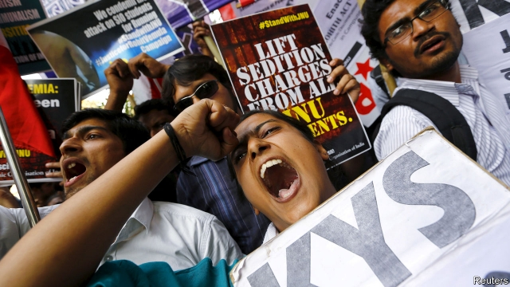

###### Roiled academy

# Hindu nationalists take aim at a hallowed Indian university 

##### Faculty and students are in open rebellion at Jawaharlal Nehru University 

 

> Jan 24th 2019 

 

YEAR AFTER year Jawaharlal Nehru University (JNU) scores among the top three of some 1,000 universities ranked by India’s government. Holders of its degrees thickly populate the upper echelons of academia and government. Yet its 7,000 students and 600 faculty are bursting with complaints. The atmosphere on campus in New Delhi is “stifling”. JNU is “being driven into the ground”, “muzzled and leashed” and “under systematic assault”. Earlier this month 49 MPs signed a letter to the minister of higher education complaining that the university was being “destroyed”. 

Things began to change in 2016, with the government’s appointment of Mamidala Jagadesh Kumar, a professor of electrical engineering, to head the university. Within days the new vice-chancellor found himself embroiled in controversy as Hindu nationalist groups mounted a fierce campaign against JNU, accusing its students of having chanted unpatriotic slogans at a campus protest. Ten students have been charged with sedition. Instead of defending them, Mr Kumar has acted as if the university was indeed in need of more patriotic spirit and discipline. He invited hawkish ex-generals and bellicose religious figures to lecture, and proposed installing a tank on campus to inspire martial pride. 

Under his leadership, JNU’s administration has ended a tradition of consultation with students and faculty, and ruled instead by command enforced by punishment. Although JNU is a research institution rather than a teaching university, professors have been ordered to register attendance at classes, and to clock themselves in for work, too. National rules that limit the number of doctoral candidates any professor can supervise have been enforced, slashing the intake of new students by two-thirds, leaving faculty idle and sabotaging JNU’s longstanding policy of encouraging applications from people of low caste and other disadvantaged groups. A new policy will replace all entrance tests for graduate-level studies, including a cherished system of challenging essays, with multiple-choice questions. 

Routine requests for teachers to attend conferences or do field research are now rigorously scrutinised and frequently denied. One frustrated professor flew to Bangalore in southern India to receive a prestigious award, only to discover on arrival that permission to go had been withheld. 

Despite an exposé by students, which revealed that four new faculty members had plagiarised large parts of their theses, no investigation or disciplinary action was taken against them. The university has meanwhile bestowed honorary lectureships on Rajiv Malhotra and Subhash Kak, Indians resident in America who are known for attacking Western scholarship on India and for espousing controversial views on ancient Indian science. 

Both students and faculty have reacted with fury to the changes. Fully 93% of JNU’s teachers’ union voted in August to demand Mr Kumar’s resignation—to no avail. Students have mounted flash-mob protests and produced a film detailing the vice-chancellor’s failings. Students and faculty have also challenged new rules in court. 

Mr Kumar, however, has the solid backing of the Rashtriya Swayamsevak Sangh, the patriarch of India’s “family” of Hindu-nationalist organisations. For decades such groups have agitated against what they see as a “left-liberal” stranglehold on the establishment. With the victory in national elections in 2014 of another family member, the Bharatiya Janata Party (BJP), JNU has come under fire. 

Judging from some online commentary by the BJP’s supporters, the changes have not gone far enough. “A surgical strike is a must on JNU,” screeches one recent tweet. Another labels JNU a “Refuge of Anti National elements and Commie goons who are enjoying life at taxpayers’ money [that] should be razed to ground.” With an election looming in the spring that could return the BJP for five more years, it is not hard to see why the mood at JNU is grim. A professor who is also a graduate declares he will leave if the BJP gets re-elected: “As much as I love this place, I can’t be beholden to their looniness.” 

-- 

 单词注释:

1.roil[rɒil]:vt. 搅浑, 使焦急 

2.Hindu['hindu:]:a. 印度教教徒的 n. 印度教教徒 

3.nationalist['næʃәnәlist]:n. 国家主义者, 民族主义者 

4.hallow['hælәu]:vt. 使...神圣, 视为神圣 n. 圣徒 

5.jawaharlal[]:[网络] 下巴哈拉尔 

6.nehru['neiru:]:n. 尼赫鲁（前印度总理） 

7.Jan[dʒæn]:n. 一月 

8.holder['hәuldә]:n. 持有人, 所有人, 支持物 [化] 夹持器; 夹具; 贮罐 

9.thickly[]:adv. 厚地；浓地 

10.populate['pɔpjuleit]:vt. 使人口聚居在...中, 殖民于, 移民于, 居住于, 定居于 

11.echelon['eʃәlɒn]:n. 梯形, 梯阵, 梯次编队 vt. 排成梯队 vi. 形成梯队 

12.academia[.ækә'di:miә]:n. 学术界, 学术生涯 

13.delhi['deli]:n. 德里（印度城市名） 

14.stifle['staifl]:vt. 使窒息, 抑止, 扼杀 vi. 窒息, 被扼杀 

15.muzzle['mʌzl]:n. 动物之鼻口, 口套, 枪口 vt. 戴口套于, 使缄默 

16.leash[li:ʃ]:n. (拴狗颈的)皮带 vt. 以皮带束缚, 束缚 

17.assault[ә'sɒ:t]:n. 攻击, 袭击 vt. 袭击, 攻击 vi. 发动攻击 

18.MP[]:国会议员, 下院议员 [计] 宏处理程序, 维护程序, 线性规划, 微程序, 多处理器 

19.Kumar[]:n. 库马尔（姓氏） 

20.embroil[im'brɒil]:vt. 使卷入, 牵连 

21.controversy['kɒntrәvә:si]:n. 论争, 辩论, 论战, 争论 [法] 论战, 争论, 争吵 

22.unpatriotic['ʌn.peitri'ɒtik]:a. 不爱国的, 无爱国心的 

23.sedition[si'diʃәn]:n. 煽动骚乱, 暴动, 妨害治安, 骚动 [法] 煽动, 煽动叛逆罪, 暴动 

24.patriotic[.peitri'ɒtik]:a. 爱国的, 有爱国心的 [法] 爱国的, 有爱国心的 

25.hawkish['hɒ:kiʃ]:a. 像鹰的, 鹰派的, 强硬派的 

26.bellicose['belikәus]:a. 好战的, 好斗的 [法] 好战的 

27.martial['mɑ:ʃәl]:a. 战争的, 军事的, 尚武的, 威武的 [医] 含铁的 

28.consultation[.kɒnsәl'teiʃәn]:n. 请教, 咨询, 磋商会 [医] 会诊 

29.attendance[ә'tendәns]:n. 出席, 出席的人数, 照料 [法] 管理, 照料, 资助 

30.doctoral['dɒktәrәl]:a. 博士的 

31.supervise['sju:pәvaiz]:v. 监督, 管理, 指导 

32.slash[slæʃ]:v. 猛砍, 乱砍 n. 猛砍, 乱砍, 删减 [计] 斜线 

33.intake['inteik]:n. 入口, 吸入, 吸入量 [医] 摄取量 

34.sabotage['sæbәtɑ:ʒ]:n. 怠工, 破坏活动, 破坏 vi. 从事破坏活动 vt. 妨害, 破坏 

35.longstanding['lɔŋ'stændiŋ;'lɔ:ŋ-]:a. 长期间的, 长期存在的 

36.caste[kæst. kɑ:st]:n. 印度的种姓制度, (排他的)社会团体 

37.cherish['tʃeriʃ]:vt. 珍爱, 怀有, 爱护 

38.rigorously[]:adv. 严厉地；残酷地 

39.scrutinise[]:vt.vi. 细看, 仔细检查, 审查, 细阅 [经] 详细检查, 细细地看 

40.Bangalore[,bæŋ^ә'lɔ:]:n. 炸药桶 

41.prestigious[pre'stidʒiәs]:a. 享有声望的 

42.withhold[wið'hәuld]:vt. 使停止, 扣留, 保留, 拒给 vi. 克制, 忍住 

43.plagiarise['pleidʒiәraiz]:vi.vt. 剽窃, 抄袭 

44.thesis['θi:sis]:n. 论题, 论文 

45.disciplinary['disiplinәri]:a. 训练的, 纪律的, 训诫的 [法] 纪律的, 惩戒性的 

46.bestow[bi'stәu]:vt. 授予, 使用, 贮藏, 留宿 

47.honorary['ɒnәrәri]:a. 荣誉的, 无报酬的, 道义上的 [法] 名誉的, 荣誉的 

48.lectureship['letʃәʃip]:n. 讲师职务 

49.Rajiv[]:n. (Rajiv)人名；(印)拉吉夫 

50.malhotra[]:n. (Malhotra)人名；(印、芬、尼)马尔霍特拉 

51.kak[]:n. (Kak)人名；(伊朗)卡克；(东南亚国家华语)角 

52.espouse[i'spauz]:vt. 支持, 赞成, 嫁, 娶 [法] 娶, 出嫁, 信奉 

53.fury['fjuri]:n. 愤怒, 狂暴, 狂怒的人 [医] 狂乱, 狂暴, 狂怒 

54.fully['fuli]:adv. 十分地, 完全地, 充分地 

55.avail[ә'veil]:vi. 有用, 有利 vt. 有利于 n. 效用, 利益 

56.failing['feiliŋ]:n. 失败, 缺点 prep. 如果没有... a. 失败的 

57.rashtriya[]:[网络] 拉什特里亚 

58.Sangh[sʌŋ^]:n. (印度的)协会,联合会(尤指政治或劳工组织) 

59.patriarch['peitriɑ:k]:n. 创办人, 家长, 元老, 教长, (天主教)教皇 [法] 家长, 族长, 创始人 

60.organisation[,ɔ: ^әnaizeiʃən; - ni'z-]:n. 组织, 团体, 体制, 编制 

61.agitate['ædʒiteit]:vt. 使摇动, 搅动, 使激动, 使不安 vi. 鼓动, 煽动 

62.stranglehold['stræŋglhәuld]:n. 勒颈, 压制自由, 抑制, 束缚 

63.Bharatiya[]:[网络] 巴拉蒂亚 

64.Janata['dʒʌnətɑ:]:n. （印度）人民团体；人民党（印度联合政党） 

65.bjp[]: [医][=Bence Jones protein]本周（氏）蛋白，凝溶蛋白 

66.online[]:[计] 联机 

67.commentary['kɒmәntәri]:n. 注释, 评论, 说明 [法] 注释, 评注, 评论 

68.supporter[sә'pɒ:tә]:n. 支持者, 后盾, 迫随者, 护身织物 [法] 支持者, 赡养者, 抚养者 

69.surgical['sә:dʒikl]:a. 外科的, 外科医生的, 手术上的 n. 外科病例, 外科病房, 外科手术 

70.screech[skri:tʃ]:n. 尖声喊叫, 尖叫声, 煞车声 vt. 尖声讲 vi. 发出尖声 

71.tweet[twi:t]:vi. 啁啾 n. 小鸟叫声 

72.anti['ænti]:n. 反对者, 反对论者 a. 反对的 

73.commie['kɒmi]:n. 共产党员 

74.goon[gu:n]:n. 受雇暴徒, 愚笨者, 呆子 

75.raze[reiz]:vt. 毁灭, 刮去, 把...夷为平地, 消除, 抹去, 破坏 

76.loom[lu:m]:n. 织布机, 若隐若现的景象 vi. 朦胧地出现, 隐约可见, 可怕地出现 

77.grim[grim]:a. 冷酷的, 坚强的, 残忍的, 可怕的, 讨厌的 

78.beholden[bi'hәudәn]:a. 负有义务的, 受惠的 

79.looniness[]:疯狂 疯子 

