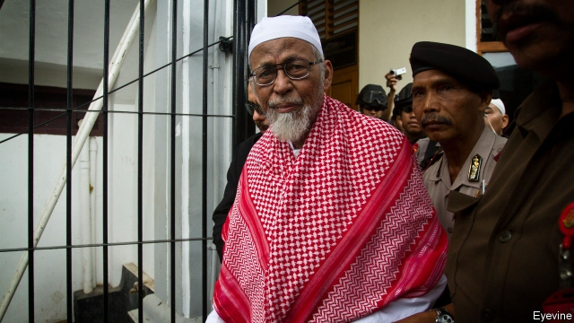

###### Undeserving

# Indonesia’s president toys with releasing a terrorist ideologue 

##### Abu Bakar Basyir founded the group behind five deadly bombings 

 

> Jan 24th 2019 

 

ABU BAKAR BASYIR founded Jemaah Islamiah, the group responsible for Indonesia’s deadliest terrorist attack. In 2002 bombs ripped through two nightspots packed with revellers on the island of Bali, killing 202. Between 2003 and 2009 JI staged four more large bombings in Indonesia, claiming more than 50 lives. Many of its members are dead or behind bars, including Mr Basyir, its chief ideologue, who was sentenced to 15 years in prison in 2011 for financing a terrorist training camp. 

On January 18th, however, Indonesia’s president, Joko Widodo, known as Jokowi, said that the 81-year-old preacher would be released early on “humanitarian” grounds, owing to poor health. Yusril Mahendra, a legal adviser to Jokowi, said the decision was proof that the president is not hostile to devout Muslims. 

Jokowi, a Muslim himself, is standing for re-election in April. His political opponents have long smeared him as troublingly irreligious. To counter those claims, Jokowi has chosen Ma’ruf Amin, a prominent 75-year-old cleric, as his running-mate this time. Other conservative figures have been put on the government payroll in an attempt to quell their criticism. Many saw Jokowi’s decision to free Mr Basyir as another attempt to appease the Islamists—even though there was no great clamour for his release. 

But Mr Basyir has never renounced violent extremism. He refuses to accept pancasila, Indonesia’s founding principles, which enshrine democracy and a degree of freedom of religion—normally a precondition for convicted terrorists seeking clemency. Mr Basyir’s son said that his father would resume preaching if released. Sidney Jones, an expert on Indonesian militants, thinks Mr Basyir’s status would be elevated if he were set free: “It would send a message that promoting violence, rejecting democracy and spreading hatred of non-Muslims are all forgivable.” 

Many Indonesians howled at the announcement, as did the government of Australia (88 Australians died in the bombing in 2002). Jokowi appears to be reconsidering: he now says Mr Basyir would have to agree to certain conditions before he could be released, including accepting pancasila, which he is unlikely to do. But the damage to the president’s reputation as a bulwark against the spread of extremism in Indonesia is already done. 

-- 

 单词注释:

1.undeserving[.ʌndi'zә:viŋ]:a. 不配受到的, 不值得...的 

2.terrorist['terәrist]:n. 恐怖分子 [法] 恐怖份子, 恐怖主义 

3.ideologue['aidi:әulɔ^]:n. 理论家, 思想家,空想家 

4.abu[]:abbr. 亚洲广播联盟（Asian Broadcast Union） 

5.bakar[]:n. (Bakar)人名；(阿拉伯、毛里塔、巴基、土)巴卡尔 

6.bombing['bɔmiŋ]:n. 轰炸, 投弹 

7.Jan[dʒæn]:n. 一月 

8.abu[]:abbr. 亚洲广播联盟（Asian Broadcast Union） 

9.bakar[]:n. (Bakar)人名；(阿拉伯、毛里塔、巴基、土)巴卡尔 

10.islamiah[]:[网络] 伊斯兰教 

11.rip[rip]:n. 裂痕, 破绽, 拉裂, 浪子, 巨浪 vi. 被拉开, 裂开, 猛冲 vt. 撕, 扯, 劈 

12.nightspot[ˈnaɪtspɒt]:n. 夜总会; 夜点 

13.reveller['revlә]:n. 狂欢者, 欢宴者 

14.Bali['bɑ:li]:n. 巴厘岛 

15.ji[]:abbr. 共同减量（Joint Implementation）；亚洲的一个恐怖组织（Jemaah Islamiyah） 

16.Indonesia[.indәu'ni:ʒә]:n. 印尼 

17.Joko[]:[网络] 佐戈；上甲；彩绘阿祥 

18.widodo[]:[网络] 阿斯 

19.Jokowi[]:[网络] 佐科威；省长佐科威；雅加达市长 

20.preacher['pri:tʃә]:n. 传道士, 讲道者, 牧师 

21.humanitarian[hju:.mæni'tєәriәn]:n. 人道主义者, 博爱者, 基督凡人论者 a. 人道主义的, 博爱的, 凡人论的 

22.mahendra[]:[网络] 马亨德拉；摩哂陀；马亨德拉国王 

23.adviser[әd'vaizә]:n. 顾问, 劝告者, 指导教师 [法] 顾问, 劝告者 

24.devout[di'vaut]:a. 虔诚的, 虔敬的, 诚恳的 

25.Muslim['mjzlim; (?@) 'mʌzlem]:n. 伊斯兰教, 伊斯兰教教徒 

26.Muslim['mjzlim; (?@) 'mʌzlem]:n. 伊斯兰教, 伊斯兰教教徒 

27.smear[smiә]:vt. 涂, 擦上, 玷污, 把...擦模糊 vi. 被弄脏 n. 污点, 污迹, 污蔑 

28.troublingly[]:adv. trouble的变形 

29.irreligious[.iri'lidʒәs]:a. 无宗教的, 反宗教的, 无信仰的 

30.amin[]:n. 阿敏（七十年代乌乾达的独裁者） 

31.cleric['klerik]:a. 牧师的, 教士的 

32.payroll['peirәul]:n. 工资名单, 饷金名单, 发放的工资总额 [计] 工资表, 工资单 

33.quell[kwel]:vt. 压制, 平息, 减轻 

34.appease[ә'pi:z]:vt. 抚慰, 缓解, 平息, 姑息 [法] 使和缓, 使满足, 姑息 

35.clamour['klæmә]:n. 喧闹 v. 大声地要求 

36.renounce[ri'nauns]:vt. 拒绝, 放弃, 否认, 垫牌 vi. 垫牌, 声明放弃权利 n. 垫牌 

37.extremism[ik'stri:mizm]:n. 极端倾向, 极端论, 过激主义 

38.pancasila[]:[网络] 潘查希拉；五戒；立国五原则 

39.enshrine[in'ʃrain]:vt. 入庙祀奉, 铭记 

40.precondition[.pri:kәn'diʃәn]:vt. 事先准备, 事先处理 n. 先决条件, 前提 [计] 前置条件 

41.convict[kәn'vikt]:n. 囚犯, 罪犯 vt. 宣告有罪, 使知罪 

42.clemency['klemәnsi]:n. 仁慈, 宽厚, 仁厚 

43.preach[pri:tʃ]:v. 传道, 讲道, 说教, 宣讲, 鼓吹 n. 说教, 布道 

44.sidney[]:n. 西德尼（男子名）；茜德尼（女子名） 

45.jones[dʒәunz]:n. 琼斯（姓氏） 

46.Indonesian[.indәu'ni:ʒәn]:a. 印尼的 n. 印尼人, 印尼语群 

47.militant['militәnt]:a. 好战的 

48.statu[]:[网络] 状态查看；雕像；特级雪花白 

49.elevate['eliveit]:vt. 举起, 提拔, 鼓舞 

50.forgivable[fә'givәbl]:a. 可宽恕的 [法] 可宽恕的 

51.Indonesian[.indәu'ni:ʒәn]:a. 印尼的 n. 印尼人, 印尼语群 

52.bulwark['bʌlwәk]:n. 保障, 壁垒, 防波堤 

