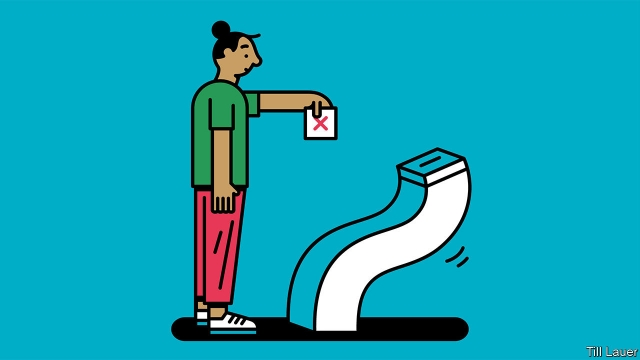

###### Banyan

# The road to democracy in Asia is full of twists and turns 

##### But at least there are reversals for autocrats, too 

 

> Jan 24th 2019 

 

IT CAN BE hard to keep track of the ups and downs of politics in some Asian countries. The Maldives, for example. For decades it was a dictatorship under Maumoon Abdul Gayoom. Then in 2008 he allowed democratic elections, which were won, to general surprise, by Mohamed Nasheed, a former political prisoner. Democracy soon appeared to take a step backwards, however, when Mr Nasheed was forced out of office in murky circumstances in 2012. Soon after, Mr Gayoom’s half-brother, Abdulla Yameen, came to power. He carefully entrenched his rule, locking up all manner of opponents, from the chief justice to Mr Gayoom himself. 

Yet in elections last September the Maldives’ political trajectory took another unexpected turn: Maldivians dismissed Mr Yameen, giving Ibrahim “Ibu” Mohamed Solih, a stolid ally of Mr Nasheed, over 58% of their votes. Rumours of the death of Maldivian democracy proved exaggerated. 

During a long period of exile from the Maldives, Mr Nasheed had taken refuge in nearby Sri Lanka. Public life there, too, has been full of surprises lately. Although local politics had been racked by bombings, assassinations and a long conflict with Tamil separatists, democracy itself did not seem to be in peril until the end of the civil war. Mahinda Rajapaksa, the president at the time, became increasingly dictatorial after crushing the Tamil rebels in 2009. One of his brothers controlled parliament, another the economy ministry, a third the armed forces. But when his health minister, Maithripala Sirisena, switched sides to become the opposition’s presidential candidate in 2015, the picture suddenly changed. Promising liberal reforms, an end to corruption and a curtailment of the president’s powers, Mr Sirisena won. 

The outlook veered wildly again in October, when Mr Sirisena, increasingly erratic, sparked a constitutional crisis by sacking the prime minister, Ranil Wickremesinghe, and appointing Mr Rajapaksa in his place. The president was not empowered to dismiss him, but never mind: he also suspended parliament, forming, in effect, a parallel government. Activists wailed, but there was a happy resolution. In December the Supreme Court unanimously ruled that the dissolution of parliament was unconstitutional. Mr Sirisena suffered the indignity of having to swear Mr Wickremesinghe in afresh. Mr Rajapaksa slunk off the scene again. The world appeared to have been set to rights. 

There are bound to be more lurches. Unscrupulous politicians who have done much to debase the Maldives’ politics are already returning. Among Mr Solih’s unlikely new allies are Mohamed Nazim, who encouraged the police and army to mutiny against Mr Nasheed in 2012, and Qasim Ibrahim, a resort-owner who, as finance minister under Mr Gayoom, lent himself the equivalent of a third of the central bank’s capital. Meanwhile, Mr Yameen walks free while Mr Solih has presented Mr Gayoom with a “Golden Pen” award for services to journalism. 

Many in Sri Lanka see it as only a matter of time before Mr Rajapaksa returns to power. Mr Wickremesinghe, although the dogged defender of democratic norms in the recent upheaval, is much less personable and popular. Moreover, his government’s reforms, although in many cases necessary, are widely reviled. It would be natural for voters to turn again to Mr Rajapaksa, the hero of the civil war, in spite of his disregard for democratic niceties. 

Encouragingly, however, strongman rule receives its share of reversals too. Think of Malaysia, where since the country’s founding the rule of law was steadily eroded by an ever more authoritarian ruling coalition. Last year voters kicked out the thoroughly rotten prime minister, Najib Razak, despite blatant gerrymandering, a pliant election commission and lavish handouts to various categories of voters. Like Messrs Yameen and Rajapaksa, Mr Najib doubtless assumed that the election was in the bag. Who would have thought that Malaysia’s institutions remained robust enough to count the votes fairly? You never know, it turns out, when previously supine courts or quiescent voters or biddable MPs will show unexpected resolve. 

Of course, travel has been largely in the opposite direction in recent years in Asia. There are the generals trying to rig elections in Thailand, the prime minister gradually squelching the opposition in Bangladesh, the president tightening his grip on Kyrgyzstan. Banyan cannot imagine what would unseat them—and neither can they. 

-- 

 单词注释:

1.banyan['bænjәn]:n. 印度榕树 [医] 榕树, 孟加拉榕 

2.reversal[ri'vә:sl]:n. 翻转, 颠倒, 反转 [医] 逆转, 颠倒 

3.autocrat['ɒ:tәkræt]:n. 独裁者 

4.Jan[dʒæn]:n. 一月 

5.politic['pɒlitik]:a. 精明的, 明智的, 策略的 

6.Maldives['mɔ:ldaivz, 'mæl-]:马尔代夫(群岛)[亚洲岛国] 

7.dictatorship[dik'teitәʃip]:n. 独裁者之职位, 独裁, 独裁政权 [法] 专攻, 独裁权 

8.Maumoon[]:[网络] 穆蒙 

9.abdul[]:n. 阿卜杜勒（人名） 

10.Gayoom[]:[网络] 加尧姆 

11.Mohamed[]:n. (Mohamed)人名；(阿拉伯)穆罕默德； 

12.nasheed[]:[网络] 前总统纳西德；马尔代夫总统纳希德；伊斯兰音乐 

13.backwards['bækwәdz]:adv. 向后 

14.murky['mә:ki]:a. 黝暗的, 阴沉的, 朦胧的 

15.abdulla[]:n. (Abdulla)人名；(阿拉伯)阿卜杜拉；(伊朗、阿塞、哈萨、塔吉、吉尔、乌兹、土库)阿卜杜拉 

16.Yameen[]:[网络] 亚岷 

17.carefully['kєәfuli]:adv. 小心地, 谨慎地 

18.entrench[in'trentʃ]:vt. 围以壕沟, 防护, 保卫, 使处于牢固地位 vi. 掘壕, 侵犯 

19.trajectory[trә'dʒektri]:n. 轨道, 弹道, 轨线 [化] 轨道 

20.unexpect[]:[网络] 意想不到；使意外 

21.Maldivian[mɔ:l'diviәn, mæl-]:a. 马尔代夫(群岛)的,马尔代夫人的  n. 马尔代夫人[语] 

22.Ibrahim[]:n. 易卜拉欣（与阿丹、努哈、穆萨、尔撒和穆罕默德并称为安拉的六大使者, 亦系犹太教和基督教推崇的圣人和希伯来人的祖先） 

23.ibu[]:n. International Biathlon Union 国际冬季两项全能联盟 

24.stolid['stɒlid]:a. 缺乏热情的, 神经麻木的 

25.ally['ælai. ә'lai]:n. 同盟者, 同盟国, 助手 vt. 使联盟, 使联合, 使有关系 vi. 结盟 

26.Maldivian[mɔ:l'diviәn, mæl-]:a. 马尔代夫(群岛)的,马尔代夫人的  n. 马尔代夫人[语] 

27.exile['eksail]:n. 放逐, 流放, 被放逐者 vt. 放逐, 流放, 使背井离乡 

28.sri[sri]:n. 斯里兰卡（Sri Lanka）；（拉）神圣罗马帝国（Sacrum Romanum Imperium） 

29.lanka[]:n. 兰卡；楞伽 

30.bombing['bɔmiŋ]:n. 轰炸, 投弹 

31.assassination[ә.sæsi'neiʃәn]:n. 暗杀 [法] 暗杀, 行刺 

32.Tamil['tæmil]:n. 泰米尔人, 泰米尔语 

33.separatist['sepәreitist]:n. 分离主义者, 独立派 

34.peril['peril]:n. 危险, 冒...之险, 险境, 险因 vt. 置...于险境, 冒险, 危及 

35.mahinda[]:[网络] 摩哂陀；阿育王之子玛兴达；马兴达 

36.rajapaksa[]:[网络] 斯里兰卡总统拉贾帕克萨 

37.dictatorial[diktә'tɒ:riәl]:a. 独裁者的, 独裁的, 独断的 

38.Maithripala[]:[网络] 迈特里帕拉 

39.Sirisena[]:n. (Sirisena)人名；(斯里)西里塞纳 

40.presidential[.prezi'denʃәl]:a. 总统制的, 总统的, 首长的, 统辖的 [法] 总统的, 议长的, 总经理的 

41.corruption[kә'rʌpʃәn]:n. 腐败, 堕落, 贪污 [计] 论误 

42.curtailment[kә: 'teilmәnt]:n. 缩减, 缩短 [经] 削减, 紧缩 

43.veer[viә]:vi. 转向 vt. 使转向 n. 转向 

44.wildly[]:adv. 狂暴地, 激动地, 狂热地, 鲁莽地, 轻率地 

45.erratic[i'rætik]:n. 古怪的人, 漂泊无定的人 a. 不稳定的, 奇怪的 

46.constitutional[.kɒnsti'tju:ʃәnl]:a. 宪法的, 立宪的, 体质的 [医] 全身的; 体质的 

47.Ranil[]:拉尼尔 

48.Wickremesinghe[]:n. 维克勒马辛哈 

49.empower[im'pauә]:vt. 授予权力, 允许, 使能够 [法] 授权, 准许, 转委 

50.activist['æktivist]:n. 激进主义分子 

51.wail[weil]:n. 恸哭, 哀号, 嚎啕, 呼啸(声) vi. 恸哭, 呼啸, 悲叹, 哀号, 嚎啕 

52.unanimously[]:adv. 全体一致, 无异议, 一致同意 

53.dissolution[.disә'lu:ʃәn]:n. 分解, 溶解, 解散, 结束 [化] 溶解; 溶解作用 

54.unconstitutional['ʌnkɔnsti'tju:ʃәnәl]:a. 违反宪法的, 不符合宪法的 [法] 违反宪法的, 违宪的, 不合宪法规定的 

55.indignity[in'digniti]:n. 侮辱 [法] 侮辱的言行, 无礼, 有伤尊严 

56.afresh[ә'freʃ]:adv. 重新 

57.slink[sliŋk]:vi. 鬼鬼祟祟地走, (动物)早产 vt. 早产 n. 鬼鬼祟祟的人, 早产的动物 a. 早产的 

58.lurch[lә:tʃ]:n. 惨败, 倾斜, 挫折, 举步蹒跚, 徘徊 vi. 惨败, 倾斜, 徘徊 vt. 击败 

59.unscrupulous[.ʌn'skru:pjulәs]:a. 无道德原则的, 不审慎的, 肆无忌惮的 

60.debase[di'beis]:vt. 贬低, 降低 

61.nazim['nɑ:zim]:n. 警察总长(印度和伊斯兰教各国高级警官), 督军 

62.mutiny['mju:tini]:n. 叛变, 兵变 vi. 叛变, 反抗, 暴动 

63.qasim[]:n. 卡西姆（巴基斯坦港口） 

64.journalism['dʒә:nәlizm]:n. 新闻业, 报章杂志 [法] 报刊, 新闻业, 新闻出版 

65.defender[di'fendә]:n. 防卫者, 防护者, 辩护者 [法] 辩护人, 保护人 

66.norm[nɒ:m]:n. 基准, 模范, 标准, 准则, 平均数 [化] 定额 

67.upheaval[ʌp'hi:vl]:n. 举起, 隆起, 大变动, 剧变 

68.les[lei]:abbr. 发射脱离系统（Launch Escape System） 

69.personable['pә:snәbl]:a. 风度好的, 讨人喜欢的, 具有行为能力的 

70.revile[ri'vail]:v. 辱骂, 斥责 

71.voter['vәutә]:n. 选民, 投票人 [法] 选民, 选举人, 投票人 

72.disregard[.disri'gɑ:d]:n. 忽视, 漠视 vt. 忽视, 不顾 

73.nicety['naisәti]:n. 美好, 准确, 精密, 拘泥细节, 纤细 

74.encouragingly[ɪn'kʌrɪdʒɪŋlɪ]:adv. 鼓励地, 勉励人地 

75.strongman[ˈstrɒŋmæn]:n. 大力士 

76.Malaysia[mә'leiziә]:n. 马来西亚 [经] 马来西亚 

77.erode[i'rәud]:vt. 腐蚀, 侵蚀 vi. 受腐蚀 

78.authoritarian[ɒ:.θɒri'tєәriәn]:a. 独裁的, 独裁主义的 

79.coalition[.kәuә'liʃәn]:n. 结合体, 结合, 联合 [经] 联合, 联盟 

80.thoroughly['θʌrәli]:adv. 彻底地, 绝对地, 透彻地, 详尽地, 周到地, 完全地, 完善地, 全面地 

81.najib[]:n. 纳吉彼; 纳吉布; 纳吉（人名） 

82.razak[]:[网络] 拉扎克；拉萨家族；总理拉紮克 

83.blatant['bleitәnt]:a. 喧嚣的, 吵闹的, 俗丽的, 炫耀的 

84.gerrymander['dʒerimændә]:vt. 为政党利益改划选区 vi. 不公正地划分选区 n. 改变选举区 

85.pliant['plaiәnt]:a. 易弯的, 柔韧的, 柔顺的 

86.lavish['læviʃ]:a. 大方的, 丰富的, 浪费的 vt. 浪费, 滥用, 慷慨给予 

87.handout['hændaut]:n. 施舍物, 救济品, 分发的印刷品资料, 广告物品 

88.Messrs['mesәz]:[法][pl. ](=Messieurs)各位(先生) 

89.robust[rәu'bʌst]:a. 健康的, 强健的, 要用力气的, 坚定的, 粗野的 [计] 健壮性 

90.supine[sju:'pain]:a. 仰卧的, 掌心向上的, 懒散的 [医] 仰卧的, 旋后的 

91.quiescent[kwai'esnt]:a. 静止的, 不活动的, 寂静的 [医] 静息的, 静止的 

92.biddable['bidәbl]:a. 顺从的, 可叫牌的 

93.MP[]:国会议员, 下院议员 [计] 宏处理程序, 维护程序, 线性规划, 微程序, 多处理器 

94.rig[rig]:n. 装备, 帆装 vt. 装配, 装扮, 给船装帆, 垄断, 操纵 

95.Thailand['tailәnd]:n. 泰国 

96.squelch['skweltʃ]:n. 嘎吱声, 压碎的一堆, 使对手哑口无言的话 vt. 压碎, 镇压, 使咯吱咯吱响 vi. 咯吱咯吱响, 涉水而过 [计] 撤消权限 

97.opposition[.ɒpә'ziʃәn]:n. 反对, 敌对, 相反, 在野党 [医] 对生, 对向, 反抗, 反对症 

98.Bangladesh[,bɑ:ŋ^lә'deʃ]:n. 孟加拉国 [经] 孟加拉共和国 

99.tighten['taitn]:vt. 勒紧, 使变紧 vi. 变紧, 绷紧 

100.Kyrgyzstan[kiə'ɡizstən]:n. 吉尔吉斯斯坦（国名） 

101.cannot['kænɒt]:aux. 无法, 不能 

102.unseat['ʌn'si:t]:vt. 剥夺...的席位, 使失去资格, 使退位, 罢免, 使去职, 使退职 

