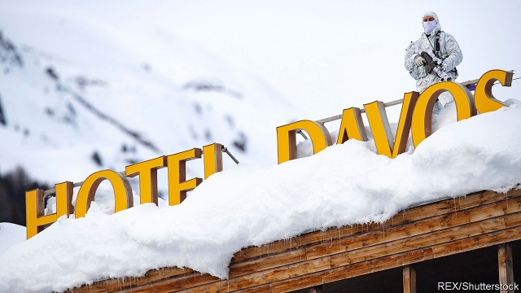

###### The Davos delusion

# Down with philanthrocapitalism, says an entertaining polemic 

##### Anand Giridharadas says the global elite is complicit in the problems it purports to solve 

 

> Jan 24th 2019 

 

Winners Take All: The Elite Charade of Changing the World. By Anand Giridharadas. Knopf; 304 pages; $26.95. Allen Lane; £12.99. 

IT IS MORE than 20 years since Samuel Huntington introduced the concept of Davos Man in his great book “The Clash of Civilisations”. Now Anand Giridharadas has gone one better and taken his reader deep inside the mind of that peculiar creature. Everybody knows the basics: Davos Man believes that markets are more efficient than governments and that globalism is preferable to nationalism or localism. Mr Giridharadas’s trick is to focus on the more intriguing parts of the Davos world-view: that businesses can “do well by doing good”; that philanthropy needs to be “reinvented” for the age of the internet and the T-shirt-wearing billionaire; and that one of the greatest problems facing the world, even as some inner-cities are ravaged by drugs and violence, is that there aren’t enough Davos Women to join the Davos Men in this win-win nirvana. 

A few years ago Mr Giridharadas, who works as a political analyst for MSNBC and teaches journalism at New York University, stumbled across a big problem—that the rise of the win-win mantra had coincided with one of the longest periods of wage stagnation in American history. Davos Man’s smiley-faced faith in business-led solutions (green bonds, impact investing, social innovation and the rest) concealed a harsher reality. Businesses were relentlessly pursuing efficiency and cutting costs—shifting jobs to cheaper places or forcing people to work longer hours—and then recycling a fraction of the profits they made into Davos-style consolations. 

All this recycling is wonderful for the billionaires who derive a warm feeling from spending their money on helping the poor. It is wonderful for CEOs who can burnish their brands by embracing the latest fashionable good cause. It is particularly wonderful for the “thought-leaders” who can spend their lives hanging out with Sergei and Mark and suggesting clever ways for their philanthrocapitalist masters to cure the world’s ills. But it does little to make up for the winner-takes-all philosophy that is driving companies to hold down wages and transfer the burden of risk onto their employees. And it does little to solve the problems of “the unexotic underclass”—white ex-working-class men in particular—who have been deemed too boring and reactionary for the Davos crowd to bother about. 

It is easy to raise objections to Mr Giridharadas’s argument. He ignores the fact that figures like Bill Gates have done a great deal of good. He doesn’t mention that, even though incomes in the West have stagnated in recent decades, hundreds of millions of people in the emerging world have been lifted out of poverty. His anti-business animus is blunt-edged: he would have been better off focusing on genuine scandals such as tax-dodging rather than railing against efficiency-seeking in general. Yet in some ways these objections miss the point. “Winners Take All” is a splendid polemic that is all the better for simplifying and exaggerating. 

Mr Giridharadas writes brilliantly on the parasitic philanthropy industry that somehow manages to hold its meetings in desirable resorts (Davos in the ski season, Bellagio in the summer) rather than in Detroit or Lagos. In one particularly stomach-turning section he reports on a luxury cruise, Summit at Sea, where various bigwigs discuss ways to improve the world while sitting in the well of the Bliss Ultra Lounge. “The boat’s not about getting drunk and getting naked,” a motivational speaker intones. “Well, it’s sort of about that. But it’s also about social justice.” 

He produces worrying case studies that illustrate his theme of companies creating big social problems and then offering sticking-plaster solutions in the form of philanthropy. For example, Purdue Pharma has an impressive record of providing grants that “encourage the healthy development of youth by reducing high-risk behaviours such as substance abuse”. But one reason that the company can afford such largesse is that it has made a fortune from marketing OxyContin, a drug that, thanks to over-prescription, is at the heart of America’s opioid epidemic. 

The only genuine failure of this otherwise excellent screed is that Mr Giridharadas does not push his argument further. He rightly goes beyond inequality of wealth to address inequality of power: how win-win fixes invariably take problems out of the political realm and sub-contract them to unaccountable global elites. But he says nothing about the fascinating issue of inequality of esteem. 

The Davos elite is not content with hoarding an inflated proportion of the world’s wealth and power. It is trying to appropriate an outsize share of the world’s esteem by reinventing philanthropy in its own techy and globe-trotting image. It is not just Davos Man’s vices that are fuelling the populist fire. It is his virtues too. 

-- 

 单词注释:

1.davo[]:abbr. Dynamic Analogue of Vocal Tract 声道动态模拟（设备） 

2.delusion[di'lu:ʒәn]:n. 迷惑, 欺瞒, 错觉 [医] 妄想 

3.philanthrocapitalism[]:[网络] 慈善资本主义；仁资主义 

4.polemic[pɒ'lemik]:a. 争辩的, 好争论的 n. 争论, 辩论, 辩论者 

5.Anand[]:n. 安纳德（印度古吉拉特邦的一个小镇, 印度代孕行为的发源地）；阿南德（男子名, 著名作家） 

6.elite[ei'li:t]:n. 精华, 精锐, 中坚分子 

7.complicit[kәm'plisit]:a. 有同谋关系的,串通一气的[由 complicity 逆构] 

8.purport['pә:pɒ:t]:n. 意义, 要旨, 目的 vt. 意味着, 声称, 打算 

9.Jan[dʒæn]:n. 一月 

10.elite[ei'li:t]:n. 精华, 精锐, 中坚分子 

11.charade[ʃә'rɑ:d]:n. 字谜游戏 

12.allen['ælin, 'ælәn]:n. 艾伦（男子名） 

13.samuel['sæmjuәl]:n. 撒母耳（希伯来先知）；塞缪尔（男子名） 

14.huntington['hʌntiŋtәn]:n. 亨廷顿（男子名, 美国地名） 

15.clash[klæʃ]:n. 冲突, 撞击声, 抵触 vi. 冲突, 抵触 vt. 使发出撞击声 [计] 对撞 

16.civilisation[,sivilai'zeiʃən;-li'z-]:n. 文明, 文明世界, 文化, 开化, 教化 

17.globalism['^lәubәlizm]:n. 全球主义,全球政策 

18.nationalism['næʃәnәlizm]:n. 民族主义, 民族特性 

19.localism['lәukәlizm]:n. 有地方色彩, 土话, 方言, 地方主义 [法] 地方主义, 地方观念 

20.intrigue[in'tri:g]:n. 阴谋, 复杂的事 vi. 密谋, 私通 vt. 激起...的兴趣, 用诡计取得 

21.philanthropy[fi'lænθrәpi]:n. 慈善, 仁慈, 博爱, 慈善事业, 慈善机构(团体) 

22.reinvent[.ri:in'vent]:vt. 重新使用；彻底改造；重复发明（在不知他人已发明的情况下） 

23.billionaire[.biljә'nєә]:n. 亿万富翁 

24.ravage['rævidʒ]:n. 破坏, 蹂躏 v. 毁坏, 破坏, 掠夺 

25.nirvana[nә:'vɑ:nә]:n. 天堂 

26.analyst['ænәlist]:n. 分析者, 精神分析学家 [化] 分析员; 化验员 

27.msnbc[]:n. 微软全国有线广播电视公司 

28.journalism['dʒә:nәlizm]:n. 新闻业, 报章杂志 [法] 报刊, 新闻业, 新闻出版 

29.york[jɔ:k]:n. 约克郡；约克王朝 

30.mantra['mʌntrә, 'mæn-]:颂歌, 咒语(尤指四吠陀经典内作为咒文或祷告唱念的) 

31.coincide[.kәuin'said]:vi. 一致, 符合 [化] 重合 

32.stagnation[stæg'neiʃәn]:n. 淤塞, 停滞 [医] 停滞, 滞留, 郁积 

33.innovation[.inәu'veiʃәn]:n. 改革, 创新 [法] 创新, 改革, 刷新 

34.relentlessly[]:adv. 不仁慈, 严酷, 无情, 坚韧, 不懈, 不屈不挠 

35.recycling[]:[电] 再循环 

36.consolation[.kɒnsә'leiʃәn]:n. 安慰, 令人安慰的事物 [法] 安慰, 慰问 

37.ceo[]:abbr. 首席执行官；执行总裁（chief executive officer） 

38.burnish['bә:niʃ]:vt. 擦亮, 打磨, 磨光 vi. 磨光发亮 n. 光辉, 光泽 

39.Sergei[]:塞奇（人名） 

40.philanthrocapitalist[]:[网络] 慈善资本家 

41.unexotic[]:[网络] 非常的 

42.deem[di:m]:v. 认为, 相信 

43.reactionary[ri'ækʃәnәri]:n. 反动分子 a. 反动的, 反动主义的, 反对改革的 

44.bother['bɒðә]:vt. 烦扰, 迷惑 vi. 烦恼, 操心 n. 麻烦, 纠纷, 讨厌的人 

45.stagnate['stægneit]:v. (使)淤塞, (使)停滞, (使)变萧条 

46.animus['ænimәs]:n. 基本态度, 敌意, 意向 [医] 男性意象(精神分析用词) 

47.railing['reiliŋ]:n. 扶手, 栏杆, 抱怨 [电] 高重回率的雷达脉冲排挤 

48.brilliantly['brijәntli]:adv. 辉煌地, 光亮地, 灿烂地 

49.parasitic[,pærә'sitik]:a. 寄生的, 由寄生虫引起的 [计] 寄生的 

50.bellagio[]:n. 百乐宫（美国酒店名） 

51.Detroit[di'trɒit]:n. 底特律(美国城市) 

52.Lagos['lɑ:gәs]:n. 拉各斯(尼日利亚的首都) 

53.cruise[kru:z]:n. 巡航, 巡弋, 漫游 v. 巡航, 巡弋, 漫游 

54.bigwig['bigwig]:n. 要人, 大亨 

55.bliss[blis]:n. 福佑, 天赐的福 [计] 实现系统软件的基本语言 

56.ultra['ʌltrә]:a. 过分的, 极端的 n. 极端主义者, 过激论者, 急进论者 

57.motivational[.mәuti'veiʃәnәl]:a. 激发性的 [法] 动机说明, 引起动机, 动机的形成 

58.intone[in'tәun]:v. 吟咏 

59.purdue[]:n. 普杜大学（美国一所大学） 

60.pharma[]:n. 制药公司 

61.largesse[lɑ:'dʒes]:n. 慷慨的赠与, 慷慨赠与物, 慷慨的赏钱 

62.marketing['mɑ:kitiŋ]:n. 行销, 买卖 [经] 推销, 在市场买卖, 销售 

63.oxycontin[]: [医]盐酸羟考酮控释片剂<镇痛药> 

64.opioid[əʊ'pi:əʊɪd]:a. 类鸦片（引起）的 n. 类鸦片活性肽 

65.epidemic[.epi'demik]:n. 传染病, 流行病 a. 流行的, 传染性的 

66.screed[skri:d]:n. 冗长的文章, (瓦工用的)抹灰靠尺 [法] 事故陈述书, 呈文, 冗长文章 

67.rightly['raitli]:adv. 合适地, 正当地, 正确地 

68.inequality[.ini'kwɒliti]:n. 不平等, 不同, 不平坦, 不平均 n. 不平等, 不等式 [计] 不等式 

69.invariably[in'vєәriәbli]:adv. 不变化地, 恒定地, 始终如一地 

70.unaccountable[.ʌnә'kauntәbl]:a. 无法解释的, 无责任的 [法] 难以申辩的, 不可解释的, 无关系的 

71.fascinate['fæsineit]:vt. 令人入神, 使着迷 vi. 入迷 

72.esteem[i'sti:m]:n. 尊敬, 尊重 vt. 尊敬, 尊重, 认为 

73.hoard[hɒ:d]:n. 贮藏物, 密藏的金钱 v. 囤积, 贮藏 

74.inflate[in'fleit]:vt. 使膨胀, 使得意, 使通货膨胀, 使充气 vi. 充气, 膨胀 

75.outsize['autsaiz]:a. 特大的 n. 特大号 

76.techy['tetʃi]:a. 易怒的,暴躁的 

77.Populist['pɔpjulist]:n. 民粹派的成员 

