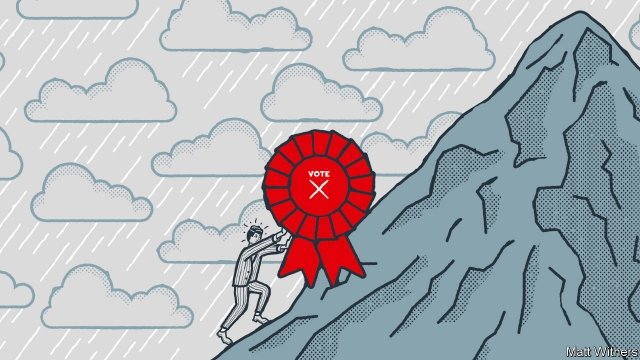

###### The wheel of history

# Max Weber’s enduring wisdom 

##### Democratic politics is a remorseless struggle, he warned 100 years ago 

 

> Jan 24th 2019 

 

IN JANUARY 1919 Munich was in turmoil. Revolution in November of the previous year had swept away the King of Bavaria, installing a ramshackle regime headed by a messianic journalist of the radical left, Kurt Eisner. As in much of Germany in the aftermath of the first world war, rival factions of left and right battled for power on the streets. In Berlin the communist luminaries Karl Liebknecht and Rosa Luxemburg were murdered as Social Democrat party leaders used Freikorps paramilitaries to assert the authority of their fledgling government. Eisner himself would soon be shot dead by a reactionary nationalist. 

The Weimar Republic was being born, as it would die, in blood. On January 28th, in this febrile atmosphere, Max Weber made one of the most important contributions to modern political theory, in a lecture titled “Politics as a Vocation” (“Politik als Beruf”). Eerily relevant in today’s age of demagoguery, it is as valuable a map to the contemporary political landscape as it was, 100 years ago, to Weber’s. 

A towering figure of 20th-century German intellectual life—and a founder of the modern discipline of sociology—Weber gave his talk to an association of liberal-leaning students on the theme of political leadership and political life. Politics, he told them, is a distinct form of activity, with its own brute imperatives. It “means slow, strong drilling through hard boards”, a ceaseless struggle between leaders and party elites. Anyone who gets involved makes a pact with “diabolical powers”; there is no moral authority to guide them, and no option but to get their hands dirty, sometimes even bloody. Famously Weber defined the state as the body that claims a monopoly on the legitimate use of force. His audience could expect no comfort from this unyielding reality. Ahead lay “a polar night of icy darkness and hardness”. 

Weber’s stern realism was not merely academic. He was contemptuous of Eisner, whom he numbered among the “literati”, and considered an exemplar of the type of leader guided solely by a determination to stay true to his principles, whatever the consequences. This “ethic of conviction”, Weber argued, was the hallmark of saints, pacifists and purist revolutionaries who could blame the world, the stupidity of others or God himself for the impact of their deeds, as long as they had done the right thing. He contrasted that with an “ethic of responsibility”, which demanded that politicians own the results of their actions, making moral compromises to achieve those results if necessary. Evil things can flow from good deeds, Weber knew, just as much as the other way round. 

For Weber, the true political leader—one for whom politics is a vocation—is characterised by three qualities: passion, a feeling of responsibility and a sense of proportion. The leader has a cause; he or she is not a “parvenu-like braggart with power”, whose baseless policies lead nowhere. On the contrary, those marked out for political leadership have ethical backbones and an inner sense of purpose. But these are combined with sober judgment and a deep sense of responsibility. Together these qualities produce politicians who can place their “hand on the wheel of history”. It is “genuinely human and profoundly moving” when (like Martin Luther) such leaders say: “Here I stand, I can do no other.” Modern readers may wistfully agree. 

Weber was a liberal nationalist who believed that the fate of Germany was the central raison d’être of politics. His preoccupation with the character and ethics of politicians reflected his belief that his country faced a moment of great peril and needed strong, capable leadership of the kind he celebrated in his Munich lecture. Germany had been badly led in the war and was threatened with subjugation by its victors. Weber was not above calling on his students to resist occupation by force; he gave succour to irredentist sentiments. But he was chiefly interested in how Germany could produce statesmen able to guide it out of the turmoil of defeat and civil conflict. It might have lost its place as a world power, but it still had its honour. 

Appeals to the power of tradition would no longer work, however. The Kaiser had abdicated and the monarchy was gone. A modern nation following the democratic path, Weber argued, had two options: rule by bureaucrats and parliamentary cliques acting from self-interest and “living from” politics; or a “leadership democracy” in which a charismatic leader, “living for” politics, commands a party machine that can mobilise voters. Mass democracy, Weber knew, always meant rule by elites. But voters had a choice between responsible and irresponsible kinds. He admired William Gladstone’s ability to dominate both Parliament and the Liberal Party; but for Germany he advocated a directly elected president who would stand above the petty factions of parliamentary politics and the fiefs of the federal territories. 

This was to become one of the most contentious of Weber’s legacies to German politics. He was active in public debates about the Weimar constitution and was recruited to an official commission given the task of framing it. His support for a “Caesarist” president, or “plebiscitary dictator of the masses”, would later draw criticism that it prefigured the overthrow of the Weimar Republic by the Nazis, despite the fact that Weber’s proposals mixed parliamentary and directly elected elements, and remained liberal, not authoritarian. 

Weber died of Spanish flu in 1920, but “Politics as a Vocation”, and the newspaper articles he wrote at the same time, remained touchstones for German debates on democracy and constitutional law for the rest of the 20th century. In Anglo-American thought, his talk became a classic of political theory after it was translated into English and published in America after the second world war. It has commonly been read as a lecture in two parts: one a scientific study of modern parties and leaders, the other a meditation on the ethics of political leadership. It has been hugely influential in the realist tradition of political theory, which emphasises the role of states and interests over values and has experienced a revival in recent years. 

A century on, Weber’s insights still help make sense of politics. In democracies governed by elites who struggle with each other for power, while paying lip service to equality or liberty—and who sometimes deploy violent means to pursue their goals—his arguments remain grimly compelling. His cool appraisal of demagoguery is useful for understanding the rise of charismatic authoritarians who command obedient party machines. The antics of Vladimir Putin, Viktor Orban or Recep Tayyip Erdogan would not have surprised him. 

Nor would the recent fall from grace of “responsible” leaders of the centre ground, for whom pragmatism and technocratic management have proved unequal to the demands of a turbulent age. Weber, after all, insisted on the centrality of passion and the struggle for power in politics. Donald Trump, meanwhile, is a brittle composite of Weberian types—not obviously possessed of an ethic of conviction, but sustained in power by a Republican Party machine and his own peculiar charisma. He would doubtless have repulsed and fascinated Weber in equal measure. 

“Politics as a Vocation” continues to inspire those who want to understand politics as it is, not as they might wish it to be. Yet realism like Weber’s can also seem like acquiescence in the status quo. His leftwing critics believed he was trapped in an iron cage of his own making, unable to see how the tides of history might open up possibilities of radical change. 

One of the students who attended his lectures in Munich in 1919 was Max Horkheimer, a founder of the Frankfurt School of critical theory. Many years later he would remark of a Weber lecture: “Everything was so precise, so scientifically austere, so value-free, that we went home completely gloomy.” That charge has echoed down the years, and points to a dilemma that still faces all practitioners of democratic politics: can you be realistic and radical at the same time? 

-- 

 单词注释:

1.MAX[mæks]:[计] 最大 

2.politic['pɒlitik]:a. 精明的, 明智的, 策略的 

3.remorseless[ri'mɒ:slis]:a. 无怜悯之心的, 冷酷的, 不知自责的 

4.Jan[dʒæn]:n. 一月 

5.Munich['mju:nik]:n. 慕尼黑 

6.turmoil['tә:mɒil]:n. 骚动, 混乱 

7.Bavaria[bә'vєәriә]:n. 巴伐利亚州(德国地名) 

8.ramshackle['ræmʃækl]:a. 象要倒的, 摇晃的, 放荡的 

9.regime[rei'ʒi:m]:n. 政权, 当权期间, 政体, 社会制度, 体制, 情态 [医] 制度, 生活制度 

10.Messianic[.mesi'ænik]:a. 弥赛亚的 

11.kurt[kә:t]:n. 库尔特（男子名） 

12.eisner[]: [人名] 艾斯纳 

13.aftermath['ɑ:ftәmæθ]:n. 结果, 后果 [法] 后果, 结果 

14.faction['fækʃәn]:n. 小派系, 内讧 [法] 宗派, 派别, 小集团 

15.Berlin[bә:'lin]:n. 柏林, (软质)柏林毛线 

16.luminary['lu:minәri]:n. 发光体, 杰出人物 

17.karl[kɑ:l]:n. 卡尔（男子名, 等于Charles） 

18.Liebknecht[]:n. (Liebknecht)人名；(德)李卜克内西 

19.rosa['rәuzә]:[医] 蔷薇, 玫瑰 

20.Luxemburg['lʌksәmbә:g]:n. 卢森堡 

21.democrat['demәkræt]:n. 民主人士, 民主主义者, 民主党党员 [经] 民主党 

22.freikorps[]:[网络] 自由军团；自由兵团；义勇军 

23.paramilitary[.pærә'militәri]:a. 辅助军事的 

24.assert[ә'sә:t]:vt. 主张, 坚称, 断言 [法] 宣称, 断言, 维护 

25.fledgling['fledʒliŋ]:n. 羽毛初长的雏鸟, 刚会飞的幼鸟, 无经验的人 

26.reactionary[ri'ækʃәnәri]:n. 反动分子 a. 反动的, 反动主义的, 反对改革的 

27.nationalist['næʃәnәlist]:n. 国家主义者, 民族主义者 

28.Weimar['vaimɑ:]:魏玛 

29.febrile['fi:brail]:a. 发热的, 热病的, 热性的 [医] 热性的, 发热的 

30.Weber['wi:bә]:[计] 韦伯 [医] 韦伯, 库仑 

31.vocation[vәu'keiʃәn]:n. 职业, 天命, 天职, 才能, 行业 [法] 行业, 职业, 职业上的才能 

32.politik[]:[网络] 政治学；政治性；策略 

33.AL[]:[计] 算法语言, 字母, 汇编语言 [医] 铝(13号元素) 

34.eerily[]:a. 怪诞的；奇异的；可怕的 

35.demagoguery['demәgɒgәri]:n. 煽动, 煽动行为, 散布谣言 

36.landscape['lændskeip]:n. 风景, 山水, 风景画 vi. 从事景观美化 vt. 美化...景观 [计] 横向 

37.founder['faundә]:n. 创立者, 建立者 vt. 使沉没, 使摔倒, 弄跛, 浸水, 破坏 vi. 沉没, 摔到, 变跛, 倒塌, 失败 

38.imperative[im'perәtiv]:n. 命令, 必要的事, 规则, 祈使语气 a. 命令式的, 急需的, 势在必行的, 强制的 

39.ceaseless['si:slis]:a. 不停的, 不断的 

40.elite[ei'li:t]:n. 精华, 精锐, 中坚分子 

41.pact[pækt]:n. 契约, 协定, 条约 [化] 合同 

42.diabolical[daiә'bɒlikl]:a. 恶魔的 

43.bloody['blʌdi]:a. 血腥的, 嗜杀的, 有血的 

44.famously['feimәsli]:adv. 极好地, 非常令人满意地 

45.monopoly[mә'nɒpәli]:n. 垄断, 专卖权, 独占事业 [经] 垄断, 专利品, 垄断(权)独占 

46.legitimate[li'dʒitimәt]:a. 合法的, 正当的, 婚生的 vt. 认为正当, 立为嫡嗣, 使合法 

47.unyielding[.ʌn'ji:ldiŋ]:a. 不易弯曲的, 不屈的 

48.polar['pәulә]:a. 两极的, 极地的, 正好相反的, 极性的 n. 极线, 极面 

49.icy['aisi]:a. 冰的, 冰冷的, 冷淡的, 滑溜的 

50.hardness['hɑ:dnis]:n. 坚硬, 困难, 严厉, 勇气 [化] 硬度 

51.realism['riәlizm]:n. 写实主义, 现实, 实在论 [法] 现实主义 

52.contemptuous[kәn'temptʃuәs]:a. 轻蔑的, 鄙视的, 瞧不起人的 

53.literati[.litә'rɑ:ti:. 'rɑ:ti:. -'reitai]:n. 文人（literatus的复数）；文学界 

54.exemplar[ig'zemplә]:n. 模范, 榜样, 原型, 标本 

55.ethic['eθik]:n. 道德规范, 伦理 

56.conviction[kәn'vikʃәn]:n. 定罪, 信服, 坚信 [法] 定罪, 证明有罪, 判罪 

57.hallmark['hɑ:lmɑ:k]:n. 纯度检验证明, 品质证明 vt. 加盖纯度检验证明 

58.pacifist['pæsifist]:n. 和平主义者, 反战论者, 不抵抗主义者 

59.purist['pjuәrist]:n. 纯粹主义者 

60.stupidity[stju:'piditi]:n. 愚蠢, 糊涂事 [医] 迟钝 

61.characterise['kærәktәraiz]:vt. 表示...的特性, 成为/是...的特性, 刻划/描述...的性格 vi. 在文艺作品中塑造人物, 描绘性格 

62.braggart['brægәt]:n. 吹牛者, 自夸者 a. 吹牛的, 自夸的 

63.baseless['beislis]:a. 无根据的 

64.ethical['eθikәl]:a. 伦理的, 民族的, 民族特有的 [医] 伦理的, 道德的 

65.backbone['bækbәun]:n. 脊椎, 志气, 骨干, 支柱 [计] 主干网, 主干网点 

66.judgment['dʒʌdʒmәnt]:n. 裁判, 宣告, 判决书 [医] 判断 

67.genuinely[]:adv. 真诚地；诚实地 

68.profoundly[prә'fajndli]:adv. 深深地, 深切地 

69.Martin['mɑ:tin]:n. 马丁, 圣马丁鸟 

70.luther['lu:θә]:n. 卢瑟（男子名） 

71.wistfully['wɪstfəlɪ]:adv. 惆怅地, 渴望地 

72.raison[]: [人名] [英格兰人姓氏] 雷森绰号, 有才智者, 来源于中世纪英语、古法语, 含义是“推论, 智能”(reasoning,intellectual faculty) 

73.preoccupation[pri:.ɒkju'peiʃәn]:n. 抢先占据, 先人之见, 入神 [医] 成见, 注意散漫, 心不在焉 

74.peril['peril]:n. 危险, 冒...之险, 险境, 险因 vt. 置...于险境, 冒险, 危及 

75.subjugation[.sʌbdʒu'geiʃәn]:n. 征服, 镇压, 平息 [法] 征服, 镇压, 克制 

76.victor['viktә]:n. 胜利者 a. 胜利的 

77.succour['sʌkә]:n. 解救, 援助者 vt. 解救, 援助 

78.Irredentist[.iri'dentist]:n. 民族统一主义者 

79.sentiment['sentimәnt]:n. 感情, 感伤, 情操, 情绪, 感想, 意见 [医] 情感, 情操 

80.chiefly['tʃi:fli]:adv. 主要地 

81.kaiser['kaizә]:n. 皇帝 

82.abdicate['æbdikeit]:vt. 正式放弃 vi. 退位, 退出, 辞职 

83.monarchy['mɒnәki]:n. 君主政体, 君主国, 君主政治 [法] 君主政体, 君主制度, 君主国 

84.bureaucrat['bjuәrәukræt]:n. 官僚作风的人, 官僚, 官僚主义者 [法] 官僚, 官僚作风的人 

85.parliamentary[.pɑ:lә'mentәri]:a. 国会的, 议会的, 议会制度的 

86.clique[kli:k]:n. 派系, 集团 vi. 结党 [计] 集团型 

87.charismatic[,kæriz'mætik]:a. 魅力, 能吸引大众的非凡能力, 神授的能力, 领袖人物感人的超凡魅力 

88.mobilise['mәjbilɑiz]:vi.vt. 动员, 松动, 使活动, 调动, 发动 

89.voter['vәutә]:n. 选民, 投票人 [法] 选民, 选举人, 投票人 

90.alway['ɔ:lwei]:adv. 永远；总是（等于always） 

91.irresponsible[.iri'spɔnsәbl]:a. 不负责任的；不可靠的 

92.william['wiljәm]:n. 威廉（男子名）；[常作W-][美俚]钞票, 纸币 

93.petty['peti]:a. 琐碎的, 小规模的, 小气的, 委琐的 [经] 小额的, 微小的, 小规模的 

94.fief[fi:f]:n. 封地, 采邑 

95.contentious[kәn'tenʃәs]:a. 好争吵的, 爱争论的, 有异议的 [法] 诉讼的, 争执的, 引起争论的 

96.legacy['legәsi]:n. 祖先传下来之物, 遗赠物 [经] 遗产, 遗赠物 

97.Caesarist['si:zәrist]:n. 信奉君主专制主义的人 

98.plebiscitary[pli'bisitәri]:a. 平民表决的, 公民投票的 

99.dictator['dikteitә]:n. 命令者, 独裁者 

100.prefigure[pri:'figә]:vt. 预示, 预见, 预想 

101.overthrow[.әuvә'θrәu]:n. 推翻, 瓦解, 倾覆 vt. 打倒, 推翻, 倾覆 

102.Nazi['nɑ:tsi]:n. 纳粹党人 a. 纳粹党的 

103.authoritarian[ɒ:.θɒri'tєәriәn]:a. 独裁的, 独裁主义的 

104.touchstone['tʌtʃstәun]:n. 试金石, 检验标准 

105.constitutional[.kɒnsti'tju:ʃәnl]:a. 宪法的, 立宪的, 体质的 [医] 全身的; 体质的 

106.meditation[.medi'teiʃәn]:n. 沉思, 冥想 

107.hugely['hju:dʒli]:adv. 巨大地, 非常地 

108.realist['riәlist]:n. 现实主义者, 写实主义者, 实在论者 

109.emphasise[]:vt. 强调, 重读, 加强...的语气, 着重 

110.revival[ri'vaivl]:n. 复兴, 复活, 恢复精神, 苏醒 [医] 复苏, 回生, 精神重振 

111.deploy[di'plɒi]:v. 展开, 配置 

112.grimly['grimli]:adv. 严格地, 冷酷地, 可怕地 

113.appraisal[ә'preizәl]:n. 评价, 估价 [经] 评价, 评估 

114.obedient[ә'bi:djәnt]:a. 服从的, 顺从的, 孝顺的 [法] 服从的, 顺从的, 忠顺的 

115.antic['æntik]:n. 滑稽动作 a. 古怪的 

116.Vladimir[vlɑ'dimɪr]:n. 弗拉基米尔（古罗斯弗拉基米尔-苏兹达里公国的古都） 

117.putin['putin]:n. 普京（人名） 

118.Viktor[]:维克托（人名） 

119.orban[]: [人名] 奥尔班 

120.recep[]:n. (Recep)人名；(土)雷杰普 

121.tayyip[]:[网络] 塔伊普 

122.erdogan[]:[网络] 埃尔多安；土耳其总理埃尔多安；艾尔多安 

123.pragmatism['prægmәtizm]:n. 实用主义 [法] 实用主义, 干涉主义, 独断 

124.technocratic[ˌteknə'krætɪk]:a. 由技术专家官员组成的；受技术官僚影响的 

125.unequal[.ʌn'i:kwәl]:a. 不相等的, 不规则的, 不能胜任的 [经] 不平均的, 不等的 

126.centrality[sen'træliti]:n. 中心, 中央, 向心性 [医] 中央性, 归中性 

127.donald['dɔnәld]:n. 唐纳德（男子名） 

128.trump[trʌmp]:n. 王牌, 法宝, 喇叭 vt. 打出王牌赢, 胜过 vi. 出王牌, 吹喇叭 

129.composite[kәm'pɒzit]:a. 合成的, 混合成的, 菊科的 n. 合成物, 复合材料, 菊科 

130.Weberian[vei'biəriən]:a. 韦伯式的 

131.charisma[kә'rizmә]:n. 非凡的领导力, 神秘的个人魅力, 神授的能力 

132.repulse[ri'pʌls]:n. 击退, 拒绝 vt. 厌恶, 击退, 拒绝 

133.fascinate['fæsineit]:vt. 令人入神, 使着迷 vi. 入迷 

134.acquiescence[.ækwi'esәns]:n. 默许, 默认 [法] 默许, 默认 

135.statu[]:[网络] 状态查看；雕像；特级雪花白 

136.quo[]:vt. [古]说 

137.leftwing['leftwiŋ]:左派[翼]的, 进步的 

138.horkheimer[]: 霍克海默（人名） 

139.frankfurt['fræŋkfәt]:n. 牛肉香肠, 猪牛肉混合香肠 

140.scientifically[.saiәn'tifikәli]:adv. 合乎科学地, 学问上, 系统地 

141.austere[ɒ'stiә]:a. 严峻的, 禁欲的, 简朴的 

142.practitioner[præk'tiʃәnә]:n. 从业者, 开业者 [医] 行医者, 医师 

143.realistic[riә'listik]:a. 现实的, 逼真的, 现实主义的, 实在论的 

