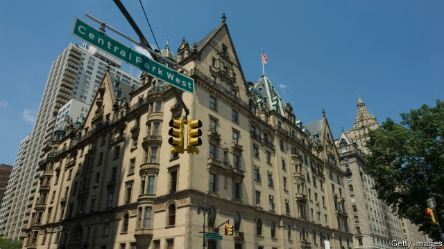

###### Above us only sky

# The perils of celebrity 

##### John Lennon features in Tom Barbash’s novel of New York in 1980 

 

> Jan 24th 2019 

 

The Dakota Winters. By Tom Barbash.Ecco; 336 pages; $26.99. Scribner; £14.99. 

ANTON WINTER leads a charmed life. As a rich and restless 23-year-old in New York in 1980, he drinks martinis at the Plaza, takes meetings at the Algonquin and snorts coke in club bathrooms. He lives in the Dakota, Manhattan’s most coveted address, where Roberta Flack and Leonard Bernstein rub shoulders in the lift. And he has a job his peers would kill for, producing a talk show on which celebrities wisecrack and bare their souls. The only problem is that he owes everything to his famous father, Buddy Winter, the show’s star. 

“The Dakota Winters”, Tom Barbash’s new novel, is about fathers and sons, the perniciousness of fame and the challenge of second acts. It is also about the grit and glamour of the city at a time when rents were affordable and muggings rife. Much of the drama involves Anton’s ambivalent role in Buddy’s return to the airwaves after a two-year hiatus. His previous show ended abruptly when he asked, mid-broadcast, “What the fuck am I doing here?” Buddy walked off the set, had a nervous breakdown and travelled the world; now he feels ready to go back on camera—but only with his son’s help. 

Meanwhile Anton develops a friendship with none other than John Lennon, a fellow Dakota resident, who seems to see him for the man he wants to be, not merely as a facilitator of his father’s charms. The fact that Lennon’s own comeback will be cut short by his imminent death (at the Dakota’s entrance) steeps the story in dramatic irony. 

This book goes down like a quaffable wine—easy and engaging, if not terribly complex. Mr Barbash has a habit of spoon-feeding his themes with somewhat unlikely dialogue, such as when Anton’s sister warns him that “it’s [Buddy’s] life story you’re writing, and pretty soon you’ve got to begin writing your own”. Those who recall spending their early 20s as self-conscious buffoons may tire of Anton’s relentless winning—at work, romantically and so on. It is not for nothing that the most beloved protagonists tend to be outsiders and losers, or bigshots who fall from grace. 

Still, Mr Barbash recreates an inviting world. And he observes clearly the insidious human tendency to turn people into idols, only to topple them. “They don’t want to even bloody listen to us,” Lennon says in the novel. “They want our souls.” 

-- 

 单词注释:

1.peril['peril]:n. 危险, 冒...之险, 险境, 险因 vt. 置...于险境, 冒险, 危及 

2.celebrity[si'lebrti]:n. 名声, 名人 

3.john[dʒɔn]:n. 盥洗室, 厕所, 嫖客 

4.Lennon['lennən]:n. 列侬（男子名） 

5.tom[tɒm]:n. 雄性动物, 雄猫 

6.york[jɔ:k]:n. 约克郡；约克王朝 

7.Jan[dʒæn]:n. 一月 

8.dakota[dә'kәutә]:n. 达科他（美国过去一地区名, 现分为南、北达科他州） 

9.scribner[]: [人名] [英格兰人姓氏] 斯克里布纳 Scriven的变体; [地名] [美国] 斯克里布纳 

10.anton['æntәn]:n. 安东（男子名） 

11.charm[tʃɑ:m]:n. 吸引力, 魔力, 符咒 vt. 迷住, 使陶醉, 行魔法 vi. 用符咒, 有魅力 

12.martini[mɑ:'ti:ni]:n. 马提尼（一种鸡尾酒, 等于Martini） 

13.plaza['plɑ:zә]:n. 广场, 市场, 购物区 

14.algonquin[æl'^ɔŋkwin]:n. 阿尔冈琴族(语, 人) 

15.snort[snɒ:t]:vi. 喷着气弄响鼻子, 轻蔑地哼, 嘶嘶响着排气 vt. 哼着鼻子说, 喷出, 吸入(毒品) n. 喷鼻息, (潜艇的)水下通气管 

16.covet['kʌvit]:v. 妄想, 垂涎 

17.roberta[rәu'bә:tә]:n. 罗伯塔（女子名） 

18.flack[flæk]:n. 高射炮, 对空炮火, 广告, 宣传 

19.leonard['lenәd]:n. 伦纳德（男子名） 

20.Bernstein[bә:n'stein]:[德]琥珀, 伯恩斯坦(姓氏) 

21.peer[piә]:n. 同等的人, 匹敌, 贵族 vi. 凝视, 窥视, 费力地看, 隐现 vt. 与...同等, 封为贵族 

22.wisecrack['waizkræk]:n. 俏皮话 

23.buddy['bʌdi]:n. 好朋友, 伙伴 

24.perniciousness[]:危害性 

25.grit[grit]:n. 砂砾, 粗砂石 vt. 覆以砂砾, 咬牙切齿地说 vi. 摩擦作声 

26.glamour['glæmә]:n. 魅力, 迷人的美, 魔法 vt. 迷惑 

27.affordable[]:[计] 普及型 

28.mugging['mʌ^iŋ]:n. 行凶抢劫；（美）哑剧 

29.rife[raif]:a. 流行的, 盛传的, 充满的 

30.ambivalent[æm'bivәlәnt]:a. 矛盾的, 模棱两可的 [医] 矛盾情绪的 

31.airwave['єәweiv]:n. 电波, 波道 

32.hiatus[hai'eitәs]:n. 裂缝, 中断, 空隙, 间隙, 裂孔, (稿件)脱字, 漏句 pl. 裂缝, 中断, 空隙, 间隙, 裂孔, (稿件)脱字, 漏句 

33.abruptly[ә'brʌptli]:adv. 突然地, 唐突地 

34.fuck[fʌk]:vt. 与...性交, 欺骗, 诅咒 vi. 性交 n. 性交, 些微, 杂种 interj. 他妈的, 混帐 

35.breakdown['breikdaun]:n. 崩溃, 故障 [化] 事故; 击穿 

36.anton['æntәn]:n. 安东（男子名） 

37.facilitator[fә'siliteitә]:n. 服务商；促进者 

38.comeback['kʌmbæk]:n. 复原, 复辟, 复位, 尖刻的对答, 抱怨的原因 [计] 复原的 

39.imminent['iminәnt]:a. 即将来临的, 逼近的 

40.irony['aiәrәni]:n. 反语, 讽刺, 具有讽刺意味的事 

41.quaffable[k'wɒfeɪbl]:adj. （酒）可饮用的 

42.terribly['terәbli]:adv. 可怕地, 甚为, 非常 

43.barbash[]:n. (Barbash)人名；(英)巴巴什；(俄)巴尔巴什 

44.buffoon[bә'fu:n]:n. 小丑 

45.relentless[ri'lentlis]:a. 无情的, 冷酷的, 残酷的 

46.romantically[rәu'mæntikli]:adv. 浪漫地, 小说般地, 空想地 

47.protagonist[prәu'tægәnist]:n. 主人公, 主角, 领导者 

48.outsider[' aut'saidә]:n. 外人, 局外人, 非会员, 外行, 门外汉, 比赛中获胜可能性不大的选手 [经] 外船公司 

49.loser['lu:zә]:n. 失败者, 遗失者 [法] 失败者, 失物者, 遗失者 

50.bigshot[]:n. 权贵；大人物 

51.recreate['rekrieit]:v. (使)得到休养, (使)得到娱乐, 再创造 

52.insidious[in'sidiәs]:a. 隐伏的, 阴险的, 狡猾的 [医] 隐袭的 

53.idol['aidәl]:n. 偶像, 崇拜物, 宠儿, 幻象, 谬论 

54.topple['tɒpl]:vt. 推翻, 颠覆 vi. 倒塌, 摇摇欲坠 

55.bloody['blʌdi]:a. 血腥的, 嗜杀的, 有血的 

