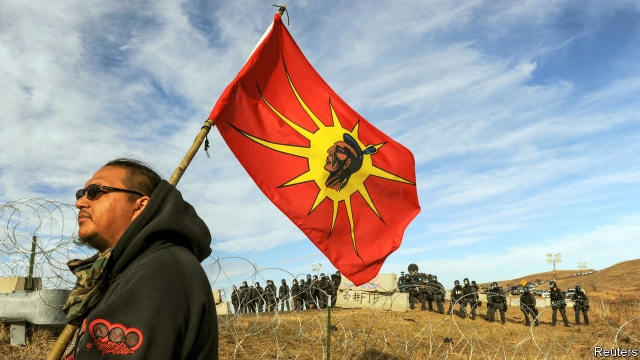

###### Still beating

# The recovery from Wounded Knee 

##### The heart of Native American culture is beating strongly, says David Treuer 

 

> Jan 24th 2019 

 

The Heartbeat of Wounded Knee. By David Treuer. Riverhead Books; 512 pages; $28. To be published in Britain by Corsair in March; £25.  

ACCORDING TO A convenient myth dating back to the 19th century, Native Americans were doomed to vanish, except for a few hold-outs on remote and poverty-stricken reservations. A corrective is urgently required, argues David Treuer, an anthropologist, novelist and member of the Ojibwe people, in his new survey of “Indian country” since the massacre at Wounded Knee in 1890. 

That attack on Lakota Sioux by the 7th Cavalry killed at least 150 people and marked the last major armed conflict between Indian tribes and the federal government. For many Americans, it also came to signify the end of Native culture itself, due in part to a hugely influential book, “Bury My Heart at Wounded Knee”. Published in 1970, the book held that by 1890 “the culture and civilisation of the American Indian was destroyed”. After growing up on the Leech Lake Reservation in Minnesota, Mr Treuer found this view not just wrong, but soul-crushing. His sweeping, essential history is “not about the heart that was buried in the cold ground of South Dakota, but rather about the heart that beats on.” 

Like its predecessor, his account opens with a catalogue of murder, disease and displacement. His survey of Indian homelands and their destruction is dry but necessary, since many Americans of European descent are unacquainted with the facts (some seem to regard the country as their patrimony alone). But it is in recounting more recent history that Mr Treuer’s storytelling skills shine. He salts a century’s-worth of wrangling over the rights guaranteed by 19th-century treaties with personal stories from numerous tribes. 

A host of paternalistic programmes meant to solve the “Indian problem” mainly backfired, he shows. These included forced assimilation through boarding schools, which aimed to “kill the Indian” to “save the man”, the destruction of collective land-ownership on reservations through individual allotments (in which wealthy whites, more often than not, snapped up the best plots), and later manoeuvres that ended the legal status of some tribes. 

Yet the schools, as well as military service in both world wars, had an inadvertent benefit: to forge a pan-Indian identity. Like other marginalised groups, Indians moved to the cities and began to organise. From 1970, through the activism of the American Indian Movement and legal training that helped define—and defend—their rights, tribes started to rebound. Indian culture experienced a rebirth. 

Mr Treuer’s elegant handling of this complex narrative occasionally falters. For example, he omits to set out clearly how tribal sovereignty works. Only midway through do readers learn that federal funding for such things as Indian health and education “are not pity payments or proto-welfare”, but commitments established by treaty in exchange for the loss of 97% of ancestral lands. That provenance refutes the frequent and mistaken assumption that most Native Americans are on the dole. 

But his writing sings when he celebrates recent gains. By 1900 a Native population estimated to have numbered 5m when Christopher Columbus arrived had dropped to 237,000; the census of 2010 counted 2m, plus 3m identifying as partly Native. Casinos are giving some of America’s more than 500 tribes an economic boost. These days, enterprising Native Americans “actively remember and promote indigenous knowledge”; Mr Treuer introduces several, including a Sioux master chef and young women who extol healthy ways of life as a form of “warrior strength”. He ends with the Standing Rock pipeline protest of 2016 (pictured), the largest gathering of Native Americans since the battle of the Little Bighorn in 1876, which catapulted their struggle into national headlines for the first time in decades. 

How Americans imagine their future depends on how they see their past, Mr Treuer argues. In a year in which, for the first time, two Native American women have taken seats in Congress, it is possible to infer that his community has not only survived, but begun to thrive again. 

-- 

 单词注释:

1.david['deivid]:n. 大卫；戴维（男子名） 

2.treuer[]:[网络] 特罗伊尔 

3.Jan[dʒæn]:n. 一月 

4.heartbeat['hɑ:tbi:t]:n. 心跳 

5.corsair['kɒ:sєә]:n. 海盗, 海盗船, 回教徒的私掠船 

6.myth[miθ]:n. 神话, 虚构的事, 虚构的人 

7.doom[du:m]:n. 厄运, 不幸, 法律, 宣告, 判决, 死亡 vt. 命中注定, 判决 

8.corrective[kә'rektiv]:a. 纠正的, 改正的, 矫正的 n. 改善法, 矫正物 

9.urgently[]:adv. 急切地；迫切地；紧急地 

10.anthropologist[.ænθrә'pɒlәdʒist]:n. 人类学家 

11.ojibwe[]:[网络] 奥杰布华语；奥吉布瓦语；欧基瓦语 

12.massacre['mæsәkә]:n. 大屠杀 vt. 大屠杀, 残杀 

13.lakota[lə'kəutə]:n. 拉科塔族 

14.sioux[su:]:a. 苏人的；苏语的 

15.cavalry['kævәlri]:n. 骑兵 

16.signify['signifai]:vt. 象征, 预示 vi. 要紧, 重要 

17.hugely['hju:dʒli]:adv. 巨大地, 非常地 

18.civilisation[,sivilai'zeiʃən;-li'z-]:n. 文明, 文明世界, 文化, 开化, 教化 

19.leech[li:tʃ]:n. 水蛭, 吸血鬼, 榨取他人利益的人 vt. 以水蛭吸血 vi. 依附并榨取别人 

20.Minnesota[.mini'sәutә]:n. 明尼苏达州 

21.dakota[dә'kәutә]:n. 达科他（美国过去一地区名, 现分为南、北达科他州） 

22.predecessor[.predi'sesә]:n. 前任, 先辈, 前身 [医] 初牙, 前辈, 祖先 

23.displacement[dis'pleismәnt]:n. 换置, 移位, 移动, 取代 [化] 顶替展开法 

24.descent[di'sent]:n. 降落, 家系, 侵袭, 血统 [医] 下降, 世代, 血统 

25.unacquainted[.ʌnә'kweintid]:a. 不知道的, 不认识的, 陌生的 

26.patrimony['pætrimәni]:n. 祖传的财物, 继承物 [经] 世袭财产, 遗产 

27.recount[ri'kaunt]:vt. 详述, 叙述, 重新计算 n. 重新计算 

28.storytelling['stɒ:riteliŋ]:n. 说故事, 说谎话 

29.wrangle['ræŋgl]:vi. 争论, 口角 vt. 辩驳, 放牧 n. 口角, 吵嘴 

30.paternalistic[pә.tә:nә'listik]:a. 家长式作风的 

31.backfire[.bæk'faiә]:n. 逆火, 回火, 放火 vi. 放逆火, 预先放火, 发生意外 

32.assimilation[ә.simi'leiʃәn]:n. 同化, 同化作用, 吸收 [化] 同化; 同化作用 

33.allotment[ә'lɒtmәnt]:n. 分配, 拨款, 命运 [经] 分配, 拨款, 分配额分派认购额 

34.manoeuvre[mә'nu:vә]:n. 调遣, 演习, 策略 vi. 调动, 演习, 用策略 vt. 调动, 操纵 

35.statu[]:[网络] 状态查看；雕像；特级雪花白 

36.inadvertent[.inәd'vә:tәnt]:a. 漫不经心的, 非故意的 

37.forge[fɒ:dʒ]:n. 熔炉, 铁工厂 vt. 打制, 锻造, 伪造 vi. 锻造, 伪造 

38.marginalise['mɑ:dʒɪnəlaɪz]:v. 使显得微不足道；使处于边缘；使无实权 

39.activism['æktivizm]:n. 激进主义, 行动主义, 能动论 [法] 激进主义, 行动主义 

40.rebound[ri'baund]:vi. 弹回, 返回, 产生事与愿违的结果 vt. 使弹回, 使返回 n. 反弹, 返回, 篮板球, 振作 rebind的过去式和过去分词 

41.rebirth[.ri:'bә:θ]:n. 再生, 复活, 新生 

42.narrative['nærәtiv]:n. 叙述, 故事 a. 叙述的, 叙事的, 故事体的 

43.falter['fɒ:ltә]:vt. 支吾地说 vi. 支吾, 蹒跚地走 n. 颤抖, 支吾, 踌躇 

44.tribal[traibl]:a. 部落的, 宗族的 

45.sovereignty['sɒvrәnti]:n. 主权, 独立国 [法] 主权, 主权国家, 统治权 

46.midway['mid'wei]:n. 中途, 中间, 娱乐场 a. 中途的, 中间的 adv. 中途 

47.ancestral[æn'sestrәl]:a. 祖先的, 祖传的 [法] 祖先的, 祖传的 

48.provenance['prɒvәnәns]:n. 起源, 出处 

49.dole[dәul]:n. 救济品, 失业救济金 vt. 发放救济 

50.christopher['kristәfә]:n. 克里斯多夫（男子名） 

51.columbus[kә'lʌmbәs]:n. 哥伦布（美国一座城市）；哥伦布（意大利航海家） 

52.census['sensәs]:n. 户口普查 vt. 实施统计调查 

53.casino[kә'si:nәu]:n. 卡西诺赌场, 卡西诺牌戏 

54.enterprising['entәpraiziŋ]:a. 有魄力的, 有进取心的, 有事业心的 

55.actively['æktivli]:adv. 活跃地, 积极地 

56.indigenous[in'didʒinәs]:a. 本土的, 国产的, 固有的 [医] 原产的, 本土的 

57.extol[ik'stәul]:vt. 颂扬, 称赞, 吹捧 

58.warrior['wɒ:riә]:n. 战士, 勇士, 武士, 鼓吹战争的人, 战斗, 尚武 

59.bighorn['bighɒ:n]:n. 加拿大盘羊 

60.catapult['kætәpʌlt]:n. 弹射器, 弹弓, 弩炮 vt. 发射 

