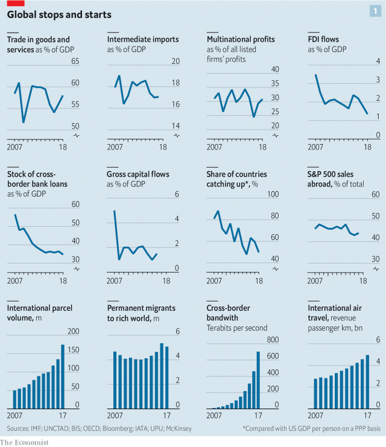
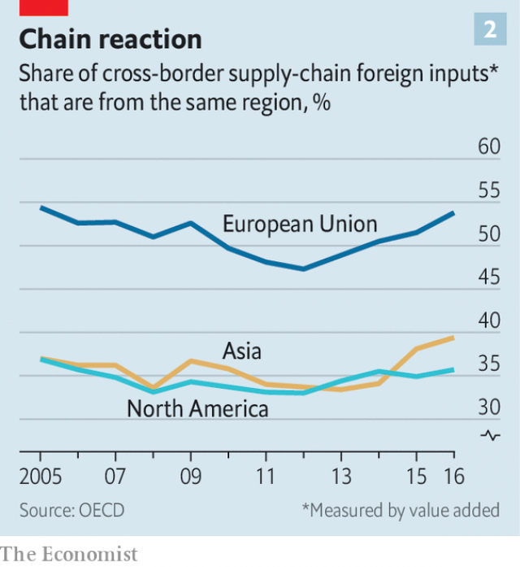

###### The global list

# Globalisation has faltered 

##### It is now being reshaped 

 

> Jan 24th 2019 

 

LARGE AND sustained increases in the cross-border flow of goods, money, ideas and people have been the most important factor in world affairs for the past three decades. They have reshaped relations between states both large and small, and have increasingly come to affect internal politics, too. From iPhones to France’s gilets jaunes, globalisation and its discontents have remade the world. 

Recently, though, the character and tempo of globalisation have changed. The pace of economic integration around the world has slowed by many—though not all—measures. “Slowbalisation”, a term used since 2015 by Adjiedj Bakas, a Dutch trend-watcher, describes the reaction against globalisation. How severe will it become? How much will a trade war launched by America’s president, Donald Trump, exacerbate it? What will global commerce look like in the aftermath? 

There have been periods of more and less globalisation throughout history. Today’s era sprang from America’s sponsorship of a new world order in 1945, which allowed cross-border flows of goods and capital to recover after years of war and chaos. After 1990 this bout of globalisation went into warp speed as China rebounded, India and Russia abandoned autarky and the European single market came into its own. Containerising freight sent shipping costs plummeting. America signed NAFTA, helped create the World Trade Organisation and supported global tariff cuts. Financial liberalisation freed capital to roam the world in search of risk and reward. 

World trade rocketed as a result, from 39% of GDP in 1990 to 58% last year. International assets and liabilities rose too, from 128% to 401% of GDP, as did the stock of migrants, from 2.9% to 3.3% of the world’s population. On the first two of those measures the world is far more integrated than in 1914, the peak of the previous age of globalisation. Nonetheless, parts of the world remain poorly integrated into the global economy. About 1bn people live in countries where trade is less than a quarter of GDP. World trade can be split into tens of thousands of separate potential corridors between pairs of countries: America and China, say, or Gabon and Denmark. In a quarter of those corridors there was no recorded commerce at all. 

When did the slowdown begin? Consider a dozen measures of global integration (see chart 1). Eight are in retreat or stagnating, of which seven lost steam around 2008. Trade has fallen from 61% of world GDP in 2008 to 58% now. If these figures exclude emerging markets (of which China is one), it has been flat at about 60%. The capacity of supply chains that ship half-finished goods across borders has shrunk. Intermediate imports rose fast in the 20 years to 2008, but since then have dropped from 19% of world GDP to 17%. The march of multinational firms has halted. Their share of global profits of all listed firms has dropped from 33% in 2008 to 31%. Long-term cross-border investment by all firms, known as foreign direct investment (FDI), has tumbled from 3.5% of world GDP in 2007 to 1.3% in 2018. 

 

As cross-border trade and companies have stagnated relative to the economy, so too has the intensity of financial links. Cross-border bank loans have collapsed from 60% of GDP in 2006 to about 36%. Excluding rickety European banks, they have been flat at 17%. Gross capital flows have fallen from a peak of 7% in early 2007 to 1.5%. When globalisation boomed, emerging economies found it easy to catch up with the rich world in terms of output per person. Since 2008 the share of economies converging in this way has fallen from 88% to 50% (using purchasing-power parity). 

A minority of yardsticks show rising integration. Migration to the rich world has risen slightly over the past decade. International parcels and flights are growing fast. The volume of data crossing borders has risen by 64 times, according to McKinsey, a consulting firm, not least thanks to billions of fans of Luis Fonsi, a Puerto Rican crooner with YouTube’s biggest-ever hit. 

There are several underlying causes of this slowbalisation. After sharp declines in the 1970s and 1980s trading has stopped getting cheaper. Tariffs and transport costs as a share of the value of goods traded ceased to fall about a decade ago. The financial crisis in 2008-09 was a huge shock for banks. After it, many became stingier about financing trade. And straddling the world has been less profitable than bosses hoped. The rate of return on all multinational investment dropped from an average of 10% in 2005-07 to a puny 6% in 2017. Firms found that local competitors were more capable than expected and that large investments and takeovers often flopped. 

Deep forces are at work. Services are becoming a larger share of global economic activity and they are harder to trade than goods. A Chinese lawyer is not qualified to execute wills in Berlin and Texan dentists cannot drill in Manila. Emerging economies are getting better at making their own inputs, allowing them to be self-reliant. Factories in China, for example, can now make most parts for an iPhone, with the exception of advanced semiconductors. Made in China used to mean assembling foreign widgets in China; now it really does mean making things there. 

What might the natural trajectory of globalisation have looked like had there been no trade war? The trends in trade and supply chains appear to suggest a phase of saturation, as the pull of cheap labour and multinational investment in physical assets have become less important. If left to their own devices, however, financial flows such as bank loans might have picked up as the shock of the financial crisis receded and Asian financial institutions gained more reach abroad. 

Instead, the Trump administration has charged in. Its signature policy has been a barrage of tariffs, which cover a huge range of goods, from tyres to edible offal. The revenue America raised from tariffs, as a share of the value of all imports, was 1.3% in 2015. By October 2018, the latest month for which data are available, it was 2.7%. If America and China do not strike a deal and Mr Trump acts on his threats, that will rise to 3.4% in April. The last time it was that high was in 1978, although it is still far below the level of over 50% seen in the 1930s. 

Tariffs are only one part of a broad push to tilt commerce in America’s favour. A tax bill passed by Congress in December 2017 was designed to encourage firms to repatriate cash held abroad. They have brought back about $650bn so far. In August 2018 Congress also passed a law vetting foreign investment, aimed at protecting American technology companies. 

America’s control of the dollar-based payments system, the backbone of global commerce, has been weaponised. ZTE, a Chinese technology firm, was temporarily banned from doing business with American firms. The practical consequence was to make it hard for it to use the global financial system, with devastating results. Another firm, Huawei, is being investigated as a result of information from an American monitor placed inside a global bank, who raised a flag about the firm busting sanctions. The punishment could be a ban on doing business in America, which in effect means a ban on using dollars globally. 

The administration’s attacks on the Federal Reserve have undermined confidence that it will act as a lender of last resort for foreign banks and central banks that need dollars, as it did during the financial crisis. The boss of an Asian central bank says in private that it is time to prepare for the post-American era. America has abandoned climate treaties and undermined bodies such as the WTO and the global postal authority. 

Other countries have reciprocated in kind if not in degree. As well as raising tariffs of its own, China used its antitrust apparatus in July to block the acquisition of NXP, a Dutch chip firm, by Qualcomm, an American one. Both do business in China. It is also pursuing an antitrust investigation against a trio of foreign tech firms—Samsung, Micron and SK Hynix—which its domestic manufacturers complain charge too much. Since November the French state has taken an overt role in the row between Renault and Nissan, having sat in the back seat for years. 

Most multinational firms spent 2018 insisting to investors that this trade war did not matter. This is odd, given how much effort they spent over the previous 20 years lobbying for globalisation. The Economist has reviewed the investor calls in the second half of 2018 of about 80 of the largest American firms which have given guidance about the impact of tariffs. The hit to total profits was about $6bn, or 3%. Most firms said they could pass on the costs to customers. Many claimed their supply chains were less extended than you might think, with each region a self-contained silo. 

This blasé attitude has begun to crumble in the past eight weeks, as executives factor in not just the mechanical impact of tariffs but the broader consequences of the trade war on investment and confidence, not least in China. On December 18th Federal Express, one of the world’s biggest logistics firms, said that business was slowing. Estimates for the firm’s profits have dropped by a sixth since then. On January 2nd Apple said that trade tensions were hurting its business in China, and five days later Samsung gave a similar message. 

Temporary manoeuvring by firms to get round tariffs may have created a sugar high that is now ending. Some firms have been “front-running” tariffs by stockpiling inventories within America. Reflecting this, the price to ship a container from Shanghai to Los Angeles soared in the second half of 2018, compared with the price to ship one to Rotterdam. But this effect is unwinding and prices to Los Angeles are falling again as global export volumes slow. 

America has had bouts of protectionism before, as the historian Douglas Irwin notes, only to return to an open posture. Nonetheless investors and firms worry that this time may be different. Uncle Sam is less powerful than during the previous bout of protectionism, which was aimed at Japan. Its share of global GDP is roughly a quarter, compared with a third in 1985. Fear of trade and anger about China is bipartisan and will outlive Mr Trump. And damage has been done to American-led institutions, including the dollar system. Firms worry that the full-tilt globalisation seen between 1990 and 2010 is no longer underwritten by America and no longer commands popular consent in the West. 

Faced with this, some things are easy to fix. The boss of one big multinational is planning to end its practice of swapping board seats with a Chinese firm, in order to avoid political flak in America. Supply chains take longer to adjust. Multinationals are sniffing out how to shift production from China. Kerry Logistics, a Hong Kong firm, has said that trade tensions are boosting activity in South-East Asia. Citigroup, a bank, has seen a pickup in deal flows between Asian countries such as South Korea and India. 

An exodus cannot happen overnight, however. Vietnam is rolling out the red carpet but its two big ports, Ho Chi Minh City and Haiphong, each have only a sixth of the capacity of Shanghai. Apple, which has a big supply chain in China, is committed to paying its vendors $42bn in 2019 and the contracts cannot be cancelled. It relies on a long tail of 30-odd barely profitable suppliers and assemblers of components, which it squeezes. If these firms were asked to shift their factories from China they might struggle to do so quickly—the cost could be anywhere between $25bn and $90bn. 

Over time, however, firms will apply a higher cost of capital to long-term investments in industries that are politically sensitive, such as tech, and in countries that have fraught trade relations. The legal certainty created by NAFTA in 1994 and China’s entry into the WTO in 2001 boosted multinational investment flows. The removal of certainty will have the opposite effect. 

 

Already, activity in the most politically sensitive channels is tumbling. Investment by Chinese multinationals into America and Europe sank by 73% in 2018. Overall global FDI fell by 20% in 2018, according to UNCTAD, a multilateral body. Some of that reflects an accounting quirk as American firms adjust to recent tax reforms. Still, in the last few weeks of 2018, one element of FDI, cross-border takeovers, slipped compared with the past few years. If you assume that the rate of tax repatriation fades and that deal flows are subdued, FDI this year might be a fifth lower than in 2017. 

These trends can be used as a crude indicator of the long-run effect of a continuing trade war. Assume that FDI does not pick up, and also that the recent historical relationship between the stock of FDI and trade can be extrapolated. On this basis, exports would fall from 28% of world GDP to 23% over a decade. That would be equivalent to a third of the proportionate drop seen between 1929 and 1946, the previous crisis in globalisation. 

Perhaps firms can adapt to slowbalisation, shifting away from physical goods to intangible ones. Trade in the 20th century morphed three times, from boats laden with metals, meat and wool, to ships full of cars and transistor radios, to containers of components that feed into supply chains. Now the big opportunity is services. The flow of ideas can pack an economic punch; over 40% of the productivity growth in emerging economies in 2004-14 came from knowledge flows, reckons the IMF. 

Overall, it has been a dismal decade for exports of services, which have stagnated at about 6-7% of world GDP. But Richard Baldwin, an economist, predicts a cross-border “globotics revolution”, with remote workers abroad becoming more embedded in companies’ operations. Indian outsourcing firms are shifting from running functions, such as Western payroll systems, to more creative projects, such as configuring new Walmart supermarkets. In November TCS, India’s biggest firm, bought W12, a digital-design studio in London. Cross-border e-commerce is growing, too. Alibaba expects its Chinese customers to spend at least $40bn abroad in 2023. Netflix and Facebook together have over a billion cross-border customers. 

It is a seductive story. But the scale of this electronic mesh can be overstated. Typical American Facebook users have 70% of their friends living within 200 miles and only 4% abroad. The cross-border revenue pool is relatively small. In total the top 1,000 American digital, software and e-commerce firms, including Amazon, Microsoft, Facebook and Google, had international sales equivalent to 1% of all global exports in 2017. Facebook may have a billion foreign users but in 2017 it had similar sales abroad to Mondelez, a medium-sized American biscuit-maker. 

Technology services are especially vulnerable to politics and protectionism, reflecting concerns about fake news, tax-dodging, job losses, privacy and espionage. Here, the dominant market shares of the companies involved are a disadvantage, making them easier to target and control. America discourages Chinese tech firms from operating at scale within its borders and American companies like Facebook and Twitter are not welcome in China. 

This sort of behaviour is spreading. Consider India, which Silicon Valley had hoped was an open market where it could build the same monopolistic positions it has in the West. On December 26th India passed rules that clobber Amazon and Walmart, which dominate e-commerce there, preventing them from owning inventory. The objective is to protect local digital and traditional retailers. Draft rules revealed in July would require internet firms to store data exclusively in India. A third set of rules went live in October, requiring financial firms to store data locally, too. 

Furthermore, trade in services might bring the kind of job losses that led manufacturing trade to become unpopular. Imagine, for example, if India’s IT services firms, experts at marshalling skilled workers, doubled in size. Assuming each Indian worker replaced a foreign one, then 1.5m jobs would be lost in the West. And even the flow of raw ideas across borders could be slowed. The White House has considered restricting Chinese scientists’ access to research programmes. America’s new investment-vetting regime could hamper venture-capital activity. Technology services will not evade the backlash against globalisation, and may make it worse. 

 

As globalisation fades, the emerging pattern of cross-border commerce is more regional. This matches the trend of shorter supply chains and fits the direction of geopolitics. The picture is clearest in trade. The share of foreign inputs that cross-border supply chains source from within their own region—measured using value added—has risen since 2012 in Asia, Europe and North America, according to the OECD, a club of mostly rich countries (see chart 2). 

Multinational activity is becoming more regional, too. A decade ago a third of the FDI flowing into Asian countries came from elsewhere in Asia. Now it is half. If you put Asian firms into two buckets—Japanese and other Asian firms—each made more money selling things to the other parts of Asia than to America in 2018. In Europe around 60% of FDI has come from within the region over the past decade. Outside their home region, European multinationals have tilted towards emerging markets and away from America. American firms’ exposure to foreign markets of any kind has stagnated for a decade as firms have made hay at home. 

The legal and diplomatic framework for trade and investment flows is becoming more regional. The one trade deal Mr Trump has struck is a new version of NAFTA, known as USMCA. On November 20th the EU announced a new regime for screening foreign investment. China is backing several regional initiatives, including the Asian Infrastructure Investment Bank and a trade deal known as RCEP. Tech governance is becoming more regional, too. Europe now has its own rules for the tech industry on data (known as GDPR), privacy, antitrust and tax. China’s tech firms have rising influence in Asia. No emerging Asian country has banned Huawei, despite Western firms’ security concerns. The likes of Alibaba and Tencent are investing heavily across South-East Asia. 

Both Europe and China are trying to make their financial system more powerful. European countries plan to bring more derivatives activity from London and Chicago into the euro area after Brexit, and are encouraging a wave of consolidation among banks. China is opening its bond market, which over time will make it the centre of gravity for other Asian markets. As China’s asset-management industry gets bigger it will have more clout abroad. 

Yet the shift to a regional system comes with three big risks. One is political. Two of the three zones lack political legitimacy. The EU is unpopular among some in Europe. Far worse is China, which few countries in Asia trust entirely. Traditionally, economic hegemons are consumer-centric economies which create demand in other places by buying lots of goods from abroad, and which often run trade deficits as a result. Yet both China and Germany are mercantilist powers that run trade surpluses. As a result there could be lots of tensions over sovereignty and one-sided trade. 

The second risk is to finance, which remains global for now. The portfolio flows sloshing around the world are run by money-management firms that roam the globe. The dollar is the world’s dominant currency, and the decisions of the Fed and gyrations of Wall Street influence interest rates and the price of equities around the world. When America was ascendant the patterns of commerce and the financial system were complementary. During a boom healthy American demand lifted exports everywhere even as American interest rates pushed up the cost of capital. But now the economic and financial cycles may work against each other. Over time this will lead other countries to switch away from the dollar, but until then it creates a higher risk of financial crises. 

The final danger is that some countries and firms will be caught in the middle, or left behind. Think of Taiwan, which makes semiconductors for both America and China, or Apple, which relies on selling its devices in China. Africa and South America are not part of any of the big trading blocks and lack a centre of gravity. 

Many emerging economies now face four headwinds, worries Arvind Subramanian, an economist and former adviser to India’s government: fading globalisation, automation, weak education systems that make it hard to exploit digitalisation fully, and climate-change-induced stress in farming industries. Far from making it easier to mitigate the downsides of globalisation, a regional world would struggle to solve worldwide problems such as climate change, cybercrime or tax avoidance. 

Viewed in the very long run, over centuries, the march of globalisation is inevitable, barring an unforeseen catastrophe. Technology advances, lowering the cost of trade in every corner of the world, while the human impulse to learn, copy and profit from strangers is irrepressible. Yet there can be long periods of slowbalisation, when integration stagnates or declines. The golden age of globalisation created huge benefits but also costs and a political backlash. The new pattern of commerce that replaces it will be no less fraught with opportunity and danger. 

  

-- 

 单词注释:

1.globalisation[,gləubəlai'zeiʃən]:n. 全球化, =globalization 

2.falter['fɒ:ltә]:vt. 支吾地说 vi. 支吾, 蹒跚地走 n. 颤抖, 支吾, 踌躇 

3.reshape[ri:'ʃeip]:vt. 改造, 使成新的形状, 打开新局面 vt. 整形 vi. 整形 [计] 整形 

4.Jan[dʒæn]:n. 一月 

5.politic['pɒlitik]:a. 精明的, 明智的, 策略的 

6.iphone[]:n. 苹果手机 

7.jaune[]:[网络] 汝拉 

8.globalisation[,gləubəlai'zeiʃən]:n. 全球化, =globalization 

9.discontent[.diskәn'tent]:n. 不满 

10.remake[ri'meik]:vt. 再作, 再制, 重作 n. 再制, 改作, 重制物 

11.tempo['tempәu]:n. 速度, 节奏, 进行速度, (棋的)一着 

12.integration[.inti'greiʃәn]:n. 综合, 与环境协调的行为, 集成 [化] 集成; 整合 

13.baka['bækə]:abbr. African pygmy 非洲俾格米人, 非洲矮人 

14.Dutch[dʌtʃ]:n. 荷兰人, 荷兰语 a. 荷兰的 

15.donald['dɔnәld]:n. 唐纳德（男子名） 

16.trump[trʌmp]:n. 王牌, 法宝, 喇叭 vt. 打出王牌赢, 胜过 vi. 出王牌, 吹喇叭 

17.exacerbate[ek'sæsәbeit]:vt. 使恶化, 使增剧, 激怒, 使加剧 

18.les[lei]:abbr. 发射脱离系统（Launch Escape System） 

19.sponsorship['spɔnsәʃip]:n. 发起, 倡议, 主办, 保证人的地位, 教父的地位, 教母的地位 

20.chao[]:n. 钞（货币） 

21.bout[baut]:n. 一回, 回合, 较量 [医] 发作 

22.warp[wɒ:p]:n. 变形, 弯曲, 歪曲, 乖僻, 偏差, 偏见 vt. 使变形, 弄歪, 使翘曲, 使不正常, 歪曲, 使有偏见 vi. 变弯, 变歪 

23.rebound[ri'baund]:vi. 弹回, 返回, 产生事与愿违的结果 vt. 使弹回, 使返回 n. 反弹, 返回, 篮板球, 振作 rebind的过去式和过去分词 

24.autarky['ɒ:tɑ:ki]:n. 自给自足 

25.containerising[kən'teinəraiz]:containerising vt. containerise的变形 containerise [kən'teinəraiz] vt. [主英国英语] =containerize 变形： vt. containerised . containerising 

26.plummete[]:[网络] 直线下降 

27.organisation[,ɔ: ^әnaizeiʃən; - ni'z-]:n. 组织, 团体, 体制, 编制 

28.tariff['tærif]:n. 关税, 关税表, 价格表, 收费表 vt. 课以关税 [计] 价目表 

29.liberalisation[,libərəlai'zeiʃən, -li'z-]:n. 自由化；开放 

30.roam[rәum]:v. 漫游, 闲逛, 徜徉 n. 漫步, 漫游 

31.asset['æset]:n. 资产, 有益的东西 

32.liability[laiә'biliti]:n. 责任, 债务, 倾向 [经] 责任, 义务, 负债 

33.migrant['maigrәnt]:n. 候鸟, 移居者 [法] 移居者 

34.nonetheless[,nʌnðә'les]:conj. 然而, 尽管, 不过 adv. 不过, 仍然, 尽管如此, 然而 

35.poorly['puәli]:adv. 贫穷地, 不充分地, 贫乏地 a. 身体不舒服的 

36.tens[]:十位 

37.gabon[^a'b]:n. 加蓬（非洲中西部国家） 

38.Denmark['denmɑ:k]:n. 丹麦 

39.slowdown['slәudaun]:n. 降低速度, 减速 

40.stagnate['stægneit]:v. (使)淤塞, (使)停滞, (使)变萧条 

41.multinational[.mʌlti'næʃәnl]:a. 多国的, 跨国公司的 n. 跨国公司 

42.fdi[]:abbr. 飞行方向指示器（Flight Direction Indicator ）；世界牙科联合会（Federation Dentaire Internationale） 

43.rickety['rikәti]:a. 患佝偻病的, 虚弱的, 摇摆的 [医] 佝偻病的 

44.converge[kәn'vә:dʒ]:vi. 聚合, 集中于一点 vt. 使集合 

45.parity['pærәti]:n. 同等, 同位, 平价, 奇偶性 [计] 奇偶性 

46.yardstick['jɑ:dstik]:n. 码尺, 计算标准, 准绳 [法] 尺度, 衡量标准, 任何评判或比较的标准 

47.migration[mai'greiʃәn]:n. 移民, 移往, 移动 [计] 迁移 

48.datum['deitәm]:n. 论据, 材料, 资料, 已知数 [医] 材料, 资料, 论据 

49.McKinsey[]:n. 麦肯锡（公司） 

50.luis[]:n. 路易斯（人名） 

51.fonsi[]:abbr. finding of no significant impact 无重大影响的发现 

52.Puerto[]:n. 垭口, 港口, 山口 n. (Puerto)人名；(西)普埃尔托 

53.rican[]:adj. 波多黎各岛的(人) n. 波尔图 [网络] 日佳 

54.crooner['kru:nә(r)]:n. 低声哼唱伤感歌曲的歌手 

55.underlie[.ʌndә'lai]:vt. 位于...之下, 成为...的基础 

56.stingier[ˈstɪndʒi:ə]:a. 小气的, 吝啬的( stingy的比较级 ) 

57.straddle['strædl]:n. 跨坐, 观望 v. 跨坐, 两腿叉开坐, 观望 

58.puny['pju:ni]:a. 微小的, 弱小的, 微不足道的 

59.takeover[]:n. 接管, 接收 [经] 接收 

60.flop[flɒp]:n. 砰然落下, 拍击声, 失败 vi. 笨重地摔, 猛落 vt. 笨拙地抛下 adv. 噗通 

61.Berlin[bә:'lin]:n. 柏林, (软质)柏林毛线 

62.Texan['teksәn]:a. 得克萨斯州的 n. 得克萨斯州的人, 得克萨斯人 

63.cannot['kænɒt]:aux. 无法, 不能 

64.Manila[mә'nilә]:n. 马尼拉 

65.iphone[]:n. 苹果手机 

66.widget['widʒit]:n. 装饰物；小机械；未定名的主要新产品 

67.trajectory[trә'dʒektri]:n. 轨道, 弹道, 轨线 [化] 轨道 

68.saturation[.sætʃә'reiʃәn]:n. 饱和, 渗透, 浸透, 色饱和度 [计] 饱和度 

69.recede[ri'si:d]:vi. 向后退, 退却, 收回, 降低, 减弱 [医] 退缩 

70.barrage['bærɑ:dʒ]:n. 弹幕, 掩护炮火 vt. 以密集炮火进攻 

71.edible['edibl]:n. 食品, 食物 a. 可食用的 

72.offal['ɒfәl]:n. 碎屑, 残渣, 下水, 不能吃的部份, 垃圾, 被鄙弃的人 [化] 废料; 下角料 

73.tilt[tilt]:n. 倾斜, 倾向, 船篷, 车篷 vt. 使倾斜, 使倾侧, 用帆布篷遮盖 vi. 倾斜, 翘起, 冲, 评击 [计] 倾斜 

74.repatriate[ri:'pætrieit]:vt. 把...遣返 vi. 回国 n. 被遣返回国者 

75.vet[vet]:n. 兽医 vi. 当兽医 vt. 诊断, 检审 

76.backbone['bækbәun]:n. 脊椎, 志气, 骨干, 支柱 [计] 主干网, 主干网点 

77.temporarily['tempәrәrәli]:adv. 暂时, 一时, 临时 

78.devastate['devәsteit]:vt. 毁坏 [法] 使荒废, 毁灭, 掠夺 

79.huawei[]: 华为 

80.bust[bʌst]:n. 半身像, 胸部, 失败, 殴打 vt. 使爆裂, 使破产 vi. 爆裂, 破产 [计] 操作错 

81.sanction['sæŋkʃәn]:n. 核准, 制裁, 处罚, 约束力 vt. 制定制裁规则, 认可, 核准, 同意 

82.globally[]:[计] 全局地 

83.undermine[.ʌndә'main]:vt. 在...下面挖, 渐渐破坏, 暗地里破坏 [法] 暗中破坏, 以阴谋中伤伤害 

84.lender['lendә]:n. 出借人, 贷方 [经] 出借者, 贷方, 贷款人 

85.postal['pәustl]:a. 邮政的, 邮局的 [经] 邮政的 

86.reciprocate[ri'siprәkeit]:vt. 回报, 互换, 交换, 报答, 使往复运动 vi. 往复运动, 回报, 互换, 酬答 

87.antitrust[.ænti'trʌst]:a. 反托拉斯的 [法] 反托拉斯的 

88.chip[tʃip]:n. 屑片, 薄片, 碎片 vt. 削, 切, 削成碎片, 使摔倒, 凿 vi. 削下屑片 [计] 孔屑; 组件; 晶片; 芯片 

89.qualcomm['kualkɔm]:n. 高通（美国公司）; 高通公司 

90.trio['tri:әu]:n. 三重唱 

91.tech[tek]:n. 技术学院或学校 

92.micron['maikrɒn]:n. 微米 [计] 微米 

93.overt['әuvә:t]:a. 明显的, 公然的, 蓄意的 [法] 明显的, 公开的 

94.renault[rә'nәu]:n. 法国雷诺公司；雷诺（姓氏） 

95.nissan[]:n. 尼桑（日产汽车名） 

96.investor[in'vestә]:n. 投资者 [经] 投资者 

97.lobby['lɒbi]:n. 大厅, 休息室, 游说议员者 vi. 游说议员, 游说 vt. 游说 

98.silo['sailәu]:n. 筒仓, 青贮窖 [机] 储仓 

99.crumble['krʌmbl]:v. (使)粉碎, (使)成为碎屑, 瓦解, 崩溃, 败落 

100.logistic[lәu'dʒistik]:a. 逻辑的, 后勤学的 

101.samsung[]:n. 三星电子（韩国电子公司） 

102.manoeuvre[mә'nu:vә]:n. 调遣, 演习, 策略 vi. 调动, 演习, 用策略 vt. 调动, 操纵 

103.stockpile['stɒkpail]:n. 储蓄, 积蓄, 库存 vt. 储蓄, 贮存 

104.inventory['invәntәri]:n. 详细目录, 存货清单 vt. 列入详细目录, 清点存货 [计] 存货清单 

105.los[lɔ:s]:abbr. 月球轨道航天器（Lunar Orbiter Spacecraft）；视线（Line of Sight） 

106.angeles[]:n. 安杰利斯（姓氏）；天使城（菲律宾地名） 

107.soar[sɒ:]:n. 高扬, 翱翔 vi. 往上飞舞, 高耸, 翱翔 

108.Rotterdam['rɔtәdæm]:[经] 鹿特丹 

109.unwind[.ʌn'waind]:vt. 展开 [化] 拆卷; 开卷 

110.protectionism[prә'tekʃәnizm]:n. 贸易保护主义, 贸易保护制 [经] 保护(贸易)主义, 保护(贸易)制 

111.historian[hi'stɒ:riәn]:n. 历史学家, 记事者 

112.douglas['dʌ^lәs]:n. 道格拉斯（男子名）；道格拉斯（英国马恩岛首府） 

113.irwin['ә:win]:n. 欧文（男子名, 姓氏） 

114.posture['pɒstʃә]:n. 姿势, 态度, 情形, 形势 vt. 作...的姿势 vi. 作姿势 

115.SAM[sæm]:[计] 安全性帐户管理器 

116.bipartisan[bai,pɑ:ti'zæn]:a. 两党连立的 

117.outlive[aut'liv]:vt. 比...经久, 比...活得长, 度过(风暴)而健在 

118.underwrite['ʌndәrait]:vt. 签名于下, 给...保险 vi. 经营保险业 

119.flak[flæk]:n. 高射炮, 对空炮火, 广告, 宣传 

120.kerry['keri]:n. 黑色的小乳牛（英国产） 

121.hong[hɔŋ]:n. （中国、日本的）行, 商行 

122.kong[kɔŋ]:n. 含锡砾石下的无矿基岩；钢 

123.citigroup[]:n. 花旗集团1998年4月6日; 花旗公司与旅行者集团宣布合并; 合并组成的新公司称为“花旗集团”; 其商标为旅行者集团的红雨伞和花旗银行的兰色字标。 

124.pickup['pikʌp]:n. 拾起, 加速, 刺激, 猎物的收集, 好转, 恢复健康, 搭车者, 兴奋剂, 电视摄像 [电] 拾音器 

125.Korea[kә'riә]:n. 朝鲜, 韩国 

126.exodus['eksәdәs]:n. 大批的离去 [法] 退出, 大批离去, 成一外出 

127.Vietnam[.vjet'næm]:n. 越南 

128.HO[hәu]:interj. 嗬(表示惊讶或引人注意) [医] 钬(67号元素) 

129.chi[kai, ki:]:n. 希腊语的第22个字母 [医] 卡, χ(希腊文的第二十二个字母) 

130.Minh[]:n. (Minh)人名；(老、柬)明 

131.Haiphong['hai'fɔŋ]:海防[越南北部港市] 

132.vendor['vendә]:n. 小贩, 卖主, 自动售货机 [计] 计算机销售商 

133.supplier[sә'plaiә]:n. 供应者, 供给国, 供应商 [化] 承制厂; 供应厂商 

134.assembler[ә'semblә]:n. 装配工 [计] 汇编程序 

135.politically[]:adv. 政治上 

136.fraught[frɒ:t]:a. 含有...的, 伴着...的, 充满...的 

137.multilateral[.mʌlti'lætәrәl]:a. 多边的, 多国的 [经] 多边的, 涉及多方的 

138.quirk[kwә:k]:n. 古怪举动, 俏皮话, 急转 

139.repatriation[.ri:pætri'eiʃәn]:n. 遣送回国 [经] 汇回本国 

140.indicator['indikeitә]:n. 指示器, 指示剂, 指标 [计] 指示器 

141.extrapolate[ek'stræpәleit]:v. 推断, 外推 

142.proportionate[prә'pɒ:ʃәnit]:a. 相称的, 成比例的, 适当的 vt. 使相称, 使成比例 

143.intangible[in'tændʒәbl]:a. 难以明了的, 无形的 [经] 无形的 

144.morphed[mɔft]:v. （动植物的）变种( morph的过去式和过去分词 ); 变体; 语子; 语素形式 

145.productivity[.prәudʌk'tiviti]:n. 生产力 [经] 生产率, 生产能力 

146.reckon['rekәn]:vt. 计算, 总计, 估计, 认为, 猜想 vi. 数, 计算, 估计, 依赖, 料想 

147.dismal['dizmәl]:a. 阴沉的, 凄凉的, 令人忧郁的 n. 低落的情绪, 沼泽 

148.richard['ritʃәd]:n. 理查德（男子名） 

149.baldwin['bɔ:ldwin]:n. 鲍尔温苹果；鲍尔温（姓氏） 

150.economist[i:'kɒnәmist]:n. 经济学者, 经济家 [经] 经济学家 

151.embed[im'bed]:vt. 使插入, 使嵌入, 使深留脑中 [计] 嵌入 

152.outsource[aut'sɔ:s]:vt. 把…外包 

153.payroll['peirәul]:n. 工资名单, 饷金名单, 发放的工资总额 [计] 工资表, 工资单 

154.configure[kәn'figә]:vt. 装配, 使成形 

155.walmart['wɔlma:t]: 沃尔玛（世界连锁零售企业） 

156.alibaba[]:n. 阿里巴巴（公司名） 

157.netflix[]:n. 全球十大视频网站中唯一收费站点 

158.facebook[]:n. 脸谱网 

159.seductive[si'dʌktiv]:a. 诱惑的, 引人注意的, 有魅力的 

160.mesh[meʃ]:n. 网孔, 网丝, 网眼, 网状物, 圈套, 陷阱, 啮合 vt. 以网捕捉, 啮合, 使缠住 vi. 落网, 相啮合 

161.overstate[.әuvә'steit]:vt. 夸大的叙述, 夸张, 过分强调 [经] 多计, 高估 

162.amazon['æmәzɒn]:n. 亚马孙河 [医] 无乳腺者 

163.Microsoft[]:n. (美国)微软公司 [电] 微软公司 

164.google[]:谷歌；搜索引擎技术；谷歌公司 

165.Mondelez[]:[网络] 蒙大利兹；蒙迪里斯 

166.vulnerable['vʌlnәrәbl]:a. 易受伤害的, 有弱点的, 易受影响的, 脆弱的, 成局的 [医] 易损的 

167.fake[feik]:n. 假货, 欺骗, 诡计 a. 假的 vt. 假造, 仿造 vi. 伪装 

168.privacy['praivәsi]:n. 隐私, 隐居, 秘密 [计] 个人保密权 

169.espionage[.espiә'nɑ:ʒ]:n. 间谍活动 [法] 间谍活动, 刺探, 间谍 

170.dominant['dɒminәnt]:a. 占优势的, 支配的 [医] 优性的, 显性的 

171.twitter['twitә]:n. 啁啾, 唧唧喳喳声 vi. 啭, 啁啾, 颤抖 vt. 嘁嘁喳喳地讲, 抖动 

172.silicon['silikәn]:n. 硅 [化] 硅Si 

173.monopolistic[mә.nɒpә'listik]:a. 垄断性的, 专卖的, 垄断论者的 

174.clobber['klɒbә]:n. 衣服, (鞋匠用来掩饰皮革缝的)软膏 vt. 痛打, 击倒, 拉垮 

175.retailer['ri:teilә]:n. 零售商人, 传播的人 [经] 零售商 

176.locally['lәukәli]:adv. 地方性地, 局部性地, 在当地 

177.manufacturing[.mænju'fæktʃәriŋ]:n. 制造业 a. 制造业的 

178.unpopular['ʌn'pɔpjulә]:a. 不得人心的, 不受欢迎的, 不流行的 

179.marshal['mɑ:ʃәl]:n. 元帅, 陆空军高级将官, 典礼官, 执法官 vt. 整理, 引领, 统率 vi. 排列, 各就各位 

180.regime[rei'ʒi:m]:n. 政权, 当权期间, 政体, 社会制度, 体制, 情态 [医] 制度, 生活制度 

181.hamper['hæpә]:n. 食篮, 阻碍物, 食盒 vt. 阻碍, 使困累, 妨碍, 牵制 

182.evade[i'veid]:v. (巧妙地)逃脱, 规避, 逃避 

183.backlash['bæklæʃ]:n. 后冲, 强烈反对 [电] 反撞, 逆栅流 

184.regional['ri:dʒәnәl]:a. 地方的, 地域性的 [医] 区的, 部位的 

185.geopolitic[,dʒi:әjpә'litik]:a. 地理政治学的 

186.multinational[.mʌlti'næʃәnl]:a. 多国的, 跨国公司的 n. 跨国公司 

187.diplomatic[.diplә'mætik]:a. 外交的, 老练的 [法] 外交的, 外交上的, 文献上的 

188.infrastructure['infrәstrʌktʃә]:n. 基础结构, 基础设施 [经] 基础设施 

189.tech[tek]:n. 技术学院或学校 

190.governance['gʌvәnәns]:n. 统治, 统辖, 管理 [法] 统治, 管理, 支配 

191.Tencent[]:[网络] 腾讯；腾讯公司；腾讯控股 

192.derivative[di'rivәtiv]:a. 引出的, 派生的 n. 引出之物, 派生物, 衍生字 

193.Chicago[ʃi'kɑ:gәu]:n. 芝加哥 

194.euro['juәrәu]:n. 欧元（欧盟的统一货币单位） 

195.Brexit[]:[网络] 英国退出欧盟 

196.consolidation[kәn.sɒli'deiʃәn]:n. 巩固, 团结, 合并, 加强 [医] 实变 

197.clout[klaut]:n. 敲击, 破布 vt. 打补钉 

198.legitimacy[li'dʒitimәsi]:n. 合法, 正统, 正当 [法] 合法性, 正统性, 婚生 

199.entirely[in'taiәli]:adv. 完全, 全然, 一概 

200.traditionally[]:adv. 传统上；传说上；习惯上 

201.hegemon['hedʒəmɒn]:n. 有至高无上权力的霸权主义者(或国家等) 

202.deficit['defisit]:n. 赤字, 不足额 [医] 短缺 

203.mercantilist['mә:kәntilist]:n. 重商主义者 [经] 重商主义者 

204.surpluse[]:[网络] 尚余 

205.sovereignty['sɒvrәnti]:n. 主权, 独立国 [法] 主权, 主权国家, 统治权 

206.portfolio[pɒ:t'fәuliәu]:n. 皮包, 公文包, 部长职务, 有价证券财产目录, 艺术代表作选辑 [法] 公文包, 文件夹, 阁员职务 

207.slosh[slɒʃ]:n. 泥泞, 溅泼声 v. 走泥泞路, 液体晃动, 溅, 泼 

208.gyration[dʒai'reiʃәn]:n. 旋回, 回转, 旋转 [医] 回旋, 环旋 

209.equity['ekwiti]:n. 公平, 公正 [经] 权益, 产权 

210.ascendant[ә'sendәnt]:n. 支配地位, 优势, 运星 a. 上升的, 占优势的 

211.complementary[.kɒmpli'mentәri]:a. 补充的, 补足的 [经] 补足的, 补充的 

212.taiwan['tai'wɑ:n]:n. 台湾 

213.headwind[]:n. 逆风, 顶风 

214.arvind[]:n. (Arvind)人名；(瑞典、印、肯)阿尔温德 

215.subramanian[]:[网络] 苏巴马廉王；苏布兰马尼安；苏布拉马尼亚 

216.adviser[әd'vaizә]:n. 顾问, 劝告者, 指导教师 [法] 顾问, 劝告者 

217.digitalisation[dɪdʒɪteɪlaɪ'zeɪʃən]: [医]数字化 

218.fully['fuli]:adv. 十分地, 完全地, 充分地 

219.mitigate['mitigeit]:vt. 温和, 缓和, 减轻 [医] 缓和, 减轻 

220.downside['daunsaid]:n. 底侧；下降趋势 

221.cybercrime[]:n. 网络犯罪 

222.avoidance[ә'vɒidәns]:n. 避免, 避开, 逃避 [经] 回避, 废止, 宣告无效 

223.unforeseen[.ʌnfɒ:'si:n]:a. 未预料的 

224.impulse['impʌls]:n. 冲动, 驱使, 刺激, 推动, 冲力, 建议, 脉冲 vt. 推动 

225.irrepressible[.iri'presәbl]:a. 约束不住的, 抑制不住的 

