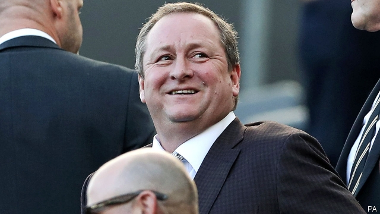

###### Vulture or visionary?

# Can the “power drinker” of British business rescue the high street? 

##### Mike Ashley is snapping up bankrupt chains, with big promises to turn them around 

 

> Jan 24th 2019 

 

THE BILLIONAIRE retailer never courts publicity. But when Mike Ashley does open up, the results are colourful. Giving evidence in a court case in 2017 he boasted of his binge drinking, although he did dispute one account that had him vomiting into a fireplace after 12 pints of beer and chasers. Hauled before a House of Commons select committee to explain allegations of sweatshop conditions at his company’s warehouse, Mr Ashley confessed that he had lost control of Sports Direct. The eminently sober Institute of Directors has called the firm’s actions a “scar on British business”. 

Yet Mr Ashley is now seen by some as the saviour of the high street. Bricks-and-mortar retailers have been devastated recently; the country’s main shopping streets suffered a net loss of 1,123 stores in the first half of last year, and expect this year to be worse. But Mr Ashley has been picking over the carrion, snapping up the famous names slain by online shopping. 

His latest bid is for HMV, a music chain which collapsed in December for the second time in six years. Last August he bought the House of Fraser group of department stores after it collapsed into administration, and in October he swooped on the bankrupt Evans Cycles chain. In 2017 he started buying shares in the Debenhams group. He now controls 29% of that business, which has just endured an awful Christmas trading period. He has also taken over Flannels, a fashion chain, and bought stakes in another, French Connection, as well as Game Digital, a struggling video-games retailer. 

Even if Mr Ashley closes many of these chains’ shops, to cut costs, he will have saved some of Britain’s most famous brands. “Only God could keep them all open,” he told a committee of startled MPs in December. During the same performance he advocated new policies to save what is left of the “dying” high street, including free parking and a tax on firms that sell more than 20% of their goods online. 

But beyond some big promises, such as a vow to transform House of Fraser into “the Harrods of the high street”, Mr Ashley has yet to articulate a vision of what he is going to do with all his acquisitions. Is he just a circling vulture, or does this self-made man have a plan? 

Mr Ashley is a “superb retailer”, believes Bryan Roberts of TCC, a retail analyst. He opened his first shop in 1982 at the age of 17. That venture grew into Sports Direct, now the country’s second-largest sportswear retailer by value, with more than 400 stores. He built the business by buying up famous sports brands such as Dunlop, Slazenger and Lonsdale. Mr Ashley, born nowhere near Tyneside, also bought Newcastle United football club in 2007. Adding companies such as Evans Cycles to this core sports business may make sense. 

It is harder to see how the non-sports acquisitions fit into the portfolio. One answer, argues Mr Roberts, is that Mr Ashley could start “cross-pollinating” brands, the on-trend way to fill up empty shops. Thus just as Sainsbury’s bought Argos, a catalogue retailer, and put its outlets in its supermarkets, so HMV, Sports Direct and other brands could go into Debenhams. Mr Ashley bought his slice of Game Digital to provide e-sports in his Sports Direct shops. Selfridges, a posh department store, does cross-pollination well—and, unlike everyone else, had a booming Christmas. 

Meanwhile, however, Sports Direct has lost more than 60% of its value in the past five years, partly because of the scandals over its employment practices. It has been spectacularly overtaken by JD Sports, which is now worth £4.3bn ($5.6bn), more than twice as much as Sports Direct. Getting Sports Direct back on track should be the priority. If Mr Ashley can reinvent retailing at the same time, that really will call for a few drinks. 

-- 

 单词注释:

1.vulture['vʌltʃә]:n. 秃鹫, 贪婪的人 [法] 贪婪而残酷者, 劫掠成性者 

2.drinker['driŋkә]:n. 饮者, 酒徒 

3.mike[maik]:vi. 偷懒, 游手好闲 n. 休息, 游手好闲, 扩音器, 话筒 

4.ashley[]:n. 艾希莉（人名） 

5.bankrupt['bæŋkrʌpt]:n. 破产者 a. 破产的 vt. 使破产 

6.Jan[dʒæn]:n. 一月 

7.billionaire[.biljә'nєә]:n. 亿万富翁 

8.retailer['ri:teilә]:n. 零售商人, 传播的人 [经] 零售商 

9.publicity[pʌb'lisiti]:n. 名声, 宣传, 公开场合 [经] 宣传, 广告 

10.colourful['kʌlәful]:a. 颜色丰富的, 鲜艳的, 艳丽的, 多色的, 丰富多彩的, 吸引人的, 引人入胜的 [计] 有色的 

11.binge[bindʒ]:n. 狂闹, 狂欢 

12.vomit['vɒmit]:vt. 吐出, 呕吐 vi. 呕吐 n. 呕吐, 呕吐物, 催吐剂 

13.chaser['tʃeisә]:n. 猎人, 驱逐舰 [机] 螺纹钣刀 

14.haul[hɒ:l]:n. 用力拖拉, 拖运, 强拉, 捕获量, 拖运距离 vi. 拖, 拉, 改变方向, 改变主意 vt. 拖拉, 拖运 

15.allegation[.æli'geiʃәn]:n. 断言, 主张, 申辩 [法] 声明, 事实陈述, 断言 

16.sweatshop['swet,ʃɔp]:n. 血汗工厂 

17.eminently[]:adv. 很, 突出地, 非常 

18.saviour['seivjә]:n. 救助者, 救世主, 救星 

19.devastate['devәsteit]:vt. 毁坏 [法] 使荒废, 毁灭, 掠夺 

20.carrion['kæriәn]:n. 死肉, 腐肉 a. 腐肉的, 似腐肉的, 吃腐肉的 

21.slay[slei]:v. 杀害, 残杀 

22.online[]:[计] 联机 

23.hmv[]:abbr. 英国"主人之声"牌唱片（His Master's Voice） 

24.fraser[]:n. 弗雷则河（加拿大西南部河流）；弗雷泽（男子名） 

25.swoop[swu:p]:n. 俯冲, 攫取 vt. 抓取 vi. 猛扑, 突然袭击 

26.evan['evən]:n. 埃文（男子名） 

27.Debenhams[]:[网络] 德本汉姆；德本罕百货公司；德本汉姆商场 

28.flannel['flænl]:n. 法兰绒, 法兰绒衣服 

29.MP[]:国会议员, 下院议员 [计] 宏处理程序, 维护程序, 线性规划, 微程序, 多处理器 

30.vow[vau]:n. 誓约, 誓言, 许愿 vi. 起誓, 发誓, 郑重宣言 vt. 立誓, 起誓要, 郑重地宣布 

31.Harrod['hærəd]:n. 哈罗德（姓氏） 

32.articulate[ɑ:'tikjulit]:a. 发音清晰的, 口才好的 vt. 明白地说, 以关节连接, 使成为系统的整体 

33.vulture['vʌltʃә]:n. 秃鹫, 贪婪的人 [法] 贪婪而残酷者, 劫掠成性者 

34.bryan['braiәn]:n. 布赖恩（男子名） 

35.Robert['rɔbәt]:[法] 警察 

36.TCC[]:[计] 技术控制中心, 传输控制字符 

37.analyst['ænәlist]:n. 分析者, 精神分析学家 [化] 分析员; 化验员 

38.sportswear['spɒ:tswєә]:n. 运动装, 休闲服 

39.dunlop[dʌn'lɔp, 'dʌnlɔp]:n. 邓洛普干酪（一种原产于苏格兰邓洛普的全脂干酪） 

40.slazenger[]:[网络] 史莱辛格；施莱辛格；史莱新格 

41.Lonsdale['lɔnzdeil]:朗斯代尔(姓氏) 

42.Tyneside['taɪn.saɪd]:[网络] 泰恩赛德；泰恩塞德；泰恩河畔 

43.newcastle['nju:,kɑ:sl]:n. 纽卡斯尔（英国港市） 

44.portfolio[pɒ:t'fәuliәu]:n. 皮包, 公文包, 部长职务, 有价证券财产目录, 艺术代表作选辑 [法] 公文包, 文件夹, 阁员职务 

45.argos['ɑ:^әus]:n. 阿哥斯（希腊东南一古城） 

46.Selfridge[]:n. 塞尔弗里奇（百货公司名） 

47.posh[pɒʃ]:a. 豪华的, 漂亮的, 优雅的, 极好的 interj. 呸 

48.spectacularly[]:adv. 引人注目地；壮观地 

49.JD[]:法学博士 

50.reinvent[.ri:in'vent]:vt. 重新使用；彻底改造；重复发明（在不知他人已发明的情况下） 

