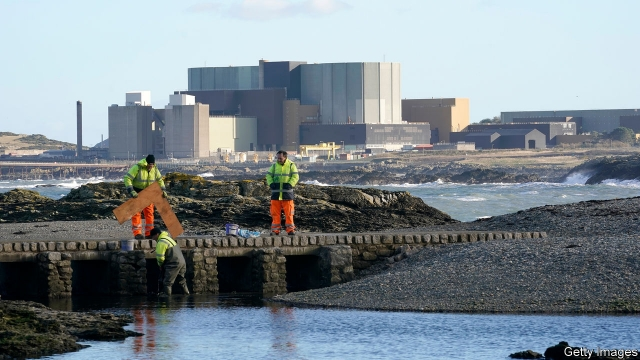
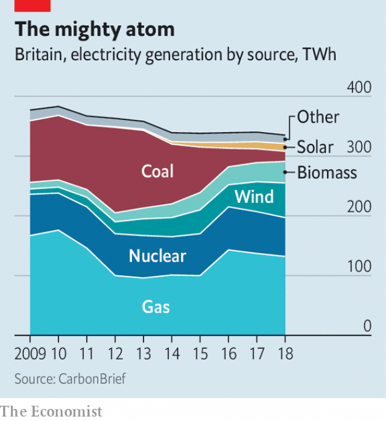

###### Wylfa’s fallout

# Hitachi’s exit puts Britain’s nuclear policy in meltdown 

##### As investors get cold feet, the government must either subsidise the industry or find other sources of power 

 

> Jan 24th 2019 

 

THE GOALS of the British government have recently seemed mysterious even to those within it. But on at least one issue, policymakers have had clear purpose: climate change. While some countries dawdle, Britain has had a comprehensive climate policy for more than a decade. In 2016, even as the country reeled from the Brexit vote, Parliament approved new targets for slashing carbon emissions. Meeting them, however, just got more difficult. 

On January 17th Hitachi, a Japanese company, said it would shelve plans for two nuclear power stations, at Wylfa Newydd in Anglesey and at Oldbury in Gloucestershire. The announcement came just two months after Toshiba, another Japanese firm, ditched plans for a nuclear plant in Cumbria. 

The nuclear companies that remain, France’s EDF and China General Nuclear (CGN), continue to plug their projects, in which they are partners. CGN is taking the lead on a plan to build a station at Bradwell, in Essex. EDF is trudging forwards with public consultations for Sizewell C, a nuclear project in Suffolk, fielding questions this week at the Trimley Sports and Social Club. EDF is already building Hinkley Point C in Somerset, with CGN as a minority investor. Yet despite such efforts, it looks increasingly plausible that Britain’s nuclear programme may be turned on its head. 

 

Nuclear power has been key to the government’s clean-electricity strategy. In the past decade power generated by coal has plunged and that from wind has soared. Nuclear stations supply about a fifth of Britain’s power (see chart). As coal and nuclear plants retire, the government expects new nuclear stations to help fill the gap, supplying ten new gigawatts of stable, reliable power by 2032. 

But there are growing doubts about whether some of the proposed nuclear plants will materialise. Investors have become wary of nuclear’s staggering upfront costs, delays and rising competition from wind and solar. In the effort to woo Hitachi the government offered, among other things, to take a one-third stake in the company’s Wylfa project and finance its debt. Even then, Hitachi rejected the deal, describing it as incompatible with the company’s “economic rationality”. 

CGN remains keen to build Bradwell. Success in the strictly regulated British market would bolster CGN’s standing as it tries to build nuclear stations around the world. But America has warned that CGN is helping China to militarise nuclear technology. The company proposes that Rolls-Royce, a British firm, could provide the control systems for Bradwell. Even then, security worries are unlikely to subside. 

Sizewell C’s chances look better. In nuclear construction, repetition and standardisation help restrain spending. Sizewell is a replica of Hinkley Point C, so EDF says its costs would be low enough to compete with wind. Sizewell may also be financed under a new mechanism in which the company receives a regulated rate of return. Even then, reckons Dieter Helm of Oxford University, the government would probably need to take a stake in the project to make it viable. “If the British government really wants to do Sizewell,” he argues, “it will have to invest in Sizewell and it will have to make it an Anglo-French project.” 

So ministers face a choice. They could pivot away from nuclear power and find a new way to lower emissions. Wind and solar could fill some of the gap, but new natural-gas stations would probably still be needed to offset the loss of nuclear, predicts Peter Osbaldstone of Wood Mackenzie, an energy consultancy. “There would potentially be a large tranche of low-carbon power coming offline and a fossil fuel stepping into its place,” he says. 

Alternatively, the government could bolster nuclear power, which would probably require substantial public investment in new power stations. It is unclear that Labour would support that, given the falling cost of renewables. For a successful nuclear industry, says Mr Helm, “you do need a cross-party, deep political consensus.” Right now there is little of that around. 

-- 

 单词注释:

1.fallout['fɒ:laut]:n. 原子尘的降下, 辐射性微尘, 原子尘, 附带结果 [医] [放射尘]回降 

2.meltdown['meltdaun]:[经] 销毁(货币等), 变卖(财产) 

3.investor[in'vestә]:n. 投资者 [经] 投资者 

4.subsidise[]:vt. 给...补助金, 津贴, 资助 

5.Jan[dʒæn]:n. 一月 

6.policymaker['pɔlisi.meikә]:n. 政策制定者；决策人 

7.dawdle['dɒ:dl]:v. 游手好闲, 混日子 

8.Brexit[]:[网络] 英国退出欧盟 

9.slash[slæʃ]:v. 猛砍, 乱砍 n. 猛砍, 乱砍, 删减 [计] 斜线 

10.emission[i'miʃәn]:n. 发射, 射出, 发行 [医] 发射, 遗精 

11.Hitachi[hi'tɑ:tʃi]:[计] 日立网络体系结构 

12.shelve[ʃelv]:vt. 放置架子上, 搁置 vi. 渐渐倾斜 

13.wylfa[]:[网络] 威尔法；北威尔士威尔法；安格尔西威尔法 

14.Anglesey['æŋgəlsi:]:n. 安格尔西岛（英国威尔士西北部一岛） 

15.Oldbury[]:[地名] 奥尔德伯里 ( 英 ) 

16.Gloucestershire['^lɔstәʃiә]:格洛斯特郡[英国英格兰郡名] 

17.toshiba[]:n. 东芝（公司名, 财富500强公司之一, 总部所在地日本, 主要经营电子电气） 

18.Cumbria['kʌmbriә]:坎布里亚郡 [英国英格兰郡名] 

19.edf[]:abbr. Economic Development Foundation <菲>经济开发基金会 

20.cgn[]: [医]cis-Golgi network 

21.Bradwell[]:n. (Bradwell)人名；(英)布拉德韦尔 

22.Essex['esiks]:n. 艾塞克斯郡(英格兰郡名) 

23.trudge[trʌdʒ]:n. 沉重的步伐, 长途跋涉 vi. 步履艰难地走, 蹒跚地走 vt. 跋涉 

24.consultation[.kɒnsәl'teiʃәn]:n. 请教, 咨询, 磋商会 [医] 会诊 

25.Sizewell[]:[地名] 赛兹韦尔 ( 英 ) 

26.C[si:]:[计] 调用, 访问, 呼叫；电容, 进位, 通道, 字符, 清除, 常数, 控制, 周期；C 程序设计语言 [化] 碳的化学符号; 胞苷 

27.suffolk['sʌfәk]:n. 萨福克（英国东部一郡）；萨克福马；萨福克羊 

28.Trimley[]:[地名] 特里姆利 ( 英 ) 

29.Hinkley[]:n. (Hinkley)人名；(英)欣克利 

30.somerset['sʌmәsit. -set]:n. 有衬垫的马鞍（独腿者乘坐的） 

31.plausible['plɒ:zibl]:a. 貌似真实的, 貌似合理的, 说得煞有其事的 [法] 花言巧语的, 似乎有理的 

32.soar[sɒ:]:n. 高扬, 翱翔 vi. 往上飞舞, 高耸, 翱翔 

33.gigawatt['dʒai^әwɔt]:[电] 十万万瓦 

34.materialise[mә'tiәriәlaiz]:vi.vt. (使)物质化, (使)具体化, (使)追求物质利益, (使)显形, 成为事实, 实现 vi. 突然出现 

35.wary['wєәri]:a. 谨慎的, 小心的, 机警的, 周到的, 唯恐的 

36.stagger['stægә]:n. 蹒跚, 踌躇 vi. 蹒跚, 犹豫 vt. 使摇摆, 使踌躇, 交错, 错开 a. 交错的, 错开的 

37.upfront[ˌʌpˈfrʌnt]:a. 正直的, 坦率的; 最前面的, 首要的; 在前面的; 预先的 adv. 在最前面; 提前支付（工资） 

38.incompatible[.inkәm'pætәbl]:a. 不相容的, 不能并存的, 矛盾的 [化] 不协调 

39.rationality[.ræʃә'næliti]:n. 合理性, 纯理性 

40.bolster['bәulstә]:n. 支持, 长枕 vt. 支持, 支撑 

41.militarise['militəraiz]:v. 军事化, 军国化 

42.subside[sәb'said]:vi. 沉淀, 沉降, 平息 

43.standardisation[,stændədai'zeiʃən, -di'z-]:n. 标准化 

44.replica['replikә]:n. 复制品 [计] 目录分区复制 

45.mechanism['mekәnizm]:n. 机械, 机构, 结构, 机理, 技巧 [化] 机理; 历程; 机构 

46.reckon['rekәn]:vt. 计算, 总计, 估计, 认为, 猜想 vi. 数, 计算, 估计, 依赖, 料想 

47.dieter['daiәtә]:n. 节食者 

48.helm[helm]:n. 舵, 驾驶盘, 枢机, 头盔 vt. 给...掌舵, 指挥, 给...戴头盔 

49.Oxford['ɒksfәd]:n. 牛津, 牛津大学 

50.viable['vaiәbl]:a. 能养活的, 能生长发育的 [医] 有活力的, 有生机的 

51.pivot['pivәt]:n. 枢轴, 支点, 旋转运动, 中枢, 关键人物 a. 枢轴的, (如)在枢轴上转动的 vi. 在枢轴上转动, 随着转移 vt. 装枢轴于, 以...为中心旋转 [计] 程序员交互验证和编制工具, 数据透视表 

52.offset['ɒ:fset]:n. 抵消, 把...并列, 旁系, 支管, 用胶印法印 vt. 弥补, 抵消, 胶印 vi. 装支管 n. 偏移量 [计] 偏移量 

53.peter['pi:tә]:vi. 逐渐消失, 逐渐减少 

54.mackenzie[]:n. 麦肯齐河（又译“马更些河”, 加拿大西北部河流）；麦肯齐区（又译“马更些区”, 加拿大西北部的小区）；麦肯齐氏 

55.consultancy[]:n. 商量, 协商, 磋商, 会诊, 与...商量, 咨询, 请教, 找(医生)看病, 查阅, 考虑 [经] 咨询业务, 咨询服务 

56.potentially[pә'tenʃәli]:adv. 可能地, 潜在地 

57.tranche[trɑ:nʃ]:[经] 一片, 一期, 一批 

58.offline[]:[计] 挂线, 脱机 

59.fossil['fɒsәl]:n. 化石, 古物 a. 化石的, 陈腐的, 守旧的 

60.alternatively[ɒ:l'tә:nәtivli]:adv. 非此即彼 

61.unclear[.ʌn'kliә]:a. 不易了解的, 不清楚的, 含混的 

62.renewable[ri'nju(:)әbl]:a. 可更新的, 可恢复的, 可继续的, 可换新的, 可重复的, 可重说的 [计] 可更新, 可再生的 

