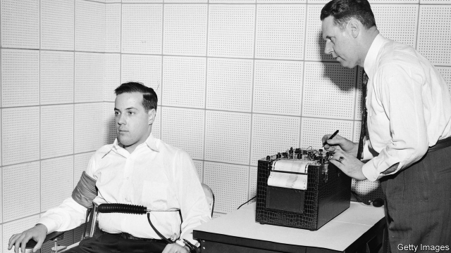

###### Testing the test

# Lie-detectors might be useful, even if they don’t work 

##### The science behind polygraphs is questionable but they nevertheless encourage offenders to be more honest 

 

> Jan 24th 2019 

 

POLYGRAPH TESTS are popular with credulous hacks and cranky quacks. In the 1940s, reports claimed a “lie-detector” test proved 43% of a sample of shop assistants had stolen stock or helped themselves from the till. Two decades on, the New York Times reported a study warning spooks to stop relying on the test to vet job candidates, since “homosexuals, laggards and trained Communist agents” could fool it. 

Yet plenty of serious scientists still embrace the polygraph, which records physiological responses associated with telling lies, like sweating and breathing-rate changes. Cops and probation officers use it in America and Japan. English courts do not usually admit polygraph evidence but some probation officers have recently begun using the tests. On January 21st the British government said it wants to wire up domestic abusers. If MPs pass its domestic-abuse bill, the policy will be piloted next year. Abusers who have been sentenced to a year or more in jail and are deemed likely to reoffend would be tested every six months while on parole. 

Some supporters of the bill were taken aback. Jess Phillips, a Labour MP, reckons the technique is better suited to daytime television: “I thought it was the preserve of ‘The Jeremy Kyle Show’.” In 2003 America’s National Academy of Sciences (NAS) found that evidence on its accuracy was “far from satisfactory”. 

Those who champion its use in Britain agree it is hardly foolproof, but argue it is still handy. The NAS also concluded that, among untrained examinees, polygraphs can identify lies at rates “well above chance, though well below perfection”. Since evidence suggests that psychologists and cops only spot whoppers at about the same rate as chance, the machine has an edge. 

As long as abusers believe the machine could catch them out, it might encourage them to be honest with probation officers, for example by disclosing contact with a former partner or breach of an exclusion zone. “It’s more useful as a truth facilitator than as a lie detector,” says Daniel Wilcox, a forensic psychologist. Serious sex-offenders have been forced to take the test on parole since 2014. Of the 4,800 tests since then, offenders passed about 60% and failed 35-40%. But more than half of those in each category disclosed new information because of the polygraph, either during a test that found them to be truthful or in questioning after one that indicated lies. Offenders who fail a test are not automatically returned to prison but might be questioned further. 

Don Grubin, a forensic psychiatrist, was a sceptic when he first began researching polygraphs in 2000. But he is now convinced of their usefulness as one tool to help probation officers identify those prisoners who might be in need of greater supervision. “People have this visceral reaction,” he says. “They just don’t like the polygraph. We’re building its credibility.” 

-- 

 单词注释:

1.polygraph['pɒligrɑ:f]:n. 多种波动记录仪, 复写器, 多产作家, 测谎器 [医] 多种波动描记器 

2.questionable['kwestʃәnәbl]:a. 可疑的 [法] 可疑的, 有问题的, 不可靠的 

3.offender[ә'fendә]:n. 罪犯, 无礼的人, 得罪人的人 

4.Jan[dʒæn]:n. 一月 

5.polygraph['pɒligrɑ:f]:n. 多种波动记录仪, 复写器, 多产作家, 测谎器 [医] 多种波动描记器 

6.credulous['kredʒulәs]:a. 轻信的, 易受骗的 

7.hack[hæk]:n. 劈, 砍, 砍痕, 出租车, 干咳, 晒架, 鹤嘴锄 vt. 劈, 砍, 出租, 用旧 vi. 劈, 砍, 干咳, 驾驶出租车 a. 出租的 

8.cranky['kræŋki]:a. 古怪的, 暴躁的, 脾气坏的 

9.quack[kwæk]:n. 鸭叫声, 冒牌医生, 冒充内行之人 a. 冒牌医生的 v. 嘎嘎叫, 当冒牌医生, 夸大广告 

10.york[jɔ:k]:n. 约克郡；约克王朝 

11.spook[spu:k]:n. 幽灵, 鬼 vt. 惊吓, 鬼怪般地出没 vi. 惊吓而逃窜, 受惊 

12.vet[vet]:n. 兽医 vi. 当兽医 vt. 诊断, 检审 

13.homosexual[.hɒmәu'sekjuәl]:a. 同性恋的 n. 同性恋者 

14.laggard['lægәd]:n. 迟钝者, 落后者 a. 迟钝的, 落后的 

15.physiological[.fiziә'lɒdʒikl]:a. 生理学的, 生理学上的, 生理机能的 [医] 生理学的, 生理的 

16.cop[kɒp]:n. 警官 vt. 抓住 

17.probation[prәu'beiʃәn]:n. 鉴定, 查验, 证明, 试用, 察看, 缓刑 [医] 审辨, 试验, 鉴定, 试用, 见习 

18.abuser[]:n. 滥用者 

19.MP[]:国会议员, 下院议员 [计] 宏处理程序, 维护程序, 线性规划, 微程序, 多处理器 

20.pilote[]:[网络] 领航员；飞行员；专用车车身制造 

21.deem[di:m]:v. 认为, 相信 

22.reoffend[]: 再犯罪；再犯法 

23.parole[pә'rәul]:n. 假释, 誓言, 释放宣言 vt. 宣誓后释放, 使假释出狱 

24.supporter[sә'pɒ:tә]:n. 支持者, 后盾, 迫随者, 护身织物 [法] 支持者, 赡养者, 抚养者 

25.aback[ә'bæk]:adv. 向后, 朝后, 突然, 船顶风地 

26.jess[dʒes]:n. 鹰的脚带 vt. 系以脚带 

27.phillips[]:n. 飞利浦（电子产业集团）；菲利普斯（姓氏） 

28.MP[]:国会议员, 下院议员 [计] 宏处理程序, 维护程序, 线性规划, 微程序, 多处理器 

29.reckon['rekәn]:vt. 计算, 总计, 估计, 认为, 猜想 vi. 数, 计算, 估计, 依赖, 料想 

30.daytime['deitaim]:n. 白天, 日间 

31.jeremy['dʒerimi]:n. 杰里米（男子名） 

32.kyle[kail]:n. （苏）狭海峡, 海峡 

33.NA[nɑ:, nә]:北美洲, 国立研究院院士, 国立研究院, 国民军 [医] 钠(11号元素) 

34.foolproof['fu:lpru:f]:a. 十分简单的, 十分安全的 

35.untrained[.ʌn'treind]:a. 未经训练的 

36.examinee[ig.zæmi'ni:]:n. 受试人, 应试者 [法] 受审人, 接受讯问者, 接受考试者 

37.perfection[pә'fekʃәn]:n. 完美, 完成, 极端 [经] 完整性 

38.psychologist[sai'kɒlәdʒist]:n. 心理学家 [医] 心理学家 

39.whopper['hwɒpә]:n. 特大之物, 弥天大谎 

40.breach[bri:tʃ]:n. 裂口, 违背, 破坏, 违反, 突破, 破裂 vt. 攻破, 突破 vi. 跳出水面 

41.exclusion[ik'sklu:ʒәn]:n. 排除, 除外, 逐出 [医] 排除, 除外, 分离术 

42.facilitator[fә'siliteitә]:n. 服务商；促进者 

43.detector[di'tektә]:n. 发现者, 检验器, 检波器 [计] 检波器; 检测器 

44.daniel['dænjәl]:n. 丹尼尔（男子名） 

45.wilcox['wilkɔks]:n. 威尔科特斯（姓氏） 

46.forensic[fә'rensik]:a. 辩论的, 法院的, 关于法庭的 n. 辩论练习 

47.truthful['tru:θful]:a. 说真话的, 诚实的, 真实的, 如实的 [法] 真实的, 说实话的, 诚实的 

48.don[dɒn]:n. 西班牙贵族(或绅士), 先生, 阁下 vt. 穿上 

49.grubin[]:[网络] 鲁宾 

50.psychiatrist[sai'kaiәtrist]:n. 精神病医生, 精神病学家 [医] 精神病学家 

51.sceptic['skeptik]:n. 怀疑论者 

52.usefulness['ju:sfjlnis]:n. 有用, 有益 [经] 有用, 有用性 

53.supervision[.sju:pә'viʒәn]:n. 监督, 管理 [经] 监督, 管理 

54.visceral['visәrәl]:a. 内脏的 [医] 内脏的 

55.credibility[.kredi'biliti]:n. 可信用, 确实性, 可靠 [法] 证据能力, 可信程度, 确实性 

