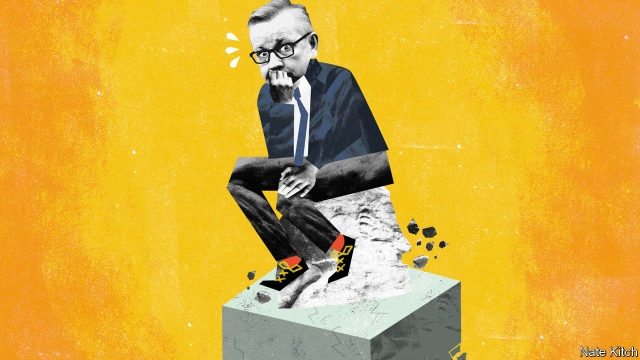

###### Bagehot

# Michael Gove, moderate maverick 

##### The evolving thinking of the most interesting Conservative 

 

> Jan 24th 2019 

 

IN AUGUST 2016, when this writer took over the Bagehot column, Michael Gove was roadkill. Theresa May had sacked him from her first cabinet. He had broken with his two political patrons—with David Cameron because he supported Leave in the referendum, and with Boris Johnson because, while acting as Mr Johnson’s campaign manager for the Tory leadership, Mr Gove suddenly announced that his boss wasn’t up to the job, and stood himself instead. A publisher cancelled a biography it had commissioned. 

Today Mr Gove is cock of the walk: the most successful secretary of state for the environment in memory; a star turn at the despatch box; and a pivotal figure in the Brexit war that will determine the country’s future. In his earlier incarnations in politics, Mr Gove always played Jeeves to an Etonian Wooster. Now the Woosters have imploded and Mr Gove is his own man. As such he is the most interesting person in the Tory party. 

On January 16th Mr Gove gave a parliamentary masterclass in defending his government against Jeremy Corbyn’s motion of no confidence. With the government’s morale shattered by a defeat of 230 votes, Mr Gove preached the old religion of how a terrorist-supporting, Communist-loving beardie from Islington North couldn’t be put in charge of the country. The Tories whooped. On January 22nd he displayed a different set of skills in his testimony before a House of Lords committee on rural affairs, making light of the tension between raising productivity and preserving “the ties that bind”, and quoting Sir Roger Scruton, a philosopher, on the importance of beauty and Dieter Helm, an economist, on natural capital. He was careful to praise both environmentalists and his own Department for the Environment, Food and Rural Affairs: “If it’s not all power to the Soviets, it’s all power to DEFRA.” 

All power to DEFRA is not a phrase uttered by any of his predecessors. Most regarded the office as a way-station on the road to higher things, or a rest home before retirement. Under Mr Gove, DEFRA is the only government department that is doing anything interesting. He is masterminding four big bills that are designed to prepare the country for its future outside the EU’s common agricultural policy and common fisheries policy. He has conducted high-profile campaigns against plastics and wood-burning stoves. 

Yet Mr Gove is far from being a smooth politician in the manner of his old friends David Cameron and George Osborne. Beneath the accomplished surface is a man in turmoil. This is partly congenital, for Mr Gove is a bundle of contradictions. He is an outsider who craves to be an insider: he grew up in Aberdeen as the adopted son of a fishmonger but spent his time in Oxford hanging around with public-school Tories like Mr Johnson. He is a populist who loves high culture: during the referendum campaign he railed against the liberal elite, but later slipped off to watch Wagner in Bayreuth with Mr Osborne. He is a moderniser with a weakness for unpopular causes such as Ulster unionism (he was a vocal critic of the Good Friday Agreement) and a convinced Tory with a streak of wild radicalism about him. It was these twin tastes for unpopular causes and wild radicalism that turned him into a Brexiteer. 

Mr Gove did as much as anybody to visit the current nightmare on the country. He was the first of Mr Cameron’s inner circle to declare his support for Brexit, which deeply wounded the then prime minister. He did more than anyone to persuade Mr Johnson to jump aboard the Brexit bus. Dominic Cummings, the campaign genius behind Vote Leave’s victory, was a Gove protégé. At the same time, Mr Gove is worried by what he has wrought. He has broken with the hard-core Brexiteers such as Sir John Redwood and Owen Paterson who think, against all evidence, that Britain will be fine if it leaves the EU with no deal. On the other hand, he is unwilling to join his close friend Nick Boles in advocating membership of the European Economic Area. He is instead sticking with the prime minister’s middle-of-the-road deal, despite the fact that it was trashed in Parliament—and despite the fact that, as by far the most talented Brexiteer in the cabinet, he has it in his power to kill it off and force the prime minister to change her direction. 

Why has one of the architects of Brexit decided to stick with a policy that, by common consent, is an exercise in damage limitation? There are all sorts of theories circulating among his friends in the Westminster village, including that he regrets the whole project and thinks that the only thing left is, indeed, damage limitation. But three explanations are more plausible. First is that he is terrified of a no-deal Brexit. He has been inundated with briefing papers that spell out in detail what a break in supply chains would mean for food supplies and what the imposition of tariffs of over 40% would mean for the lamb industry. He thinks that the Conservatives could be out of power for a generation if a no-deal exit occurred on their watch. The second is that he is content to bide his time. He thinks that the most important thing to do is get Brexit over the line, preferably on March 29th, after which it can grow organically. Third is a political consideration. Having helped bring down Mr Cameron and Mr Johnson, Mr Gove doesn’t have a third assassination in him. 

A fourth possibility is that the radical at the heart of British politics may be belatedly learning the essential Conservative value of pragmatism. He recently compared Tories waiting for the perfect Brexit to “mid-50s swingers” waiting for Scarlett Johansson to turn up to one of their parties. It is an apt metaphor. The past few agonising months have not only shown that Ms Johansson is not going to show up. They have also demonstrated that Sir John Major, perhaps the most underrated politician in recent decades, had negotiated a cunning deal with the EU that kept Britain out of the euro but gave it access to all the benefits of the union. Brilliant Tory radicals like Mr Gove have their place—but only if they are kept under strict control by wise Tory pragmatists like Sir John. 

-- 

 单词注释:

1.Bagehot[ˈbædʒət]:白芝浩；巴杰特（人名） 

2.michael['maikl]:n. 迈克尔（男子名） 

3.gove[]: [人名] 戈夫; [地名] [澳大利亚、美国] 戈夫 

4.maverick['mævәrik]:n. 未烙饲主印记的小牛, 持不同意见的人 vi. 迷路 

5.Jan[dʒæn]:n. 一月 

6.roadkill[ˈrəʊdkɪl]: 路上被轧死的动物 

7.theresa[ti'ri:zә]:n. 特丽萨（女子名） 

8.david['deivid]:n. 大卫；戴维（男子名） 

9.cameron['kæmәrәn]:n. 卡梅伦/隆（男子名） 

10.referendum[.refә'rendәm]:n. （就重大政治或社会问题进行的）全民公决，全民投票 

11.boris['bɔris]:n. 鲍里斯（男子名） 

12.johnson['dʒɔnsn]:n. 约翰逊（姓氏） 

13.Tory['tɒ:ri]:n. 托利党党员, 保守党员, 亲英分子 a. 保守分子的 

14.publisher['pʌbliʃә]:n. 出版者, 发行人 [法] 发行人, 出版者, 报刊发行者 

15.despatch[di'spætʃ]:v. 派遣 n. 派遣 

16.pivotal['pivәtәl]:a. 枢轴的, 关键的, 起中心作用的 

17.Brexit[]:[网络] 英国退出欧盟 

18.incarnation[.inkɑ:'neiʃәn]:n. 典型, 特殊阶段, 化身, 体现 

19.politic['pɒlitik]:a. 精明的, 明智的, 策略的 

20.alway['ɔ:lwei]:adv. 永远；总是（等于always） 

21.jeeve[]:[网络] 杰威 

22.etonian[i(:)'tәunjәn, -niәn]:a. 伊顿公学的, 伊顿公学般的 

23.Wooster[]:n. 伍斯特（美国俄亥俄州的一个城市）；伍斯特（一家生产飞机模型的厂商） 

24.Wooster[]:n. 伍斯特（美国俄亥俄州的一个城市）；伍斯特（一家生产飞机模型的厂商） 

25.implode[im'plәud]:vi. 内爆, 向内破裂, 爆裂 [电] 内裂 

26.parliamentary[.pɑ:lә'mentәri]:a. 国会的, 议会的, 议会制度的 

27.masterclass[ˈmɑ:stəklɑ:s]:n. （由舞蹈、音乐等方面的名家为优秀生讲授的）高级讲习班 

28.jeremy['dʒerimi]:n. 杰里米（男子名） 

29.morale[mɒ'rɑ:l]:n. 士气, 道德 

30.shatter['ʃætә]:n. 碎片, 粉碎, 落叶, 喷洒 vt. 打碎, 使散开, 粉碎, 破坏 vi. 粉碎, 损坏, 脱落 

31.preach[pri:tʃ]:v. 传道, 讲道, 说教, 宣讲, 鼓吹 n. 说教, 布道 

32.beardie[ˈbɪədi]: [医]泥鳅; 须鳕 

33.Islington[]:伊斯灵顿（地名, 圭亚那、美国、新西兰、牙买加、英国） 

34.Tory['tɒ:ri]:n. 托利党党员, 保守党员, 亲英分子 a. 保守分子的 

35.whoop[hwu:p]:n. 大叫, 呐喊, 一点点 vi. 叫喊, 鸣叫 vt. 高声说, 唤起 

36.testimony['testimәni]:n. 证言, 证据, 声明 [医] 证据 

37.productivity[.prәudʌk'tiviti]:n. 生产力 [经] 生产率, 生产能力 

38.roger['rɔdʒә]:interj. 对!, 行!, 好! 

39.scruton[]: [人名] 斯克鲁顿 

40.dieter['daiәtә]:n. 节食者 

41.helm[helm]:n. 舵, 驾驶盘, 枢机, 头盔 vt. 给...掌舵, 指挥, 给...戴头盔 

42.economist[i:'kɒnәmist]:n. 经济学者, 经济家 [经] 经济学家 

43.environmentalist[in,vaiәrәn'mentlist]:n. 环保人士 

44.Defra['defrə]:abbr. （英国）环境食品和乡村事务部 [网络] 农村事务部；食品暨乡村事务部；食品乡村事务部 

45.predecessor[.predi'sesә]:n. 前任, 先辈, 前身 [医] 初牙, 前辈, 祖先 

46.retirement[ri'taiәmәnt]:n. 退休, 隐居, 撤退 [经] 退休, 退股, (固定资产)报废 

47.mastermind['mɑ:stәmaind]:n. 优秀策划者, 才子 vt. 指导, 主持, 策划 

48.fishery['fiʃәri]:n. 渔业 [法] 捕鱼, 捕鱼权 

49.george[dʒɔ:dʒ]:n. 乔治（男子名）；自动操纵装置；英国最高勋爵勋章上的圣乔治诛龙图 

50.Osborne[]:n. 奥斯本（男子名） 

51.turmoil['tә:mɒil]:n. 骚动, 混乱 

52.congenital[kәn'dʒenitәl]:a. 天生的, 先天的 [医] 先天的 

53.outsider[' aut'saidә]:n. 外人, 局外人, 非会员, 外行, 门外汉, 比赛中获胜可能性不大的选手 [经] 外船公司 

54.crave[kreiv]:v. 渴望, 热望, 恳求 

55.aberdeen[,æbә'di:n]:n. 亚伯丁（英国苏格兰一郡 ）；苏格兰粗毛猎狐狗（等于Aberdeenterrier） 

56.fishmonger['fiʃ.mʌŋgә]:n. 鱼贩, 鱼商 

57.Oxford['ɒksfәd]:n. 牛津, 牛津大学 

58.Populist['pɔpjulist]:n. 民粹派的成员 

59.elite[ei'li:t]:n. 精华, 精锐, 中坚分子 

60.wagner['wæ^nә]:[电] 瓦格纳接地法 

61.Bayreuth['bairɔit]:拜罗伊特[德意志联邦共和国东南部城市] 

62.moderniser[]:n. 现代主义者, 现代化者 

63.unpopular['ʌn'pɔpjulә]:a. 不得人心的, 不受欢迎的, 不流行的 

64.ulster['ʌlstә]:n. 有带的宽大长外套 

65.unionism['ju:njәnizm]:n. 工会主义, 联合主义, 联邦主义 

66.vocal['vәukl]:a. 嗓音的, 声音的, 有声的, 歌唱的 n. 元音, 声乐作品 

67.streak[stri:k]:n. 条理, 斑纹, 倾向 vt. 加条纹 vi. 变成条纹, 飞跑 

68.radicalism['rædikәlizm]:n. 激进主义 

69.Brexiteer[]: 

70.nightmare['naitmєә]:n. 梦魇, 恶梦, 可怕的事物(或情景、人物) [医] 梦魇, 恶梦 

71.dominic['dɔminik]:n. 多米尼克（男子名） 

72.Cumming[]:n. (Cumming)人名；(英)卡明 卡明 

73.Brexiteers[]:支持英国退欧的人（Brexiteer的复数） 

74.john[dʒɔn]:n. 盥洗室, 厕所, 嫖客 

75.redwood['redwud]:n. (美国)红杉, 红树 

76.owen['әuin]:n. 欧文（男子名） 

77.Paterson['pætәsәn]:帕特森[美国新泽西州东北部城市] 

78.EU[]:[化] 富集铀; 浓缩铀 [医] 铕(63号元素) 

79.nick[nik]:n. 刻痕, 缺口, 划痕 vt. 刻痕于, 弄缺, 擦伤 vi. 狙击 

80.bole[bәul]:n. 树干 [医] 胶灰粘土 

81.membership['membәʃip]:n. 会员的资格, 全体会员, 会员数目 [法] 会员资格, 成员资格, 会籍 

82.trash[træʃ]:n. 垃圾, 废物 vt. 丢弃 

83.talented['tælәntid]:a. 天资高的, 有才能的 

84.Westminster['westminstә]:n. 威斯敏斯特 

85.plausible['plɒ:zibl]:a. 貌似真实的, 貌似合理的, 说得煞有其事的 [法] 花言巧语的, 似乎有理的 

86.inundate['inʌndeit]:vt. 浸水, 泛滥, 淹没, 使充满 

87.imposition[.impә'ziʃәn]:n. 征收, 课税, 强加, 欺骗 [经] 征税, 税, 税款 

88.tariff['tærif]:n. 关税, 关税表, 价格表, 收费表 vt. 课以关税 [计] 价目表 

89.bide[baid]:vt. 等候, 住, 忍耐, 等待 

90.preferably['prefәrәbli]:adv. 更可取地, 更好地, 更合意地 

91.organically[ɒ:'gænikli]:adv. 有机性地, 器官上地, 有组织地 

92.assassination[ә.sæsi'neiʃәn]:n. 暗杀 [法] 暗杀, 行刺 

93.belatedly[bi'leitidli]:adv. 延迟地；延续地 

94.pragmatism['prægmәtizm]:n. 实用主义 [法] 实用主义, 干涉主义, 独断 

95.swinger['swiŋә]:n. 赶时髦的人, 摆动的人, 摆动的物, 有力的事物, 轰动的事物, 责打者 

96.Scarlett['ska:lət]:n. 斯嘉丽（女子名或《飘》中的女主人公） 

97.Johansson[]:n. 约翰逊（姓氏） 

98.apt[æpt]:a. 有...倾向的, 易于的, 恰当的, 聪明的 [计] 自动数控语言, 自动图象传输, 自动程序控制, 自动程序设计工具 

99.metaphor['metәfә]:n. 隐喻 

100.agonising['æɡə,naiziŋ]:a. 烦恼的；苦闷的 

101.underrate[.ʌndә'reit]:vt. 低估, 对...估计过低, 看轻 

102.euro['juәrәu]:n. 欧元（欧盟的统一货币单位） 

103.pragmatist['prægmәtist]:n. 实用主义者, 爱管闲事的人 

