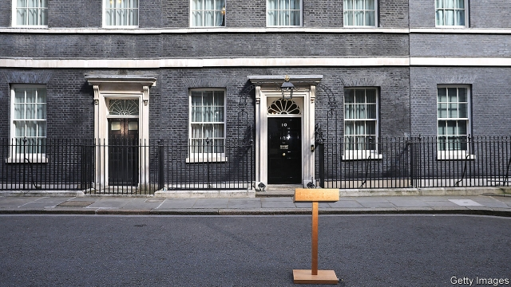
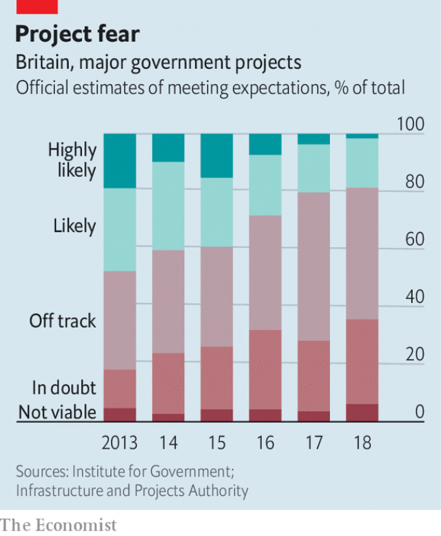

###### An absent agenda

# Missing: the British government 

##### Brexit is just one problem for a prime minister without the votes or the ideas to rule 

 

> Jan 24th 2019 

 

THERE ARE few quick wins in politics at the moment, but a plan to crack down on domestic abuse should surely have been one of them. Measures to beef up the country’s laws against abusive partners won cross-party support when Theresa May’s government proposed them in the summer of 2017. A public consultation ended the following May. But then eight more months went by. The government at last published its draft bill this week, a year and a half after it was first mooted. 

As Brexit has dominated, the rest of the government’s agenda has withered. Uncontroversial proposals like the domestic-abuse plan have moved slowly. Bigger reforms, to the National Health Service, for instance, have been delayed. Others seem to have been shelved altogether. A promised green paper on how to care for Britain’s increasingly numerous oldies, originally due last autumn, is still absent. The forthcoming spending review, which allocates cash to departments, has no date. And much of the legislation that has made it through has been fairly piddling. One law introduced a price cap on energy bills, a policy pinched from Labour. Another imposed stiffer punishments on people who shine lasers at aeroplanes. 

It is a far cry from the programme that Mrs May laid out on becoming prime minister in 2016, when she promised to deal with the “burning injustices” of British society. Instead, she has spent most of her time putting out Brexit-related fires. Although the government has introduced 46 bills since 2017—about par for an administration—only 28 have been unrelated to Brexit. Subtracting bills on Northern Ireland (which is without its assembly and thus dependent on Westminster) and those required for the basic functioning of government, only 17 new bits of legislation have been introduced. The government is all but grinding to a halt. 

 

One reason is a lack of capacity. The burden of preparing to leave the EU is badly hindering the civil service, points out Emily Andrews of the Institute for Government, a think-tank. Manpower is being shifted to cope. Bureaucrats from the Department for International Development (who are at least used to dealing with unstable banana republics) are being redeployed to other departments to help with Brexit planning. Even before the referendum, the proportion of big government projects in danger of over-running was rising (see chart). As a result, some policies are being deferred. John Manzoni, the chief executive of the civil service, put this situation in fluent bureaucratese on January 22nd, calling it “the beginning of a process of prioritisation”. 

Some blame the prime minister for worsening the situation. Other ministers’ aides complain of a lack of strategy in Downing Street, which they accuse of being unable to explain its priorities. Mrs May has carried on her habit from the Home Office of relying on inquiries and consultations. What once seemed like conscientious lawmaking increasingly looks like a figleaf for indecision. Last year a widely briefed plan to cut university tuition fees resulted instead in yet another review (since delayed). 

One senior Conservative MP describes Mrs May’s method of government as “valiant pugilism”. Rapid decision-taking and parliamentary dealmaking are things to which she is particularly ill-suited. “It’s a fantastic skill, her ability to do nothing,” says one of her former cabinet ministers, almost admiringly. 

Mrs May’s allies say the government is simply constipated. Civil servants were optimistically told to gear up to unleash a host of policies in anticipation of a successful vote for the government’s Brexit deal in December. “Departments were told to hold on to stuff,” says one adviser. “They are still holding it.” Brexit blocks up the “grid”, the Downing Street media planner that dictates when policies are announced. A host of reforms are ready to go, once the legislative laxative of passing a Brexit deal has taken effect, argue some aides. 

They may be waiting a long time. A basic problem lies at the heart of the government’s agenda: it does not have the votes. Since 2017 the Tories have lacked a majority in the House of Commons. This makes Brexit, described by civil servants as the government’s trickiest peacetime task, even harder. “We would not be having the issue with Brexit if we had [an] 80-seat majority,” says one government adviser. 

This has knock-on effects. Ministers are confined to the parliamentary estate, lest they miss a crucial vote, and so spend less time on the day job. Political instability saps ministerial ambition: why bother with tricky negotiations with Downing Street or the Treasury if the current occupants might not even be there in six months’ time? Even innocuous reforms run the risk of getting bogged down in proxy battles in the Brexit wars. 

Yet Mrs May’s programme suffers from a more profound flaw. “There is a belief [in Downing Street] that there ought to be a bold agenda,” says one ministerial aide. “I worry that they don’t know what it is.” After more than two years in power, Mrs May and her team have failed to spell out a plan to fix those burning injustices. 

The prime minister’s allies point out that she has found more money for the NHS, overseen a plan for its overhaul (albeit one drawn up by the NHS itself rather than the government) and enacted some small but successful measures, such as mandatory reporting of the gender pay gap for big companies. But on the big problems facing Britain—weak productivity growth, inadequate housing, crumbling social care and a grim long-term fiscal outlook, to name a few—Mrs May seems to be out of ideas. 

Her domestic agenda has undoubtedly been hampered by Brexit, an overworked civil service and miserable parliamentary arithmetic. But the bigger problem is that such an agenda barely exists at all. 

-- 

 单词注释:

1.Brexit[]:[网络] 英国退出欧盟 

2.Jan[dʒæn]:n. 一月 

3.politic['pɒlitik]:a. 精明的, 明智的, 策略的 

4.abusive[ә'bju:siv]:a. 恶言谩骂的, 被滥用的, 腐败的, 虐待的 

5.theresa[ti'ri:zә]:n. 特丽萨（女子名） 

6.consultation[.kɒnsәl'teiʃәn]:n. 请教, 咨询, 磋商会 [医] 会诊 

7.moot[mu:t]:n. 大会, 模拟案件, 辩论会 a. 未决议的, 无实际意义的 vt. 讨论, 争论 

8.wither['wiðә]:vt. 使凋谢, 使消亡, 使畏缩 vi. 枯萎, 衰退 

9.uncontroversial[]:a. 非争论性的；不会引起争论的 

10.shelve[ʃelv]:vt. 放置架子上, 搁置 vi. 渐渐倾斜 

11.oldy['әuldi]:n. 老人；陈旧之物 

12.originally[ә'ridʒәnli]:adv. 本来, 原来, 最初, 就起源而论, 独创地 

13.forthcoming['fɒ:θ'kʌmɑŋ]:a. 即将来临的 n. 来临 

14.piddle['pidl]:vi. 鬼混, 浪费, 挑食, 撒尿 

15.Mr['mistә(r)]:先生 [计] 存储器回收程序, 多重请求 

16.injustice[in'dʒʌstis]:n. 不公平, 非正义的行为 [法] 不公正, 不公平, 权利侵害 

17.par[pɑ:]:n. 标准, 票面价值, 平均数量, 同等水平 a. 票面的, 平常的, 标准的, 平价的 [计] 重新传输的肯定回答 

18.unrelated[]:[法] 无关的 

19.Westminster['westminstә]:n. 威斯敏斯特 

20.EU[]:[化] 富集铀; 浓缩铀 [医] 铕(63号元素) 

21.hinder['hindә]:a. 后面的 v. 阻碍, 打扰 

22.emily['emәli]:n. 埃米莉（女子名） 

23.andrew['ændru:]:n. 安德鲁（男子名） 

24.manpower['mænpauә]:n. 人力 [经] 人力 

25.bureaucrat['bjuәrәukræt]:n. 官僚作风的人, 官僚, 官僚主义者 [法] 官僚, 官僚作风的人 

26.redeploy[.ri:di'plɒi]:vt. 调动, 调换, 重新部署 vi. 重新部署 

27.referendum[.refә'rendәm]:n. （就重大政治或社会问题进行的）全民公决，全民投票 

28.defer[di'fә:]:vi. 推迟, 延期, 听从 vt. 使推迟, 使延期 

29.john[dʒɔn]:n. 盥洗室, 厕所, 嫖客 

30.Manzoni[]:n. (Manzoni)人名；(意、英)曼佐尼 

31.bureaucratese[,bjuәrәkrә'ti:z]:n. 官话, 官腔 

32.prioritisation[]:n. 优先性 [网络] 优先顺序；排列优先顺序；优先顺序制定 

33.worsen['wә:sn]:vt. 使更坏, 使恶化 vi. 变得更坏, 恶化 

34.aide[eid]:n. 助手, 副官 [计] 数据输入的可说明性 

35.conscientious[.kɒnʃi'enʃәs]:a. 有责任心的, 负责的, 本着良心的 [法] 凭良心做的, 有道德感的 

36.lawmaking[lɒ:'meikiŋ]:n. 立法 

37.figleaf[]:na. (雕塑)裸体像的遮羞叶；无花果叶 [网络] 狼战士；无花果树叶 

38.indecision[.indi'siʒәn]:n. 优柔寡断 [医] 决定不能 

39.MP[]:国会议员, 下院议员 [计] 宏处理程序, 维护程序, 线性规划, 微程序, 多处理器 

40.valiant['væljәnt]:a. 英勇的 n. 勇敢的人 

41.pugilism['pju:dʒilizm]:n. 拳击 

42.parliamentary[.pɑ:lә'mentәri]:a. 国会的, 议会的, 议会制度的 

43.dealmaking[]:[网络] 交易；交易促成；交易撮合 

44.admiringly[әd'maiәriŋli]:adv. 钦佩地, 羡慕地 

45.ally['ælai. ә'lai]:n. 同盟者, 同盟国, 助手 vt. 使联盟, 使联合, 使有关系 vi. 结盟 

46.constipate['kɒnstipeit]:vt. 使秘结, 使便秘, 使迟钝 vi. 便秘 

47.optimistically[]:adv. 乐观地；乐天地 

48.unleash[.ʌn'li:ʃ]:vt. 解开...的皮带, 发出, 发动 

49.anticipation[æn.tisi'peiʃәn]:n. 预期, 预料 [医] 提前出现(如遗传病) 

50.adviser[әd'vaizә]:n. 顾问, 劝告者, 指导教师 [法] 顾问, 劝告者 

51.grid[grid]:n. 格子, 栅格 [计] 网格 

52.planner['plænә]:n. 计划者, 设计者, 安排者 [机] 刨床机 

53.legislative['ledʒislәtiv]:n. 立法机构 a. 立法的, 有立法权的 

54.laxative['læksәtiv]:a. 通便的, 轻度腹泻的 n. 通泻剂, 缓泻药 

55.Tory['tɒ:ri]:n. 托利党党员, 保守党员, 亲英分子 a. 保守分子的 

56.tricky['triki]:a. 狡猾的, 机敏的 

57.peacetime['pi:staim]:n. 平时时期, 和平 

58.les[lei]:abbr. 发射脱离系统（Launch Escape System） 

59.instability[.instә'biliti]:n. 不安定, 不稳定 [医] 不稳定性 

60.sap[sæp]:n. 树液, 体液, 活力, 坑道, 消弱, 警棍 vt. 使排出体液, 使伤元气, 使衰竭, 挖坑道逼近, 逐渐侵蚀 vi. 挖坑道, 消弱 [计] 共享汇编程序, 结构分析程序, 符号汇编程序, 服务器广告协议 

61.ministerial[.mini'stiәriәl]:a. 部长的, 内阁的, 执政的 [法] 部长的, 部的, 公使的 

62.bother['bɒðә]:vt. 烦扰, 迷惑 vi. 烦恼, 操心 n. 麻烦, 纠纷, 讨厌的人 

63.negotiation[ni.gәuʃi'eiʃәn]:n. 谈判, 磋商, 交涉 [经] 谈判, 协商 

64.treasury['treʒәri]:n. 国库, 宝库, 财政部, 国库券 [经] 库存, 国库, 金库 

65.occupant['ɒkjupәnt]:n. 占有者, 居住者, 占用者 

66.innocuous[i'nɒkjuәs]:a. 无害的, 无伤大雅的 [医] 无害的, 良性的 

67.bog[bɒg]:n. 沼泽 vt. 使陷于泥沼 vi. 陷于泥沼 

68.proxy['prɒksi]:n. 代理, 代理人, 委托书 [经] 代理人, 代表权, 授权书 

69.profound[prә'faund]:a. 极深的, 深厚的, 深刻的, 渊博的 

70.flaw[flɒ:]:n. 缺点, 裂纹, 瑕疵, 一阵狂风 [化] 划痕; 裂缝; 裂纹 

71.nh[]:abbr. 不吸湿的（nonhygroscopic）；全日空航空公司；美国地名, 新罕布什尔（New Hampshire） 

72.oversee[.әuvә'si:]:vt. 向下看, 了望, 监督, 偷看到 [法] 监察, 监督, 俯瞰 

73.overhaul[.әuvә'hɒ:l]:vt. 分解检查, 翻修, 精细检查, 彻底革新 n. 分解检查, 精细检查, 大检修 

74.albeit[ɔ:l'bi:it]:conj. 尽管, 虽然 

75.enact[i'nækt]:vt. 制定法律, 扮演, 颁布 [法] 法令, 法规, 条例 

76.mandatory['mændәtәri]:a. 命令的, 托管的 [经] 受托者, 命令者 

77.gender['dʒendә]:n. 性 vt. 产生 

78.productivity[.prәudʌk'tiviti]:n. 生产力 [经] 生产率, 生产能力 

79.inadequate[in'ædikwәt]:a. 不充分的, 不适当的 [法] 不充分的, 不适当的 

80.crumble['krʌmbl]:v. (使)粉碎, (使)成为碎屑, 瓦解, 崩溃, 败落 

81.grim[grim]:a. 冷酷的, 坚强的, 残忍的, 可怕的, 讨厌的 

82.fiscal['fiskәl]:a. 财政的, 国库的 [经] 财政上的, 会计的, 国库的 

83.hamper['hæpә]:n. 食篮, 阻碍物, 食盒 vt. 阻碍, 使困累, 妨碍, 牵制 

84.overwork[.әuvә'wә:k]:n. 过度操劳的工作, 额外工作 v. (使)工作过度, 使过分劳累 

