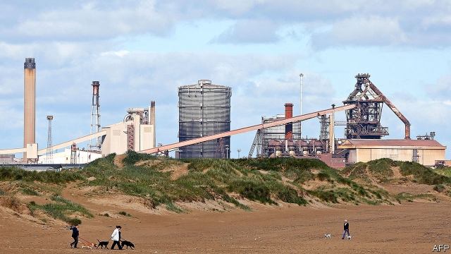

###### Port in a storm

# Teesside bids to become Britain’s first free port 

##### An idea from the Middle East could be given a whirl in the North East 

 

> Jan 24th 2019 

 

TEESSIDE WAS the future, once. In the 1950s Ridley Scott, then a student at the Northern School of Art in Hartlepool, would walk down to nearby Redcar, crossing a bridge over the steelworks on his way. The view of the area’s bustling chemical plants, roaring blast furnaces and booming seaport inspired the opening shots of Sir Ridley’s 1982 film, “Blade Runner”, set in a dystopian 2019. 

The future has arrived, and Teesside looks very different to the scenes Sir Ridley imagined. The industrial area around the mouth of the river Tees, where 40,000 people once worked, now employs just 3,300. Most of its buildings lie abandoned, including a blast furnace as tall as St Paul’s Cathedral that was closed in 2015. 

Big plans are now afoot to reinvigorate the area. Last year a 4,500-acre industrial plot, rebranded as the South Tees Development Corporation, became Britain’s first “special economic area”, with the power directly to collect business rates on the site to fund land remediation work. More than £100m ($130m) of central-government grants have helped to redevelop the plot. Ben Houchen, the young Conservative mayor of the Tees Valley, says the next step is for the site to become a “free port”, with carve-outs from the national customs regime. The Treasury is considering the plan. 

That too would be a first for Britain. Free ports and special economic areas are common elsewhere in the world. There were more than 4,000 in 2015; a report in 2008 estimated that up to 68m people worked in them. Simon Clarke, the Conservative MP for nearby Middlesbrough, raves about Jebel Ali, a free zone in Dubai through which a quarter of the emirate’s trade passes. A special economic zone near Hong Kong, set up in 1980, has been dubbed the “miracle of Shenzhen”. Policies tested there have spread to other Chinese cities. America launched “opportunity zones” in 2017, which do away with capital-gains tax for firms investing in poor areas. 

The idea that Britain could copy these was outlined by Rishi Sunak, another local Tory MP, in a paper for the Centre for Policy Studies, a think-tank, shortly after the vote to leave the European Union in 2016. Mr Clarke and Mr Houchen argue that Britain should establish free ports nationwide, as a cure for long-term industrial decline and any trade friction caused by Brexit. 

Companies are interested. Two metalworks firms have promised to build factories on the Teesside plot, helped by £14m from the central government to prepare the site. PMAC, a Yorkshire-based business, has signed a £250m deal to build a waste-to-energy plant there. And in November a consortium of six big energy companies announced plans to build a gas-powered energy plant, claiming it would be the first in the world to use carbon-capture technology on a large scale. 

Economists tend to be sceptical of free ports. By design they create distortions. Cutting taxes in one place encourages firms to move there, but at a cost to other regions. “Enterprise zones”, British forerunners to special economic areas, were found mainly to attract relocating firms, rather than new ones. 

Mr Houchen says Teesside can avoid this by focusing on industries without a large presence elsewhere in Britain. He claims the firms investing there would “come to Teesside or not to Britain at all”. That might not solve the problem. Economies operate in equilibrium, says Meredith Crowley, an economist at Cambridge University. A benefit offered to one firm causes relative harm to another. Firms operating in a free port could undercut those outside. 

The policy becomes costly over time, as tax revenues are forgone. Special incentives may cut $3bn from Amazon’s tax bill at its new base in New York, which critics say it would have built in America without giveaways. The same idea may apply in Teesside. Chris McDonald of the Materials Processing Institute, a research and advisory firm based there, says that industrial companies need land, power, ports and people, all of which are abundant. As Mr Houchen says, “Once you get people here, they see the other benefits of the site and invest.” If you build it they will come—but they may have come anyway. 

-- 

 单词注释:

1.Teesside[]:蒂赛德（地区）（地名）（英国） 

2.Jan[dʒæn]:n. 一月 

3.Teesside[]:蒂赛德（地区）（地名）（英国） 

4.ridley['ridli]:n. [动] 鳞龟属(=Lepidochelys)动物 (产于墨西哥湾) 

5.scott[skɔt]:n. 斯科特（男子名） 

6.Hartlepool['hɑ:tlipu:l]:哈特尔普尔[英国英格兰东北部港市] 

7.Redcar[]:雷德卡 

8.steelwork[]:n. 钢铁工程, 钢结构, 钢制品 [化] 钢结构 

9.bustle['bʌsl]:n. 喧闹, 裙撑 vi. 奔忙, 喧闹 vt. 使忙碌, 催促 

10.dystopian[dis'tәjpiәn]:a. 反面乌托邦的,反面假想国的  n. 反面乌托邦的鼓吹者(或描写者) 

11.tee[ti:]:n. T字形, T字形之物, 发球区, 球座, 目标 vt. 搁在球座上 a. T字形的 

12.ST[]:[计] 段表, 状态, 系统测试, 直端连接器 [化] 磺胺噻唑 

13.afoot[ә'fut]:a. 徒步的, 在进行中的, 活动中的 adv. 徒步, 在进行中 

14.reinvigorate[.ri:in'vigәreit]:vt. 使再振作, 使复兴 

15.rebrand[ˌri:ˈbrænd]:v. 给（产品或组织）重新命名（或包装）, 重塑…的形象 

16.remediation[,ri,midi'eiʃәn]:n. 补习, 辅导, 补救, 纠正 

17.redevelop[,ri:di'velәp]:v. 恢复(促进)经济发展, 重点恢复 

18.ben[ben]:n. 内室 [医] 贝昂(俗名,一般指辣木Moringa oleifera,有时也指一些不同属的植物) 

19.houchen[]: [人名] 霍钦 

20.regime[rei'ʒi:m]:n. 政权, 当权期间, 政体, 社会制度, 体制, 情态 [医] 制度, 生活制度 

21.treasury['treʒәri]:n. 国库, 宝库, 财政部, 国库券 [经] 库存, 国库, 金库 

22.simon['saimәn]:n. 西蒙（男子名） 

23.clarke[]:n. 克拉克（姓氏） 

24.MP[]:国会议员, 下院议员 [计] 宏处理程序, 维护程序, 线性规划, 微程序, 多处理器 

25.Middlesbrough['midlzbrә]:米德尔斯布勒[英国英格兰东北部港市]( 克利夫兰郡首府) 

26.rave[reiv]:n. 狂吼, 狂暴 v. 愤怒地说, 叫嚷, 咆哮 

27.jebel['dʒebl]:n. <阿> 山, 高山 

28.ALI[]:[计] 异步线路接口 

29.dubai['dju:bai]:n. 迪拜（阿拉伯联合酋长国的酋长国之一）；迪拜港（阿拉伯联合酋长国港市） 

30.hong[hɔŋ]:n. （中国、日本的）行, 商行 

31.kong[kɔŋ]:n. 含锡砾石下的无矿基岩；钢 

32.dub[dʌb]:vt. 配音, 轻点, 授予称号, 击 n. 一下击鼓声, 笨蛋 

33.shenzhen['ʃʌn'dʒʌŋ]:n. 深圳 

34.rishi['riʃi,'ri:-]:n. (印度教)哲人,圣人, 富有灵感的诗人 

35.Tory['tɒ:ri]:n. 托利党党员, 保守党员, 亲英分子 a. 保守分子的 

36.Brexit[]:[网络] 英国退出欧盟 

37.metalwork['metәlwә:k]:n. 金属制品, 金属加工 [机] 金工 

38.pmac[]:[=phenylmercuric acetate]醋酸苯汞 

39.consortium[kәn'sɒ:tjәm]:n. 协会, 合伙, (国际性)财团 [经] 合作, 联合, 财团 

40.economist[i:'kɒnәmist]:n. 经济学者, 经济家 [经] 经济学家 

41.distortion[dis'tɒ:ʃәn]:n. 扭曲, 变形, 曲解 [计] 畸变; 失真 

42.forerunner[fɒ:'rʌnә]:n. 先驱, 前兆 

43.relocate[ri:'lәukeit]:vt. 重新安置, 再配置, 放在新地方 [计] 再定位; 浮动 

44.equilibrium[.i:kwi'libriәm]:n. 平衡, 平静, 均衡 [化] 平衡 

45.Meredith['meridiθ]:n. 梅雷迪思(m.) , 梅瑞狄斯(Edward Robert Bulwer-Lytton 的笔名) 

46.Crowley[]:克罗利 克罗利 

47.Cambridge['keimbridʒ]:n. 剑桥 

48.undercut['ʌndәkʌt]:n. 底切, 牛腰部下侧嫩肉, 下口, 下旋削球 vt. 廉价出售, 底切, 雕出, 下旋削球 vi. 切除底部 

49.forgo[fɒ:'gәu]:vt. 摒绝, 放弃 

50.incentive[in'sentiv]:n. 动机 a. 激励的 

51.york[jɔ:k]:n. 约克郡；约克王朝 

52.giveaway['givә.wei]:n. 泄漏, 免费赠品 

53.chris[kris]:n. 克里斯（男子名）；克莉丝（女子名） 

54.mcdonald[mәk'dɔnәld]:n. 麦克唐纳（男子名）；麦当劳（快餐店名称） 

55.advisory[әd'vaizәri]:a. 顾问的, 咨询的, 劝告的 [法] 劝告的, 忠告的, 咨询的 

