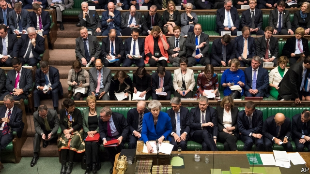

###### Brexit and Parliament

# The unintended consequences of the plan to stop a no-deal Brexit 

##### How attempts to extend Article 50 could yet help Theresa May get her own deal passed 

 

> Jan 24th 2019 

 

AFTER SEEING her Brexit agreement crushed in the Commons by 230 votes, Theresa May was forced on January 21st to report to MPs on what she would do next. Characteristically, she refused to change. After a token effort to consult opposition MPs, she reverted to her previous plan: seek assurances from the European Union about the temporary nature of the Irish “backstop”, in hopes of winning over Brexit hardliners. With Brussels still rejecting any legally binding end-point to the backstop, such hopes seem forlorn. 

Most Brexiteers are unfazed. They argue that, if there is no majority for any Brexit deal, Britain will leave without one on March 29th, the deadline fixed under Article 50 of the EU treaty. Yet many MPs and even some ministers are determined to stop such a high-risk outcome. Amendments have been proposed to Mrs May’s Brexit motion that will be put to the vote on January 29th. Some are declaratory only. But two are more serious because they change parliamentary procedure—and they seem likely to pass. 

The first, from Yvette Cooper, a Labour MP, and Nick Boles, a Tory, would suspend the rules giving precedence to government business for one day, February 5th. It would be used to rush through a bill requiring the government, if no Brexit deal were passed by February 26th, to ask the EU to extend the Article 50 deadline. A second amendment from Dominic Grieve, another Tory, would suspend the rules for every sitting Tuesday until March 26th. On those days MPs would instead vote on other Brexit options, ranging from a permanent customs union to a second referendum. 

Mrs May is against such plans because she wants to keep the no-deal option. But with the Labour opposition suggesting it will back at least the first proposal, it seems likely to win the day. Hardliners are denouncing what they call a constitutional outrage by which Remainers seek to hijack and even stop the Brexit backed by voters in 2016. Jacob Rees-Mogg, a leading Brexiteer, has even suggested that the government should prorogue (ie, suspend) Parliament to stop the Cooper/Boles bill becoming law. 

There are several ironies in this. A key argument made by Leavers was that sovereignty must return from Brussels to Westminster. Yet now that MPs are duly asserting themselves, Leavers attack them for subverting the sovereign will of the people. 

Another irony arises from claims that MPs are not delivering Brexit because they no longer represent their voters. It is true that a large majority of MPs, like the prime minister and most of the cabinet, were Remainers. Yet as a study on Brexit and public opinion published this week by the UK in a Changing Europe academic network shows, voters are as divided as MPs on what sort of Brexit they want. In failing to find a majority for anything, the Commons exactly reflects those divisions. Moreover, the study suggests that, were the 2016 referendum rerun now, Remain would win, albeit narrowly. 

What will happen if backbenchers succeed in legislating a call for an Article 50 extension? The first point to keep in mind is that other EU governments might not agree. Extension (as opposed to revocation of the original Article 50 letter) requires unanimous approval, and many in Brussels are dubious about giving Britain more time merely to argue over what it wants. Yet the EU is also anxious to avoid a no-deal Brexit, which would damage the continent as well as Britain. So it may well, in the end, prove ready to accept an extension. 

This could produce another unexpected outcome. Brexit hardliners could find that, thanks to their annoying colleagues, the option of a no-deal Brexit was, in effect, blocked. They would then discover that Mrs May was right to say that one likely alternative to her deal was—horrors!—no Brexit at all. Already, Mr Rees-Mogg and others are hinting that, if she can only find face-saving tweaks to her deal, they may back it after all. It would be the ultimate irony if MPs who hoped to use legislative tricks to soften Brexit end up creating the best chance Mrs May has of getting her Brexit deal through. 

-- 

 单词注释:

1.Brexit[]:[网络] 英国退出欧盟 

2.unintended['ʌnin'tendid]:a. 不是存心的, 无心的, 非故意的 

3.theresa[ti'ri:zә]:n. 特丽萨（女子名） 

4.Jan[dʒæn]:n. 一月 

5.MP[]:国会议员, 下院议员 [计] 宏处理程序, 维护程序, 线性规划, 微程序, 多处理器 

6.characteristically[.kærәktә'ristikli]:adv. 表示特性地 

7.token['tәukәn]:n. 表征, 记号, 代币 a. 象征的, 表意的 [计] 记号 

8.opposition[.ɒpә'ziʃәn]:n. 反对, 敌对, 相反, 在野党 [医] 对生, 对向, 反抗, 反对症 

9.revert[ri'vә:t]:vi. 恢复, 复归, 回复, 还原 vt. 使回复原状, 使回转 n. 恢复原信仰的人 [计] 还原 

10.assurance[ә'ʃuәrәns]:n. 保证, 把握, 信心, 保险 [经] 保证, 担保, 保险 

11.backstop['bækstɒp]:n. 挡球网, 接球手 [电] 背向停止 

12.hardliner[ˌhɑ:d'laɪnə(r)]:n. 强硬路线者 

13.Brussel[]:n. 布鲁塞尔（比利时首都） 

14.legally['li:gәli]:adv. 法律上, 合法地 [法] 法律上, 合法地, 法定地 

15.forlorn[fә'lɒ:n]:a. 孤独的, 悲惨的, 凄凉的 

16.Brexiteers[]:支持英国退欧的人（Brexiteer的复数） 

17.unfazed[ʌnˈfeɪzd]:a. 不担忧的, 不苦恼的 

18.EU[]:[化] 富集铀; 浓缩铀 [医] 铕(63号元素) 

19.amendment[ә'mendmәnt]:n. 修订, 改善, 改良, 改正 [化] 调理剂; 修正 

20.Mr['mistә(r)]:先生 [计] 存储器回收程序, 多重请求 

21.declaratory[di'klærәtәri]:a. 宣言的；公布的 

22.parliamentary[.pɑ:lә'mentәri]:a. 国会的, 议会的, 议会制度的 

23.yvette[i'vet]:n. 伊薇特（女子名） 

24.cooper['ku:pә]:n. 制桶工人 v. 制桶 

25.MP[]:国会议员, 下院议员 [计] 宏处理程序, 维护程序, 线性规划, 微程序, 多处理器 

26.nick[nik]:n. 刻痕, 缺口, 划痕 vt. 刻痕于, 弄缺, 擦伤 vi. 狙击 

27.bole[bәul]:n. 树干 [医] 胶灰粘土 

28.Tory['tɒ:ri]:n. 托利党党员, 保守党员, 亲英分子 a. 保守分子的 

29.precedence[pri'si:dns]:n. 优先, 居先 [计] 先后次序; 优先规定 

30.dominic['dɔminik]:n. 多米尼克（男子名） 

31.referendum[.refә'rendәm]:n. （就重大政治或社会问题进行的）全民公决，全民投票 

32.denounce[di'nauns]:vt. 告发, 抨击, 谴责 [法] 谴责, 斥责, 告发 

33.constitutional[.kɒnsti'tju:ʃәnl]:a. 宪法的, 立宪的, 体质的 [医] 全身的; 体质的 

34.outrage['autreidʒ]:n. 暴行, 侮辱, 愤怒 vt. 凌辱, 虐待, 触犯 

35.remainers[]:[网络] 剩余物 

36.hijack['haidʒæk]:vt. 抢劫, 劫持, 敲诈 [法] 挡路抢劫, 抢劫, 绑架 

37.voter['vәutә]:n. 选民, 投票人 [法] 选民, 选举人, 投票人 

38.jacob['dʒeikәb]:n. [圣经]雅各（以色列人的祖先）；雅各布（男子名） 

39.Brexiteer[]: 

40.prorogue[prә'rәu^]:vt.vi. (使)闭会, (使)休会 [法] 使休会, 使闭会 

41.IE['i:ei]:[计] 中断启动 

42.irony['aiәrәni]:n. 反语, 讽刺, 具有讽刺意味的事 

43.leaver['li:vә]:n. 离开者（常指学校毕业生） 

44.sovereignty['sɒvrәnti]:n. 主权, 独立国 [法] 主权, 主权国家, 统治权 

45.Westminster['westminstә]:n. 威斯敏斯特 

46.duly['dju:li]:adv. 恰当地, 充分地, 适当地, 及时地 

47.assert[ә'sә:t]:vt. 主张, 坚称, 断言 [法] 宣称, 断言, 维护 

48.subvert[sәb'vә:t]:vt. 推翻, 颠覆, 毁灭 [法] 颠覆, 推翻, 减亡 

49.sovereign['sɒvrin]:n. 元首, 独立国 a. 具有主权的, 至高无上的, 国王的, 完全的 

50.UK[ju: 'kei]:n. 联合王国 

51.rerun[ri:'rʌn]:n. 重新开动, 再度上演 vt. 重新开动, 再度上演 [计] 再运行; 重新运行 

52.albeit[ɔ:l'bi:it]:conj. 尽管, 虽然 

53.narrowly['nærәuli]:adv. 狭窄地, 严密地, 仔细地, 几乎不, 勉强地, 仅仅 

54.backbencher['bækbentʃә]:n. 后座议员 

55.legislate['ledʒisleit]:vi. 制定法律 vt. 用立法规定 

56.revocation[.revә'keiʃәn]:n. 废止, 取消, 撤回 [经] 撤销 

57.unanimous[ju:'nænimәs]:a. 意见一致的, 无异议的 

58.dubious['dju:biәs]:a. 可疑的, 不确定的 

59.unexpect[]:[网络] 意想不到；使意外 

60.tweak[twi:k]:n. 拧, 扭, 焦急 vt. 扭, 开足马力 

61.legislative['ledʒislәtiv]:n. 立法机构 a. 立法的, 有立法权的 

62.soften['sɒftn]:v. (使)变柔软, (使)变柔和 

