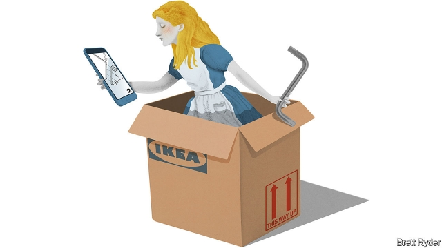

###### Schumpeter

# As retailers abandon the high street, why is IKEA moving in? 

##### The company is heading into the heart of London, Paris and New York 

 

> Jan 24th 2019 

 

TOTTENHAM COURT road is a little-loved street of furniture stores in central London, made even more drab by boarded-up shops and SALE signs plastered across the windows. But since October a new type of outlet has brought in some Lewis Carroll-like magical realism. Through vast glass windows, passers-by gaze in on a kitchen so tall it looks like part of Wonderland. Inside are no tills; indeed nothing is sold there. It belongs to IKEA, a Swedish furniture retailer, which also seems topsy-turvy; IKEA is famously a staple of suburbia. 

It may seem as if Alice has stepped through the looking-glass. But there is method in the madness. As other retailers are driven off the high street, partly because of competition from big-box stores like IKEA, the company is heading into the heart of London, Paris and New York as part of an expansion into 30 city centres. It is not only examining where it puts its shops. Though IKEA woke up late to the importance of e-commerce, it is using the shock as an opportunity to rethink its business model; the internet will become more central to its future. Many of its competitors still see digital commerce as just one retail channel among many. They are making a big mistake. Unless they face reality, more will join the ranks of struggling retailers such as Sears, JC Penney and Macy’s in America, and Debenhams in Britain—especially if consumer spending turns down. 

Retailing is not an industry prone to reinvention. Far from it. As Mark Pilkington, a former lingerie executive, explains in a new book, “Retail Therapy”, its two great innovations happened long ago, when shops grew into supermarkets, department stores and malls, and when merchandise moved out from behind the counter. The big stores became vast distribution systems, benefiting from oodles of capital and high barriers to entry. Meanwhile, customers bought the merchandise and walked out with it; the retailer saw little reason to engage with them beyond advertising and pretending to listen to their complaints. 

E-commerce has upended this arrangement. Strip out items that are not widely bought online, such as cars, fuel and meals, and the internet’s share of total retail sales last year rose above 17% in Britain, 16% in America and 15% in Germany, according to the Centre for Retail Research, a British consultancy. Above 15%, says Mr Pilkington, is the point at which legacy retailers, with their high cost of stores and staff, struggle to survive, posing huge risks to jobs, the commercial-property business, lenders and investors. 

Not bearing such costs or capacity constraints, e-retailers can offer a wider range of goods, at better prices, with a more personalised, data-driven service. E-commerce also changes the distribution system. Retailing used to be cash-and-carry, with shoppers taking their merchandise home with them. Now they often travel by different routes, unencumbered by shopping bags. So in addition to sales, retailers have to factor in delivery. That is where IKEA is devoting lots of attention. 

Though Tolga Öncü, IKEA’s head of retail, explains this with a wad of Swedish snus, or smokeless tobacco, beneath his upper lip, he appears more excited than nervous about the transition. The company’s strong brand and balance-sheet give it freedom to have a “test-and-fail” approach, rather than “being in a panic to do something”, he says. It has three big tasks ahead: redefining sales measures, logistics and the whole concept of the store. 

Start with sales measures in stores. These will remain crucial; online sales make up at most 10% of the total, and stores are still the best way of attracting customers. But the idea that IKEA’s success can be measured only by how much it sells per square foot is outdated. As it ships more of its products to people’s homes, it has to bear in mind online purchases, delivery and assembly. In 2017 IKEA bought TaskRabbit, a gig-economy startup that can spare customers the grief of assembling furniture with an Allen key and a wordless instruction manual. Logistics is another factor. As people shop online, they demand speedy delivery. Part of this comes via IKEA’s stand-alone warehouses. But Mr Öncü says its large suburban stores, which are within easy reach of densely populated areas, can also “double up” as part of the logistics network, shortening delivery times. 

This feeds into the third challenge—changing the purpose of the store. Rather than always stocking the full range of products, the priority in smaller stores is to allow customers to “touch and feel” items they have seen online. That means stores can keep less inventory. Meanwhile, space is freed for displays of kitchens and other rooms, with staff on hand to offer home-furnishing advice. 

This switch to more personalised service will be particularly evident in the city centres. In Tottenham Court Road, the outlet is a “planning centre”, where no money or goods change hands. This is aimed at online shoppers who need humans to talk to about design without having to travel to suburbia. This spring IKEA will open a different type of store in Paris, selling goods across a fairly small floor space. Its aim will be to attract local visitors more frequently, offering frequent range changes, fresh food and events. 

Both store formats respond not just to online pressure, but to generational trends like urbanisation, demand for sustainability and reduced car use. IKEA is lucky. Shoppers already treat going to its stores as an “experience”—albeit not one for all tastes. In an online world, it is vital to build on this to keep customers interested. 

IKEA is by no means safe. Its recent results show falling profits as it invests in new formats, but at least it has lots of cash on its balance-sheet. Others have less freedom to experiment, especially retailers who have overexpanded, been leveraged to the hilt by private-equity owners, and paid dividends out of sale-and-leaseback property deals that expose them to rising rents. Many are only just realising that their business model is bust. It may be too late. 

  

-- 

 单词注释:

1.Schumpeter[]:n. 熊彼特（美籍奥匈帝国经济学家, 当代资产阶级经济学代表人物之一） 

2.retailer['ri:teilә]:n. 零售商人, 传播的人 [经] 零售商 

3.ikea[]:n. 宜家家居（瑞典公司） 

4.york[jɔ:k]:n. 约克郡；约克王朝 

5.Jan[dʒæn]:n. 一月 

6.Tottenham['tɔtnəm]:n. 托特纳姆（伦敦的一个区） 

7.drab[dræb]:a. 土褐色的, 单调的 

8.lewis['lu:is]:n. 吊楔 

9.magical['mædʒikәl]:a. 魔术的, 有魔力的, 不可思议的 

10.realism['riәlizm]:n. 写实主义, 现实, 实在论 [法] 现实主义 

11.wonderland['wʌndәlænd]:n. 奇境, 仙境, 非常奇妙的地方 

12.Swedish['swi:diʃ]:n. 瑞典人, 瑞典语 a. 瑞典的, 瑞典人的, 瑞典语的 

13.famously['feimәsli]:adv. 极好地, 非常令人满意地 

14.staple['steipl]:n. 主要产物, 常用品, 主要要素, 原料, 订书钉, 钩环 a. 主要的, 重要的 vt. 分级, 钉住 

15.suburbia[sә'bә:biә]:n. 都市的郊区, 郊区居民, 郊区居民所特有的风俗习惯 

16.ALICE['ælis]:[计] 应用语言接口转换与扩充 

17.madness['mædnis]:n. 疯狂, 愚蠢的行为 [医] 狂, 疯狂 

18.rethink[ri:'θiŋk]:v. 再想, 重想 

19.sear[siә]:a. 枯萎的, 凋谢的 vt. 烤焦, 使枯萎 vi. 凋谢, 干枯 

20.jc[]:abbr. 法学家（jurisconsult） 

21.Penney[]:彭尼（人名） 

22.Debenhams[]:[网络] 德本汉姆；德本罕百货公司；德本汉姆商场 

23.prone[prәun]:a. 俯伏的, 面向下的, 有...倾向的 [医] 旋前的, 伏的, 俯的 

24.reinvention[ri:ɪn'venʃn]:n. 再创造、重塑。 

25.Pilkington[]:皮尔金顿 

26.lingerie[,lænʒә'ri:, 'læn-]:n. 女式内衣 

27.therapy['θerәpi]:n. 治疗 [医] 疗法, 治疗 

28.innovation[.inәu'veiʃәn]:n. 改革, 创新 [法] 创新, 改革, 刷新 

29.mall[mɔ:l]:n. 林荫路 

30.merchandise['mә:tʃәndaiz]:n. 商品, 货物 v. 交易, 买卖 

31.oodle[]:[网络] 伴侣；魔灯；八面馆 

32.advertising['ædvәtaiziŋ]:n. 广告业, 广告 a. 广告的 [计] 发广告 

33.upend[ʌp'end]:v. 颠倒, 倒放 

34.online[]:[计] 联机 

35.consultancy[]:n. 商量, 协商, 磋商, 会诊, 与...商量, 咨询, 请教, 找(医生)看病, 查阅, 考虑 [经] 咨询业务, 咨询服务 

36.legacy['legәsi]:n. 祖先传下来之物, 遗赠物 [经] 遗产, 遗赠物 

37.lender['lendә]:n. 出借人, 贷方 [经] 出借者, 贷方, 贷款人 

38.investor[in'vestә]:n. 投资者 [经] 投资者 

39.constraint[kәn'streint]:n. 强制, 约束 [计] 约束 

40.personalise['p\\:sәnәlaiz]:vt. (贬)使个人化, 体现, 使人格化, 在(物品)上标明姓名/标出地址/标出记号 

41.shopper['ʃɒpә]:n. 购物者 [经] 顾客, 购物的人 

42.unencumbered['ʌnin'kʌmbәd]:a. 没有阻碍的, 不受妨碍的, 没有负担的, 没有家累的, 没有子女的 

43.Tolga[]:[地名] 托尔加 ( 挪 ) 

44.wad[wɒd]:n. 小软团, 小软块, 一卷, 填料, 大量 vt. 揉成一团, 填塞 

45.snus[]:n. 鼻烟 

46.smokeless['smәuklis]:a. 无烟的 [机] 无烟的, 不出烟的 

47.transition[træn'ziʃәn]:n. 转变, 转换, 变迁, 过渡时期, 临时转调 [化] 跃迁 

48.redefine[.ri:di'fain]:vt. 重新定义 [计] 重新定义 

49.logistic[lәu'dʒistik]:a. 逻辑的, 后勤学的 

50.outdate[.aut'deit]:vt. 使过时 

51.TaskRabbit[]:[网络] 任务兔子；天猫医药馆；跑腿兔 

52.startup[]:[计] 启动 

53.grief[gri:f]:n. 伤心, 忧愁, 悲痛, 不幸, 灾难 

54.allen['ælin, 'ælәn]:n. 艾伦（男子名） 

55.wordless['wә:dlis]:a. 沉默的, 无言的 

56.speedy['spi:di]:a. 快的, 迅速的 [经] 快的, 迅速的 

57.suburban[sә'bә:bәn]:a. 郊外的, 郊区的, (贬)偏狭的, 土气的, 见识不广的 n. 郊区居民 

58.densely['densli]:adv. 浓密地, 浓厚地 

59.populate['pɔpjuleit]:vt. 使人口聚居在...中, 殖民于, 移民于, 居住于, 定居于 

60.shorten['ʃɒ:tn]:vt. 弄短, 缩短, 减少 vi. 缩小, 变短 

61.alway['ɔ:lwei]:adv. 永远；总是（等于always） 

62.les[lei]:abbr. 发射脱离系统（Launch Escape System） 

63.inventory['invәntәri]:n. 详细目录, 存货清单 vt. 列入详细目录, 清点存货 [计] 存货清单 

64.Tottenham['tɔtnəm]:n. 托特纳姆（伦敦的一个区） 

65.generational[]:a. 生殖的, 世代的, 代与代之间的, 一代的, 生育的 

66.urbanisation[ˌɜ:bənaɪ'zeɪʃən]:n. 城市化（等于urbanization） 

67.sustainability[sə,stenə'bɪlɪti]:n. 持续性, 能维持性, 永续性 

68.overexpanded[]:adj. 过膨胀状态的 [网络] 过度扩散 

69.hilt[hilt]:n. 柄, 刀把 

70.dividend['dividend]:n. 被除数, 股利 [计] 被除数 

71.bust[bʌst]:n. 半身像, 胸部, 失败, 殴打 vt. 使爆裂, 使破产 vi. 爆裂, 破产 [计] 操作错 

