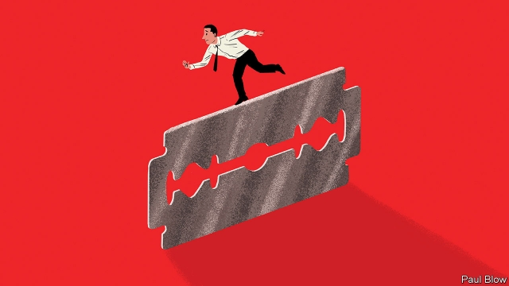

###### Bartleby

# Companies can appeal to workers and consumers with liberal messages 

##### Gillette achieved viral fame by taking a stand against “toxic masculinity” in a new advert 

 

> Jan 24th 2019 

 

ARGUING THAT men should refrain from bullying and sexual harassment does not seem terribly controversial. But a new advert from Gillette, a razor firm, recently achieved its 15 minutes of viral fame by taking a stand against “toxic masculinity”. 

Of course, encouraging a few conservative commentators to blow their top was probably part of Gillette’s strategy. Its gamble was that the free publicity from the controversy would more than offset any lost sales to men who wanted a razor rather than a lecture. 

A similar bet worked for Nike last year when it unveiled an ad featuring Colin Kaepernick, a quarterback who lost his job after kneeling during America’s national anthem as a way to protest against police racism. A few conservatives burned their Nike shoes in protest. But the company’s share price quickly rebounded and Nike’s sales rose as millennials showed they were more than happy to buy footwear that attracted the opprobrium of President Donald Trump. 

Nike’s customers may be more accustomed to politically tinged marketing than those of Gillette. The sneaker firm has tried hard to enhance its image after being caught out by criticism of its labour standards at suppliers in Asia in the 1990s and early 2000s. Taken together, the campaigns are part of a phenomenon dubbed “woke capitalism”, in which companies try to associate themselves with liberal social values. It may well be that executives genuinely do agree with such sentiments. But it is also about positioning brands with millennial consumers (those who reached adulthood after 2000) who often have more freewheeling views than their elders. 

“A younger generation of consumers is seeking products that are aligned with their causes,” says Renee Richardson Gosline of the MIT Sloan school of management. Patti Williams of the Wharton School at the University of Pennsylvania agrees that consumers expect brands to share their values, and not only represent the best value and utility. 

By the same token, companies also want to recruit workers from the same generation, which also means appealing to their values. “Young people don’t want to work for a company if it is seen as harmful to the environment or society,” says Jaideep Prabhu of Cambridge University’s Judge Business School. They want to be proud to say where they work. 

Big firms have in the past shown social awareness. In 1969, at a time of high racial tensions, Coca-Cola ran an ad called “Boys on a Bench”, which showed black and white youngsters sitting together, enjoying the fizzy drink. What gave the ad extra bite was that segregation had only just ended in the southern states; previously the kids could not have gathered together. Coke followed this with its famous “I’d Like to Teach the World to Sing” ad portraying multiracial harmony. 

Those adverts were rather more subtle than the modern examples. But firms are once again being pushed into the political forum because America’s “culture wars” cover many issues that affect the workplace. Larry Fink of BlackRock, a giant asset manager, wrote in his latest annual letter to chief executives that “society is increasingly looking to companies, both public and private, to address pressing social and economic issues. These issues range from protecting the environment to retirement to gender and racial inequality.” 

It is also worth remembering that firms have long been part of the political process through carefully co-ordinated, expensive lobbying campaigns. Last year, for example, eight firms including Alphabet (Google’s parent) and Amazon each spent over $10m lobbying America’s Congress, according to Opensecrets.org, a website. If firms can push a conservative, low-tax-and-regulation message, why not a socially progressive one? 

Lower taxes and less red tape usually mean higher profits, of course. Shareholders will need to be convinced that woke capitalism can do the same. Clearly, brands can benefit over time. A survey by Morning Consult of 2,201 consumers found that the proportion who felt the Gillette brand shared their values rose from 42% to 71% after seeing the firm’s ad. And, as Ms Gosline notes, Gillette is facing a lot of low-cost competition. Positioning the brand as “more than just a blade” may be a wise business move, she says. Harry’s, a rival, had already come out with a report on modern masculinity late last year. Selling razors is a cut-throat business. 

-- 

 单词注释:

1.bartleby[]:[网络] 巴特比；巴特白；老板是空气 

2.gillette[]:n. 吉列公司（财富500强公司之一） 

3.viral['vairәl]:a. 病毒的, 病毒引起的 [医] 病毒的 

4.toxic['tɒksik]:a. 有毒的, 中毒的 [医] 中毒的, 毒物的 

5.masculinity[.mæskju'liniti]:n. 男子气, 刚毅, 大丈夫气概 [医] 男子本性, 男性 

6.advert[әd'vә:t]:vi. 提出看法, 引起注意, 留意 n. 广告 

7.Jan[dʒæn]:n. 一月 

8.refrain[ri'frein]:n. 重复的话, 叠句, 副歌 vi. 节制, 避免, 克制 

9.bully['buli]:n. 欺凌弱小者, 土霸 vt. 威胁, 恐吓, 欺负 vi. 欺负 a. 特好的, 第一流的 adv. 十分 

10.harassment['hærәsmәnt]:n. 困扰, 烦扰, 烦恼 [法] 折磨, 骚扰, 侵扰 

11.terribly['terәbli]:adv. 可怕地, 甚为, 非常 

12.commentator['kɔmenteitә]:n. 评论员, 实况广播员, 注释者, 时事评论员 

13.gamble['gæmbl]:n. 赌博, 冒险 v. 赌博, 孤注一掷 

14.publicity[pʌb'lisiti]:n. 名声, 宣传, 公开场合 [经] 宣传, 广告 

15.controversy['kɒntrәvә:si]:n. 论争, 辩论, 论战, 争论 [法] 论战, 争论, 争吵 

16.offset['ɒ:fset]:n. 抵消, 把...并列, 旁系, 支管, 用胶印法印 vt. 弥补, 抵消, 胶印 vi. 装支管 n. 偏移量 [计] 偏移量 

17.Nike['naiki:]:n. 胜利女神, 奈克导弹 

18.unveil[.ʌn'veil]:vt. 揭开, 揭幕, 除去...的面纱 vi. 显露, 除去面纱 

19.colin['kɔlin]:n. 科林（男子名） 

20.quarterback['kwɒ:tәbæk]:n. 四分卫 vi. 担任四分卫 

21.anthem['ænθәm]:n. 圣歌, 赞美诗 

22.racism['reisizm]:n. 种族主义, 种族偏见 [法] 种族主义, 种族歧视, 种族歧视主张 

23.quickly['kwikli]:adv. 很快地 

24.rebound[ri'baund]:vi. 弹回, 返回, 产生事与愿违的结果 vt. 使弹回, 使返回 n. 反弹, 返回, 篮板球, 振作 rebind的过去式和过去分词 

25.millennials[mɪ'leniəl]:adj. 一千年的；一千年至福的 [网络] 千禧世代；千禧之子；千禧一代 

26.footwear['fjtweә(r)]:n. 鞋类, 靴类 

27.opprobrium[ә'prәubriәm]:n. 污名, 耻辱, 咒骂 [法] 轻蔑, 责骂, 不名誉 

28.donald['dɔnәld]:n. 唐纳德（男子名） 

29.trump[trʌmp]:n. 王牌, 法宝, 喇叭 vt. 打出王牌赢, 胜过 vi. 出王牌, 吹喇叭 

30.politically[]:adv. 政治上 

31.tinge[tindʒ]:n. 色调, 色彩, 气味, 气息 vt. 染, 使带气息 

32.marketing['mɑ:kitiŋ]:n. 行销, 买卖 [经] 推销, 在市场买卖, 销售 

33.supplier[sә'plaiә]:n. 供应者, 供给国, 供应商 [化] 承制厂; 供应厂商 

34.dub[dʌb]:vt. 配音, 轻点, 授予称号, 击 n. 一下击鼓声, 笨蛋 

35.capitalism['kæpitәlizәm]:n. 资本主义 [经] 资本主义 

36.genuinely[]:adv. 真诚地；诚实地 

37.sentiment['sentimәnt]:n. 感情, 感伤, 情操, 情绪, 感想, 意见 [医] 情感, 情操 

38.millennial[mi'leniәl]:a. 一千年的, 千福年的 

39.adulthood[ә'dʌlthud]:n. 成年 [医] 成人期 

40.freewheeling['fri:'hwi:liŋ]:n. 惯性滑行 a. 惯性滑行的, 随心所欲的 

41.align[ә'lain]:vi. 排列, 排成一行, 结盟 vt. 使结盟, 使成一行, 校正 

42.renee[]:n. 蕾妮（人名） 

43.richardson['ritʃәdsn]:n. 理查森（姓氏） 

44.mit[mit]:n. 手, 连指手套, 棒球手套, 拳击手套, 马萨诸塞理工学院, 麻省理工学院 vt. 与...握手, 用手铐铐住, 逮捕 [计] 麻省理工学院, 模块化智能终端 

45.sloan[slәun]:n. 斯隆（姓氏）；麻省理工学院斯隆商学院 

46.PATTI[]:帕蒂（人名） 帕蒂（印度城市） 帕蒂(意大利城市) 精密和精确的时间与时间间隔（precision and accurate time and time interval） 

47.williams['wiljәmz]:n. 威廉姆斯（男子名） 

48.wharton['(h)wɔ:tn]:n. 沃顿（姓氏）；沃顿商学院 

49.Pennsylvania[.pensil'veinjә]:n. 宾夕法尼亚 

50.token['tәukәn]:n. 表征, 记号, 代币 a. 象征的, 表意的 [计] 记号 

51.prabhu[]:[网络] 帕布；普拉布；拉胡 

52.Cambridge['keimbridʒ]:n. 剑桥 

53.awareness[ә'weәnis]:n. 意识, 认识 [计] 识别, 议定, 明白 

54.fizzy['fizi]:a. 嘶嘶作响的, 起泡沫的 

55.segregation[.segri'geiʃәn]:n. 隔离, 偏析, 被隔离的部分, 种族隔离 [化] 分离; 分凝; 离析; 偏析; 分聚 

56.portray[pɒ:'trei]:vt. 描绘, 描写, 描绘...的肖像 

57.multiracial[.mʌlti'reiʃәl]:a. 多民族的 

58.subtle['sʌtl]:a. 敏锐的, 精细的, 狡猾的, 稀薄的, 灵巧的, 微妙的 [医] 锐敏的; 精细的 

59.forum['fɒ:rәm]:n. 论坛, 公开讨论的广场, 法庭, 讨论会 [法] 讨论会, 专题讨论, 公共论坛 

60.Larry['læri]:n. 拉里（男子名） 

61.fink[fiŋk]:n. 破坏罢工的人, 告发人, 密告人 [法] 内奸 

62.blackrock[]:n. 黑石集团（美国一家债券基金管理公司） 

63.asset['æset]:n. 资产, 有益的东西 

64.retirement[ri'taiәmәnt]:n. 退休, 隐居, 撤退 [经] 退休, 退股, (固定资产)报废 

65.gender['dʒendә]:n. 性 vt. 产生 

66.inequality[.ini'kwɒliti]:n. 不平等, 不同, 不平坦, 不平均 n. 不平等, 不等式 [计] 不等式 

67.carefully['kєәfuli]:adv. 小心地, 谨慎地 

68.lobby['lɒbi]:n. 大厅, 休息室, 游说议员者 vi. 游说议员, 游说 vt. 游说 

69.amazon['æmәzɒn]:n. 亚马孙河 [医] 无乳腺者 

70.socially['sәuʃәli]:adv. 在社会上, 在社交上, 以社会生活方式 

71.les[lei]:abbr. 发射脱离系统（Launch Escape System） 

72.shareholder['ʃєә.hәuldә]:n. 股东 [法] 股东, 股票持有人 

