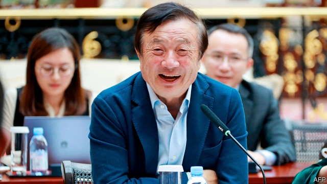

###### Cold-shouldered

# Huawei looks increasingly beleaguered in the West 

##### The Chinese tech giant’s chairman says it may pull out of some countries 

 

> Jan 24th 2019 

 

ON PAPER, AT least, Huawei is having a barnstorming time. The company, which is owned by its employees, makes everything from smartphones to solar panels and telecommunications equipment. It reckons its revenue in 2018 will hit $109bn, up by 21% on the year before and almost three times higher than it was in 2013. It has recently overtaken Apple as the world’s second-biggest seller of smartphones. Engineers at telecoms firms say that its back-end kit, used to run computer and mobile-phone networks, is as good or better than the stuff provided by Ericsson and Nokia, from which it has gobbled market share. A wodge of juicy new business looms, as the telecoms industry plans to roll out speedy fifth-generation (5G) phone networks over the coming years. 

Yet the firm also looks beleaguered, at least in the West, where criticism is growing louder. America is seeking the extradition of Huawei’s chief financial officer, Meng Wanzhou—daughter of its founder, Ren Zhengfei (pictured)—who was arrested in Canada on December 1st. America alleges that she used a Huawei subsidiary to dodge American sanctions on Iran. 

Another of the firm’s executives, Wang Weijing, was arrested on January 11th in Poland, along with a Polish citizen. The authorities accuse both of espionage. Huawei is already frozen out of the 5G market in America and Australia. Allies of America, such as Germany and New Zealand, have begun airing public doubts of their own. The University of Oxford has even said it will stop accepting money from the firm, which funds technological research in universities around the world. 

Western distrust is not yet universal. Huawei recently signed a 5G deal in Portugal with Altice, a Dutch telecoms firm, for example. Several British firms, including Vodafone and O2, are testing its 5G gear. 

America contends that Huawei’s kit exposes countries to Chinese spying or even to cyber-attacks that could bring down phone networks or other bits of important infrastructure. Huawei has repeatedly denied this. It fired Mr Wang after his arrest, and said his actions did not involve the company. It has pointed out that no evidence has ever been found that its products have been subverted. Mr Ren said on January 15th in a rare interview that, despite his prior service in the Chinese army and membership of the Communist Party, he would “definitely” refuse if China’s government demanded data from the firm. 

It is hard to see how any amount of public reassurance can help, since Huawei has got caught up in Western worries about China’s geopolitical clout. Nor are fears about espionage mere paranoia. A Chinese law passed in 2017 could force Mr Ren to comply with a spying request. 

Huawei has options. Its chairman, Liang Hua, said at the World Economic Forum in Switzerland this week that if the chill continues it might shift its geographic focus; previously Huawei had insisted it would fight to keep all important markets. There is still plenty of room for growth in India, where Huawei has already conducted 5G trials, and the rest of Asia, as well as Africa and South America. Its home market is enormous, and is predicted to dominate investment in 5G for the foreseeable future. 

But the biggest risk for Huawei goes beyond individual markets. It is heavily reliant on American and British chip designs, and also on Taiwan’s expertise in advanced chip-making. Some American politicians are pressing for legislation to ban American companies from selling to Huawei if it is found guilty of sanctions-busting, which would be crippling. Technological prowess is no defence against politics. 

-- 

 单词注释:

1.huawei[]: 华为 

2.beleaguer[bi'li:gә]:vt. 围, 围攻 

3.tech[tek]:n. 技术学院或学校 

4.Jan[dʒæn]:n. 一月 

5.barnstorming['bɑrnstɔrmɪŋ]:n. 演说家所做之事 a. 有关演说家的 v. 作巡回演说（barnstorm的现在分词） 

6.smartphones[]: 智能手机（smartphone的复数） 

7.telecommunication['telikәmju:ni'keiʃәn]:n. 电讯, 远距离通讯, 无线电通讯 [计] 远程通信, 电信 

8.reckon['rekәn]:vt. 计算, 总计, 估计, 认为, 猜想 vi. 数, 计算, 估计, 依赖, 料想 

9.telecom['telәkɔm]:telecommunication 电信 

10.kit[kit]:n. 装备, 工具箱, 成套工具 [计] 成套部件; 成套零件 

11.ericsson[]:n. 爱立信公司 

12.nokia[]:n. 诺基亚（财富500强公司之一） 

13.gobble['gɒbl]:n. 火鸡叫声 vt. 狼吞虎咽 vi. 贪食, 咯咯叫 

14.wodge[wɔdʒ]:n. 一大块, 一堆, 一团 

15.loom[lu:m]:n. 织布机, 若隐若现的景象 vi. 朦胧地出现, 隐约可见, 可怕地出现 

16.speedy['spi:di]:a. 快的, 迅速的 [经] 快的, 迅速的 

17.extradition[.ekstrә'diʃәn]:n. 引渡逃犯, 亡命者送还本国 [法] 引渡 

18.meng[]:abbr. 工程硕士（Master of Engineering） 

19.founder['faundә]:n. 创立者, 建立者 vt. 使沉没, 使摔倒, 弄跛, 浸水, 破坏 vi. 沉没, 摔到, 变跛, 倒塌, 失败 

20.REN[]:[计] DOS内部命令:更改文件名 [医] 肾 

21.Zhengfei[]:[网络] 钟晓东 

22.allege[ә'ledʒ]:vt. 宣称, 主张, 提出, 断言 [法] 断言, 指称, 指证 

23.subsidiary[sәb'sidiәri]:n. 子公司, 附件, 辅助者 a. 辅助的, 次要的, 津贴的 

24.dodge[dɒdʒ]:v. 避开, 躲避 n. 诡计, 躲藏 

25.sanction['sæŋkʃәn]:n. 核准, 制裁, 处罚, 约束力 vt. 制定制裁规则, 认可, 核准, 同意 

26.Iran[i'rɑ:n]:n. 伊朗 

27.wang[]:n. 王（姓氏）；王安电脑公司 

28.Poland['pәulәnd]:n. 波兰 

29.espionage[.espiә'nɑ:ʒ]:n. 间谍活动 [法] 间谍活动, 刺探, 间谍 

30.ally['ælai. ә'lai]:n. 同盟者, 同盟国, 助手 vt. 使联盟, 使联合, 使有关系 vi. 结盟 

31.zealand['zi:lәnd]:n. 西兰岛（丹麦最大的岛） 

32.Oxford['ɒksfәd]:n. 牛津, 牛津大学 

33.technological[.teknә'lɒdʒikl]:a. 技术的 [经] 工艺的, 技术的 

34.distrust[dis'trʌst]:n. 不信任 vt. 不信任 

35.Portugal['pɒ:tʃugl]:n. 葡萄牙 

36.altice[]:[网络] 高跷 

37.Dutch[dʌtʃ]:n. 荷兰人, 荷兰语 a. 荷兰的 

38.vodafone[]:n. 沃达丰（英国电信企业） 

39.contend[kәn'tend]:vi. 奋斗, 斗争, 竞争 vt. 为...斗争 

40.infrastructure['infrәstrʌktʃә]:n. 基础结构, 基础设施 [经] 基础设施 

41.subvert[sәb'vә:t]:vt. 推翻, 颠覆, 毁灭 [法] 颠覆, 推翻, 减亡 

42.membership['membәʃip]:n. 会员的资格, 全体会员, 会员数目 [法] 会员资格, 成员资格, 会籍 

43.datum['deitәm]:n. 论据, 材料, 资料, 已知数 [医] 材料, 资料, 论据 

44.reassurance[.ri:ә'ʃurәns]:n. 安心, 放心, 再保证 

45.geopolitical[,dʒi(:)әupә'litikәl]:[计] 地理的 

46.clout[klaut]:n. 敲击, 破布 vt. 打补钉 

47.paranoia[.pærә'nɒiә]:n. 偏执狂, 多疑症 [法] 妄想狂, 偏执狂 

48.comply[kәm'plai]:vi. 顺从, 依从 [法] 遵守, 承诺, 照做 

49.liang[liɑ:ŋ]:n. 两（中国衡量单位） 

50.hua[,eitʃ,ju:'ei]:abbr. 住房与城市事务（Housing and Urban Affairs） 

51.forum['fɒ:rәm]:n. 论坛, 公开讨论的广场, 法庭, 讨论会 [法] 讨论会, 专题讨论, 公共论坛 

52.geographic[,dʒiә'^ræfik]:a. 地理(学)的, 地区(性)的 

53.foreseeable['fɒ:'si:әbl]:a. 可预知的, 能预测的 [法] 可预见的, 可预料的 

54.reliant[ri'laiәnt]:a. 依赖的, 信赖的 

55.chip[tʃip]:n. 屑片, 薄片, 碎片 vt. 削, 切, 削成碎片, 使摔倒, 凿 vi. 削下屑片 [计] 孔屑; 组件; 晶片; 芯片 

56.expertise[.ekspә:'ti:z]:n. 专家意见, 专门技术 [法] 专门知识, 专家意见 

57.technological[.teknә'lɒdʒikl]:a. 技术的 [经] 工艺的, 技术的 

58.prowess['prauis]:n. 英勇, 勇敢, 超凡技术 

59.politic['pɒlitik]:a. 精明的, 明智的, 策略的 

