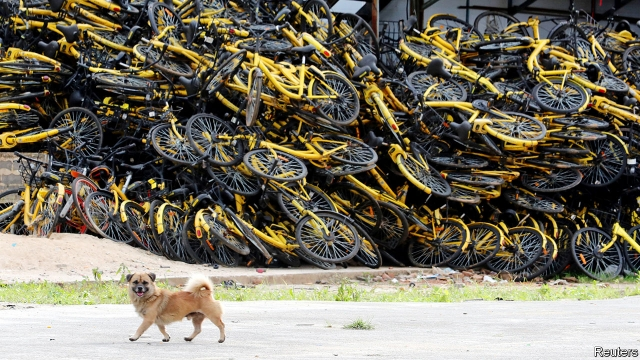
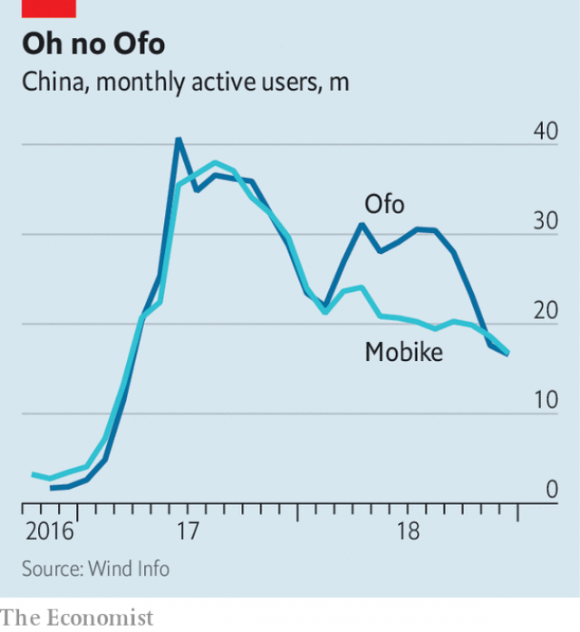

###### Kicking the tyres

# Lessons from the fall of China’s bike-sharing pioneer 

##### Ofo’s young founder is banned from pricey hotels and first-class flying 

 

> Jan 24th 2019 

 

WHEN EVERY colour had been claimed by rival bike-sharing firms, Qicai Bike (or “seven colours”) went for the whole rainbow. Onto these flashy frames it fixed glow-in-the-dark wheels, hoping perhaps for a night-time edge over competitors. Launched in June 2017, Qicai’s dockless bicycles joined those of over 70 other bike-share startups in Chinese cities, unlocked and paid for with a QR code through smartphone apps. 

Yet it seemed clear by then that it was a two-bike race—a configuration typical of China’s feverish entrepreneurial battles. That same summer, Ofo, started by students at the elite Peking University in 2014, wheeled its dockless, buttercup-yellow bikes onto the Tibetan plateau, making Lhasa its 100th city. Its main competitor, Mobike (orange and silver), raised over $600m, the largest single dollop of funding in bike-sharing anywhere, in a round led by Tencent, a social-media giant. Each startup was valued at a fizzy $3bn or so. 

Now Ofo is languishing. Lawsuits over bills it has failed to pay have multiplied, from bike manufacturers, locksmiths and logistics firms. Last month a court placed its 27-year-old founder, Dai Wei, on a credit blacklist, prohibiting him from staying in fancy hotels or flying first-class. He and his firm owe suppliers at least 194m yuan ($28.6m). Recently 12m-odd app users waited for deposit refunds in a virtual queue. In a letter to staff, Mr Dai wrote that he had considered bankruptcy. This month Ofo dissolved its international unit, which had sent fleets into 20 countries, from Mexico to Malaysia. 

What went wrong? To observers of China’s tech-economy contests, the bike-sharing sprint seemed to fit a pattern. Big spending by Ofo and Mobike fuelled a turf war that colonised cities with their bikes, seducing venture-capital firms. A half-hour ride costs just 1 yuan, or 15 cents. The model quickly won users. The business was loss-making, depressed by a subsidy war, but this has been the case for ride-hailing and food-delivery apps, too. 

 

Ofo and Mobike pulled ahead, winning a combined market share of 90%, estimated Counterpoint, a research group. Most tag-alongs folded, in a process reminiscent of the “Thousand Groupon War” waged by Chinese clones of the deal-sharing service, which left just one battle-hardened winner, Meituan. It is now valued at $30bn, doing food delivery, travel booking and much else. Last April it acquired Mobike, relieving the startup of its own financial worries. At the time Mobike was losing close to 16m yuan a day, based on Meituan’s filing documents. On January 23rd Meituan announced it would soon be renamed Meituan Bike, and available within its app only. 

Ofo had the requisite backing of powerful firms too: Xiaomi, a smartphone maker, Didi Chuxing, a rideshare app, and Alibaba, an e-commerce titan. Ofo’s woes, reckons Jeffrey Towson of Peking University, crystallised when Didi invested in its own bike service, and Alibaba backed HelloBike, a small up-and-comer—meaning that for Ofo, “the big dance partners were gone”. Unusually, a merger of giants was resisted. 

Hubris and overreach were evident, especially at Ofo. It raised seven rounds of funding in the space of 18 months, receiving $2.2bn in total. Local media cited insiders who said Ofo had more money than it knew what to do with. It was said to have spent 10m yuan for Lu Han, a Chinese pop star, to promote its bikes. 

One of Ofo’s suppliers, Flying Pigeon, an 80-year-old bike manufacturer in Tianjin, perceived that its big customer was going too fast. Ofo was ordering 600,000 bikes a month. It had asked for 1m, but Flying Pigeon refused, according to a former senior employee. “I thought they were out of their mind,” he says. An Ofo bike rolled off the production line every 15 seconds. 

Theft and vandalism hurt all firms. Another startup, 3Vbike, shut after almost all its 1,000 bikes were stolen. Cities grew tired of pile-ups clogging streets. Twelve barred new bikes, including Beijing, Shanghai and Shenzhen, in August 2017, and began to ban ads on them. Profits from geolocation data remain elusive. 

Against such headwinds it has been a surprise to see a new challenger ascend to third place behind Ofo and Mobike. HelloBike recently raised 4bn yuan, some of it from Alibaba’s Ant Financial, but is showing signs of being more disciplined. In late 2017 it merged with a peer, and claims to have bikes in 300 Chinese cities (it has no plans for overseas expansion). A co-founder, Li Kaizhu, says it was wrong to compare shared-bike services to food-delivery and ride-hailing. The former require far larger sums to be invested to win turf wars, which can lead to oversupply and waste. 

HelloBike’s late entry let it become known in big cities with only about a third as many bikes as Ofo and Mobike deployed at their peak. It claims it will be profitable this year, mostly from 1-yuan rides. Two-fifths of these are in lower-tier cities with little competition, which has allowed it to avoid subsidy wars. But the firm has swagger, suggesting it might still get ahead of itself: “If an acquisition happens,” says Mr Li, “we will be the ones devouring others.” 

-- 

 单词注释:

1.founder['faundә]:n. 创立者, 建立者 vt. 使沉没, 使摔倒, 弄跛, 浸水, 破坏 vi. 沉没, 摔到, 变跛, 倒塌, 失败 

2.pricey['praisi]:a. 昂贵的, 价格高的 

3.Jan[dʒæn]:n. 一月 

4.flashy['flæʃi]:a. 闪光的, 一瞬间的, 浮华的 

5.dockless[]:[网络] 无码 

6.startup[]:[计] 启动 

7.unlock[.ʌn'lɒk]:vt. 开...的锁, 开启, 表露, 放出 vi. 被开启, 揭开, 解放 [计] 解出锁定 

8.QR[]:[计] 商, 二次余数 

9.smartphone[]:n. 智能手机 

10.APP[]:[计] 应用, 应用程序; 相联并行处理器 

11.configuration[kәn.figju'reiʃәn]:n. 结构, 表面配置, 外形, 配置 [计] 配置 

12.feverish['fi:vәriʃ]:a. 发热的, 极度兴奋的, 不安的 

13.entrepreneurial[ˌɒntrəprə'nɜ:rɪəl]:a. 创业的, 具有企业精神的; 企业性质的 

14.Ofo[]:[网络] 奥福美国医学研究卫星(Orbiting Frog Otolith)；欧富；净油系统 

15.elite[ei'li:t]:n. 精华, 精锐, 中坚分子 

16.Peke[pi:k]:n. <口>狮子狗,哈巴狗(原产于中国的一种玩赏狗) 

17.Tibetan[ti'betn]:a. 西藏的 n. 藏语, 西藏人 

18.plateau[plæ'tәu]:n. 高地, 高原, (上升后的)稳定水平 [医] 高原, 平顶, 坪 

19.lhasa['lɑ:sә]:n. 拉萨（中国西藏藏族自治区首府） 

20.mobike['mәjbaik]:n. <口>=motorbicycle 

21.dollop['dɒlәp]:n. 块, 团 

22.Tencent[]:[网络] 腾讯；腾讯公司；腾讯控股 

23.fizzy['fizi]:a. 嘶嘶作响的, 起泡沫的 

24.languish['læŋgwiʃ]:vi. 憔悴, 凋萎, 苦思 

25.lawsuit['lɒ:sju:t]:n. 诉讼 [法] 诉讼, 诉讼案件 

26.locksmith['lɒksmiθ]:n. 锁匠 

27.logistic[lәu'dʒistik]:a. 逻辑的, 后勤学的 

28.dai[dai]:abbr. 直接存取情报（Direct Access Information） 

29.wei[]:n. 魏（姓氏）；魏（朝代）；渭河 

30.blacklist['blæklist]:n. 黑名单 

31.supplier[sә'plaiә]:n. 供应者, 供给国, 供应商 [化] 承制厂; 供应厂商 

32.yuan[ju:'ɑ:n]:n. 元(中国货币单位) [经] 元 

33.refund['ri:fʌnd]:n. 偿还 vt. 付还, 偿还借款 vi. 归还, 偿还 

34.bankruptcy['bæŋkrәptsi]:n. 破产者 [经] 破产, 倒闭 

35.Malaysia[mә'leiziә]:n. 马来西亚 [经] 马来西亚 

36.sprint[sprint]:n. 短距离赛跑 vi. 全速跑, 冲刺 vt. 全速跑过 

37.turf[tә:f]:n. 草皮, 泥炭, 跑马场 vt. 覆草皮于 

38.colonise['kɔlәnaiz]:vi. 开拓殖民地；移民于殖民地 

39.seduce[si'dju:s]:vt. 唆使, 怂恿, 引诱, 诱奸 [法] 勾引, 诱惑, 诱奸 

40.quickly['kwikli]:adv. 很快地 

41.counterpoint['kauntәpɒint]:n. 对位法, 旋律配合, 复调 

42.reminiscent[.remi'nisnt]:a. 回忆的, 怀旧的 n. 往事叙述者, 回忆录作者 

43.Groupon[]:高朋团购 

44.rename[.ri:'neim]:vt. 重新命名, 再命名, 给...改名 [计] 重命名; DOS内部命令:更改文件名 

45.requisite['rekwizit]:n. 必需品, 要素, 必要物品 a. 必要的, 需要的 

46.Xiaomi[]:[网络] 小米手机；路嘉怡；品牌 

47.maker['meikә]:n. 制造者, 上帝 [经] 制造者, 出票人 

48.Didi[]:n. 迪迪（足球运动员名） 

49.rideshare[]:[网络] 分类的找人；搭便车；共乘 

50.alibaba[]:n. 阿里巴巴（公司名） 

51.Titan['taitn]:n. 提坦, 太阳神, 巨人 

52.woe[wәu]:n. 悲哀, 悲痛, 苦痛 

53.reckon['rekәn]:vt. 计算, 总计, 估计, 认为, 猜想 vi. 数, 计算, 估计, 依赖, 料想 

54.jeffrey['dʒefri]:n. 杰弗里（男子名, 等于Geoffrey） 

55.towson['tausən]: [地名] [美国] 陶森 

56.crystallise['kristәlaiz]:vi.vt. (使)结晶, (使)定形, 明朗化, (使)具体化 vt. 给裹上糖屑 

57.merger['mә:dʒә]:n. 合并, 归并 [经] 购并 

58.hubris['hju:bris]:n. 傲慢, 狂妄野心 

59.overreach[.әuvә'ri:tʃ]:vt. 扩展...以上, 过度伸张, 走过头 vi. 伸得过远, 过分, 过火 

60.cite[sait]:vt. 引用, 引证, 表彰 [建] 引证, 指引 

61.insider['in'saidә]:n. 内部的人, 权威人士, 知道内情的人 [经] 熟悉内情者 

62.LU[]:[计] 逻辑单元, 逻辑部件 [医] 镥(71号元素) 

63.han[hæn]:n. 汉朝；汉民族 

64.tianjin['tjɑ:n'dʒin]:n. 天津（中国一城市） 

65.vandalism['vændәlizm]:n. 故意毁坏文物的行为, 破坏他人财产的行为 

66.clog[klɒg]:n. 障碍, 脚坠 v. 障碍, 阻塞 

67.Beijing[beidʒiŋ]:[经] 北京 

68.shenzhen['ʃʌn'dʒʌŋ]:n. 深圳 

69.geolocation[dʒɪɒləʊ'keɪʃn]: 地理定位 

70.datum['deitәm]:n. 论据, 材料, 资料, 已知数 [医] 材料, 资料, 论据 

71.elusive[i'lu:siv]:a. 难懂的, 易忘的, 难以捉摸的 

72.headwind[]:n. 逆风, 顶风 

73.challenger['tʃælindʒә]:n. 挑战者 [经] 申请回避的人 

74.ascend[ә'send]:vi. 上升, 追溯, 登高 vt. 攀登 

75.merge[mә:dʒ]:vt. 使合并, 使消失, 吞没 vi. 合并, 渐渐消失 [计] 合并 

76.peer[piә]:n. 同等的人, 匹敌, 贵族 vi. 凝视, 窥视, 费力地看, 隐现 vt. 与...同等, 封为贵族 

77.oversea['әuvә'si:]:adv. 海外, 向国外, 向海外, 国外 a. 外国的, 在国外的, 在海外的, 舶来的 

78.Li[li:]:[医] 锂(3号元素) 

79.oversupply[.әuvәsә'plai]:vt. 过度供给 n. 过多的供应品 

80.deploy[di'plɒi]:v. 展开, 配置 

81.swagger['swægә]:n. 大摇大摆, 吹牛, 妄自尊大, 威吓 vi. 虚张声势吓人, 大摇大摆, 吹牛 vt. 吓唬, 恫吓 a. 漂亮的, 时髦的 

82.devour[di'vauә]:vt. 吞食, 挥霍, 吞没 

