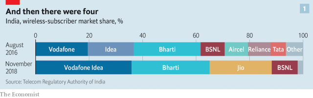
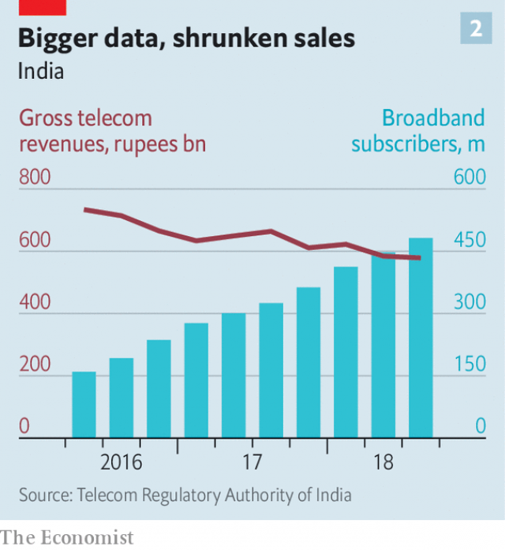

###### India’s new Jiography

# Mukesh Ambani wants to be India’s first internet tycoon 

##### Thanks to his ambitions, Indians are getting online faster than ever 

 

> Jan 24th 2019 

 

FOR A GLIMPSE of how the internet is taking hold in India, catch one of Mumbai’s double-decker buses. Even at rush hour, when people pack so tightly into the ancient vehicles that it is difficult for the conductors to collect fares, and stragglers hang out of the open door, commuters still find space to get out their mobile phones. Dozens of tiny screens glow with WhatsApp messages, news and gossip sites, Bollywood films and Hindi serials. 

Just three years ago there were only about 125m broadband internet connections in India; by last November the number had reached 512m. New connections are growing at a rate of 16m per month, almost all on mobile phones. The average Indian phone user now consumes more mobile data than most Europeans. 

If any one person can take credit for this spectacular growth, it is Mukesh Ambani, India’s richest man. With his service, Jio, a mobile network launched in 2016 offering cheap, high-speed data, he has upended Indian telecoms and changed his country. Much of his fortune comes from a chemicals and refining business inherited from his father; his conglomerate, Reliance Industries Limited (RIL), is one of India’s biggest. Unlike other phone firms, which make their money from call charges, Jio from the start gave phone calls and text messages away freely alongside data. 

Now Mr Ambani seems to want to go further and become an Indian Jeff Bezos or Jack Ma, using Jio as a launch pad—the platform now has a whopping 280m users. One prong of this will be online shopping; on January 18th he announced that Jio would join up with RIL’s retail arm, which has nearly 10,000 outlets across the country, to launch a new e-commerce platform, taking on both Amazon and Flipkart, a local firm last year bought by Walmart for $16bn. More digital services, and content creation, are in the offing. 

Both foreign and local competitors grumble about the circumstances of Jio’s birth. The radio spectrum it uses was initially reserved for data-only services, and bought in a government auction in 2010 by an unknown company called Infotel Broadband Services. Mere hours afterwards, the company was bought by RIL. In 2013 the company won the right to run voice services on its 4G spectrum, using VoIP (Voice over Internet Protocol), after the government ordered the regulator to change its rules. When Jio was launched in 2016 it had had plenty of time to prepare. Rivals complain that they would have paid more attention in 2010 had they known Reliance would back the venture. 

So as not to limit the market to people who can afford smartphones, Jio also launched its own 4G feature-phone, the JioPhone, which it says is “effectively free”. Customers pay only a refundable deposit of 1,500 rupees ($21) for the device, with which they can use WhatsApp, watch YouTube and take pictures. As Mr Ambani said last year, for most users their Jio connection “is not only their pehla [first] phone but also their pehla radio and music player, pehla TV, pehla camera and pehla Internet”. 

Data in India now cost less than in any other country. On average Jio’s users each download 11 gigabytes each month. Finns, the world’s hungriest consumers of cellular data, gobble 14 gigabytes. Jio users watch 17.5 hours of mobile video a month, far more time than they spend watching TV. 

Fast-rising consumption is provoking changes, many for the good. Yogendra Mertiya, who runs a farmers’ collective in rural Rajasthan, says the internet is subtly altering the village he lives in. “Rajasthan is a feudal sort of a state, and on the face of it everything looks like it did ten years ago, but actually there are huge social changes,” he says. Lower-caste men these days can check their horoscopes online, instead of having to visit the local Brahmin astrologer, for example. Women who are scarcely allowed to leave home are able to search for information online. Politicians calling for the prohibition of alcohol have been able to win votes by appealing to female voters through their phones. Enterprising young people can become local celebrities by building what Mr Mertiya calls “a small following” of “perhaps a million subscribers” on YouTube. A Bollywood channel of songs and clips, T-Series, seems set to soon become YouTube’s most-subscribed. 

Not all the effects are positive. Rumours and spam spread through WhatsApp messages have become a public menace, in some cases even inciting lynchings. Another problem, at least in the eyes of the government, is the spread of pornography. In September a court ordered telecoms operators to block 827 porn sites to stop children being exposed. That so many men seem to like watching it in public places may have weighed on the judges’ minds. 

So India is being transformed. But will the bet pay off for RIL and its shareholders? So far RIL has spent a massive $32bn on Jio, with limited return. Mr Ambani’s firm has certainly succeeded in ejecting competitors. Since its entrance, six firms have gone out of business, including the one owned by his brother Anil, RCom. India’s telecoms industry has shrunk to four big companies (see chart 1). Bharti Airtel, previously the market leader, now relies on its enterprise and African businesses to keep it afloat. Vodafone has merged with another firm, Idea, and the new group is selling assets and raising capital to cover its cashflow deficit. 

 

Squeezing out competitors has not yet translated into juicy profits for Jio. Since the middle of 2016 total revenue earned in Indian telecoms has shrunk by 21%, even as connectivity has soared (see chart 2). According to RIL, Jio made a profit of 25bn rupees in the latest quarter. Bernstein, an equity-research firm, has suggested that its treatment of depreciation and amortisation is unusual in the industry and may understate its costs. Jio says its method adheres to Indian accounting standards. 

 

And by some targets it set earlier, Jio seems to be doing less well than it had hoped. In 2017 it said that by 2020 it aimed to capture a 50% revenue share of a market it said would grow by 50%. Today Jio’s share is around 26% of an industry it has made smaller in revenue terms. It has all come at a big cost to RIL and its shareholders. According to Credit Suisse, a bank, by 2018 capital investment in Jio reached about 700bn rupees a year. The conglomerate’s debts have risen to around 3trn rupees, close to its annual revenue of 4.3trn rupees. 

For India’s telecoms industry to be profitable again, prices need to go up by about 50-70%, reckons one analyst. Competitors are holding on, assuming that will happen, and RIL’s share price has risen by 28% in the past 12 months on hopes Jio can cash in later. But it is hard to predict Mr Ambani’s next moves. His ambition to become a tech tycoon goes beyond making money in telecoms. As well as the new e-commerce platform around Jio, RIL separated its fibre-optic cables and towers from Jio last December to create a new firm that is preparing to provide wired broadband to homes. Other digital services would follow, such as web-hosting for firms. RIL has also invested in content creation, and has bought rights to distribute cricket matches and Disney films on its “JioTV” platform. 

All this will bring Mr Ambani into direct competition with big e-commerce firms already investing heavily in India, including Google, Amazon and Flipkart. Their appetite for India’s market has been whetted by Jio’s connectivity explosion, but their executives will be worried that the government may favour Jio, a local champion. On January 18th Mr Ambani argued that the government should prevent data colonisation; Indians’ dFata, he said, must not be controlled by global corporations. 

Foreign e-commerce firms are already banned from holding inventory in India. In December they were also banned from selling products from firms in which they have an equity stake (a common workaround). Incumbent telecoms firms, too, have seen many recent regulatory decisions (such as one on whether rules on predatory pricing apply to Jio) go against them. 

Mr Ambani will need to keep regulators happy if RIL is to earn decent returns on its investment in Jio. Even if he fails in that, he will have helped hundreds of millions of Indians get a first taste of the internet. One recent Indian social-media craze was sharing grainy pictures from the weeklong wedding for Mr Ambani’s daughter in December, where the entertainment featured Beyoncé. A few years ago, Mumbai’s hard-pressed bus commuters would have had no idea of the extravagance in their midst. 

  

-- 

 单词注释:

1.mukesh[]:[网络] 穆克什；穆克希；穆凯什 

2.ambani[]:[网络] 安巴尼；安巴尼家族；阿姆巴尼集团 

3.tycoon[tai'ku:n]:n. 企业界大亨, 将军 [经] 企业界巨头, 企业家 

4.online[]:[计] 联机 

5.Jan[dʒæn]:n. 一月 

6.tightly['taitli]:adv. 紧紧地, 坚固地 

7.straggler['stræglә]:n. 游荡者, 朱经请假擅离船舰的人员, 掉队者 

8.commuter[kә'mju:tә]:n. 乘公共车辆上下班者, 月季票乘客 [经] 非(当地)居民 

9.WhatsApp[]:[网络] 智能手机；联络电话；每月活跃用 

10.gossip['gɒsip]:n. 闲聊, 随笔, 流言, 爱讲闲话的人 vi. 说闲话, 闲聊 

11.bollywood[]:n. 宝莱坞（位于印度孟买的电影制作中心） 

12.Hindi['hindi:]:a. 印地语的, 印度北部的 n. 印地语 

13.serial['siәriәl]:n. 分期连载作品, 连载小说 a. 连续的, 一连串的, 连载的, 分期偿还的 [计] 连续的; 串行的 

14.broadband['brɔ:dbænd]:[计] 宽带 

15.datum['deitәm]:n. 论据, 材料, 资料, 已知数 [医] 材料, 资料, 论据 

16.spectacular[spek'tækjulә]:a. 公开展示的, 惊人的, 壮观的 n. 奇观, 惊人之举, 展览物 

17.JIO[]:Joint Information Officer 联合信息官 

18.upend[ʌp'end]:v. 颠倒, 倒放 

19.telecom['telәkɔm]:telecommunication 电信 

20.conglomerate[kәn'glɒmәrit]:a. 聚成球形的, 砾岩性的 n. 集成物, 混合体, 砾岩 v. (使)凝聚成团 

21.RIL[]:abbr. 重组自交系（Recombinant Inbred lines） 

22.jeff[dʒef]:n. 杰夫（男子名, 等于Jeffrey） 

23.bezos[]:贝索斯（人名） 

24.jack[dʒæk]:n. 插座, 千斤顶, 男人 vt. 抬起, 提醒, 扛举, 增加, 提高, 放弃 a. 雄的 [计] 插座 

25.MA[mɑ:]:n. 妈 [计] 存储器地址, 多路存取 

26.whop[hwɒp]:v. 打, 抽出, 打败, 征服 n. 重击, 打击声 

27.prong[prɒŋ]:n. 叉状物, 耙子 vt. 刺, 贯穿, 翻掘 

28.amazon['æmәzɒn]:n. 亚马孙河 [医] 无乳腺者 

29.Flipkart[]:[网络] 印度 

30.walmart['wɔlma:t]: 沃尔玛（世界连锁零售企业） 

31.creation[kri:'eiʃәn]:n. 创造, 创作物, 发明 [化] 产生 

32.offing['ɒ:fiŋ]:n. 海面, 离岸距离 

33.grumble['grʌmbl]:n. 怨言, 满腹牢骚 vi. 抱怨, 发牢骚, 发隆隆声 vt. 抱怨 

34.spectrum['spektrәm]:n. 光谱, 范围, 系列 [化] 光谱 

35.initially[i'niʃәli]:adv. 最初, 开头 

36.auction['ɒ:kʃәn]:n. 拍卖 vt. 拍卖 

37.infotel[]:[网络] 英飞拓；信实工业 

38.broadband['brɔ:dbænd]:[计] 宽带 

39.afterwards['ɑ:ftәwәdz]:adv. 然后, 后来 

40.voip[]:abbr. 网络语音电话业务（Voice over Internet Phone）；互联网协议电话（Voice over Internet Portocol） 

41.protocol['prәutәkɒl]:n. 草案, 礼仪, 协议 v. 拟定 [计] 协议, 协议列表实用程序 

42.regulator['regjuleitә]:n. 调整者, 校准者, 校准器, 调整器, 标准钟 [化] 调节剂; 调节器 

43.smartphones[]: 智能手机（smartphone的复数） 

44.effectively[i'fektivli]:adv. 有效地, 有力地, 实际上 

45.refundable[ri'fʌndәbl]:a. 可偿还的, 可归还的 

46.rupee[ru:'pi:]:n. 卢比(印、巴等国货币单位) 

47.youtube[]:n. 视频网站（可以让用户免费上传、观赏、分享视频短片的热门视频共享网站） 

48.les[lei]:abbr. 发射脱离系统（Launch Escape System） 

49.gigabyte[]:n. 吉字节 [计] 千兆字节 

50.Finn[fin]:n. 芬兰人 

51.cellular['seljulә]:a. 细胞的 [医] 细胞的 

52.gobble['gɒbl]:n. 火鸡叫声 vt. 狼吞虎咽 vi. 贪食, 咯咯叫 

53.provoke[prә'vәuk]:vt. 激怒, 惹起, 诱导 [法] 刺激, 煽动, 激怒 

54.yogendra[]:n. (Yogendra)人名；(印、尼、斯里)约根德拉 

55.Rajasthan[,rɑ:dʒә'stɑ:n]:拉贾斯坦邦[印度邦名] 

56.subtly['sʌtli]:adv. 敏锐地, 巧妙地, 精细地 

57.feudal['fju:dәl]:a. 封建制度的, 封地的, 领地的 

58.horoscope['hɔrәskәup]:n. 星占, 算命天宫图 

59.Brahmin['brɑ:min]:n. 婆罗门, 僧侣 

60.astrologer[ә'strɒlәdʒә]:n. 占星家 

61.prohibition[.prәuhi'biʃәn]:n. 禁令, 禁止 

62.voter['vәutә]:n. 选民, 投票人 [法] 选民, 选举人, 投票人 

63.enterprising['entәpraiziŋ]:a. 有魄力的, 有进取心的, 有事业心的 

64.celebrity[si'lebrti]:n. 名声, 名人 

65.subscriber[sʌbs'kraibә]:n. 签署者, 捐献者, 订户 [经] 定户 

66.clip[klip]:n. 修剪, 夹子, 回形针, 剪下来的东西 vt. 修剪, 痛打, 夹牢, 剪报 vi. 剪报 

67.spam[]:n. 罐头猪肉, 垃圾邮件 v. 发送垃圾邮件 

68.menace['menis]:n. 威胁, 胁迫 v. 威吓, 胁迫 

69.incite[in'sait]:vt. 刺激, 激励, 引诱 [法] 鼓动, 煽动 

70.lynching['lintʃiŋ]:n. 处私刑杀害 [法] 私刑, 私刑处死 

71.pornography[pɔ:'nɔ^rәfi]:n. 色情描写, 黄色书刊, 色情画, 色情照片, 色情文学 [法] 色情画, 色情文学, 黄色读物 

72.porn[pɔ:n]:n. 色情描写, 黄色书刊, 色情画, 色情照片, 色情文学 

73.eject[i'dʒekt]:vt. 逐放, 放逐, 喷射 [化] 排出 

74.anil['ænil]:n. 假蓝靛, 靛蓝 [化] (醛或酮)缩苯胺; 苯胺衍生物(PhN=型化合物) 

75.bharti[]:[网络] 巴提；巴帝；印度巴帝集团 

76.airtel['eәtel]:n. 机场内(或附近)的旅馆 

77.afloat[ә'flәut]:a. 飘浮着的, 在海上的, 浸满水的, 在进行中的 adv. 飘浮着, 在海上, 浸满水, 在进行中 

78.vodafone[]:n. 沃达丰（英国电信企业） 

79.merge[mә:dʒ]:vt. 使合并, 使消失, 吞没 vi. 合并, 渐渐消失 [计] 合并 

80.asset['æset]:n. 资产, 有益的东西 

81.cashflow['kæʃfləʊ]:vi. 现金流转 

82.deficit['defisit]:n. 赤字, 不足额 [医] 短缺 

83.connectivity[kәnek'tiviti]:[计] 连通性, 连通度 

84.soar[sɒ:]:n. 高扬, 翱翔 vi. 往上飞舞, 高耸, 翱翔 

85.Bernstein[bә:n'stein]:[德]琥珀, 伯恩斯坦(姓氏) 

86.depreciation[di.pri:ʃi'eiʃәn]:n. 价值减低, 减价, 跌落, 贬低, 折旧 [化] 折旧; 减值 

87.amortisation[ә,mɔ:tai'zeiʃən;-ti'z-]:n. 分期偿还, 摊还 

88.understate[.ʌndә'steit]:v. 不完全地陈述, 保守地说, 有意轻描淡写 

89.shareholder['ʃєә.hәuldә]:n. 股东 [法] 股东, 股票持有人 

90.Suisse[swi:s]:<法> = Switzerland 

91.reckon['rekәn]:vt. 计算, 总计, 估计, 认为, 猜想 vi. 数, 计算, 估计, 依赖, 料想 

92.analyst['ænәlist]:n. 分析者, 精神分析学家 [化] 分析员; 化验员 

93.tech[tek]:n. 技术学院或学校 

94.Disney['dizni]:n. 迪斯尼 

95.google[]:谷歌；搜索引擎技术；谷歌公司 

96.whet[hwet]:n. 磨, 开胃小吃 vt. 磨, 磨快, 刺激, 促进 

97.colonisation[,kɔlənai'zeiʃən]:n. 定殖；殖民地化；集群现象 

98.inventory['invәntәri]:n. 详细目录, 存货清单 vt. 列入详细目录, 清点存货 [计] 存货清单 

99.equity['ekwiti]:n. 公平, 公正 [经] 权益, 产权 

100.workaround['wә:kә.raund]:n. 工作区；变通方案；权变措施 

101.incumbent[in'kʌmbәnt]:a. 现任的, 依靠的, 负有义务的 n. 领圣俸者, 在职者 

102.regulatory['regjulәtәri]:a. 受控制的, 统制的, 调整的 [经] 规则的 

103.predatory['predәtәri]:a. 掠夺成性的, 捕食生物的, 掠夺的 [医] 捕食的 

104.craze[kreiz]:n. 狂热, 大流行 v. (使)发狂, (使)开裂 

105.grainy['greini]:a. 有纹理的, 粒状的, 多粒的, 木纹状的 

106.weeklong['wi:klɔŋ;-lɔ:ŋ]:a. 为时一周的,持续一星期的 

107.extravagance[ik'strævәgәns]:n. 奢侈, 浪费, 放肆的言行 

