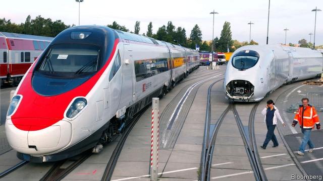

###### The big merger that couldn’t

# The creation of a European rail champion is headed for the buffers 

##### The Siemens-Alstom deal will probably get kiboshed on competition grounds 

 

> Jan 24th 2019 

 

IT TAKES ONLY a minute or so for a conductor to couple two trains headed in the same direction. Merging their manufacturers is a trickier process. Siemens and Alstom, big, old engineering firms from Germany and France respectively, have been trying to gain regulatory approval to join their railway operations since September 2017. Seemingly to no avail: European competition authorities are poised to block the deal next month. 

The prospect of creating a European rail giant has pitted politicians against trustbusters. Competition authorities fret the combined group would dominate some bits of the rail business, such as making train carriages or track signals. The competition bods at the European Commission, in charge of clearing big mergers, have been sending ever-clearer signals that they will give a red light to Siemens-Alstom on February 18th, when the decision is due. 

Yet politicians continue to be enthusiastic proponents of the deal—and are making their views known. Peter Altmaier, the German economy minister, argues that such mega-mergers are necessary for European groups to compete globally. France’s finance minister, Bruno Le Maire, tried to sway the European competition commissioner, Margrethe Vestager, this week. 

The elephant in the carriage is the transformation of China from a large-scale buyer of such industrial kit to a potent exporter. The Alstom-Siemens merger was designed in large part to take on CRRC of China, a giant state-backed rail group with global ambitions. Advocates of the merger say the mere existence of CRRC is a reason to think Siemens-Alstom will face hefty competition. The trustbusters note that the Chinese firm has made few inroads into Europe, at least for now. 

More broadly, the politicians think the technocrats are forcing European firms to stick to rules no one else is adhering to. In the age of increasing protectionism, they accuse Europe of being naive in its dealings with America or China, which don’t hesitate to gorge their own firms with soft loans or otherwise make life hard for foreign competitors. This echoes the firms’ thinking: Joe Kaeser, the boss of Siemens, argued this week that competition authorities needed to look into “global social economic factors” to make a decision. 

Analysts at Citi, an investment bank, say the market is pricing in a less than 10% chance Siemens-Alstom will come into being. The putative merger partners could yet make the deal more palatable to Ms Vestager by promising more concessions, for example the divestment of assets or licensing their technologies to rivals, though time is running out. For its part, Siemens says it has made as many concessions as it can stomach. If the deal falls through, it may spin off its rail operations into a stand-alone business, perhaps giving it a separate stockmarket listing. 

There is a slim chance politicians will manage to derail the technocratic process. No explicit threats or promises have been made yet, but Ms Vestager is sometimes touted as a new head of the European Commission later this year, a position for which German and French support would come in handy. More immediately, she will need her 27 fellow European commissioners to approve whatever decision her staff arrives at. This is usually a formality, but lobbying for the deal—and against Ms Vestager’s dogged adherence to the rules-based system—will go on until the last minute. 

-- 

 单词注释:

1.merger['mә:dʒә]:n. 合并, 归并 [经] 购并 

2.creation[kri:'eiʃәn]:n. 创造, 创作物, 发明 [化] 产生 

3.buffer['bʌfә]:n. 缓冲器, 缓冲区 vt. 缓冲 [计] 缓冲区, 缓冲器 

4.kibosh['kaibɒʃ]:n. 胡说 

5.Jan[dʒæn]:n. 一月 

6.merge[mә:dʒ]:vt. 使合并, 使消失, 吞没 vi. 合并, 渐渐消失 [计] 合并 

7.tricky['triki]:a. 狡猾的, 机敏的 

8.siemen[]:[网络] 西门子贝得 

9.alstom[]:n. 阿尔斯通（法国公司） 

10.regulatory['regjulәtәri]:a. 受控制的, 统制的, 调整的 [经] 规则的 

11.seemingly['si:miŋli]:adv. 看来似乎, 表面上看来 

12.poise[pɒiz]:n. 平衡, 均衡, 姿势, 镇静, 安静, 砝码 vt. 使平衡, 使悬着, 保持...姿势 vi. 平衡, 悬着, 准备好 

13.trustbuster['trʌstbʌstә]:n. 要求解散托拉斯的人 

14.fret[fret]:n. 烦躁, 磨损, 焦急, 网状饰物 vi. 烦恼, 不满, 磨损 vt. 使烦恼, 腐蚀, 使磨损, 使起波纹 

15.BOD[bɔd]:[化] 生化需氧量 

16.proponent[prә'pәunәnt]:n. 建议者, 支持者 [法] 提议者, 辩护者, 支持者 

17.peter['pi:tә]:vi. 逐渐消失, 逐渐减少 

18.altmaier[]:[网络] 环境部长奥特梅尔 

19.globally[]:[计] 全局地 

20.bruno['bru:nәu]:n. 布鲁诺（男子名） 

21.LE[]:[计] 小于或等于 

22.Maire[]:n. 莫雅（女子名） 

23.commissioner[kә'miʃәnә]:n. 委员, 理事, 行政长官 [法] 委员, 政府的特派员, 地方地官 

24.margrethe[]:[网络] 丹麦女王玛格丽特；丹麦玛格丽特；丹麦女王玛格丽特二世 

25.buyer['baiә]:n. 买主, 买方 [经] 买主, 买方, 买手 

26.kit[kit]:n. 装备, 工具箱, 成套工具 [计] 成套部件; 成套零件 

27.potent['pәutnt]:a. 有力的, 有说服力的, 有效的 [医] 有力的, 有性交能力的 

28.exporter[ik'spɒ:tә]:n. 出口商, 输出者, 出口公司 [经] 出口商, 输出者 

29.CRRC[]:中国中车（公司名） 中国不动产研究中心（China Realty Research Center） 全国公路摩托车锦标赛（China Road Racing Championship） 

30.hefty['hefti]:a. 重的, 肌肉发达的 

31.inroad['inrәud]:n. 侵入, 得手, 侵害 [法] 袭击, 侵犯, 损害 

32.broadly['brɒ:dli]:adv. 宽广地, 明白地, 无礼貌地 

33.technocrat['teknәukræt]:n. 技术专家治国论者, 技术专家统治论者 

34.protectionism[prә'tekʃәnizm]:n. 贸易保护主义, 贸易保护制 [经] 保护(贸易)主义, 保护(贸易)制 

35.naive[nɑ:'i:v]:a. 天真的, 纯真的, 幼稚的 

36.dealing['di:liŋ]:n. 经营行为, 行为, 交易 [法] 待遇, 处置, 行为 

37.gorge[gɒ:dʒ]:n. 峡谷, 凹槽, 塞饱, 咽喉 vi. 狼吞虎咽 vt. 塞饱, 狼吞虎咽地吃 

38.joe[dʒәu]:n. 乔（男子名） 

39.kaeser[]:[网络] 德国凯撒；德国凯撒公司；凯撒空压机 

40.analyst['ænәlist]:n. 分析者, 精神分析学家 [化] 分析员; 化验员 

41.citi[]:n. 花旗集团 

42.les[lei]:abbr. 发射脱离系统（Launch Escape System） 

43.putative['pju:tәtiv]:a. 推定的, 被公认的 [法] 被公认的, 推定的, 假定的 

44.palatable['pælәtәbl]:a. 美味的, 好吃的, 可口的 [医] 适口的, 味美的 

45.concession[kәn'seʃәn]:n. 特许, 让步, 认可 [经] 核准, 许可, 特殊(权) 

46.divestment[dai'vestmәnt,di-]:n. (=divesfiture) 剥夺, 夺取 

47.asset['æset]:n. 资产, 有益的东西 

48.stockmarket[s'tɒkmɑ:kɪt]: 证券市场; 证券交易所; 证券行情 

49.derail[di'reil]:vt. 使出轨 n. 脱轨器 [计] 转移指令 

50.technocratic[ˌteknə'krætɪk]:a. 由技术专家官员组成的；受技术官僚影响的 

51.tout[taut]:vi. 招徕顾客, 兜售物品 vt. 招徕, 刺探...情报 n. 兜售者, 侦查者 

52.formality[fɒ:'mæliti]:n. 礼节, 拘谨, 正式手续 [化] 克式浓度 

53.lobby['lɒbi]:n. 大厅, 休息室, 游说议员者 vi. 游说议员, 游说 vt. 游说 

54.adherence[әd'hiәrәns]:n. 依附, 固执, 坚持 [化] 粘合 

