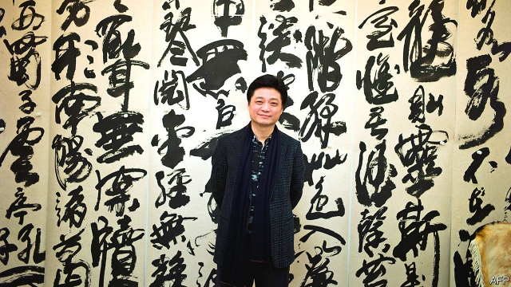

###### Politics v the law

# A celebrity blogger in China shines a light on political intrigue 

##### Suspicions surround a former provincial chief 

 

> Jan 24th 2019 

 

IT SEEMS LIKE a story straight out of a legal thriller: powerful figures conniving in the shadows at the highest level of the legal system to tip the scales of justice in a dispute over billions of dollars’ worth of mining riches. Also featured are sabotaged security cameras, missing court documents, the apparent disappearance of a supreme-court judge and the downfall of a provincial Communist Party boss. Twists in the plot are being recorded by China’s state-owned media. But it is a celebrity television-host and blogger, Cui Yongyuan (pictured), whose tweets have been keeping the story moving. 

It involves a legal battle waged by a private firm against a state-owned one over rights to a coal mine in the northern province of Shaanxi. The dispute involves a deal worth 100bn yuan ($15bn). In 2017 the Supreme People’s Court ruled in favour of the private company. But in December, in a series of posts on Weibo, a Twitter-like platform, Mr Cui alleged that senior judicial and provincial officials had earlier pressed the court to rule the other way. He said that security cameras had gone suspiciously dead as documents related to the case vanished from the office of Wang Linqing, a supreme-court judge, before he issued the verdict. How, Mr Cui wondered in one of his tweets, could anyone enter the court “when even a mouse could not”? 

Initially the supreme court dismissed Mr Cui’s reports as “rumour”. A few days later it admitted the loss and launched an investigation. State media began to pick up the story. Without those documents, they reported, the court’s ruling could not be enforced. Earlier this month, Mr Cui posted a video in which Mr Wang confirmed the story about the documents. Days later, however, Mr Cui tweeted that Mr Wang himself had gone missing—into some form of custody, Mr Cui presumed. The blogger said he was in contact with the judge and was worried about his fate. 

Mr Cui is a rare thing in China: a prominent social campaigner who gets away with it. Last year his revelations about tax evasion in the film industry led to Fan Bingbing, a famous actress, having to pay about 880m yuan in fines and back taxes. Mr Cui has also railed against the government’s plans for genetically modified crops; his views, which defy the scientific consensus, have had an outsized influence on national debate over the issue. 

Unlike previous scandals in which Mr Cui has taken an interest, the supreme-court case has political ramifications. On January 15th it was announced that Zhao Zhengyong, the former party chief of Shaanxi, was being investigated for unspecified “serious violations of law and discipline”. Caixin, a respected magazine, said Mr Zhao was implicated in the coal-mine case. State media have also linked him with a scandal involving a string of luxury villa compounds in Shaanxi. The central government ruled that the villas were built illegally. In 2014 Mr Xi himself ordered that they be torn down, to no avail. Earlier this month state television showed that demolition was at last under way. 

Political interference in the judiciary would be no surprise to the public. At a conference this month on “legal-political” work, Mr Xi said judges should “perform their duties independently and fairly”. But he also stressed the “absolute leadership of the party” over courts. As a Chinese legal scholar puts it: “The power the party has to intervene in political cases is exactly the same power officials abuse to serve their own commercial or private interests.” 

-- 

 单词注释:

1.politic['pɒlitik]:a. 精明的, 明智的, 策略的 

2.V[vi:]:[计] 溢出, 变量, 向量, 检验, 虚拟, 垂直 [医] 钒(23号元素) 

3.celebrity[si'lebrti]:n. 名声, 名人 

4.blogger[]:n. 写博客的人；博客使用者 

5.intrigue[in'tri:g]:n. 阴谋, 复杂的事 vi. 密谋, 私通 vt. 激起...的兴趣, 用诡计取得 

6.provincial[prә'vinʃәl]:n. 外地人, 粗野的人 a. 省的, 外地的, 偏狭的 

7.Jan[dʒæn]:n. 一月 

8.connive[kә'naiv]:vi. 默许, 共谋, 纵容 [法] 默许, 纵容, 共谋 

9.riche[]:n. 暴发户 

10.sabotage['sæbәtɑ:ʒ]:n. 怠工, 破坏活动, 破坏 vi. 从事破坏活动 vt. 妨害, 破坏 

11.disappearance[.disә'piәrәns]:n. 看不见, 失踪, 消失 

12.downfall['daunfɒ:l]:n. 衰败, 大雨 

13.cui[]:abbr. 字符用户界面（Character User Interface）；命令用户界面（ 	Command User Interface）；沪铜指数 

14.tweet[twi:t]:vi. 啁啾 n. 小鸟叫声 

15.Shaanxi['ʃæn'ʃi:]:陕西(省)(旧译Shensi) 

16.yuan[ju:'ɑ:n]:n. 元(中国货币单位) [经] 元 

17.sery[]:n. (Sery)人名；(俄)谢雷；(科特)塞里 

18.Weibo[]:[网络] 新浪微博；我的微博；个人微博 

19.allege[ә'ledʒ]:vt. 宣称, 主张, 提出, 断言 [法] 断言, 指称, 指证 

20.judicial[dʒu:'diʃәl]:a. 法庭的, 公正的, 审判上的, 司法的 [法] 司法的, 审判上的, 法官的 

21.suspiciously[]:adv. 猜疑地；怀疑地 

22.wang[]:n. 王（姓氏）；王安电脑公司 

23.verdict['vә:dikt]:n. 裁决, 判决, 判断性意见, 定论, 结论 [法] 定论, 判断, 意见 

24.initially[i'niʃәli]:adv. 最初, 开头 

25.custody['kʌstәdi]:n. 监护, 拘留, 监禁 [经] 保管, 照顾, 保护 

26.presume[pri'zu:m]:vt. 假定, 推测, 擅自, 意味着 vi. 擅自行动, 相信 

27.campaigner[kæm'peinә]:n. 从军者, 老兵, 竞选者 

28.revelation[.revi'leiʃәn]:n. 揭露, 泄露, 发觉, 默示, 启示 

29.evasion[i'veiʒәn]:n. 逃避, 藉口 [法] 回避, 规避, 逃避 

30.genetically[]:adv. 创始, 遗传学, 生殖, 基因, 遗传, 发生 

31.defy[di'fai]:vt. 藐视, 挑衅, 使落空 n. 挑战 

32.outsize['autsaiz]:a. 特大的 n. 特大号 

33.ramification[.ræmifi'keiʃәn]:n. 分枝, 分叉, 枝状物, 支脉, 支流, 衍生物 [医] 分支, 支状分布 

34.zhao[]:n. 赵（姓氏） 

35.unspecified['ʌn'spesifaid]:a. 未特别指出的, 未特别提到的 

36.violation[.vaiә'leiʃәn]:n. 违反, 违背, 妨碍 [法] 违犯, 违背, 违反 

37.caixin[]:[网络] 财新网；蔡老师 

38.implicate['implikeit]:vt. 涉及, 含意, 暗示, 牵连 n. 包含的东西 

39.villa['vilә]:n. 别墅 

40.illegally[]:[法] 非法地, 不合法地, 违法地 

41.xi[sai. zai. ksai. ksi:]:n. 希腊字母的第14个字母；粒子（等于xi particle） 

42.avail[ә'veil]:vi. 有用, 有利 vt. 有利于 n. 效用, 利益 

43.demolition[.demә'liʃәn]:n. 破坏, 毁坏, 撤销 [经] 拆毁(除,破坏) 

44.judiciary[dʒu:'diʃiәri]:a. 司法的, 法院的, 法官的 n. 司法部, 司法系统, 法官 

45.independently[.indi'pendәntli]:adv. 独立地, 自立地 

46.intervene[.intә'vi:n]:vi. 插入, 调停, 干涉 [经] 进场干预 

