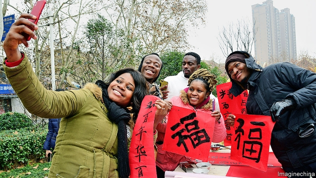

###### Silk Rhodes

# Why China is lavishing money on foreign students 

##### Those from belt-and-road countries are particularly welcome 

 

> Jan 24th 2019 

 

IN A RESTAURANT in the backstreets of Beijing, 12 Pakistanis and Afghans studying at the China University of Communications tell stories of their arrival in China. No one came to pick them up; none of them spoke a word of Chinese. They have plenty of tales of getting lost, disoriented and ripped off by taxi drivers. 

The students, all but two of them ethnic Pushtuns, roar with laughter as they swap yarns and savour the cuisine from Xinjiang, a Chinese region that borders on their home countries and has cultural bonds with them. Any ill feeling about those early days has long since dissipated. They agree that, apart from some taxi drivers, the Chinese are very helpful. Friendly relations between their countries and China mean they are welcomed as brothers. Most important, they are all on full scholarships—free tuition, free accommodation and a stipend of 3,000 yuan ($441) a month, more than three times Pakistan’s GDP per person. Beijing’s many Xinjiang restaurants serving halal food are a big plus. 

There are nearly half a million foreign students in China, about 50% of whom are on degree programmes. South Koreans are the most numerous. They often come to China if they cannot get into good universities at home—unlike Americans, who come out of cultural and political curiosity, and because it looks good on their CVs. But the share of students from the developing world is growing fast, especially from the dozens of countries such as Pakistan and Afghanistan that have signed up to China’s Belt and Road Initiative (BRI), a global infrastructure-building project. Overall numbers of foreign students grew fourfold in 2004-16; student numbers from BRI-related countries expanded eightfold. In 2012, the year before BRI was launched, students from those countries on Chinese government scholarships were less than 53% of the total number of recipients. By 2016 they made up 61%. China says it reserves 10,000 of its scholarships every year for students from BRI countries. Local governments have been piling in with their own “Silk Road scholarship” schemes. 

In countries such as Britain, Australia and America, foreign students are welcomed mostly because universities can make more money out of them than out of locals. In China it is the opposite. Foreign students enjoy big subsidies. Often they are more generously treated than local students. Last year the Ministry of Education budgeted 3.3bn yuan for them, 16% more than in 2017. The rich world is selling education. China is using it to buy influence. 

The cheerful Pushtuns are one manifestation of China’s strategy. Another are the more than 500 Confucius Institutes which the government has set up on campuses around the world. Offering heavily subsidised classes in Mandarin, the institutes have aroused suspicions in the West that China may be using them to exert political influence. Such worries have prompted several universities in Europe and America to close them. There has been far less resistance to China’s stepped-up efforts to bring students to its own territory and, it hopes, to influence them there. 

It is a familiar path among aspiring superpowers. Just as Cecil Rhodes endowed the Rhodes Scholarships a century ago to preach British imperial virtues, America set up the Fulbright programme in 1946 to spread American values and the Soviet Union created Patrice Lumumba University in 1961 to teach socialism to students from third-world countries, so China is using higher education for political ends. One of its aims is to strengthen ties with BRI countries. Global Times, a state tabloid, paraphrased a former Chinese envoy to Iran (a BRI participant) as saying that studying in China would help people to understand China’s political system and avoid “ignorant Western bias” against the country. 

For many of the foreign students, a cheap degree is the main attraction. Several of the Pakistanis tried, but failed, to get European, North American and Australian scholarships; getting a degree at home would be much costlier than the one the Chinese are offering. And the China-Pakistan Economic Corridor, a huge BRI-related project in Pakistan, means that jobs are plentiful there for those with Mandarin. Bilal, one of the Pushtun students, says that when he was returning to China from a visit home, he was offered two jobs while waiting at Karachi airport. 

For many of the students, language is a problem. Some universities have created English-medium courses—Richard Coward of China Admissions, a firm that helps students find university places, knows of 2,000 such programmes—but many students have to use Chinese and few speak it well. That is difficult for teachers. “The government and the universities don’t want the foreigners to fail, but as the number has increased, the quality has fallen,” says Shuiyun Liu of Beijing Normal University. There is some grumbling among young Chinese about the ease with which, in spite of this, foreigners walk into good universities and about the superior facilities they are sometimes offered. 

Foreign students have reservations, too, says Ms Liu, who has researched foreigners’ satisfaction with teaching in China. “The rules are all hidden here,” she says. And the relationship between teacher and pupils is different. “There’s not much critical thinking. Students are not always encouraged to challenge the teachers.” Learning in China can be an endurance test. Lectures commonly go on for three or four hours, with only a ten-minute break. “This morning I fell asleep after three hours,” says one of the Pakistani students. 

That said, students from developing countries tend to be more enthusiastic than students from the West. “The culture is amazing,” says Ugochukwu Izundu, a Nigerian who did a master’s degree in data analysis at Xi’an Jiaotong Liverpool University in the eastern city of Suzhou. “I believe China is a force for good in the world,” says Goodwill Mataranyika, a Zimbabwean at Shijiazhuang Tiedao University in Hebei, a northern province. “The Belt and Road Initiative is an economic corridor for mutual benefit, and China is also investing in Africa for a shared win-win benefit for all nations.” (Nigeria and Zimbabwe are signatories to BRI.) 

For all such talk, personal relations between the foreigners and their Chinese fellow-students often remain distant. The Pakistanis and Afghans speak warmly of the friends they have made from other countries, but they do not have any Chinese ones. “I would try to talk to them,” says Bilal, who did his degree in Chinese. “But when we did group assignments, they would make their own groups, and the foreigners would be left to work together. I don’t know what it is. Maybe they’re shy.” Still, Bilal has no complaints. He has married a Brazilian he met in China and now works in the Pakistani embassy in Beijing. “I got a scholarship, a language, a job and a wife. God smiled on me.” 

  

-- 

 单词注释:

1.rhodes[]:n. 罗兹岛（希腊东南端佐泽卡尼索斯群岛中最大的岛屿）；罗兹市（罗兹岛上的港口城市） 

2.lavish['læviʃ]:a. 大方的, 丰富的, 浪费的 vt. 浪费, 滥用, 慷慨给予 

3.Jan[dʒæn]:n. 一月 

4.backstreet['bækstri:t]:n. （贫穷地区的）后街小巷 a. 偷偷摸摸的；非法的 

5.Beijing[beidʒiŋ]:[经] 北京 

6.Pakistani[.pɑ:ki'stɑ:ni]:a. 巴基斯坦的 n. 巴基斯坦人 

7.Afghan['æfgæn]:a. 阿富汗的, 阿富汗人的 n. 阿富汗人, 阿富汗语, 阿富汗毛毯 

8.disorientate[dis'ɒ:rienteit]:vt. 使失去方向, 使迷惑 

9.rip[rip]:n. 裂痕, 破绽, 拉裂, 浪子, 巨浪 vi. 被拉开, 裂开, 猛冲 vt. 撕, 扯, 劈 

10.ethnic['eθnik]:a. 人种的, 种族的 [医] 人种的 

11.Pushtun[]:[网络] 普什图人；普什图部落 

12.yarn[jɑ:n]:n. 纱, 纱线, 故事 [化] 纱 

13.savour['seivә]:n. 滋味, 气味, 食欲 vi. 有...的滋味 vt. 品味, 加调味品于, 使有风味, 尝到 

14.Xinjiang['ʃin'dʒjɑ:ŋ]:新疆(位于中国西北部) 

15.cultural['kʌltʃәrәl]:a. 文化的, 教养的, 修养的 [医] 培养的 

16.dissipate['disipeit]:vt. 散失, 驱散, 浪费 vi. 消散, 放荡 

17.stipend['staipend]:n. 薪金, 定期生活津贴 [经] 薪水 

18.yuan[ju:'ɑ:n]:n. 元(中国货币单位) [经] 元 

19.GDP[]:[化] 鸟苷二磷酸 

20.halal[hә'lɑ:l]:n. 伊斯兰教律法的合法食物 v. 按伊斯兰教律法屠宰牲畜 

21.Korean[kә'riәn]:n. 朝鲜人, 朝鲜语 a. 朝鲜人的, 朝鲜语的 

22.cannot['kænɒt]:aux. 无法, 不能 

23.cv[]:abbr. 简历（Curriculum Vitae） 

24.Pakistan[.pɑ:ki'stɑ:n]:n. 巴基斯坦 

25.Afghanistan[æf'gænistæn]:n. 阿富汗 

26.BRI[]:[计] 基本速率综合业务数字网 

27.fourfold['fɒ:fәuld]:a. 四重的, 四倍的, 四垒的 adv. 四倍, 四重 

28.eightfold['eitfәuld]:a. 八倍的, 八层的 adv. 八倍地, 八层地 

29.les[lei]:abbr. 发射脱离系统（Launch Escape System） 

30.recipient[ri'sipiәnt]:a. 领受的, 容易接受的, 感受性强的 n. 领受者, 容纳者, 容器 

31.generously[]:adv. 宽大地；慷慨地；丰盛地 

32.manifestation[.mænifes'teiʃәn]:n. 显示, 证明, 示威运动 [医] 表现, 表示 

33.Confucius[kәn'fju:ʃjәs]:n. 孔子 

34.subsidise[]:vt. 给...补助金, 津贴, 资助 

35.mandarin['mændәrin]:n. 中国官话, 国语, 满清官吏, 柑橘 a. (中国式)紧身马褂的 

36.aspire[ә'spaiә]:vi. 渴望, 立志于 

37.superpower[.sju:pә'pauә]:n. 超级强权, 超级大国 [经] 超级大国 

38.cecil['sesl, 'sisl]:n. 塞西尔（男子名） 

39.endow[in'dau]:vt. 捐赠, 捐助, 赋予 [法] 赠送财产给, 分给寡妇一份遗产, 授与 

40.preach[pri:tʃ]:v. 传道, 讲道, 说教, 宣讲, 鼓吹 n. 说教, 布道 

41.imperial[im'piәriәl]:a. 帝王的, 宗主国的, 至尊的, 壮丽的 n. 特等品 

42.Fulbright['fu:lbrait]:n. 富布莱特奖学金 

43.Patrice[pə'tri:s]:n. 帕特里斯（男子名）；特指足球运动员帕特里斯·埃弗拉；特指法国著名导演帕特里斯•夏洛尔 

44.Lumumba[]:n. (Lumumba)人名；(刚(金))卢蒙巴 

45.tabloid['tæblɒid]:n. 小报, 小型画报, 药片, 文摘 a. 轰动性的, 扼要的, 缩略的, 小报式的 

46.paraphrase['pærәfreiz]:n. 释义, 解述, 改写 vt. 改写, 解述 vi. 释义, 意译 

47.envoy['envɒi]:n. 外交使节, 特使 [法] 使者, 代表, 使节 

48.Iran[i'rɑ:n]:n. 伊朗 

49.participant[pɑ:'tisipәnt]:n. 参加者, 参与者 a. 有份的, 参加的, 参与的 

50.bias['baiәs]:n. 偏见, 斜纹 a. 偏斜的 adv. 偏斜 vt. 使有偏见 [计] 偏流; 偏压; 偏磁; 偏离 

51.bilal[]:比拉（人名） 

52.Pushtun[]:[网络] 普什图人；普什图部落 

53.Karachi[kә'rɑ:tʃi]:n. 卡拉奇(巴基斯坦港市) 

54.liu[]:n. 线路接口单元；刘（中国姓氏） 

55.grumble['grʌmbl]:n. 怨言, 满腹牢骚 vi. 抱怨, 发牢骚, 发隆隆声 vt. 抱怨 

56.alway['ɔ:lwei]:adv. 永远；总是（等于always） 

57.endurance[in'djuәrәns]:n. 忍耐, 忍耐力, 耐性 [机] 持九性 

58.Pakistani[.pɑ:ki'stɑ:ni]:a. 巴基斯坦的 n. 巴基斯坦人 

59.Nigerian[nai'dʒiriәn]:n. 尼日利亚人 

60.datum['deitәm]:n. 论据, 材料, 资料, 已知数 [医] 材料, 资料, 论据 

61.Jiaotong[]:[网络] 交通查询；扰动；地图 

62.Liverpool['livәpu:l]:n. 利物浦 

63.suzhou['su:dʒәj]:n. 苏州（位于江苏省） 

64.goodwill[^jd'wil]:n. 友好, 好意, 善意, 亲善, (企业享有的)信誉, 声誉 [经] (企业的)商誉, 信誉 

65.Zimbabwean[zim'bɑ:bwiәn]:n. 津巴布韦人 

66.Shijiazhuang[,ʃi:tʃjɑ:'tʃwæŋ]:石家庄[河北省](旧译 Shihchiachuang或Shihkiachwang) 

67.hebei['hә'bei]:n. 河北（中国省份） 

68.Nigeria[nai'dʒiriә]:n. 尼日利亚 

69.Zimbabwe[zim'bɑ:bwei]:n. 津巴布韦 

70.signatory['si^nәtәri]:n. 协议的签署者, 签约国 a. 签署的, 签约的 

71.warmly['wɒ:mli]:adv. 亲切地, 温暖地, 热心地 

72.Brazilian[brә'ziljәn]:n. 巴西人 a. 巴西的, 巴西人的 

