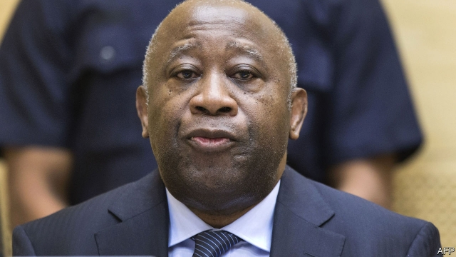

###### Residual injustices

# Are international tribunals running out of steam? 

##### The Dutch plan their own case over the shooting down of Flight MH17 

 

> Jan 26th 2019 

 

MANY VICTIMS of war crimes dream of seeing their oppressors tried by an international court. Seeing them tried twice on the same charges, however, suggests that the court may not be running smoothly. On January 28th in The Hague, hearings will resume in the second trial of Jovica Stanisic and Franko Simatovic, two former officers of the Serbian secret police accused of masterminding ethnic cleansing in Bosnia and Croatia in the 1990s. They were acquitted in 2013. But an appeals court ruled that judges had not properly applied the doctrine of “joint criminal enterprises”, which holds individual conspirators responsible for the crimes committed by their organisations, and ordered them to be tried again. 

The retrial is occurring at a time when international criminal justice has lost some of the momentum it once had. The International Criminal Tribunal for the Former Yugoslavia (ICTY), which heard the case the first time round, was chartered by the United Nations in the 1990s, followed by similar tribunals for the conflicts in Rwanda and Sierra Leone. These courts laid new groundwork for prosecuting crimes against humanity, indicting hundreds of people and convicting more than 100. 

But their mandates had all expired by 2017. To finish off remaining trials such as that of Messrs Stanisic and Simatovic, the UN chartered a follow-up court, the discouragingly named Residual Mechanism for Criminal Tribunals. Its business could drag on well into the next decade. 

Critics charge that other international courts, too, have begun to seem like residual mechanisms. The International Criminal Court (ICC) was established in 2002 as a permanent tribunal that could be granted jurisdiction for conflicts anywhere in the world. Yet it has so far convicted fewer than ten suspects, all of them African. It has had to drop prosecutions of senior leaders in Kenya. On January 15th the court acquitted Laurent Gbagbo, a former president of Ivory Coast, on charges of fomenting violence to steal an election in 2010. It said the prosecution lacked sufficient evidence. 

One theory for the lack of convictions is that the ICC bit off too much, too soon. “Expectations need to be reduced,” says Goran Sluiter, a professor of international criminal law at Amsterdam University. Early in its history, the court issued arrest warrants when it had enough evidence to indict, but not to convict, hoping to gather the rest later. That may have contributed to the acquittals of Mr Gbagbo and of Jean-Pierre Bemba, a Congolese warlord. A problem for such tribunals is the difficulty of proving criminal responsibility for generals and political leaders who gave vague or verbal orders which they now deny. 

The ICC is broadening out beyond Africa, investigating possible crimes against humanity in countries including Afghanistan, Colombia, Georgia, Myanmar (via Bangladesh), Palestine, Ukraine and Venezuela. But America, which is not a party to the court, opposes giving it a role in Afghanistan. Russia will not co-operate with its investigations in Georgia or Ukraine. 

 

Even the Netherlands, proud as it is of hosting the court, has chosen not to use it in the case of Malaysian Airlines flight MH17, the airliner shot down by a Russian missile in 2014 with 193 Dutch citizens on board. The Dutch plan to prosecute any cases against Russians in their own courts, which, unlike the ICC, can try suspects in absentia—an advantage, since Russia is unlikely to allow extradition. Yet it will take years, at best, to collect enough evidence to charge individuals. In the meantime, the Dutch may bring a case against the Russian state for failing to protect civilians, possibly at the European Court of Human Rights. 

Venal governments are bound to reject the authority of international courts. Yet the demand for them has never been stronger, argues Elizabeth Evenson of Human Rights Watch. The ICC’s acquittals show it is not a Western kangaroo court, and it helps set standards for other bodies. Russia vetoed a push in the UN Security Council to give the ICC a role in Syria, but agreed to an international fact-finding mission. A new tribunal on the war in Kosovo in 1998-2000 has been launched in The Hague. In Senegal, a so-called hybrid court with an international mandate convicted Hissène Habré, a Chadian tyrant, in 2016. A similar court may be set up for South Sudan. As Ms Evenson says, “The terrain is rough, but the appetite is growing.” 

-- 

 单词注释:

1.residual['rezidju:l]:a. 残渣的, 剩余的 n. 残渣, 剩余, 余数 

2.injustice[in'dʒʌstis]:n. 不公平, 非正义的行为 [法] 不公正, 不公平, 权利侵害 

3.tribunal[trai'bju:nl]:n. 法庭, 法官席, 裁决 [法] 法庭, 裁判所, 裁判 

4.Dutch[dʌtʃ]:n. 荷兰人, 荷兰语 a. 荷兰的 

5.Jan[dʒæn]:n. 一月 

6.oppressor[ә'presә]:n. 压迫者, 压制者 [法] 压迫者, 压制者, 强迫者 

7.Hague[hei^]:[法] 海牙 

8.jovica[]:n. (Jovica)人名；(塞)约维察 

9.franko[]:n. (Franko)人名；(英、法、俄、塞、捷、乌克)弗兰科 

10.serbian['sә:bjәn]:a. 塞尔维亚人（语）的；塞尔维亚的 

11.mastermind['mɑ:stәmaind]:n. 优秀策划者, 才子 vt. 指导, 主持, 策划 

12.ethnic['eθnik]:a. 人种的, 种族的 [医] 人种的 

13.cleanse[klenz]:vt. 使清洁, 净化, 使纯净 [建] 纯化, 净化, 精炼 

14.bosnia['bɔzniә]:n. 波斯尼亚；波士尼亚 

15.Croatia[krәu'eiʃjә]:n. 克罗地亚 

16.acquit[ә'kwit]:vt. 无罪释放, 表现, 使履行 [法] 开释, 释放, 免 

17.doctrine['dɒktrin]:n. 教条, 学说 [医] 学说 

18.conspirator[kәn'spirәtә]:n. 同谋者, 阴谋者, 反叛者 [法] 共谋者, 阴谋家 

19.organisation[,ɔ: ^әnaizeiʃən; - ni'z-]:n. 组织, 团体, 体制, 编制 

20.retrial[ri:'traiәl]:n. 再审, 复试, 再试验 [法] 再审, 复审 

21.momentum[mәu'mentәm]:n. 动力, 动量 [化] 动量 

22.tribunal[trai'bju:nl]:n. 法庭, 法官席, 裁决 [法] 法庭, 裁判所, 裁判 

23.Yugoslavia['ju:^әu'slɑ:vjә]:n. 南斯拉夫 [经] 南斯拉夫 

24.icty[]:[网络] 前南斯拉夫国际刑事法庭(International Criminal Tribunal for Yugoslavia)；前南斯拉夫国际战犯法庭；前南战犯法庭 

25.charter['tʃɑ:tә]:n. 特许状, 执照, 宪章 vt. 特许, 发给特许执照 

26.rwanda[rj'ændә]:n. 卢旺达（东非国家）；卢旺达语 

27.sierra[si'єәrә]:n. 呈齿状起伏的山脉 

28.Leone[li:'әun]:[经] 里昂 

29.groundwork['graundwә:k]:n. 地基, 基础, 根据 

30.prosecute['prɒsikju:t]:vt. 告发, 起诉, 彻底进行, 执行, 从事 vi. 告发, 起诉, 作检察官 

31.humanity[hju:'mæniti]:n. 人性, 人类, 博爱 

32.indict[in'dait]:vt. 起诉, 控告, 指控 [法] 控告, 揭发, 对...起诉 

33.convict[kәn'vikt]:n. 囚犯, 罪犯 vt. 宣告有罪, 使知罪 

34.mandate['mændeit]:n. 命令, 指令, 要求 vt. 委任统治 

35.expire[ik'spaiә]:vi. 期满, 呼气, 断气 vt. 呼出 

36.Messrs['mesәz]:[法][pl. ](=Messieurs)各位(先生) 

37.UN[ʌn]:pron. 家伙, 东西 [经] 联合国 

38.discouragingly[dɪs'kʌrɪdʒɪŋlɪ]:adv. 使人气馁地, 阻止地 

39.mechanism['mekәnizm]:n. 机械, 机构, 结构, 机理, 技巧 [化] 机理; 历程; 机构 

40.residual['rezidju:l]:a. 残渣的, 剩余的 n. 残渣, 剩余, 余数 

41.mechanism['mekәnizm]:n. 机械, 机构, 结构, 机理, 技巧 [化] 机理; 历程; 机构 

42.icc[]:abbr. 国际商会（International Chamber of Commerce）；国际计算中心（International Computation Centre）；印第安人申诉委员会（Indian Claims Commission）；国际版权公约（International Copyright Convention） 

43.jurisdiction[.dʒuәris'dikʃәn]:n. 司法权, 审判权, 管辖权 [经] 法律管辖权, 审判权 

44.prosecution[.prɒsi'kju:ʃәn]:n. 执行, 经营, 起诉 

45.Kenya['kenjә]:n. 肯尼亚 

46.laurent['lɔrәnt]:n. 劳伦（法国数学家） 

47.gbagbo[]:[网络] 前总统巴博；科特迪瓦总统巴博；科特迪瓦前总统巴博 

48.ivory['aivәri]:n. 象牙, 乳白色 a. 象牙制的, 乳白色的 

49.foment[fәu'ment]:vt. 热敷, 煽动 

50.conviction[kәn'vikʃәn]:n. 定罪, 信服, 坚信 [法] 定罪, 证明有罪, 判罪 

51.Goran[^ә'rɑ:n]:戈伦树 

52.Amsterdam[.æmstә'dæm]:n. 阿姆斯特丹(荷兰首都) 

53.warrant['wɒ:rәnt]:n. 授权, 正当理由, 根据, 证明, 批准, 凭证, 令状, 委任状 vt. 授权给, 保证, 担保, 批准, 使有正当理由 

54.acquittal[ә'kwitәl]:n. 履行, 无罪开释 [经] (债务的)清偿 

55.Bemba['bembә]:本巴人 

56.Congolese[,kɔŋ^ә'li:z]:n. 刚果人, 刚果语 a. 刚果的, 刚果语的, 刚果人的 

57.warlord['wɒ:lɒ:d]:n. 军阀, 军阀式领袖 

58.verbal['vә:bl]:a. 用言辞的, 言语的, 口头的, 逐字的, 动词的 [医] 言语的, 口述的 

59.broaden['brɒ:dn]:vi. 变宽, 扩大 vt. 放宽, 使扩大 

60.Afghanistan[æf'gænistæn]:n. 阿富汗 

61.Colombia[kә'læmbiә]:n. 哥伦比亚 

62.Georgia['dʒɒ:dʒjә]:n. 乔治亚州 

63.Myanmar['mjænmɑ:(r)]:缅甸[东南亚国家](即Burma) 

64.Bangladesh[,bɑ:ŋ^lә'deʃ]:n. 孟加拉国 [经] 孟加拉共和国 

65.Palestine['pælәstain]:n. 巴勒斯坦 

66.ukraine[ju(:)'krein]:n. 乌克兰（原苏联一加盟共和国, 现已独立） 

67.Venezuela[,vene'zweilә]:n. 委内瑞拉 

68.Netherlands['neðәlәndz]:n. 荷兰 

69.Malaysian[mә'leiziәn]:a. 马来西亚的 n. 马来西亚人 

70.airliner['єәlainә]:n. 班机, 大型客机 

71.extradition[.ekstrә'diʃәn]:n. 引渡逃犯, 亡命者送还本国 [法] 引渡 

72.venal['vi:nl]:a. 可收买的, 贪污的, 用金钱买得的 [经] 贪污的 

73.elizabeth[i'lizәbәθ]:n. 伊丽莎白（女子名） 

74.evenson[]: [人名] 埃文森 

75.veto['vi:tәu]:n. 否决权 vt. 否决, 禁止 

76.Syria['siriә]:n. 叙利亚 [经] 叙利亚 

77.Kosovo['kɔ:sәvәj]:科索沃[南斯拉夫自治省名] 

78.Senegal[,seni'^ɔ:l]:n. 塞内加尔 

79.hybrid['haibrid]:n. 混血儿, 杂种, 混合物 a. 混合的, 杂种的, 混合语的 [计] NetWare的主机实用程序, 双重用户建立程序 

80.Chadian['tʃædiәn]:n. 乍得人 a. 乍得的, 乍得人的 

81.tyrant['taiәrәnt]:n. 暴君 [法] 专制君主, 暴君, 压制他人者 

82.Sudan[su:'dæn]:n. 苏丹 [化] 苯偶氮间苯二酚; 苏丹 

83.terrain['terein]:n. 地带, 地区, 地形, 领域, 范围 

