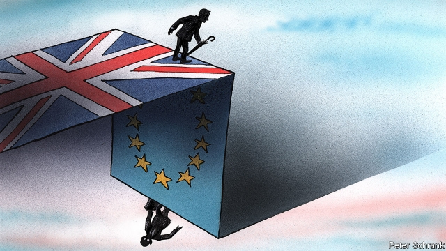

###### Charlemagne

# How Britain and its neighbours misunderstand each other 

##### Both need to learn fast 

 

> Jan 24th 2019 

 

TO VISIT BRITAIN after years of living on the European mainland, as Charlemagne did last weekend, is to glimpse the country through continental eyes. It is an exotically distinct place. Its cities are dominated by two-or-three storey buildings rather than five-or-six storey ones. Houses are more common than blocks of flats. Forms of convenience culture—pre-packed meals, card-tapping electronic payments, technological gizmos—are abundant. Institutions like religion, organised labour and even the state itself take a back seat. Public spaces feel shabby by northern European standards, but people are good-humoured about it. The country is strikingly mixed and multi-ethnic. Most notable is its sheer Victorian-ness: the architecture, the urban planning, the transport networks and even the pub names (Coach and Horses, Prince of Wales) speak of a country forged in the 19th century. 

At its narrowest, the English Channel is 33km (21 miles) wide. Exchange and movement across this gap have shaped countries on both sides for millennia. Yet Britain remains different. To be an island is to be other—at once prone to insularity and to seeing horizons more clearly. To have been a superpower for a time is an experience that takes centuries to process. To have political and legal institutions distinctive from those of one’s neighbours is to find their instincts alien—and to be poorly understood oneself. 

Britain’s otherness was good for Europe, a welcome speck of liberal grit in the unctuous continental oyster. It made Britain and its partners richer and more influential. But an awkward truth persists: the two sides do not understand each other well. It is a reality with which anti-Brexiteers on both Channel coasts must contend. 

Nothing better illustrates it than the Brexit process. In David Cameron’s pre-referendum “renegotiation” of Britain’s EU membership and Theresa May’s Brexit talks, Britain overestimated the political salience of cross-Channel trade to the rest of the EU and wildly underestimated the importance of internal cohesion. Some die-hards still hope that German carmakers will press Angela Merkel into allowing Britain to cherry-pick the benefits of EU membership. They will remain disappointed. 

Britons tend to see the EU only at its extremes, in its most pragmatic and most idealistic forms: half trade accelerator and half highfalutin peace project. The truth dwells in the complicated zone between the two. “European integration is primarily about ensuring collective European survival,” argues Alexander Clarkson of King’s College London. Although few fear a new major European war, the EU’s leaders are driven by the quest to preserve a recognisably European way of life (think modern societies and long holidays) in a multipolar world. It was this argument that Helmut Kohl used to win over sceptical Christian Democrats to the euro. 

Likewise, Westminster parliamentarianism and Britain’s common-law legal system run on common-sense specificity and abstract principle, not the codified layers between the two that define the mainland. Continental systems rely on binding codes. Politicians can collaborate and do deals, but lawyers refer to first-principles legal scriptures. In London, where rules are mutable, officials wait for Mrs Merkel to signal that she does not really mean it when she says Britain cannot pick and choose the benefits of EU membership. Even Europhiles like Tony Blair insist that the EU would change its freedom-of-movement regime to prevent Britain from leaving. They are wrong. The fear of failed rules is more alive on the history-scarred continent than on a pragmatic island that never knew the jackboot. 

Britons, who tend not to speak other languages, understand other Europeans more poorly than the other way around. But even the Anglophone elites of the remaining EU member states struggle to grasp certain things about Britain. It has long been assumed in capitals like Berlin that its vote to leave would somehow be forgotten or fudged: “The political and economic elite in the EU-27 have vastly underestimated the willingness of the UK public and politicians to vote for Brexit in the first place and now opt for a hard Brexit,” observes Nicolai von Ondarza of the German Institute for International and Security Affairs. 

This illustrates two continental blind spots. Seen from afar and combined with stereotypes about British deference and stoicism among Europeans who spend too long watching “Downton Abbey”, Westminster’s wood-panelled frippery looks like a guarantor of establishment views. In fact, Britons are capable of and even prone to rebellion and transformation—from the civil war, to abrupt decolonisation, the Thatcher revolution and punk music. A letter on January 18th from German leaders urging Britons to stay was endearing, but also oddly twee. It gushed about the gentle delights of ale and milky tea while paying little heed to the abrasive, diverse, individualistic character of Britain today. The second misunderstanding is related: continentals have long overlooked the adversarial nature of Britain’s politics and assumed that its leaders can fudge their way to a compromise on Brexit. According to the Financial Times, officials in Brussels were surprised to find that Jeremy Corbyn, the leader of the opposition, did not have Mrs May’s mobile number. 

What to do? Europe’s leaders should realise that the stuffy yet practical country they thought they knew can sometimes be the opposite: anarchically capable of romantic self-destruction. London must realise that the continentals mean what they say about preserving the EU’s coherence and about standing by a member (Ireland) over a third party (Britain) in debates about borders. And those on both sides seeking a second referendum to end Brexit must accept that even a repentant Britain will be a troublesome participant in future moves towards European integration. Brexit is a disaster that should be reversed; yet if it is, that will not settle Britain’s relationship with its continent for one second. 

-- 

 单词注释:

1.Charlemagne['ʃɑ:lә'mein]:查理曼大帝(742-814, 世称 Charles the Great或Charles I, 768-814为法兰克王, 800-814为西罗马帝国皇帝) 

2.Jan[dʒæn]:n. 一月 

3.continental[.kɒnti'nentl]:a. 大陆的, 洲的 n. 欧洲大陆人 

4.exotically[]:外来地 奇异地 异乎寻常地 极不稳定地 

5.technological[.teknә'lɒdʒikl]:a. 技术的 [经] 工艺的, 技术的 

6.strikingly[]:adv. 显著地, 惊人地, 引人注目地 

7.notable['nәutәbl]:n. 著名人士, 值得注意之事物 a. 值得注意的, 显著的 

8.sheer[ʃiә]:a. 绝对的, 全然的, 纯粹的, 透明的, 峻峭的 vi. 偏转, 偏航 vt. 使急转向, 使偏航 adv. 完全, 全然, 峻峭 n. 偏航 

9.wale[weil]:n. 隆起的伤痕, 鞭痕, 凸条纹, 精华, 选择 vt. 在...上留下鞭痕, 织成棱纹, 挑选, 撑住 vi. 挑选 

10.forge[fɒ:dʒ]:n. 熔炉, 铁工厂 vt. 打制, 锻造, 伪造 vi. 锻造, 伪造 

11.millennia[mi'leniә]:一千年, 千年周年纪念日, 千年庆典, 千年期, (喻)太平盛世, 想象中的黄金时代 

12.prone[prәun]:a. 俯伏的, 面向下的, 有...倾向的 [医] 旋前的, 伏的, 俯的 

13.insularity[.insju'læriti]:n. 岛屿生活状况, 孤立, 岛国性质 

14.superpower[.sju:pә'pauә]:n. 超级强权, 超级大国 [经] 超级大国 

15.distinctive[di'stiŋktiv]:a. 有特色的, 出众的 

16.poorly['puәli]:adv. 贫穷地, 不充分地, 贫乏地 a. 身体不舒服的 

17.otherness['ʌðәnis]:n. 相异, 不同, 差异性 

18.speck[spek]:n. 斑点, 有斑点的东西, 污点, 缺点, 微粒, 肥肉 vt. 使有斑点 

19.grit[grit]:n. 砂砾, 粗砂石 vt. 覆以砂砾, 咬牙切齿地说 vi. 摩擦作声 

20.unctuous['ʌŋktjuәs]:a. 油的, 油质的, 油腻的, 虚情假意的 [医] 油滑的, 油样的 

21.oyster['ɒistә]:n. 牡蛎, 蚝, 沉默者 

22.contend[kәn'tend]:vi. 奋斗, 斗争, 竞争 vt. 为...斗争 

23.Brexit[]:[网络] 英国退出欧盟 

24.david['deivid]:n. 大卫；戴维（男子名） 

25.renegotiation[]:[经] 重议价 

26.EU[]:[化] 富集铀; 浓缩铀 [医] 铕(63号元素) 

27.membership['membәʃip]:n. 会员的资格, 全体会员, 会员数目 [法] 会员资格, 成员资格, 会籍 

28.theresa[ti'ri:zә]:n. 特丽萨（女子名） 

29.overestimate[.әuvәr'estimeit]:vt. 评价过高, 过高估价 n. 估计过高, 评价过高 

30.salience['seiliәns]:n. 显著, 卓越, 突出, 突起, 特征 

31.wildly[]:adv. 狂暴地, 激动地, 狂热地, 鲁莽地, 轻率地 

32.underestimate[.ʌndәr'estimeit]:n. 低估 vt. 低估, 看轻 

33.cohesion[kәu'hi:ʒәn]:n. 结合, 黏聚, 内聚 [计] 内聚性 

34.carmaker['kɑ:,meikә(r)]:n. 汽车制造商 

35.angela['ændʒilә]:n. 安吉拉（女子名） 

36.merkel[]: [人名] 默克尔; [地名] [美国] 默克尔 

37.Briton['britәn]:n. 大不列颠人, 英国人 

38.pragmatic[præ^'mætik]:a. 忙碌的, 爱管闲事的, 自负的, 固执己见的, 实际的, 务实的, 国事的, 国务的 [法] 闲断的, 固执己见的, 实用主义的 

39.idealistic[ai'diәlistik]:a. 理想主义的, 唯心论的, 唯心主义的, 唯心主义者的 

40.accelerator[әk'selәreitә]:n. 加速剂, 加速器, 油门 [化] 加速器; 早强剂; 促进剂; 硫化促进剂 

41.highfalutin[haifә'lu:ti:n]:n. 大话, 夸张的言词 

42.dwell[dwel]:vi. 居住, 居住(于), 存在(于) 

43.integration[.inti'greiʃәn]:n. 综合, 与环境协调的行为, 集成 [化] 集成; 整合 

44.alexander[,æli^'zɑ:ndә]:n. 亚历山大（男子名） 

45.Clarkson[]:n. 克拉克森（男子名） 

46.quest[kwest]:n. 探索, 寻求, 调查 v. 寻找, 找, 追寻猎物 

47.recognisably[]:[网络] 可以肯定的 

48.multipolar[.mʌlti'pәulә]:a. 多极的 [医] 多极的 

49.Helmut[]:赫尔穆特 

50.kohl[kәul]:n. 化妆墨, 眼影粉 

51.democrat['demәkræt]:n. 民主人士, 民主主义者, 民主党党员 [经] 民主党 

52.euro['juәrәu]:n. 欧元（欧盟的统一货币单位） 

53.Westminster['westminstә]:n. 威斯敏斯特 

54.parliamentarianism[]:[法] 代议制政体, 议会制政府 

55.specificity[,spesi'fisiti]:n. 特异性, 专一性, 特殊性, 特性, 特征 [化] 专一性 

56.codify['kәudifai]:vt. 编成法典 [法] 使成文法化, 编成法典, 编纂 

57.continental[.kɒnti'nentl]:a. 大陆的, 洲的 n. 欧洲大陆人 

58.scripture['skriptʃә]:n. 圣经, 圣经的一节, 圣经的一句, 铭文 

59.mutable['mju:tәbl]:a. 易变的, 性情不定的 

60.Mr['mistә(r)]:先生 [计] 存储器回收程序, 多重请求 

61.cannot['kænɒt]:aux. 无法, 不能 

62.europhiles[]:[网络] 欧洲支持者；欧盟者 

63.tony['tәuni]:a. 高贵的, 时髦的 

64.blair[bleә(r)]:n. 布莱尔（男子名） 

65.regime[rei'ʒi:m]:n. 政权, 当权期间, 政体, 社会制度, 体制, 情态 [医] 制度, 生活制度 

66.jackboot['dʒækbu:t]:n. 长统靴 

67.anglophone['æŋ^lәufәun]:n. 母语是英语者 

68.elite[ei'li:t]:n. 精华, 精锐, 中坚分子 

69.Berlin[bә:'lin]:n. 柏林, (软质)柏林毛线 

70.vastly['vɑ:stli]:adv. 广大地, 许多, 巨大 

71.UK[ju: 'kei]:n. 联合王国 

72.opt[ɒpt]:vi. 选择 

73.nicolai[]:n. (Nicolai)人名；(德、意、罗)尼古拉；(法)尼科莱 

74.Von[vɔn;fɔn;fәn]:[计] 冯·诺伊曼 

75.afar[ә'fɑ:]:adv. 由远处, 遥远地 

76.stereotype['stiәriәtaip]:n. 铅版, 陈规, 老套 vt. 使用铅版, 把...印制成盲文, 套用老套, 使一成不变 

77.deference['defәrәns]:n. 顺从, 尊重 

78.Stoicism['stәuisizәm]:n. 斯多葛哲学, 禁欲主义, 淡泊 

79.Downton[]:唐顿 

80.abbey['æbi]:n. 大修道院 

81.frippery['fripәri]:n. 便宜而俗艳的服装, 无用的东西 

82.guarantor['gærәntә]:n. 保证人 [经] 保证人, 担保人 

83.decolonisation[]:n. 非殖民地化 

84.thatcher[]:n. 盖屋顶者 

85.punk[pʌnk]:n. 废物, 小阿飞 a. 无用的, 腐朽的 

86.endear[in'diә]:vt. 使受喜爱, 使受钟爱 

87.oddly['ɒdli]:adv. 奇怪地 

88.twee['twi:]:a. 矫饰的, 过分艳丽的 

89.gush[gʌʃ]:n. 涌出, 滔滔不绝地讲话 v. 涌出, 迸出, 滔滔不绝的讲话 

90.ale[eil]:n. 麦芽酒 [医] 麦芽酒 

91.milky['milki]:a. 乳状的, 乳白色的, 柔和的 

92.heed[hi:d]:n. 注意, 留心 v. 注意, 留心 

93.abrasive[ә'breisiv]:n. 研磨料 a. 有研磨作用的 

94.individualistic[,indi,vidjuә'listik]:a. 个人主义的, 独特的 

95.misunderstanding[.misʌndә'stændiŋ]:n. 误会, 误解 [法] 误解, 误会, 不和 

96.adversarial[,ædvә'seәriәl]:a. 敌手的,对手的,对抗(性)的 

97.politic['pɒlitik]:a. 精明的, 明智的, 策略的 

98.fudge[fʌdʒ]:n. 虚构的故事, 谎言, 胡说 interj. 胡说八道 vi. 蒙混, 做傻事 vt. 粗制滥造, 捏造, 逃避职责 

99.Brussel[]:n. 布鲁塞尔（比利时首都） 

100.jeremy['dʒerimi]:n. 杰里米（男子名） 

101.Corbyn[]:科尔宾（人名） 

102.opposition[.ɒpә'ziʃәn]:n. 反对, 敌对, 相反, 在野党 [医] 对生, 对向, 反抗, 反对症 

103.stuffy['stʌfi]:a. 闷热的, 窒息的, 乏味的, 固步自封的, 自以为是的 

104.anarchically[]:adv. anarchic, anarchical的变形 

105.coherence[kәu'hiәrәns]:n. 黏合(性), 连贯性, 一致性 [化] 相干性 

106.referendum[.refә'rendәm]:n. （就重大政治或社会问题进行的）全民公决，全民投票 

107.repentant[ri'pentәnt]:a. 后悔的, 悔改的 

108.participant[pɑ:'tisipәnt]:n. 参加者, 参与者 a. 有份的, 参加的, 参与的 

