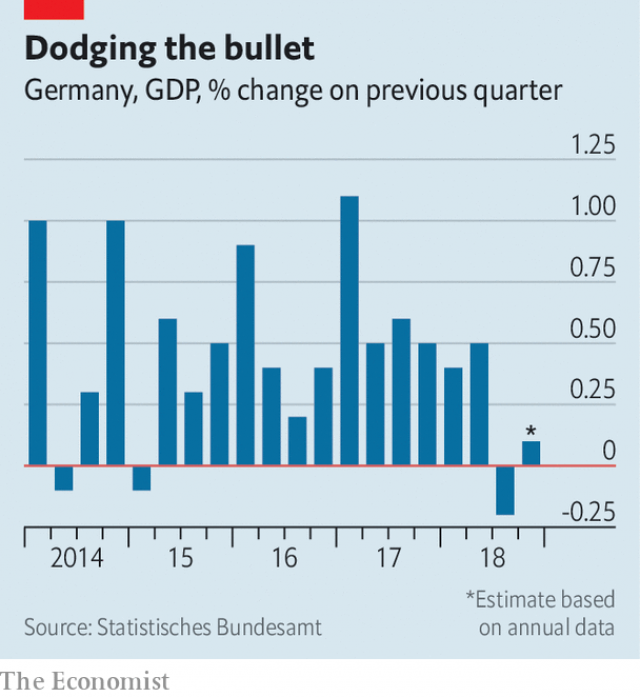

###### An exporter imports trouble

# Is Germany’s golden decade coming to an end? 

##### German business is deeply unsettled by geopolitical tensions 

 

> Jan 24th 2019 

 

FOR MOST of the past decade Germany has been a shining exception to Europe’s economic weakness. But a series of recent figures indicate the mighty Teutons might be in serious trouble. After the economy contracted by 0.2% in the third quarter of last year (see chart), industrial production declined by 1.9% month-on-month in November, much worse than the expected growth of 0.3%, prompting fears that the country was about to enter a technical recession. The federal statistics office said last week that German GDP grew by only 1.5% in 2018, compared with 2.2% in 2017, and stated that economic growth “has lost momentum”. Business confidence is flagging. And on January 21st the IMF revised its forecast for German growth to just 1.3% this year, down by 0.6 points from its prediction in October, the biggest downward revision of any major economy. The fund cited weak consumer demand at home and abroad, and the introduction of stricter fuel-emission standards for carmakers that temporarily slowed production. 

The weakness of Europe’s economic giant has many outside Germany worried. But economists and entrepreneurs inside the country are reacting stoically. “The underlying fundamentals are still rock solid,” says Holger Schmieding, chief economist at Berenberg, Germany’s oldest private bank. Germany has excellent skilled workers, top-notch engineers, hardly any unemployment, rising wages and stable politics. Alain Durre of Goldman Sachs insists that “concerns about a recession are overdone” because much of the weak performance in the third quarter of last year can be explained by one-off events such as the low water levels of the Rhine, which prevented bigger boats from navigating the river that runs through Germany’s industrial heartland, cutting off factories from raw materials and slowing down the distribution of goods. 

 

This sentiment is echoed by some manufacturers. Werner Utz, chairman of Uzin Utz, a maker of flooring products in Ulm, says he remains optimistic. The order books of his family company, which exports 60% of its turnover, mainly to other European countries, are full for this year and next year. Karl Haeusgen, the boss of Hawe Hydraulik, a maker of hydraulic pumps, which exports 70% of its turnover, is also upbeat about prospects for the coming year even though Hawe’s main export markets are China and America. As a supplier of builders, Hawe is profiting handsomely from China’s Belt and Road Initiative, which involves China underwriting billions of dollars’ worth of infrastructure linking itself to the rest of the world. 

Exports are equivalent to almost half of Germany’s economic output, which means that the country is much more dependent than other big economies on trade. (In France and Italy, exports are equivalent to 31% of GDP.) According to Ralph Wiechers of VDMA, the trade body representing machine manufacturers, its members are deeply unsettled by the risk of an escalating trade war between America and China (Germany’s top and third export markets respectively). They also fear Brexit (Britain is Germany’s fourth-biggest export market), the restless mood in France and the unpredictable populist government in Italy (Germany’s second- and sixth-largest export markets). 

Trade tends to dry up in such uncertain times, warns Domink Lucius, chief financial officer of Fr. Meyer’s Sohn, a sea-freight forwarding company. With the Chinese economy last year growing at its weakest pace in a decade, Chinese imports from Germany dwindled by 9% quarter-on-quarter and by 24% month-on-month in December, according to Bank of America Merrill Lynch. As a result of this decline, Fr. Meyer’s Sohn is expecting no growth in its business this year, and is also considering selling its British business. Germany’s small and medium-sized companies, the Mittelstand, are the backbone of the economy. But, as the latest numbers make all too clear, their fate rises and falls with the state of the global economy. 

-- 

 单词注释:

1.exporter[ik'spɒ:tә]:n. 出口商, 输出者, 出口公司 [经] 出口商, 输出者 

2.unsettle[.ʌn'setl]:vt. 使移动, 搅乱, 使动摇, 使不安宁 vi. 动荡不定, 离开固定位置 

3.geopolitical[,dʒi(:)әupә'litikәl]:[计] 地理的 

4.Jan[dʒæn]:n. 一月 

5.sery[]:n. (Sery)人名；(俄)谢雷；(科特)塞里 

6.mighty['maiti]:n. 有势力的人 a. 有势力的, 强大的, 有力的 adv. 很, 极 

7.Teuton['tju:tn]:n. 条顿人, 日耳曼人 

8.recession[ri'seʃәn]:n. 后退, 凹处, 衰退, 归还 [医] 退缩 

9.statistic[stә'tistik]:n. 统计量 a. 统计的, 统计学的 

10.GDP[]:[化] 鸟苷二磷酸 

11.momentum[mәu'mentәm]:n. 动力, 动量 [化] 动量 

12.IMF[]:国际货币基金组织 [经] 国际货币基金 

13.prediction[pri'dikʃәn]:n. 预言, 预报 [化] 预测 

14.cite[sait]:vt. 引用, 引证, 表彰 [建] 引证, 指引 

15.carmaker['kɑ:,meikә(r)]:n. 汽车制造商 

16.temporarily['tempәrәrәli]:adv. 暂时, 一时, 临时 

17.economist[i:'kɒnәmist]:n. 经济学者, 经济家 [经] 经济学家 

18.entrepreneur[.ɒntrәprә'nә:]:n. 企业家, 主办人 [经] 承包商, 企业家 

19.stoically['stəuikli]:adv. 坚忍地；恬淡寡欲地 

20.underlie[.ʌndә'lai]:vt. 位于...之下, 成为...的基础 

21.holger[]:霍尔格（男名） 

22.schmieding[]:n. (Schmieding)人名；(德)施米丁 

23.Berenberg[]:贝伦贝格 

24.politic['pɒlitik]:a. 精明的, 明智的, 策略的 

25.Alain[]:n. 阿兰（人名） n. (Alain)人名；(西)阿拉因；(英、法、布基、黎)阿兰 

26.durre[]:[网络] 杜尔 

27.goldman[]:n. 高曼（姓氏） 

28.Sachs[zaks]:n. 萨克斯（汽车零配件生产厂商） 

29.overdo[.әuvә'du:]:vt. 做得过分, 过度, 夸张, 使过分劳累 vi. 过火 

30.Rhine[rain]:n. 莱茵河 

31.navigate['nævigeit]:vi. 航行 vt. 航行于, 驾驶, 操纵, 使通过 

32.heartland['hɑ:tlænd]:n. 心脏地区, 中心地带 

33.sentiment['sentimәnt]:n. 感情, 感伤, 情操, 情绪, 感想, 意见 [医] 情感, 情操 

34.werner['wә:nә]:n. 维尔纳（男子名） 

35.utz[]: [电影]乌兹伯爵 

36.maker['meikә]:n. 制造者, 上帝 [经] 制造者, 出票人 

37.flooring['flɒ:riŋ]:n. 地板, 地板材料, 铺地板 

38.Ulm[jlm]:乌尔姆[德意志联邦共和国南部城市](或译乌耳姆) 

39.turnover['tә:n.әuvә]:n. 翻倒, 翻转, 半圆酥饼, 营业额, 流通, 周转 a. 可翻转的 

40.karl[kɑ:l]:n. 卡尔（男子名, 等于Charles） 

41.hawe[]:[网络] 哈威；哈威R；德国 

42.hydraulic[hai'drɒ:lik]:a. 与水有关的, 水力的, 水压的 [电] 水力的 

43.upbeat['ʌpbi:t]:n. 弱拍, 上升, 兴旺 a. 上升的, 乐观的 

44.supplier[sә'plaiә]:n. 供应者, 供给国, 供应商 [化] 承制厂; 供应厂商 

45.builder['bildә]:n. 建立者 [机] 组份 

46.handsomely['hænsәmli]:adv. 漂亮地, 整齐地, 当心地, 慢慢地, 优厚地, 慷慨地, 美观地 

47.underwriting['ʌndә.raitiŋ]:n. 保险业 [经] (海上)保险业, 证券包销 

48.infrastructure['infrәstrʌktʃә]:n. 基础结构, 基础设施 [经] 基础设施 

49.Ralph[reif, rælf]:n. 拉尔夫（男子名） 

50.wiechers[]:[网络] 韦谢斯；歇斯 

51.VDMA[]:abbr. Variable Destination Multiple Access 可变目标多路存取 

52.escalate['eskәleit]:vi. 逐步扩大, 逐步升高, 逐步增强 vt. 使逐步上升 

53.Brexit[]:[网络] 英国退出欧盟 

54.unpredictable[.ʌnpri'diktәbl]:a. 不可预知的 

55.Populist['pɔpjulist]:n. 民粹派的成员 

56.lucius['lu:sjәs]:n. 卢修斯（男子名） 

57.Fr[]:[医] 钫(87号元素) 

58.sohn[]:n. (Sohn)人名；(朝)孙；(德)佐恩；(英、瑞典)索恩 

59.dwindle['dwindl]:vi. 减少, 缩小, 衰落 vt. 使缩小 

60.Merrill[]:n. 美林（美国证券公司）；美林（美国城市） 

61.lynch[lintʃ]:n. 私刑, 私罚 vt. 处以私刑处死, 加私刑 

62.Mittelstand[ˈmɪtlˌstænd]:[网络] 中小型企业；中小企业；德国中小型企业 

63.backbone['bækbәun]:n. 脊椎, 志气, 骨干, 支柱 [计] 主干网, 主干网点 

