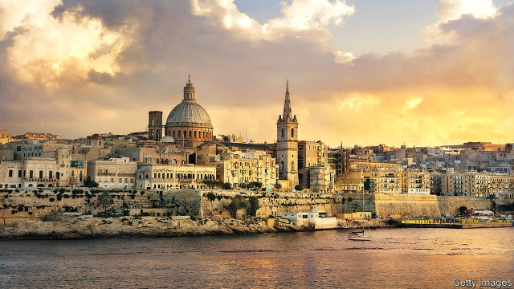

###### Treasure islands

# Malta and Cyprus face growing pressure over money-laundering 

##### Trouble for the European Union’s two smallest economies 

 

> Jan 24th 2019 

 

MARSHALL BILLINGSLEA, the American Treasury official in charge of tackling money-laundering, visited Cyprus in May 2018 with a stern message. His office had recently accused ABLV, Latvia’s third-largest bank, of laundering Russian money and starved it of American dollars, forcing it to close. Clean up your banks, Mr Billingslea is said to have told Cypriot officials, or they will be next. Later that summer another Mediterranean island felt similar heat from European officials, who said there had been serious regulatory gaps in Malta’s handling of scandal-hit Pilatus Bank. 

The European Union has been jolted by money-laundering scandals over the past year. The one uncovered at the Estonian branch of Denmark’s Danske Bank is reckoned to be among the largest in history. Pressure has grown on European countries to take action. A lot of it has fallen on Malta and Cyprus, respectively the EU’s two smallest economies, which have acquired a reputation for financial sleaze. A European Commission report on the sale of passports, released on January 23rd, warned that the pair’s investor citizenship schemes expose the rest of the EU to money-laundering risks. Some complain that the countries have been unfairly singled out because they are small. Both say they are now cracking down. But many wonder if this is compatible with their continued enthusiasm for offshore banking. 

Cyprus has been a haven for Russian money since the 1990s. But American officials are now looking at it with renewed interest, as they seek to curtail Russia’s influence in the West. There is much to worry them. Viktor Vekselberg, a Russian oligarch under American sanctions since April, owns 9% of the Bank of Cyprus, the country’s largest bank. The country’s name has also cropped up frequently at the trial of Paul Manafort, Donald Trump’s former campaign chief, who is charged with fraud. 

The reputation of Malta’s financial sector—newer than Cyprus’s and, for now, too small to trouble America—began to sour in 2017. Daphne Caruana Galizia, an investigative journalist, alleged that Malta-based Pilatus Bank was laundering millions for Azerbaijan’s ruling family, while Maltese officials took bribes to turn a blind eye. (They deny this.) Ms Caruana Galizia was killed by a car bomb in October 2017. Her murder shocked the European Commission into action. It told the European Banking Authority (EBA) to look into Malta’s supervision of Pilatus Bank a week later. 

Regulators are already showing some improvement. The Central Bank of Cyprus (CBC) forbade banks to deal with shell companies in June. Malta has increased the budget of its anti-money-laundering regulator six-fold. 

But many are sceptical about both countries’ efforts. Panicos Demetriades, the CBC’s former head, says industries that have sprung up around the banks, including “politically well-connected” law firms, remain mostly untouched. As for Malta, the commission told its regulators in November to “step up” their implementation of the EBA’s suggestions, warning that failure to meet deadlines could lead to hefty fines. Their citizenship-by-investment schemes also attract criticism. They are the lone EU members on a blacklist maintained by the OECD, a group of mostly rich nations, of countries whose “golden passport” schemes make tax evasion easy. 

This contrasts with Latvia’s contrition after the closure of ABLV. “We realised we had to do much more to clean up our financial sector,” says Liga Klavina, an official at the finance ministry. Since February, the proportion of deposits in Latvia belonging to non-residents has plummeted from 40% to 20%. The figure in Malta is 45%. 

-- 

 单词注释:

1.Malta['mɒ:ltә]:n. 马尔他 

2.Cyprus['saiprәs]:n. 塞浦路斯 [经] 赛浦路斯 

3.Jan[dʒæn]:n. 一月 

4.Marshall['mɑ:ʃәl]:n. 马歇尔（姓氏, 男子名, 等于Mar'shal） 

5.treasury['treʒәri]:n. 国库, 宝库, 财政部, 国库券 [经] 库存, 国库, 金库 

6.tackle['tækl]:n. 工具, 复滑车, 滑车, 装备, 扭倒 vt. 固定, 处理, 抓住 vi. 扭倒 

7.ABLV[]:abbr. Air-Breathing Launch Vehicle 喷气运载火箭 

8.launder['lɒ:ndә]:n. 流水槽 v. 洗衣, 烫衣 

9.Cypriot['sipriәt]:a. 塞浦路斯的, 塞浦路斯语的, 塞浦路斯人的 n. 塞浦路斯人, 塞浦路斯语 

10.regulatory['regjulәtәri]:a. 受控制的, 统制的, 调整的 [经] 规则的 

11.Pilatus[]:n. 皮拉图斯山（位于瑞士中部） 

12.jolt[dʒәult]:n. 震摇, 摇动, 颠簸 vi. 颠簸而行, 震摇 vt. 使颠簸, 使慌张, 猛击 

13.Estonian[es'tәuniәn]:a. 爱沙尼亚的 n. 爱沙尼亚人, 爱沙尼亚语 

14.danske[]:[网络] 银行丹斯克；丹麦丹克斯银行；丹麦文 

15.reckon['rekәn]:vt. 计算, 总计, 估计, 认为, 猜想 vi. 数, 计算, 估计, 依赖, 料想 

16.sleaze[sli:z]:n. 劣等品；卑鄙的人；肮脏；不名誉的状况 

17.investor[in'vestә]:n. 投资者 [经] 投资者 

18.citizenship['sitizәnʃip]:n. 国籍, 市民权, 市民的身份 [法] 公民权, 公民资格, 公民身分 

19.EU[]:[化] 富集铀; 浓缩铀 [医] 铕(63号元素) 

20.unfairly[]:adv. 不正当地；不公平地 

21.compatible[kәm'pætәbl]:a. 能共处的, 可并立的, 适合的 [计] 相容的; 兼容的 

22.haven['heivn]:n. 港, 避难所, 安息所 vt. 安置...于港中, 庇护, 入港 

23.curtail[kә:'teil]:vt. 缩减, 剥夺, 简略 [法] 剥夺特权 

24.Viktor[]:维克托（人名） 

25.oligarch['ɒligɑ:k]:n. 寡头政治执政者 

26.sanction['sæŋkʃәn]:n. 核准, 制裁, 处罚, 约束力 vt. 制定制裁规则, 认可, 核准, 同意 

27.paul[pɔ:l]:n. 保罗（男子名） 

28.manafort[]:[网络] 马纳福特 

29.donald['dɔnәld]:n. 唐纳德（男子名） 

30.fraud[frɒ:d]:n. 欺骗, 欺诈, 诡计, 骗子 [经] 欺诈, 舞弊, 骗子 

31.daphne['dæfni]:n. [植]瑞香；达芙妮（女名） 

32.caruana[]:[网络] 卡鲁亚纳 

33.investigative[in'vestigeitiv]:a. 审查的, 调查的, 好研究的 [法] 调查的, 审查的, 受调查研究的 

34.allege[ә'ledʒ]:vt. 宣称, 主张, 提出, 断言 [法] 断言, 指称, 指证 

35.Maltese[.mɒ:l'ti:z]:a. 马尔他的 n. 马尔他人, 马尔他语 

36.bribe[braib]:n. 贿赂 vt. 贿赂, 收买 vi. 行贿 

37.eba[]:abbr. 初级工商管理（Elementary Business Arrangement）；紧急制动辅助系统（emergency brake assist system） 

38.supervision[.sju:pә'viʒәn]:n. 监督, 管理 [经] 监督, 管理 

39.regulator['regjuleitә]:n. 调整者, 校准者, 校准器, 调整器, 标准钟 [化] 调节剂; 调节器 

40.cbc[]:abbr. 加拿大广播公司（Canadian Broadcasting Corporation） 

41.Demetriades[]:[网络] 崔亚德斯 

42.politically[]:adv. 政治上 

43.untouched[.ʌn'tʌtʃt]:a. 未触摸过的, 未改变的, 未受影响的 

44.implementation[.implimen'teiʃәn]:n. 安装启用, 实行, 履行 [计] 实施; 实现 

45.hefty['hefti]:a. 重的, 肌肉发达的 

46.lone[lәun]:a. 孤单的, 孤立的, 单身的, 寂寞的 

47.blacklist['blæklist]:n. 黑名单 

48.Oecd[]:[经] 已开发国家组织 

49.evasion[i'veiʒәn]:n. 逃避, 藉口 [法] 回避, 规避, 逃避 

50.contrition[kәn'triʃәn]:n. 完全悔悟, 悔改, 悔罪 

51.closure['klәuʒә]:n. 关闭 vt. 使终止 

52.sector['sektә]:n. 扇形, 部门, 部分, 函数尺, 象限仪, 段, 区段 vt. 把...分成扇形 [计] 扇面; 扇区; 段; 区段 

53.liga[]:n. 里加（地名） 

54.Latvia['lætviә]:n. 拉脱维亚 

55.plummete[]:[网络] 直线下降 

