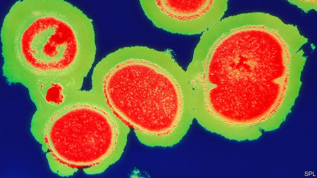
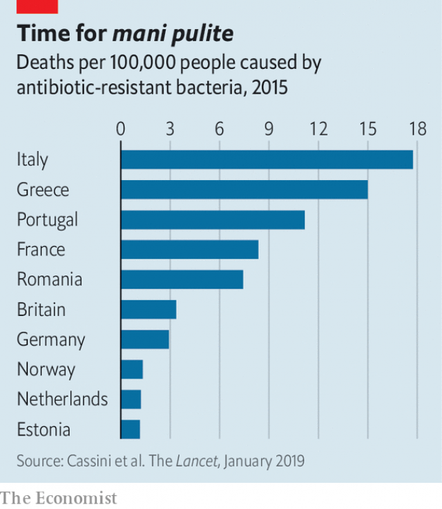

###### First, wash your hands

# Why Dutch hospitals are so good at beating superbugs 

##### Can the rest of Europe catch up? 

 

> Jan 26th 2019 

 

THE SEVENTH floor of Vrije University Medical Centre (VUMC), a 700-bed hospital in Amsterdam, houses what staff call the “Ebola room”. To enter, you have to wait in a pressurised antechamber until a monitor on the wall turns green. The difference in air pressure keeps germs from escaping. Nurses and doctors who check on a patient in the room must wear surgical gowns and respiratory masks. As many as 60 sets a day are used in looking after someone quarantined here, says Femke Overkamp, a nurse. 

The hospital has yet to see its first Ebola case. Isolation rooms like this one, sprinkled through its wards, have long been used for the kinds of patients who in other European countries are often in open-plan wards: those who harbour superbugs like MRSA (short for methicillin-resistant Staphylococcus aureus), a bacterium resistant to several widely used antibiotics. Here, as in other Dutch hospitals, some patients are even quarantined pre-emptively until tests for such bacteria come back negative. Suspects include workers on animal farms and those who have recently stayed in a hospital abroad. When an unexpected MRSA case is found on a ward, everyone who has been near that patient, including health workers, is tested. 

 

This “search and destroy” approach to superbugs is a Dutch speciality, though variations are also used in the Nordic countries. It helps explain why the Netherlands has the second-lowest mortality from infections resistant to antibiotics in the EU, after Estonia (see chart). As Rosa van Mansfeld, who oversees infection prevention at VUMC, points out, when MRSA outbreaks sweep through German hospitals, they stop at the Dutch border. That is no small feat. In 2016 about 30,000 patients crossed that border to get health care. 

The rest of Europe is looking to the Netherlands as superbugs scarier than MRSA, once rare, are spreading fast. They include CRE (for carbapenem-resistant Enterobacteriaceae), gut bacteria resistant to the last-resort antibiotics that are deployed when all else has failed. CRE blood infections are deadly in about 50% of cases, compared with 10-30% for MRSA. In Europe, the prevalence of superbugs is particularly high in Greece, Italy and Romania, but international travel has put other countries on notice. Even in the Netherlands, which has used antibiotics prudently for decades, the prevalence of some superbugs in the general population has almost doubled in the past five years. 

For preventing deaths, hospitals are the front line. People can harbour superbugs on the skin, around the nostrils or in the gut, where they are usually harmless. But if they slip into a wound or the bloodstream they become dangerous. In Europe, 73% of deaths caused by superbugs are from infections that occur in medical settings. 

Many European hospitals cannot replicate the Dutch model wholesale because they have few single-bed rooms or none at all. Choosing which of its features to prioritise is tricky. The evidence for the effectiveness of any one tactic, such as pre-emptive isolation or testing all patients for superbugs, is thin. National and EU-wide guidelines instead tend to rely heavily on experts’ beliefs that a given measure matters. Dr van Mansfeld likens the measures at her hospital to slices of Swiss cheese stacked together: each has holes through which something can slip, but the chances that it will get all the way through are slim. She admits that, unlike cash-strapped hospitals in countries like Greece, hers has the luxury of being able to afford to do everything thought to be effective. 

No money is spared in the fight against germs. The corridors are lined with beds wrapped as tightly as sandwiches in clear plastic foil. All have been through the room-size cleaning machine that whirrs in the hospital’s sprawling basement (“our dishwasher for beds”, says Dr van Mansfeld). A designated elevator brings down used beds; another is reserved for clean ones going up to the wards. Before shifts, staff pick up fresh uniforms from stations that look like vending machines. 

Such extras are a dream for most hospitals, even in richer countries like Britain. But any hospital manager awed by such infection control must reserve envy for something else that this hospital is zealous about: the basics. “In the end, it is all about hand hygiene,” says Dominique Monnet from the European Centre for Disease Prevention and Control (ECDC), the EU’s public-health agency. Though superbugs can lurk on clothes, sinks, toilets and indeed almost any surface in a hospital, the most common way they get transmitted to patients is by the hands of health workers. 

A survey in 2011-12 found that the amount of sanitising hand-rub used per patient per day in Bulgarian, Italian and Romanian hospitals was less than a fifth of that in Norway, Denmark or Sweden. After a tour of several Italian hospitals in 2017 an ECDC team concluded that “most personnel seemed unaware of basic hand-hygiene principles”. It also found that alcohol hand-rub was often placed where it was “unrealistic” to expect its routine use. 

In countries where basic hospital hygiene is neglected, the reason is not lack of knowledge, says Michael Borg of the Mater Dei Hospital in Malta, a consultant to the ECDC. “It is because infection prevention is not a priority,” he says—so nobody is held accountable for it. In Romania, where the health minister recently shut a maternity hospital in the capital for disinfection after 39 babies became infected with MRSA, people have come to see hospital infections as inevitable, says Stefan Voinea of the Romanian Health Observatory, a think-tank. 

Britain’s experience shows how quickly things can change when the spotlight zooms in on hospital hygiene. Investigations of superbug outbreaks in British hospitals in 2005-06 found filthy wards. Fewer than a third of doctors washed their hands between routine patient contacts (though they thought they were much better than that). Under pressure, the British government made infection-prevention a legal requirement for hospitals and results from audits on the matter became public. From 2003 to 2012 serious MRSA infections plummeted by nearly 90%. 

In southern Europe, policing hand-hygiene compliance is the best way to boost it, says Mr Borg. For northern Europe, he believes that convincing health workers of its merits works better. At VUMC in Amsterdam a “link nurse” from each ward is trained to proselytise about infection-prevention standards. Nurses like Ms Overkamp, the link nurse for the trauma unit, are also better than higher-ups at spotting barriers to compliance—and the solutions. By one estimate, some nurses must clean their hands about 100 times per shift. “On a busy day, at the end, the skin on my hands feels like it will fall off,” says Ms Overkamp. A new hand-rub, which nurses requested as a less messy option, turned out to be more skin-friendly too. To make the message land, link nurses resort to creativity. A game with glow-in-the-dark powder that nurses smeared on their gloved hands, for example, showed how easily germs spread from hands that are not cleaned after removing the gloves. (It ended up “everywhere”, including nurses’ faces, says Ms Overkamp.) 

In November the OECD, a think-tank, published a comparison of various strategies to reduce the toll from superbugs. It ranked improved hand hygiene in health care as the best approach to reduce deaths and hospital stays. Achieving compliance at 70% of health-care facilities is estimated to cost an OECD country between $0.90 and $2.50 per head of population per year. The money that would be saved from having fewer hospitalisations as a result exceeds these costs. There are few deals as good as this to be had in health care. 

-- 

 单词注释:

1.Dutch[dʌtʃ]:n. 荷兰人, 荷兰语 a. 荷兰的 

2.superbug[ˈsu:pəbʌg]: 超级细菌 

3.Jan[dʒæn]:n. 一月 

4.vrije[]:[网络] 阿姆斯特丹自由 

5.Amsterdam[.æmstә'dæm]:n. 阿姆斯特丹(荷兰首都) 

6.ebola[i'bəulə]:n. 埃博拉病毒 

7.pressurise[]:vt. 对...施加压力, 对...加压, 使(飞机座舱)增压, 密封, 使...耐压 

8.antechamber['ænti.tʃeimbә]:n. 前厅, 候见室 [机] 对燃室 

9.surgical['sә:dʒikl]:a. 外科的, 外科医生的, 手术上的 n. 外科病例, 外科病房, 外科手术 

10.respiratory[ri'spaiәrәtәri]:a. 呼吸的 [医] 呼吸的 

11.quarantine['kwɒrәnti:n]:n. 隔离, 封锁交通, 检疫期 vt. 隔离, 排斥 

12.femke[]:[网络] 芬克；费姆可 

13.isolation[.aisә'leiʃәn]:n. 隔绝, 孤立, 隔离 [化] 分离; 生物分离 

14.MRSA[]:abbr. 耐甲氧西林金黄色葡萄球菌（Methicillin-resistant Staphylococcus aureus） 

15.staphylococcus[.stæfilәu'kɒkәs]:n. 葡萄球菌 [医] 葡萄球菌属 

16.aureus['ɔ:riәs]:n. 奥里斯(古罗马和罗马帝国的基本金质货币单位) 

17.antibiotic[.æntibai'ɒtik]:n. 抗生素 a. 抗生的 

18.unexpect[]:[网络] 意想不到；使意外 

19.Nordic['nɒ:dik]:n. 北欧人, 日耳曼民族, 北欧两项滑雪 a. 北欧人的, 日耳曼民族的, 北欧两项滑雪的 

20.Netherlands['neðәlәndz]:n. 荷兰 

21.mortality[mɒ:'tælәti]:n. 必死的命运, 死亡数目, 死亡率 [医] 必死性, 死亡率 

22.infection[in'fekʃәn]:n. 传染, 影响, 传染病 [医] 传染, 感染 

23.EU[]:[化] 富集铀; 浓缩铀 [医] 铕(63号元素) 

24.Estonia[es'tәuniә]:n. 爱沙尼亚 

25.rosa['rәuzә]:[医] 蔷薇, 玫瑰 

26.mansfeld[]: [地名] [德国] 曼斯费尔德 

27.oversee[.әuvә'si:]:vt. 向下看, 了望, 监督, 偷看到 [法] 监察, 监督, 俯瞰 

28.prevention[pri'venʃәn]:n. 阻止, 妨碍, 预防 [医] 预防 

29.outbreak['autbreik]:n. 爆发, 暴动 [医] 暴发 

30.feat[fi:t]:n. 壮举, 功绩, 技艺表演 a. 灵巧的, 合适的, 整洁的 

31.scary['skєәri]:a. 容易受惊的, 胆小的, 提心吊胆的 

32.cre[]:abbr. 中铁快运（China Railway Express） 

33.Enterobacteriaceae[]:[医] 肠杆菌科 

34.gut[gʌt]:n. 剧情, 内容, 内脏, 肚子, 海峡, 勇气 vt. 取出内脏, 毁坏...的内部 

35.deploy[di'plɒi]:v. 展开, 配置 

36.prevalence['prevәlәns]:n. 普遍, 流行, 广泛 [医] 流行, 盛行 

37.Romania[rәu'meinjә]:n. 罗马尼亚 

38.prudently[]:adv. 谨慎地；慎重地 

39.nostril['nɒstril]:n. 鼻孔 [医] 鼻孔 

40.bloodstream[]:n. 血流 

41.cannot['kænɒt]:aux. 无法, 不能 

42.replicate['replikeit]:vt. 折叠, 折转, 复制 n. 复现试验, 复制品, 高八度音 a. 复现的, 复制的, 折转的, 弯回的 

43.wholesale['hәulseil]:n. 批发 a. 批发的, 大规模的 adv. 大规模, 照批发方式 vi. 经营批发业, 批发 vt. 批发 

44.prioritise[praɪ'ɒrəˌtaɪz]:vt. 给予…优先权; 按优先顺序处理; 出轻重缓急 vi. 把事情按优先顺序排好（等于prioritize） 

45.tricky['triki]:a. 狡猾的, 机敏的 

46.effectiveness[i'fektivnis]:n. 效力 [经] 有效性, 能行性 

47.tactic['tæktik]:n. 一项战术, 一条策略 a. 战术的, 顺序的, 排列的 

48.isolation[.aisә'leiʃәn]:n. 隔绝, 孤立, 隔离 [化] 分离; 生物分离 

49.guideline['gaidlain]:n. 指导路线, 方针, 指标 [经] 指导路线, 方针, 准则 

50.liken['laikәn]:vt. 比喻, 比拟 

51.tightly['taitli]:adv. 紧紧地, 坚固地 

52.foil[fɒil]:n. 箔, 烘托, 衬托 vt. 贴箔于, 衬托, 阻止, 挡开, 挫败 

53.whirr[hwә:]:vi. 发呼呼声, 作飕飕声, 作呼呼声 vi.vt. 呼呼地飞 n. 呼呼声, 嗡嗡声, 飕飕声, 匆忙, 熙攘, 纷乱 

54.sprawl[sprɒ:l]:vi. 伸开手足躺, 爬行, 蔓生, 蔓延 vt. 懒散地伸开, 使蔓生, 使不规则地伸展 n. 伸开手足躺卧姿势 

55.dishwasher['diʃwɒʃә]:n. 洗碗机, 洗碗工 

56.designate['dezigneit]:vt. 指定, 指明, 称呼 a. 已选出而未上任的 

57.vending[]:a. 贩卖的 

58.awe[ɒ:]:n. 敬畏 vt. 使敬畏 

59.hygiene['haidʒi:n]:n. 卫生保健, 卫生学, 保健法 [医] 卫生, 卫生学 

60.Dominique[,dɔmi'ni:k]:n. 多米尼加鸡；多米尼克（女子名） 

61.monnet[mɔˈne]:n. 莫内（一种假设中统一的欧洲货币单位） 

62.prevention[pri'venʃәn]:n. 阻止, 妨碍, 预防 [医] 预防 

63.ECDC[]:External Count-Down Clock 外部倒计时钟 

64.lurk[lә:k]:n. 潜伏, 潜行 vi. 暗藏, 潜伏, 埋伏 [计] 隐匿阅读 

65.sanitising[]:[网络] 消毒 

66.bulgarian[bʌl'ɡεәriәn]:n. 保加利亚人；保加利亚语 

67.Romanian[ru:'meiniәn]:n. 罗马尼亚人, 罗马尼亚语 a. 罗马尼亚的 

68.les[lei]:abbr. 发射脱离系统（Launch Escape System） 

69.Norway['nɒ:wei]:n. 挪威 

70.Denmark['denmɑ:k]:n. 丹麦 

71.Sweden['swi:dn]:n. 瑞典 

72.unaware[.ʌnә'wєә]:a. 未认识到的, 不知道的 [法] 不知道的, 不察觉的, 无意的 

73.unrealistic[.ʌnriә'listik]:a. 不切实际的, 幻想的 

74.michael['maikl]:n. 迈克尔（男子名） 

75.borg[]:n. 柏格（男子名） 

76.mater['meitә]:n. 母亲 [医] 脑[脊]膜 

77.dei[]:prep. （意）一些 

78.Malta['mɒ:ltә]:n. 马尔他 

79.accountable[ә'kauntәbl]:a. 负有责任的, 可说明的, 可解释的 [经] 负有责任的 

80.maternity[mә'tә:niti]:n. 母性, 怀孕, 妇产科医院 a. 产妇的 

81.disinfection[.disin'fekʃәn]:n. 消毒 [医] 消毒 

82.stefan[]:n. 斯蒂芬（男子名） 

83.observatory[әb'zә:vәtәri]:n. 天文台, 气象台, 了望台 

84.quickly['kwikli]:adv. 很快地 

85.spotlight['spɒtlait]:n. 照明灯, 反光灯, 聚光灯 

86.filthy['filθi]:a. 污秽的, 丑恶的 

87.audit['ɒ:dit]:n. 审计, 查帐 vt. 查(帐), 旁听 vi. 查账 [计] 查帐; 审查; 检查 

88.plummete[]:[网络] 直线下降 

89.compliance[kәm'plaiәns]:n. 遵从, 顺从, 屈从 [化] 柔顺; 顺应 

90.proselytise['prɔsilitaiz]:v. <主英>=proselytize 

91.trauma['trɒ:mә]:n. 外伤, 损伤 [医] 创伤, 外伤 

92.creativity[.kri:ei'tiviti]:n. 创造力, 创造性 

93.smear[smiә]:vt. 涂, 擦上, 玷污, 把...擦模糊 vi. 被弄脏 n. 污点, 污迹, 污蔑 

94.gloved[glʌvd]:a. （手）戴着手套的 

95.Oecd[]:[经] 已开发国家组织 

96.toll[tәul]:n. 通行费, 代价, 钟声 vt. 征收, 敲钟, 鸣钟, 勾引, 引诱 vi. 征税, 鸣钟 

97.hospitalisation[,hɔspitәlai'zeiʃәn;-li'z-]:n. <主英>=hospitalization 

