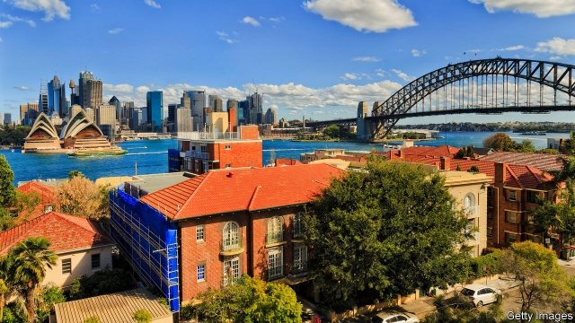
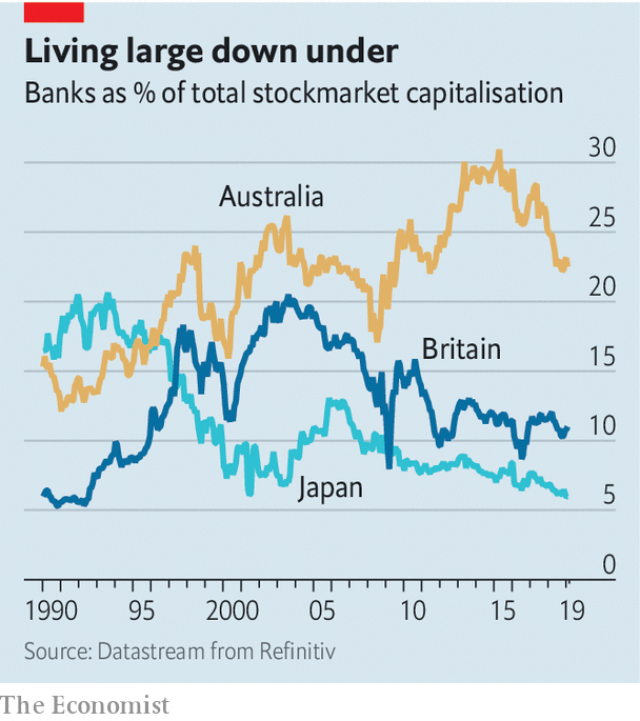

###### Buttonwood

# Australia has dodged many banana skins. Is it about to come a cropper? 

##### An extended business cycle has led to an over-extension of finance 

 

> Jan 24th 2019 

 

THERE ARE two ways to film the banana-skin joke, said Charlie Chaplin. The first begins with a wide shot of a man walking down Fifth Avenue. Cut to the banana skin on the pavement. Go to a close-up as foot meets peel. Then pan out to reveal the man landing on his backside. Ha ha ha. The second version is like the first except in this one the man spots the banana skin and carefully sidesteps it. Blind to other hazards, he smiles to the camera—and immediately falls down an open manhole. 

The second version is funnier, perhaps because it carries a deeper truth: a mishap avoided can lead to a greater calamity down the road. This seems to be a pattern in financial affairs. Japan dodged the banana skin of America’s 1987 stockmarket crash, only to disappear down a manhole a few years later. Emerging Asia brushed aside the Mexican crisis but imploded later on. Britain sailed through the dotcom bust in the early noughties, but was damaged by the subprime crisis. 

This is why some analysts believe that Australia’s economy is overdue a fall. It shrugged off the global financial crisis (the GFC as Australians call it) of 2007-09. Indeed it has dodged recession for 27 years, making fools of forecasters. But it has paid a price. By extending its business cycle, it has over-extended its financial cycle. That in turn makes it more vulnerable when trouble strikes. 

To understand why, first consider how exceptional Australia has been. Its economic cycle was broadly in sync with America’s until 2001. America slipped into recession. But in Australia a sharp reduction in interest rates by the central bank lit a fire under the housing market. The saving rate declined as consumer spending rose. GDP growth sped up even as it fell in America. 

When the GFC struck, Australia’s banks came through intact. Policymakers boasted that the steady profits from oligopoly (Australia’s “big four” accounted for 70% of banking assets) meant local banks could eschew the sort of risky lending that crippled those in America and Europe. A credit boom in China spurred a mining boom in Australia. When it ended in 2014, interest rates were cut and housing took off again. 

 

Australia has not been left unmarked by these escapes. Its housing market is now one of the most overvalued in The Economist’s global house-price index. Household debt has reached 200% of disposable income (the comparable peak in America was 125% in 2007). The saving rate is skimpy. Ian Harnett of Absolute Strategy Research, a London-based consultancy, points out that wherever the value of the banking sector has risen above 20% of the overall equity market, trouble has been close behind (see chart). Others think Australia is due a “Minsky moment”, named after Hyman Minsky, a scholar of financial cycles, in which a debt mountain collapses under its own weight. 

House prices have been falling for a year, led by the markets in the big cities, Sydney and Melbourne, popular spots for global investors, notably from China. A clampdown on risky lending by bank regulators acted as a trigger. It seems Australia’s banks may not have been quite as conservative as previously advertised. The share of interest-only loans, favoured by speculators, was as high as 40% (it has since fallen). 

The wider damage has so far been limited. The number of permits issued for apartment buildings has fallen, but a full pipeline of projects means that construction firms are still busy. Consumers have kept spending. The Australian dollar fell by 10% against the American dollar in 2018, but its current level is not out of the ordinary. 

Still, the situation looks fragile. Doubts about the durability of consumer spending have kept the Reserve Bank of Australia from raising interest rates, from their current 1.5%. A heap of mortgage debt seems wise when house prices are rising; less so when prices fall, especially for those who bought at the peak. The momentum that drove the market up, as higher prices fuelled expectations of further gains, works in reverse too. 

Efforts to stabilise an economy often lead to booms in asset prices and credit, which in turn leaves it vulnerable come the next spot of trouble. The lucky country has avoided so many potential slip-ups that even long-standing bears are wary of predicting a fall. Perhaps a new round of fiscal stimulus in China will lift Australia’s fortunes. But for many people’s tastes, China is an even better example of a tragic principle. The more banana skins you dodge, the bigger the manhole waiting for you. 

-- 

 单词注释:

1.buttonwood['bʌtnwʊd]: 美洲悬铃木 

2.dodge[dɒdʒ]:v. 避开, 躲避 n. 诡计, 躲藏 

3.Jan[dʒæn]:n. 一月 

4.Charlie[]:n. 通讯中用以代表字母C的词 

5.chaplin['tʃæplin]:n. 卓别林（喜剧演员） 

6.backside[.bæk'said]:n. 背部, 背后, 后方 

7.carefully['kєәfuli]:adv. 小心地, 谨慎地 

8.sidestep['saidstep]:n. 横跨的一步, 台阶 vt. 横跨一步躲避, 回避 vi. 回避问题, 躲避打击 

9.manhole['mænhәul]:n. 人孔 [化] 人孔; 进人孔 

10.mishap['mishæp]:n. 不幸之事, 灾祸, 恶运 

11.calamity[kә'læmiti]:n. 灾难, 不幸事件 

12.stockmarket[s'tɒkmɑ:kɪt]: 证券市场; 证券交易所; 证券行情 

13.implode[im'plәud]:vi. 内爆, 向内破裂, 爆裂 [电] 内裂 

14.dotcom['dɒtkɒm]:n. 网站 

15.bust[bʌst]:n. 半身像, 胸部, 失败, 殴打 vt. 使爆裂, 使破产 vi. 爆裂, 破产 [计] 操作错 

16.noughties['nɔtiz]:n. 21 世纪头十年（即从 2000 年到 2009 年的十年） 

17.subprime[ˌsʌb'praɪm]:a. 准一流的, 近乎头等的; 准最低贷款利率的 

18.analyst['ænәlist]:n. 分析者, 精神分析学家 [化] 分析员; 化验员 

19.gfc[]:abbr. Gas-Filled Counter 充气计数管 

20.recession[ri'seʃәn]:n. 后退, 凹处, 衰退, 归还 [医] 退缩 

21.forecaster['fɔ:kɑ:stә]:n. 预报员 

22.vulnerable['vʌlnәrәbl]:a. 易受伤害的, 有弱点的, 易受影响的, 脆弱的, 成局的 [医] 易损的 

23.exceptional[ik'sepʃәnәl]:a. 例外的, 异常的, 特别的 

24.broadly['brɒ:dli]:adv. 宽广地, 明白地, 无礼貌地 

25.sync[siŋk]:[计] 同步的 

26.GDP[]:[化] 鸟苷二磷酸 

27.intact[in'tækt]:a. 尚未被人碰过的, 原封不动的, 完整的 [医] 完整的, 无伤的 

28.policymaker['pɔlisi.meikә]:n. 政策制定者；决策人 

29.oligopoly[.ɒli'gɒpәli]:n. 求过于供的市场情况, 寡头买主垄断 

30.asset['æset]:n. 资产, 有益的东西 

31.eschew[is'tʃu:]:vt. 避开, 远避 

32.risky['riski]:a. 危险的 

33.unmarked[.ʌn'mɑ:kt]:a. 未被注意的, 无记号的, 无标志的 

34.overvalue[.әuvә'vælju:]:vt. 估价过高, 过分尊重, 估计过高 

35.disposable[dis'pәuzәbl]:a. 可任意处理的 [法] 可任意处理或处置的, 可自由使用的 

36.skimpy['skimpi]:a. 不足的, 吝啬的 

37.ian[iәn]:n. 伊恩（男子名） 

38.harnett[]: [人名] [英格兰人姓氏] 哈尼特 Arnold的变体 

39.consultancy[]:n. 商量, 协商, 磋商, 会诊, 与...商量, 咨询, 请教, 找(医生)看病, 查阅, 考虑 [经] 咨询业务, 咨询服务 

40.sector['sektә]:n. 扇形, 部门, 部分, 函数尺, 象限仪, 段, 区段 vt. 把...分成扇形 [计] 扇面; 扇区; 段; 区段 

41.equity['ekwiti]:n. 公平, 公正 [经] 权益, 产权 

42.minsky[]: [人名] 明斯基 

43.hyman['haimәn]:n. 海曼 

44.sydney['sidni]:n. 悉尼（澳大利亚港市） 

45.Melbourne['melbәn]:n. 墨尔本 

46.investor[in'vestә]:n. 投资者 [经] 投资者 

47.notably['nәjtbәli]:adv. 显著地, 著名地, 尤其, 特别 

48.clampdown['klæmdaun]:n. 压制, 取缔 

49.regulator['regjuleitә]:n. 调整者, 校准者, 校准器, 调整器, 标准钟 [化] 调节剂; 调节器 

50.trigger['trigә]:n. 触发器, 扳机 vt. 触发, 发射, 引起 vi. 松开扳柄 [计] 切换开关 

51.speculator['spekjuleitә]:n. 投机者, 投机商人, 思索者 [经] 投机买卖者, 投机商 

52.durability[,djuәrә'biliti]:[计] 耐久性, 耐用性, 持久性 

53.mortgage['mɒ:gidʒ]:n. 抵押, 约束性义务, 抵押借款 vt. 抵押, 以...作担保, 把...许给 

54.les[lei]:abbr. 发射脱离系统（Launch Escape System） 

55.momentum[mәu'mentәm]:n. 动力, 动量 [化] 动量 

56.stabilise['steibilaiz]:vt.vi. (使)稳定, (使)安定, (使)坚固 vt. 装稳定器 

57.wary['wєәri]:a. 谨慎的, 小心的, 机警的, 周到的, 唯恐的 

58.fiscal['fiskәl]:a. 财政的, 国库的 [经] 财政上的, 会计的, 国库的 

59.stimulus['stimjulәs]:n. 刺激, 激励, 刺激品 [医] 刺激特, 刺激 

60.tragic['trædʒik]:a. 悲惨的, 悲剧的 

