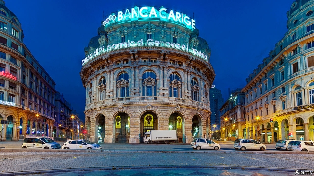

###### Stubborn blemishes

# Cleaning up Italy’s banks is proving slow and painful 

##### The scars of the financial crisis will be slow to fade 

 

> Jan 24th 2019 

 

“THE BOILS that had to burst have burst,” says Mario Deaglio, an economist at the University of Turin, of Italy’s banks. The latest carbuncle to come to a head is Banca Carige, which was put into temporary administration by the European Central Bank (ECB) on January 2nd—the first time the euro-zone regulator has exercised this power. The move followed a shareholders’ meeting in December that failed to approve the first tranche of a €400m ($455m) capital increase. 

The ECB appointed three administrators, including Carige’s former chief executive and chairman, giving them three months to reduce the €3bn stock of bad loans and arrange a merger. Italy’s government issued a decree to guarantee the bank’s bonds for up to €3bn, and to support a precautionary recapitalisation, if requested. On January 18th Banca Carige said it would issue government-backed bonds to the tune of €2bn, and perhaps a further €1bn. But it maintains that it will find a market solution. The administrators will present a business plan next month. 

Banca Carige, Italy’s tenth-biggest lender, has had a rocky time of it recently: an accounting scandal emerged in 2017 and it has gone through three bosses in as many years. Its latest troubles date from last autumn, when the ECB identified losses of €200m. Carige was required to shore up its capital or arrange a merger by the end of the year. Attempts to issue bonds on the market failed, and in November Italy’s interbank deposit-guarantee fund, a voluntary scheme, stepped in to the tune of €320m. December’s planned capital increase included converting those bonds into equity. 

The rescue legislation bears a strong resemblance to that passed by the previous government in 2017 to save another troubled bank, Monte dei Paschi di Siena, Italy’s fourth-biggest. But their situations differ markedly. Monte dei Paschi required a capital injection of €8bn; Carige’s shortfall is €400m—€320m of which it has already. 

That is a welcome sign of stabilisation, says Nicolas Véron of Bruegel, a think-tank in Brussels: “Three years ago, Italy was a textbook case of a zombie banking system.” Total bad loans, including those in delinquency and those classed as unlikely to be repaid, are down from a peak of €341bn in 2015 to €211bn last September. Sales of non-performing loans (NPLs) last year amounted to €66bn; Banca IFIS, a lender that is building a portfolio of bad debts, predicts sales of €50bn in 2019. A report by PwC, a professional-services firm, suggests that this year could see the start of a market for unlikely-to-pay loans and growth in the secondary market for NPLs. 

Monte dei Paschi di Siena, for its part, issued a five-year €1bn bond, guaranteed by residential mortgages, on January 23rd. Demand exceeded €2bn. Last year it disposed of bad loans with a face value of €24.1bn, but market volatility has made its turnaround trickier than had been hoped. This year it will have to present a plan for its reprivatisation to the ECB. It is supposed to be sold on by 2021. 

Italy’s banks are still fragile. The stock of bad loans remains high, profitability is low and banks remain highly exposed to sovereign debt even as national politics have become more tumultuous. More difficulties lie ahead, says Giovanni Razzoli of Equita, a bank. In Italy recession is looming, meaning appetite for mergers is likely to be low. The ECB’s targeted longer-term refinancing operations, which offered euro-zone banks cheap credit, are due to come to an end. And it wants banks to dispose of all bad loans by around 2025, sooner than had been expected. The scars of the banking crisis will be slow to fade. 

-- 

 单词注释:

1.blemish['blemiʃ]:n. 污点, 缺点 vt. 弄脏, 玷污, 损害 

2.Jan[dʒæn]:n. 一月 

3.mario['mæriәj, 'mɑ:-]:n. 马里奥（男子名） 

4.economist[i:'kɒnәmist]:n. 经济学者, 经济家 [经] 经济学家 

5.turin[tju'rin]:n. 都灵（意大利城市） 

6.carbuncle['kɑ:bʌŋkl]:n. 痈, 红玉, 红榴石 [医] 痈 

7.Banca['bɑ:ŋkɑ:]:n. 螃蟹船（菲律宾特色船只） 

8.Carige[]:[网络] 双角尺蛾属 

9.ECB[]:[计] 事件控制块 

10.regulator['regjuleitә]:n. 调整者, 校准者, 校准器, 调整器, 标准钟 [化] 调节剂; 调节器 

11.tranche[trɑ:nʃ]:[经] 一片, 一期, 一批 

12.administrator[әd'ministreitә]:n. 管理人, 行政官 [经] 遗产管理人员 

13.merger['mә:dʒә]:n. 合并, 归并 [经] 购并 

14.decree[di'kri:]:n. 法令, 判决, 天意 vt. 颁布, 判决 vi. 发布命令 

15.precautionary[pri'kɒ:ʃәnәri]:a. 预先警戒的, 预防的, 留心的 

16.recapitalisation[]:[网络] 资本重整；资本重组；备后政府需要进行再注资 

17.lender['lendә]:n. 出借人, 贷方 [经] 出借者, 贷方, 贷款人 

18.rocky['rɒki]:a. 岩石的, 多石的, 像岩石的, 无情的, 摇动的, 摇晃的 

19.interbank[,intә'bæŋk]:管排间的, 管束间的 

20.equity['ekwiti]:n. 公平, 公正 [经] 权益, 产权 

21.resemblance[ri'zemblәns]:n. 相似处, 类似, 肖像 

22.Monte['mɔnti]:[计] 蒙特卡罗 

23.dei[]:prep. （意）一些 

24.Paschi[]:帕斯基 

25.DI[]:[计] 数据输入, 数据项, 设备独立性, 双整数 

26.siena[si'enә, 'sjenɑ:]:n. 锡耶纳（意大利城市） 

27.markedly['mɑ:kidli]:adv. 显著地, 醒目地, 明显地 

28.shortfall['ʃɒ:tfɒ:l]:n. 不足, 不足量 [经] 缺少, 不足, 亏舱运费 

29.stabilisation[ˌsteɪbɪlaɪ'zeɪʃən]: 稳定 

30.Nicolas['nɪkələs]:n. 尼古拉斯（男子名） 

31.Bruegel[]:n. (Bruegel)人名；(德)布吕格尔 

32.zombie['zɔmbi]:n. 蛇神, 起死回生的魔力, 僵尸, 回魂尸, (美)鸡尾酒, 木鸡, 讨厌的家伙 [计] 僵尸 

33.delinquency[di'liŋkwәnsi]:n. 行为不良, 失职 [经] 毁约, 怠工, 旷职 

34.repay[ri'pei]:v. 偿还, 报答, 报复 

35.NPLs[]:abbr. 不良贷款（Non-performing Loans） 

36.ifis[]:abbr. integrated flight instrument system 综合飞行仪表系统; integrated flight instrumentation system 综合飞行仪表系统 

37.portfolio[pɒ:t'fәuliәu]:n. 皮包, 公文包, 部长职务, 有价证券财产目录, 艺术代表作选辑 [法] 公文包, 文件夹, 阁员职务 

38.PWC[]:abbr. 印刷线路卡（Printed Wiring Card） 

39.residential[.rezi'denʃәl]:a. 住宅的, 与居住有关的 [法] 有关居住的, 房产的:居所的, 适于居住的 

40.mortgage['mɒ:gidʒ]:n. 抵押, 约束性义务, 抵押借款 vt. 抵押, 以...作担保, 把...许给 

41.volatility[.vɒlә'tiliti]:n. 挥发性, 挥发度, 轻快, 易变, 短暂 [计] 变更率 

42.turnaround['tә:nә.raund]:n. 转向, 回车道, 转变 [化] 小修; 预防(性)修理 

43.tricky['triki]:a. 狡猾的, 机敏的 

44.reprivatisation[]:[网络] 恢复私营化 

45.profitability[.prɒfitә'biliti]:n. 收益性, 利益率 [经] 可获利润率 

46.sovereign['sɒvrin]:n. 元首, 独立国 a. 具有主权的, 至高无上的, 国王的, 完全的 

47.politic['pɒlitik]:a. 精明的, 明智的, 策略的 

48.tumultuous[tju:'mʌltʃuәs]:a. 吵闹的, 纷乱的, 骚乱的 [法] 喧嚣的, 骚乱的, 凶猛的 

49.Giovanni[dʒo'vanni]:n. 乔瓦尼（人名） 

50.recession[ri'seʃәn]:n. 后退, 凹处, 衰退, 归还 [医] 退缩 

51.loom[lu:m]:n. 织布机, 若隐若现的景象 vi. 朦胧地出现, 隐约可见, 可怕地出现 

52.refinancing[rifi'nænsiŋ]:[经] 重新集资金 

