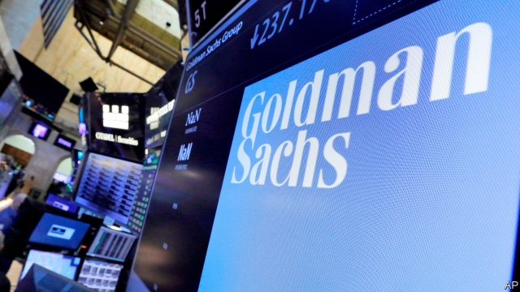

###### Big numbers

# Efforts to fix the market in auditing rumble on 

##### Regulators in both Britain and Europe want to make audits less cosy 

 

> Jan 24th 2019 

 

AUDITORS ARE supposed to provide an independent view of company accounts. But regulators fear that the relationship between auditors and those they audit can become too cosy—which is why the European Union has decided that, from 2020, companies will have to switch auditor at least once every 20 years. Last week the Financial Reporting Council (FRC), a British regulator, sent a letter to audit firms warning them away from “rotation in form but not in substance”. 

That was aimed at subsidiaries of American banks. The FRC wants to deter Goldman Sachs and PwC, the auditor it has used since 1926, from seeking to satisfy the new rules by hiring a smaller auditor for the Wall Street firm’s British subsidiary while retaining PwC for the global business. 

The spat is a consequence of flaws in the audit market. It is dominated by four global networks: PwC, Deloitte, KPMG and EY, which also have consultancy arms and between them audit 98% of companies in the S&P 500 and FTSE 350. Most big multinationals receive consultancy services from those of the Big Four that they do not use as auditor. Rotating auditors therefore means either severing a consulting relationship or turning to a smaller audit firm. But none outside the Big Four is likely to have the expertise to audit a global company. 

Recent high-profile corporate failures, notably that of Carillion, a construction firm, have put Britain at the centre of discussions about how to fix the audit market. The Competition and Markets Authority (CMA), the national antitrust watchdog, has been considering possible reforms since last autumn. In a paper published in December it suggested several, including operational division of audit and consulting within firms (it shied away from proposing forced break-ups). A consultation on its ideas closed on January 21st. 

Another of its proposals was for mandatory joint audit, in which two firms would share the work. Both would retain full responsibility, unlike Goldman’s plans to split its audit work geographically. Companies could not retain either for longer than 20 years. The thinking is that joint audits might be higher-quality and, if one of the auditors was a minnow, it would be given the chance to gain experience and grow. 

On the same day as the CMA published its paper, another review came out looking at the FRC. Commissioned by the British government from Sir John Kingman, the chairman of Legal & General, a life insurer, it was scathing. It likened the FRC to a “ramshackle house” built on weak foundations, and recommended its replacement by a new regulator with more powers. Despite the harsh words the FRC welcomed the report, which it said had “set a course for a stronger, new regulator to emerge”. 

The government said it would act on the recommendations. Meanwhile, the outgoing chairman of the London Stock Exchange, Donald Brydon, has been asked to lead yet another review on audit quality, building on the previous work. Companies up against a tight deadline to switch auditor can expect the rules to change more. 

-- 

 单词注释:

1.audit['ɒ:dit]:n. 审计, 查帐 vt. 查(帐), 旁听 vi. 查账 [计] 查帐; 审查; 检查 

2.rumble['rʌmbl]:n. 隆隆声, 辘辘声 vi. 发隆隆声, 辘辘响 vt. 使隆隆响, 低沉地说 

3.regulator['regjuleitә]:n. 调整者, 校准者, 校准器, 调整器, 标准钟 [化] 调节剂; 调节器 

4.les[lei]:abbr. 发射脱离系统（Launch Escape System） 

5.Jan[dʒæn]:n. 一月 

6.auditor['ɒ:ditә]:n. 审计员, 听者, 旁听生 [经] 审计(查帐)员, 审计师, 会计检查员 

7.FRC[]:abbr. 货物交与承运人价格（Free Carrier-Named Point）；阻燃粘胶纤维 

8.subsidiary[sәb'sidiәri]:n. 子公司, 附件, 辅助者 a. 辅助的, 次要的, 津贴的 

9.deter[di'tә:]:vt. 制止, 吓住, 威慑 

10.goldman[]:n. 高曼（姓氏） 

11.Sachs[zaks]:n. 萨克斯（汽车零配件生产厂商） 

12.PWC[]:abbr. 印刷线路卡（Printed Wiring Card） 

13.flaw[flɒ:]:n. 缺点, 裂纹, 瑕疵, 一阵狂风 [化] 划痕; 裂缝; 裂纹 

14.Deloitte[]:n. 德勤（四大会计师事务所之一） 

15.KPMG[]:abbr. 毕马威会计事务所 

16.ey[]:abbr. 医院；阿联酋阿提哈德航空公司 

17.consultancy[]:n. 商量, 协商, 磋商, 会诊, 与...商量, 咨询, 请教, 找(医生)看病, 查阅, 考虑 [经] 咨询业务, 咨询服务 

18.ftse[]:abbr. failed to sustain engraftment 支撑移植物植入失败 

19.multinational[.mʌlti'næʃәnl]:a. 多国的, 跨国公司的 n. 跨国公司 

20.sever['sevә]:vt. 切断, 脱离, 分开, 使分离, 断绝, 中断 vi. 断, 裂开 

21.expertise[.ekspә:'ti:z]:n. 专家意见, 专门技术 [法] 专门知识, 专家意见 

22.corporate['kɒ:pәrit]:a. 社团的, 合伙的, 公司的 [经] 团体的, 法人的, 社团的 

23.notably['nәjtbәli]:adv. 显著地, 著名地, 尤其, 特别 

24.cma[]:abbr. 军事委员会（Committee of Military Affairs）；特许医学助理医师（Certified Medical Assistant）；中华医学会（China Medical Association）；基督教传教联盟（Christian and Missionary Alliance） 

25.antitrust[.ænti'trʌst]:a. 反托拉斯的 [法] 反托拉斯的 

26.watchdog['wɒtʃdɒg]:n. 看门狗, 监察人 [化] 监控设备; 监视器 

27.consultation[.kɒnsәl'teiʃәn]:n. 请教, 咨询, 磋商会 [医] 会诊 

28.mandatory['mændәtәri]:a. 命令的, 托管的 [经] 受托者, 命令者 

29.geographically[]:[计] 自通地 

30.minnow['minәu]:n. 鲤科淡水小鱼 

31.john[dʒɔn]:n. 盥洗室, 厕所, 嫖客 

32.kingman[]: [人名] [英格兰人姓氏] 金曼来源于King,含义是“金之仆”(servant of King); [地名] [加拿大、美国] 金曼 

33.insurer[in'ʃuәrә]:n. 保险公司 [法] 保险人, 承保人, 保险公司 

34.scathing['skeiðiŋ]:a. 伤害的, 损伤的, 严厉的 

35.liken['laikәn]:vt. 比喻, 比拟 

36.ramshackle['ræmʃækl]:a. 象要倒的, 摇晃的, 放荡的 

37.replacement[ri'pleismәnt]:n. 归还, 更换, 代替者 [医] 复位, 置换 

38.donald['dɔnәld]:n. 唐纳德（男子名） 

39.brydon[]: [人名] 布赖登 

