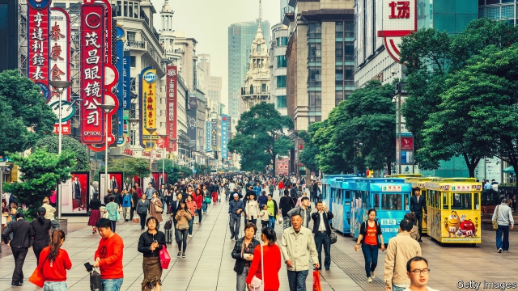
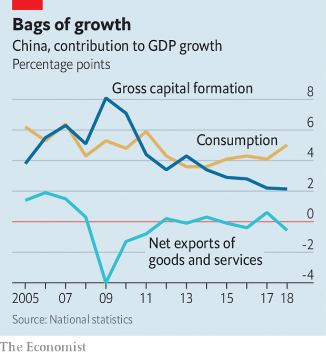

###### China’s economy

# Headlines about China’s weak growth are somewhat misleading 

##### Slowness is in the eye of the beholder 

 

> Jan 24th 2019 

AMERICA’S PRESIDENT knows a catchy number when he sees one. Like much of the world’s media, Donald Trump tweeted this week that China’s growth in 2018 was its slowest in nearly three decades. This, he said, ought to compel it to make a “Real Deal” on trade with America. China’s growth of 6.6% last year was indeed the weakest since 1990, and the country does want to end the trade war. But a closer look at the data shows why its leaders are less panicked than Mr Trump might think. 

First, the sheer size of its economy means that China’s growth last year generated a record amount of new production. Nominal GDP increased by 8trn yuan ($1.2trn), well above the 5.1trn yuan added in 2007, when it notched up 14.2%, its fastest growth in recent decades. The point is simple: China is now growing from a much larger base. But this was overlooked in the flurry of headlines about its slowdown. 

The changing nature of China’s growth also provides some cushioning from the trade war. American tariffs are starting to inflict pain: Chinese companies have reported a sharp drop in export orders. But for the broader economy, foreign sales matter less than they used to. Although the falling trade surplus lopped half a percentage point from the growth rate last year, domestic demand more than plugged the shortfall (see chart). Consumption accounted for three-quarters of the growth rate last year, the most since 2000. 

 

Finally, China has made modest progress towards cleaning up its financial system. The government had sought to rein in debt, which had soared over the past decade. Critics have observed that it has failed to bring about any real deleveraging, because debt-to-GDP levels have continued to creep up. But stabilisation, rather than outright deleveraging, was China’s real goal. It has had some success: the pace of debt accumulation has slowed sharply. In 2015 it took more than four yuan of new credit to generate each yuan of incremental GDP. In 2018 that multiple fell to 2.5, in line with China’s average over the past 15 years. 

Alongside these positives, however, there were some worrying signs. Nominal growth has slowed significantly, from an annual rate of 11.2% in the third quarter of 2017 to 8.1% in the final quarter of last year. It will slow further this year as inflation decelerates. Since nominal growth is closely correlated with corporate revenue growth, companies could be in for a difficult year. 

As for consumption, this year looks less promising than last. Companies have started cutting back hiring and incomes are growing more slowly, weighing on consumer sentiment. The middle three quintiles of China’s population by income distribution saw earnings increase by only about 2% last year in real terms. Those of the richest quintile rose by 6.6%. Given that lower earners tend to spend more of their wages than the rich do, that is a poor basis for sustained growth in consumption. Sales of cars fell last year for the first time in more than two decades. Sales of mobile phones were also sluggish. 

China has already pivoted towards more supportive economic policies. It has sped up spending on infrastructure, trimmed income taxes and relaxed some restraints on bank lending. This does not add up to a big stimulus package, but the direction is clear. If growth slows further, as seems likely, the government will move more boldly still. 

There is no doubt that China would like to persuade Mr Trump to roll back tariffs on Chinese goods, which would both help its exporters and boost market sentiment. Bilateral talks are grinding on ahead of a March 1st deadline. Chinese negotiators are working on an offer they hope will satisfy their American counterparts, combining pledges to buy more American goods with reforms to treat foreign companies more fairly. But if Mr Trump truly believes what he tweets about the Chinese economy, he is at risk of overestimating the strength of America’s hand. China wants a trade deal, certainly, but it is not desperate. 

-- 

 单词注释:

1.misleading[mis'li:diŋ]:a. 引入歧途的, 使人误解的, 骗人的 [法] 误写姓名的, 误称的, 令人误解的 

2.slowness['slәunis]:n. 缓慢, 迟钝 

3.beholder[bi'hәjldә(r)]:n. 观看者 

4.Jan[dʒæn]:n. 一月 

5.catchy['kætʃi]:a. 易记住的, 欺骗性的, 不规则发生的 

6.donald['dɔnәld]:n. 唐纳德（男子名） 

7.trump[trʌmp]:n. 王牌, 法宝, 喇叭 vt. 打出王牌赢, 胜过 vi. 出王牌, 吹喇叭 

8.tweet[twi:t]:vi. 啁啾 n. 小鸟叫声 

9.datum['deitәm]:n. 论据, 材料, 资料, 已知数 [医] 材料, 资料, 论据 

10.les[lei]:abbr. 发射脱离系统（Launch Escape System） 

11.panick[]:v. 恐慌, 使（受惊） 

12.sheer[ʃiә]:a. 绝对的, 全然的, 纯粹的, 透明的, 峻峭的 vi. 偏转, 偏航 vt. 使急转向, 使偏航 adv. 完全, 全然, 峻峭 n. 偏航 

13.yuan[ju:'ɑ:n]:n. 元(中国货币单位) [经] 元 

14.notch[nɒtʃ]:n. 刻痕, 等级, 峡谷 vt. 刻凹痕, 用刻痕计算, 赢得 

15.flurry['flә:ri]:n. 疾风, 飓风, 慌张 vt. 使恐慌, 使激动 vi. 慌张 

16.slowdown['slәudaun]:n. 降低速度, 减速 

17.tariff['tærif]:n. 关税, 关税表, 价格表, 收费表 vt. 课以关税 [计] 价目表 

18.inflict[in'flikt]:vt. 施以, 加害, 使承受 [法] 处, 加, 予以 

19.lop[lɒp]:vt. 剪, 砍伐, 斩 vi. 下垂, 闲荡 a. 垂下的 n. 砍伐, 剪下的树枝 

20.shortfall['ʃɒ:tfɒ:l]:n. 不足, 不足量 [经] 缺少, 不足, 亏舱运费 

21.soar[sɒ:]:n. 高扬, 翱翔 vi. 往上飞舞, 高耸, 翱翔 

22.deleveraging[ˈli:vəridʒɪŋ]:[网络] 去杠杆化；去杠杆化过程；去杠杆化效应 

23.stabilisation[ˌsteɪbɪlaɪ'zeɪʃən]: 稳定 

24.outright['autrait]:a. 率直的, 完全的, 总共的, 直率的 adv. 完全地, 率直地, 立刻地, 一直向前 

25.accumulation[ә.kju:mju'leiʃәn]:n. 积聚, 累积, 积聚物 [医] 蓄积, 累积 

26.nominal['nɒminl]:a. 名义上的, 名字的, 有名无实的, 稍许的 n. 名词性词 

27.significantly[]:adv. 值得注目地；意味深长地 

28.inflation[in'fleiʃәn]:n. 胀大, 夸张, 通货膨胀 [化] 充气吹胀; 膨胀 

29.decelerate[.di:'selәreit]:v. (使)减速 

30.nominal['nɒminl]:a. 名义上的, 名字的, 有名无实的, 稍许的 n. 名词性词 

31.correlate['kɒrәleit]:n. 有相互关系的东西, 相关物 vt. 使有相互关系 vi. 相关 

32.corporate['kɒ:pәrit]:a. 社团的, 合伙的, 公司的 [经] 团体的, 法人的, 社团的 

33.sentiment['sentimәnt]:n. 感情, 感伤, 情操, 情绪, 感想, 意见 [医] 情感, 情操 

34.quintile['kwintil, -tail]:a. [占星术] 五分之一对座的(相隔72度) n. [天]五分之一对座 

35.earning['ә:niŋ]:n. 收入（earn的现在分词） 

36.earner['ә:nә]:n. 赚钱的人 

37.sluggish['slʌgiʃ]:a. 偷懒的, 懒惰的, 迟钝的 [经] 萧条的, 呆滞的 

38.pivote[]:[网络] 在枢轴上转动 

39.supportive[sә'pɔ:tiv]:a. 支撑, 支承, 资助, 赞助, 支援, 经受, 忍受, 扶养, 证实, 鼓励, 维持, 伴奏 

40.infrastructure['infrәstrʌktʃә]:n. 基础结构, 基础设施 [经] 基础设施 

41.stimulus['stimjulәs]:n. 刺激, 激励, 刺激品 [医] 刺激特, 刺激 

42.boldly['bәuldli]:adv. 大胆地, 显眼地 

43.exporter[ik'spɒ:tә]:n. 出口商, 输出者, 出口公司 [经] 出口商, 输出者 

44.bilateral[bai'lætәrәl]:a. 有两边的, 双边的, 双方的 [医] 两侧的 

45.negotiator[ni'gәuʃieitә]:n. 磋商者, 交涉者, 议定者 [经] 谈判者, 交易者, 协商者 

46.counterpart['kauntәpɑ:t]:n. 副本, 复本, 配对物, 相应物 [经] 副本, 正副二份中之一 

47.pledge[pledʒ]:n. 诺言, 保证, 誓言, 抵押, 信物, 保人, 祝愿 vt. 许诺, 保证, 使发誓, 抵押, 典当, 举杯祝...健康 

48.overestimate[.әuvәr'estimeit]:vt. 评价过高, 过高估价 n. 估计过高, 评价过高 

