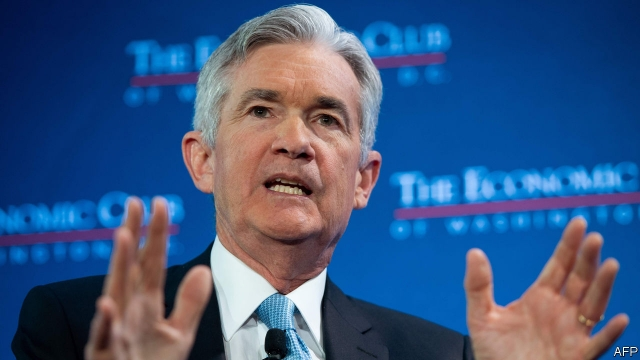
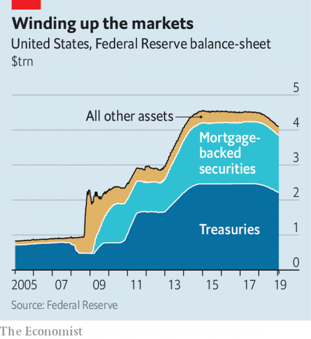

###### A delicate balance

# Investors fear that the unwinding of QE is causing market turbulence 

##### The Fed wanted its balance-sheet policy to be dull. It is anything but 

 

> Jan 24th 2019 

 

AS DULL AS “watching paint dry”. That was how Janet Yellen, the former head of the Federal Reserve, described plans for a gradual unwinding of its $4.5trn balance-sheet announced in September 2017. The Fed’s stock of assets had swelled during the previous decade as it engaged in “quantitative easing” (QE), seeking to ease the pernicious effects of the global financial crisis. Now that the economy had recovered, it planned to shrink its balance-sheet again. 

The plan was to set a path and proceed on autopilot. This, it was hoped, would avoid the pace of unwinding being taken as a signal of the direction of interest rates. It would start slowly, just $10bn a month from October 2017, and smoothly pick up pace. By October 2018 it had quickened, as planned, to $50bn. 

That coincided with the start of a bout of market turbulence. The S&P 500 index of leading shares fell by 14.0% in the final three months of 2018. The yield on ten-year Treasuries fell by 0.7 percentage points, peak to trough, suggesting growing pessimism about long-term growth. The coincidence of timing led many to blame the turbulence on the tightening. 

The Fed’s expanding balance-sheet was intended to achieve different things at different times. The first was to provide banks in crisis with liquidity. The second was to signal to markets that monetary policy would remain loose for some considerable time. The third was to reduce bond yields, encouraging investors to buy riskier assets. 

 

The current unwinding is unlikely to affect liquidity much: banks still hold significant excess reserves. And any signal sent by shrinking the balance-sheet would have come when the policy was announced, not when it was carried out. Since the Fed was on autopilot, “the path of the balance-sheet should already have been baked in to the market”, says Richard Benson of Millennium Global, a hedge fund. 

That leaves the question of whether QE encouraged investors to buy riskier assets, like stocks. “If you thought QE reduced yields in the first place, you should think the reversal might have the opposite effect,” says Glenn Hubbard, chairman of George W. Bush’s Council of Economic Advisers. The Fed’s economists estimated that the effect of QE had been to lower long-term bond yields by one percentage point. 

But that does not imply that shrinking the balance-sheet caused market troubles. That yields would rise by as much as they fell is unlikely for several reasons. The Fed does not plan to shrink its balance-sheet to pre-crisis levels. Nor is all else equal. The end of QE in Europe, announced last December, is a new source of uncertainty. If the market thought a big rise in long-term rates was likely, the term premium—the difference between short- and long-term interest rates—would have jumped as unwinding was announced (it did not). Besides, bond investors have other worries. Tim Duy of the University of Oregon, the author of a widely read blog, “Fed Watch”, points to increased issuance of Treasuries, a consequence of a bigger fiscal deficit. 

The problem facing the Fed is how to react to the charge that its unwinding of QE is causing the market’s jitters. If Jerome Powell, its chairman, ignores these concerns, it could cause further turbulence. But the more he says about the pace of unwinding, the more likely it is that markets start to read it as a signal of broader monetary policy. On January 4th he said he “would not hesitate” to slow down if policymakers decided that it was “part of the problem”. Markets rejoiced: the S&P 500 rose by 3.4% that day. But, by speaking, Mr Powell drew markets’ attention to the Fed’s balance-sheet—just what he least wanted to do. 

-- 

 单词注释:

1.investor[in'vestә]:n. 投资者 [经] 投资者 

2.unwind[.ʌn'waind]:vt. 展开 [化] 拆卷; 开卷 

3.qe[]:abbr. 量子电子学（Quantum Electronics） 

4.turbulence['tә:bjulәns]:n. 混乱, 动荡, 骚乱, 紊流 [化] 湍流; 紊流 

5.Jan[dʒæn]:n. 一月 

6.JANET['dʒænit]:[计] 英国大学联合科学网 

7.yellen[]: [人名] 耶伦 

8.asset['æset]:n. 资产, 有益的东西 

9.quantitative['kwɒntitәtiv]:a. 数量的, 定量的 [医] 定量的, 数量的 

10.pernicious[pә'niʃәs]:a. 有害的, 致命的, 恶劣的, 险恶的 [医] 恶性的 

11.autopilot['ɔ:tәpailәt]:[化] 自动驾驶仪 

12.coincide[.kәuin'said]:vi. 一致, 符合 [化] 重合 

13.bout[baut]:n. 一回, 回合, 较量 [医] 发作 

14.treasury['treʒәri]:n. 国库, 宝库, 财政部, 国库券 [经] 库存, 国库, 金库 

15.trough[trɒ:f]:n. 槽, 水槽, 饲料槽 [化] 料槽 

16.pessimism['pesimizm]:n. 悲观, 悲观情绪, 悲观主义 [医] 悲观主义 

17.timing['taimiŋ]:n. 时间选择, 时间测定, 定时, 调速 [计] 定时器时钟 

18.tighten['taitn]:vt. 勒紧, 使变紧 vi. 变紧, 绷紧 

19.liquidity[li'kwiditi]:n. 流动性, 流畅 [经] 流动性 

20.monetary['mʌnitәri]:a. 货币的, 金钱的 [经] 货币的, 金融的 

21.risky['riski]:a. 危险的 

22.richard['ritʃәd]:n. 理查德（男子名） 

23.benson[]:n. 班森（男子名） 

24.millennium[mi'leniәm]:n. 千禧年, 一千年 

25.reversal[ri'vә:sl]:n. 翻转, 颠倒, 反转 [医] 逆转, 颠倒 

26.glenn[^len]:n. 格伦（男子名） 

27.Hubbard['hʌbәd]:n. 哈伯德（人名） 

28.george[dʒɔ:dʒ]:n. 乔治（男子名）；自动操纵装置；英国最高勋爵勋章上的圣乔治诛龙图 

29.W['dʌb(ә)lju:]:[计] 等待, 写, 字 [医] 钨(74号元素) 

30.adviser[әd'vaizә]:n. 顾问, 劝告者, 指导教师 [法] 顾问, 劝告者 

31.economist[i:'kɒnәmist]:n. 经济学者, 经济家 [经] 经济学家 

32.uncertainty[.ʌn'sә:tnti]:n. 不确定, 不可靠, 不确定的事物 [化] 不确定度 

33.tim[tim]:n. 蒂姆（男子名） 

34.duy[]:[网络] 睹；对；殌 

35.Oregon['ɒ:rigɒn]:n. 俄勒冈 

36.blog[]:n. 博客；部落格；网络日志 

37.issuance['iʃjuәns]:n. 发行, 发布 [经] 发行, 发给 

38.fiscal['fiskәl]:a. 财政的, 国库的 [经] 财政上的, 会计的, 国库的 

39.deficit['defisit]:n. 赤字, 不足额 [医] 短缺 

40.jitter['dʒitә]:vi. 神经过敏, 战战兢兢 [计] 跳动; 抖动 

41.jerome[dʒә'rәum]:n. 杰罗姆（男子名） 

42.powell['pәuәl, 'pauәl]:n. 鲍威尔（英国物理学家） 

43.policymaker['pɔlisi.meikә]:n. 政策制定者；决策人 

