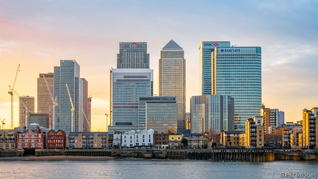

###### Benchmark interest rates

# LIBOR’s administrator proposes an alternative to the doomed rate 

##### Will the idea catch on? 

 

> Jan 24th 2019 

 

IN THE FINANCIAL world, LIBOR is a staggeringly important number. The London Interbank Offered Rate—supposedly the rate at which banks can borrow unsecured from one another—is the benchmark for interest rates on around $260trn-worth of derivatives, loans and more. Over $200trn-worth is in dollars. But the number’s number is up. An ever-thinner underlying market and a rate-fixing scandal have prompted regulators to seek replacements. Britain’s Financial Conduct Authority has told banks that they need no longer supply estimates of their borrowing costs, on which LIBOR is based, after the end of 2021. Regulators everywhere would like markets to switch to overnight interest rates. 

In a paper published on January 24th, ICE Benchmark Administration (IBA), which has produced LIBOR since 2014, says that overnight rates are widely accepted to be well suited to derivatives, which make up the vast bulk of LIBOR-pegged products. But it sets out an alternative that it thinks may be a more fitting substitute in pricing loans. Loans make up a small share of the LIBOR universe, but that is still a large sum. At the end of 2016 between $4trn- and $5trn-worth of American mortgages and business loans had interest rates linked to dollar LIBOR. 

The great advantage of overnight rates lies in the sheer volume of transactions on which they are based. The Federal Reserve, for example, favours the Secured Overnight Financing Rate (SOFR) as a replacement for dollar LIBOR. SOFR measures the cost of borrowing cash overnight using Treasury securities as collateral. Lately volumes have been around $1trn a day. By contrast, the world’s 30 “globally systemically important” banks raise more than $1bn in unsecured one-month and three-month funding on only about one day in two, according to the Alternative Reference Rates Committee, a group convened by the Fed to identify a LIBOR substitute. Some banks’ reports to IBA of their borrowing costs are merely their best guesses. 

IBA’s paper points out that overnight rates lack two of LIBOR’s useful features. First, whereas LIBOR reflects banks’ unsecured funding costs, overnight rates like SOFR are virtually risk-free. Second, overnight rates by definition lack forward-looking term structures—the cost of borrowing for the next three months, say—although regulators are looking into ways of devising them. With LIBOR, term structures are built in. A company with a loan pegged to three-month LIBOR fixes its interest payments three months in advance. 

All this might not matter much if the two moved in near-lockstep: banks and borrowers could simply replace LIBOR with SOFR and adjust the markup. But between mid-2014 and mid-2017 the premium of three-month dollar LIBOR over an average of SOFR ranged from about five to 50 basis points (hundredths of a percentage point). In a crisis overnight rates might fall as investors run for safety, even as banks’ unsecured funding costs go up. Oliver Wyman, a consulting firm, has calculated that in 2000-17 the gap between three-month LIBOR and a proxy for SOFR averaged 36 basis points, but spiked to 460 points in 2008. 

Unlike LIBOR, the proposed new benchmark, the ICE Bank Yield Index (IBYI), is based wholly on transactions. It uses two types: international banks’ unsecured funding rates in the primary market (commercial paper, institutional certificates of deposit and interbank funding); and yields on banks’ bonds of various maturities, implied by trades in the secondary market. Banks have increased their use of the bond market since the financial crisis. 

IBA uses a least-squares regression to estimate a daily yield curve from those data points, showing the rate at which the average bank can expect to raise unsecured funds for different periods. (It gives primary sales, which average $94m each, a much bigger weight than the secondary deals, which average just $3.2m.) One-, three- and six-month benchmark rates can be read from the curve. 

IBA has calculated a preliminary version since the start of 2018, drawing on about 50 primary transactions and 100 bond trades a day. The one-month IBYI averaged 2.03%, just a basis point below LIBOR; the three-month rate, at 2.29%, was three points below. Although IBYI and LIBOR tracked each other fairly closely, outliers in the data caused a couple of gaps of 10-20 points. One question IBA poses is whether to exclude outliers. Since banks and borrowers value stability (and IBA already discards the highest and lowest few rates reported by banks before calculating LIBOR) this makes sense. If the market likes IBYI, IBA expects to launch it in early 2020. 

Of course, IBA has a commercial interest at stake. Market participants pay to use its benchmarks. Regulators will object that IBYI’s transaction base is still only a tiny fraction of that for SOFR. It is untested by crisis. And lenders and borrowers will not be able to disconnect themselves from overnight rates entirely, if they want to hedge their interest payments. 

Yet the index may be a decent answer to the question: what is a good benchmark interest rate for loans? It might even be a possible “fallback” rate for existing LIBOR-linked contracts, including some derivatives, after LIBOR’s demise, soothing a severe legal headache. But these are matters for banks and borrowers to decide. 

-- 

 单词注释:

1.benchmark[]:[计] 基准程序; 基准 

2.administrator[әd'ministreitә]:n. 管理人, 行政官 [经] 遗产管理人员 

3.doom[du:m]:n. 厄运, 不幸, 法律, 宣告, 判决, 死亡 vt. 命中注定, 判决 

4.Jan[dʒæn]:n. 一月 

5.Libor[]:n. (Libor)人名；(法、匈)利博尔 abbr. 伦敦银行间拆放款利率 

6.staggeringly['stæɡərɪŋlɪ]:adv. 难以置信地; 令人震惊地; 摇晃地; 蹒跚地 

7.interbank[,intә'bæŋk]:管排间的, 管束间的 

8.unsecured['ʌnsi'kjuәd]:a. 无担保的 [经] 无担保的 

9.benchmark[]:[计] 基准程序; 基准 

10.derivative[di'rivәtiv]:a. 引出的, 派生的 n. 引出之物, 派生物, 衍生字 

11.underlie[.ʌndә'lai]:vt. 位于...之下, 成为...的基础 

12.regulator['regjuleitә]:n. 调整者, 校准者, 校准器, 调整器, 标准钟 [化] 调节剂; 调节器 

13.replacement[ri'pleismәnt]:n. 归还, 更换, 代替者 [医] 复位, 置换 

14.IBA[i'bɑ:]:伊拜(菲律宾的中型乔木) 

15.mortgage['mɒ:gidʒ]:n. 抵押, 约束性义务, 抵押借款 vt. 抵押, 以...作担保, 把...许给 

16.sheer[ʃiә]:a. 绝对的, 全然的, 纯粹的, 透明的, 峻峭的 vi. 偏转, 偏航 vt. 使急转向, 使偏航 adv. 完全, 全然, 峻峭 n. 偏航 

17.transaction[træn'sækʃәn]:n. 交易, 办理, 学报, 和解协议 [计] 事务处理 

18.sofr[]:索夫尔 

19.treasury['treʒәri]:n. 国库, 宝库, 财政部, 国库券 [经] 库存, 国库, 金库 

20.collateral[kә'lætәrәl]:a. 并行的, 附随的, 旁系的 n. 旁系亲属, 担保品 

21.globally[]:[计] 全局地 

22.systemically[]:全身, 影响全身 

23.convene[kәn'vi:n]:vt. 集合, 召集, 召唤 vi. 聚集, 集合 

24.peg[peg]:n. 钉, 桩, 栓, 藉口, 销子, 借口 vt. 钉木钉, 固定, 限制, 使受约束 vi. 坚持不懈地奋力于, 疾行 

25.borrower['bɒrәuә]:n. 借用人, 剽窃者 [经] 借款人, 借用人 

26.markup['mɑ:kʌp]:n. 涨价, 利润, 标高价 

27.premium['pri:miәm]:n. 额外补贴, 奖金, 奖赏, 保险费 [医] 保险费 

28.hundredth['hʌndrәdθ]:a. 第一百的 

29.investor[in'vestә]:n. 投资者 [经] 投资者 

30.oliver['ɒlivә]:n. 脚踏铁锤 

31.Wyman[]:怀曼（人名） 

32.proxy['prɒksi]:n. 代理, 代理人, 委托书 [经] 代理人, 代表权, 授权书 

33.spike[spaik]:n. 长钉, 鞋钉, 钉状物, 尖峰状物, 穗 vt. 以大钉钉牢, 用尖物刺穿, 阻止, 弃置不用 [计] 尖峰信号 

34.institutional[.insti'tju:ʃәnәl]:a. 制度的, 公共机构的, 学会的 [法] 组织机构的, 制度的, 公共机构的 

35.interbank[,intә'bæŋk]:管排间的, 管束间的 

36.maturity[mә'tjuәriti]:n. 成熟, 完备, 到期 [医] 成熟, 成熟期, 发育期 

37.regression[ri'greʃәn]:n. 退步, 回归 [计] 回归 

38.datum['deitәm]:n. 论据, 材料, 资料, 已知数 [医] 材料, 资料, 论据 

39.outlier['autlaiә]:n. 露宿者 [化] 异常值 

40.participant[pɑ:'tisipәnt]:n. 参加者, 参与者 a. 有份的, 参加的, 参与的 

41.untested[ʌn'testid]:a. 未经试验的, 未经考验的 

42.lender['lendә]:n. 出借人, 贷方 [经] 出借者, 贷方, 贷款人 

43.disconnect[.diskә'nekt]:vt. 使分离, 使不相连, 拆开 vi. 断开 [计] 断开 

44.entirely[in'taiәli]:adv. 完全, 全然, 一概 

45.fallback['fɒ:lbæk]:n. 可依靠的东西, 退却 [计] 撤退 

46.demise[di'maiz]:n. 崩, 薨, 死亡 vt. 让渡, 遗赠, 转让 

47.soothe[su:ð]:vt. 缓和, 使安静, 安慰, 奉承 vi. 起安慰作用 

