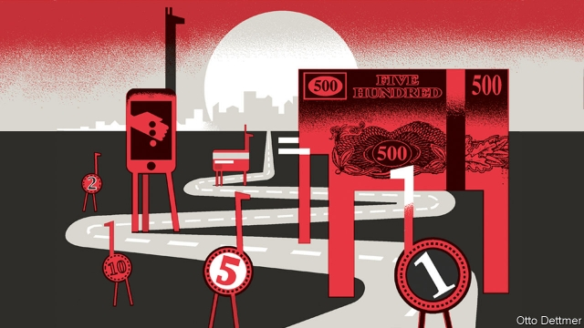

###### The winding road

# Monetary policy in Africa has become more orthodox 

##### But it is still bedevilled by difficulties—including political meddling 

 

> Jan 24th 2019 

 

FOR MORE than a month protesters in Sudan have defied tear-gas and bullets to demand the resignation of Omar al-Bashir, the president. The unrest began with demonstrations against soaring food prices; inflation is above 70%. There is turbulence, too, in Zimbabwe, where the central bank’s “bond notes”, a kind of local dollar, are reviving memories of hyperinflation. Protests broke out on January 14th after the government raised fuel prices. The crackdown was lethal and swift. 

Such crises grab headlines. But they obscure a big shift. In Africa, as in advanced economies, inflation has fallen over the long term. In the 1980s a fifth of countries south of the Sahara endured average annual inflation of at least 20%. This decade only the two Sudans have (the rate in Zimbabwe is tricky to measure). Runaway prices are now the exception, not the rule. 

African countries took different routes to orthodoxy. Inflation is rarely a problem for the 15 in west and central Africa with currencies pegged to the euro. They have imported central-bank credibility from Europe. Elsewhere, monetary policy was reformed in the 1990s under the guidance of the IMF. Governments gave more independence to central banks. Some let exchange rates float. And they stopped printing so much money. In the 1990s central banks in sub-Saharan Africa printed money worth 12% of GDP a year to help finance governments; by 2015 that had fallen to 3%. 

But African central bankers still have a harder task than their rich-world counterparts. Two-fifths of the consumption baskets used to calculate inflation in the region consist of food; for rich countries the average is 15%. When rains fail, food output declines and prices surge. Shocks come from abroad, too, when currencies tumble or import prices spike. High inflation often used to stem from macroeconomic indiscipline. Now, though inflation is in single digits, its trajectory can be harder to control. Pricey power and inefficient farms make inflation hard to cut, says Ernest Addison, the governor of the Bank of Ghana. 

Supply shocks also create a nasty trade-off for monetary policy. In the rich world volatility is often caused by shifts in demand. If the government spends more, that both stimulates output and leads to higher prices. In Africa, by contrast, frequent squeezes on supply mean that inflation and output move in opposite directions. A drought may push up prices while shrinking production. That can mean central banks have to tighten when the economy is in a trough. 

In most of Africa, markets for stocks and bonds are small. Only a fifth of firms have access to a bank loan or formal credit. Monetary policy therefore has a limited impact on financial conditions, and takes effect slowly. It works partly by nudging banks to lend more (or less). An IMF study finds that this effect is only half as strong in Uganda as it is in advanced economies. 

Many countries in the region still set targets for growth in the money supply. But financial innovations such as mobile money mean that the rate at which money changes hands has become unpredictable, snapping the link between monetary aggregates and inflation. Central banks often miss their targets, in ways that can be hard to decipher. They might do better to focus on an explicit inflation target, using interest rates as their main tool. That is easier to communicate to the public, so has more effect. Some countries, including Ghana and Uganda, have already made this switch. 

Some worry that too narrow a focus on prices could stifle development. The typical inflation target in Africa is around 5-8%. Yet studies find that inflation starts to drag on growth in poor countries only when it hits 15-20%. Some economists therefore urge a more flexible approach that places greater weight on other objectives, such as job creation. 

Take the example of Uganda, which has a notoriously hawkish central bank. In 2011, as commodity shocks and an election pushed inflation to 25%, it raised its main interest rate by ten percentage points. Traders shut up shop; businesses laid off workers. The bank was using a hammer to kill a mosquito, says Ramathan Ggoobi of Makerere University Business School. But high inflation helps nobody, retorts Adam Mugume, the head of research at the Bank of Uganda. Constraints such as bad roads and rain-dependent farms limit economic growth to around 6%; above that, the economy overheats and inflation rises. 

Debate about central-bank objectives is healthy. In other ways, however, politics is less helpful. One problem is new laws, such as a cap on commercial-lending rates imposed by the Kenyan parliament in 2016. The move infuriated the country’s central bank, which complains that monetary policy has become less effective as a result. Another political headache is banking supervision, which is typically done by central banks. The Bank of Uganda is mired in lawsuits and official probes after some controversial bank closures. 

Politics also intrudes in a third way: public debt. Many countries’ borrowing has risen sharply in the past decade. Last year the region’s median fiscal deficit was 3.5%, including foreign grants. That revives pressures to turn on the printing presses. All told, there is “growing concern” about African banks’ hard-won autonomy, says Benno Ndulu, a former governor of the Bank of Tanzania. That is a shame. Their task is hard enough as it is. 

-- 

 单词注释:

1.monetary['mʌnitәri]:a. 货币的, 金钱的 [经] 货币的, 金融的 

2.orthodox['ɒ:θәdɒks]:a. 正统的, 传统的, 惯常的 

3.bedevil[bi'devl]:vt. 使痛苦, 使苦恼, 虐待 

4.meddle['medl]:vi. 干涉, 干预, 擅自摸弄 [法] 干预, 插手, 弄乱 

5.Jan[dʒæn]:n. 一月 

6.protester[]:n. 抗议者, 持异议者, 拒付者 [经] 反对者 

7.Sudan[su:'dæn]:n. 苏丹 [化] 苯偶氮间苯二酚; 苏丹 

8.defy[di'fai]:vt. 藐视, 挑衅, 使落空 n. 挑战 

9.omar['әjmɑ:(r)]:n. 奥马尔（男子名） 

10.demonstration[.demәn'streiʃәn]:n. 示范, 实证 [医] 示教, 实物教授 

11.soar[sɒ:]:n. 高扬, 翱翔 vi. 往上飞舞, 高耸, 翱翔 

12.inflation[in'fleiʃәn]:n. 胀大, 夸张, 通货膨胀 [化] 充气吹胀; 膨胀 

13.turbulence['tә:bjulәns]:n. 混乱, 动荡, 骚乱, 紊流 [化] 湍流; 紊流 

14.Zimbabwe[zim'bɑ:bwei]:n. 津巴布韦 

15.revive[ri'vaiv]:vt. 使苏醒, 使复兴, 使振奋, 回想起, 重播 vi. 苏醒, 复活, 复兴, 恢复精神 

16.hyperinflation[,haipәrin'fleiʃәn]:n. 恶性通货膨胀 

17.crackdown['krækdaun]:n. 制裁, 镇压, 痛击 

18.lethal['li:θәl]:a. 致命的 n. 致死因子 

19.grab[græb]:n. 抓握, 掠夺, 强占, 东方沿岸帆船 vi. 抓取, 抢去 vt. 攫取, 捕获, 霸占 

20.Sahara[sә'hɑ:rә]:n. 撒哈拉沙漠 

21.Sudan[su:'dæn]:n. 苏丹 [化] 苯偶氮间苯二酚; 苏丹 

22.tricky['triki]:a. 狡猾的, 机敏的 

23.runaway['rʌnә.wei]:n. 逃跑, 逃走的人, 逃亡, 压倒性的优胜 a. 逃亡的, 逃走的 

24.orthodoxy['ɒ:θәdɒksi]:n. 正统说法, 正教, 信奉正教 

25.inflation[in'fleiʃәn]:n. 胀大, 夸张, 通货膨胀 [化] 充气吹胀; 膨胀 

26.peg[peg]:n. 钉, 桩, 栓, 藉口, 销子, 借口 vt. 钉木钉, 固定, 限制, 使受约束 vi. 坚持不懈地奋力于, 疾行 

27.euro['juәrәu]:n. 欧元（欧盟的统一货币单位） 

28.credibility[.kredi'biliti]:n. 可信用, 确实性, 可靠 [法] 证据能力, 可信程度, 确实性 

29.monetary['mʌnitәri]:a. 货币的, 金钱的 [经] 货币的, 金融的 

30.banker['bæŋkә]:n. 银行家, 庄家 [经] 银行业者, 银行家 

31.counterpart['kauntәpɑ:t]:n. 副本, 复本, 配对物, 相应物 [经] 副本, 正副二份中之一 

32.surge[sә:dʒ]:n. 巨涌, 汹涌, 澎湃 vi. 汹涌, 澎湃, 颠簸, 猛冲, 突然放松 vt. 使汹涌奔腾, 急放 [计] 电压尖峰 

33.spike[spaik]:n. 长钉, 鞋钉, 钉状物, 尖峰状物, 穗 vt. 以大钉钉牢, 用尖物刺穿, 阻止, 弃置不用 [计] 尖峰信号 

34.macroeconomic[-mik]:n. 整体经济 

35.indiscipline[in'disiplin]:n. 无纪律, 未经训练 

36.digit['didʒit]:n. 数字, 位数, 指头 [计] 数位; 位 

37.trajectory[trә'dʒektri]:n. 轨道, 弹道, 轨线 [化] 轨道 

38.pricey['praisi]:a. 昂贵的, 价格高的 

39.erne[ә:n]:n. 白尾海雕 

40.addison['ædisn]:n. 艾迪生（姓氏） 

41.Ghana['gɑ:nә]:n. 加纳 

42.volatility[.vɒlә'tiliti]:n. 挥发性, 挥发度, 轻快, 易变, 短暂 [计] 变更率 

43.tighten['taitn]:vt. 勒紧, 使变紧 vi. 变紧, 绷紧 

44.trough[trɒ:f]:n. 槽, 水槽, 饲料槽 [化] 料槽 

45.nudge[nʌdʒ]:n. 用肘轻推, 推动, 讨厌家伙 

46.les[lei]:abbr. 发射脱离系统（Launch Escape System） 

47.Uganda[ju(:)'^ændә, u:'^ændә]:n. 乌干达 

48.innovation[.inәu'veiʃәn]:n. 改革, 创新 [法] 创新, 改革, 刷新 

49.unpredictable[.ʌnpri'diktәbl]:a. 不可预知的 

50.aggregate['ægrigәt]:n. 合计, 总计, 聚集体 a. 合计的, 聚集的 v. 聚集, 集合, 合计达 [计] 聚合体; 聚集 

51.decipher[di'saifә]:vt. 译解, 解释 n. 密电译文 

52.stifle['staifl]:vt. 使窒息, 抑止, 扼杀 vi. 窒息, 被扼杀 

53.economist[i:'kɒnәmist]:n. 经济学者, 经济家 [经] 经济学家 

54.creation[kri:'eiʃәn]:n. 创造, 创作物, 发明 [化] 产生 

55.notoriously[]:adv. 臭名昭著的, 声名狼藉的 

56.hawkish['hɒ:kiʃ]:a. 像鹰的, 鹰派的, 强硬派的 

57.commodity[kә'mɒditi]:n. 农产品, 商品, 有用的物品 [经] 商品, 货物, 日用品 

58.trader['treidә]:n. 商人, 商船 [经] 交易者, 商船 

59.Ramathan[]:[网络] 斋月 

60.makerere[]: [地名] [乌干达] 马凯雷雷 

61.retort[ri'tɒ:t]:n. 反驳, 顶嘴, 蒸馏器, 曲颈甑 vi. 反驳, 回嘴, 反击 vt. 反击, 反驳, 蒸馏 

62.Adam['ædәm]:n. 亚当 [计] 自动直接存取管理 

63.constraint[kәn'streint]:n. 强制, 约束 [计] 约束 

64.overheat[.әuvә'hi:t]:vt. 使过热 vi. 变得过热 

65.politic['pɒlitik]:a. 精明的, 明智的, 策略的 

66.kenyan['kenjәn]:n. 肯尼亚人 

67.infuriate[in'fjuәrieit]:a. 狂怒的 vt. 激怒 

68.supervision[.sju:pә'viʒәn]:n. 监督, 管理 [经] 监督, 管理 

69.typically['tipikәli]:adv. 代表性地；作为特色地 

70.mire[maiә]:n. 泥沼, 泥泞 vt. 使陷于泥泞, 使陷入困境 vi. 掉进泥坑 

71.lawsuit['lɒ:sju:t]:n. 诉讼 [法] 诉讼, 诉讼案件 

72.probe[prәub]:n. 探索, 调查, 探针, 探测器 v. 用探针探测, 调查, 探索 

73.closure['klәuʒә]:n. 关闭 vt. 使终止 

74.intrude[in'tru:d]:vi. 闯入, 侵入 vt. 强加于 

75.median['mi:diәn]:a. 中央的, 中间的, 正中的 n. 正中动脉, 中位数, 中线 

76.fiscal['fiskәl]:a. 财政的, 国库的 [经] 财政上的, 会计的, 国库的 

77.deficit['defisit]:n. 赤字, 不足额 [医] 短缺 

78.autonomy[ɒ:'tɒnәmi]:n. 自治, 自治权 [医] 自主性 

79.benno[]:n. (Benno)人名；(日)辨野(姓)；(德、西、葡)本诺 

80.Tanzania[.tænzә'ni:ә]:n. 坦桑尼亚 

