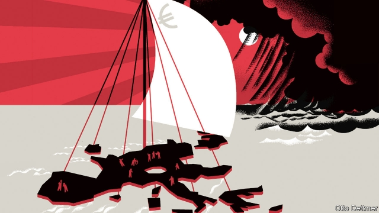
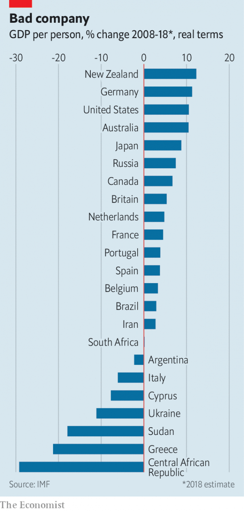

###### Free exchange

# The euro area is back on the brink of recession 

##### After two decades of underperformance, that should not be surprising 

 

> Jan 24th 2019 

 

IT BEGAN AS a joke: the Twitter hashtag #euroboom tacked on to news of any sign, no matter how faint, of a euro-area recovery. By 2017, when French, German and even Spanish GDP grew by more than 2%, it seemed to describe a real phenomenon. Alas, all too quickly #euroboom has turned to #eurogloom. GDP data scheduled for release later this month are likely to confirm that in the final three months of 2018 Italy’s economy contracted for a second consecutive quarter, satisfying one of the technical definitions of a recession. Germany appears to have escaped recession, but only just. The euro area, formed in January 1999, may pass its anniversary on the brink of another downturn. 

The euro has been an economic fiasco. GDP growth in the euro area has lagged behind that in other advanced economies, and in the European Union as a whole, throughout its life—before the financial crisis, during the global recession and its euro-area encore, and even during the recent #euroboom. Perhaps the area would have done as badly without the single currency. But attempts to estimate euro-zone performance relative to a counterfactual world sans euro suggest not. The past decade has been especially brutal. A list of the world’s worst performers in terms of real GDP per person since 2008 contains places suffering geopolitical meltdowns—plus the euro-area periphery. Greece has been outgrown by Sudan and Ukraine. Cyprus and Italy have been beaten by Brazil and Iran; France and the Netherlands by Britain. 

And now the euro area begins its third decade, a new slump looming. It has many causes. German car production slowed as firms worked to meet new emissions standards. Italy’s economy wobbled as its new populist leaders battled with Brussels, spooking markets. Protests threw a wrench in the gears of the French economy. China’s slowdown and straitened global financial conditions took a toll. But although the specific forces dragging down euro-area growth might not have been foreseeable two or three years ago, an eventual return to gloomy form should have been. 

The euro zone’s economies labour under plenty of structural hindrances to growth. But since 2008 their main constraint has been weak demand. After the global crisis growth briefly revived, only to swoon again because of institutional weaknesses. Investors fretted that the European Central Bank (ECB) would not stand behind nationally issued bonds or deposits at nationally insured banks, and panicked accordingly. Fear subsided as European leaders moved grudgingly to create supranational stabilisation mechanisms, allowing the ECB to promise to support national bonds and banks. Growth remained weak, however, despite the ECB’s decision in 2015 to begin an open-ended programme of stimulative bond purchases, like those started elsewhere long before. 

Then came the #euroboom. If reform and ECB action cleared away obstacles to growth, it was demand imported from abroad that rescued the euro area from its doldrums. From 2013 to 2016 net exports contributed substantially to growth; the euro area’s current-account surplus leapt from roughly 1% of GDP to nearly 4%. As a recovery in export industries reduced unemployment, domestic demand played a bigger part in boosting growth. In 2017 and the first half of 2018, consumption contributed more than two percentage points to growth in GDP. Investment chipped in another percentage point. The euro area was lucky. Had China’s government not flooded its economy with stimulus, or had America not supported global production by running vast trade deficits, then the boost to demand needed to put Europeans back to work, and get them spending again, might never have materialised. 

 

That is because Europe’s crisis-era reforms also included draconian measures to limit government borrowing. The price of German support for crisis-addled economies was a revision to the “stability and growth pact”, which is intended to keep budgets in line. The new fiscal compact struck in 2012 requires governments to keep net borrowing to no more than 3% of GDP. Though that may not seem particularly onerous, it also requires them to maintain a structural budget deficit (adjusted to take account of the business cycle) of no more than 1% of GDP if debt is “significantly” below 60% of GDP, and no more than 0.5% of GDP if debt is above that level. Governments with debt above 60% must also take steps to bring it back below that threshold; those approaching it can no doubt expect stern warnings. Countries in egregious violation of these rules are subject to penalties. In Italy, which has public debt of around 130% of GDP, populists were carried into office by frustration with the status quo, but cowed into budget sobriety last year after the EU threatened to impose such penalties. 

In effect, Europe has denied governments the ability to use their budgets to boost demand. These fiscal shackles would be less worrying if the ECB were better positioned to boost private spending by easing monetary policy. But its effective interest rate is already negative. The slowdown in 2018 came despite the ECB asset purchases continuing, albeit more slowly than in 2016 and 2017. Foreign spending could keep the euro-area economic engine turning over. But it is fickle, as the currency bloc is learning. It was only a matter of time until an ill wind caused the euro area’s sails to slacken, exposing its inability to maintain domestic demand without external help. The shift from boom to gloom was inevitable. 

It need not be permanent. Europe could loosen its fiscal restraints. Better still, it could make use of its combined fiscal potential by mutualising some debt and creating a euro-area budget big enough to offer meaningful stimulus. These reforms would require a big shift in the balance of power and thinking within Europe. Such shifts have occurred before, in the throes of crisis. But if the past ten years of #eurogloom did not demonstrate the pressing need to maintain an array of demand-boosting tools, it is difficult—and frightening—to contemplate what ultimately will. 

-- 

 单词注释:

1.euro['juәrәu]:n. 欧元（欧盟的统一货币单位） 

2.brink[briŋk]:n. 边缘, 陡岸 

3.recession[ri'seʃәn]:n. 后退, 凹处, 衰退, 归还 [医] 退缩 

4.underperformance[]: 新股弱势 

5.Jan[dʒæn]:n. 一月 

6.twitter['twitә]:n. 啁啾, 唧唧喳喳声 vi. 啭, 啁啾, 颤抖 vt. 嘁嘁喳喳地讲, 抖动 

7.hashtag['hæʃtæg]:n. 井号(#)标签（微博twitter中用来标注线索主题的标签） 

8.tack[tæk]:n. 平头钉, 大头钉, 粗缝针脚, 行动方针, 食物 vt. 以大头针钉住, 附加 

9.ala['eilә]:n. 翼, 翅 [化] 丙氨酸 

10.quickly['kwikli]:adv. 很快地 

11.consecutive[kәn'sekjutiv]:a. 连续的, 联贯的 [计] 连续的; 连接的 

12.downturn['dauntә:n]:n. (尤指经济方面的)衰退, 下降趋势 [电] 低迷时期 

13.encore[ɒŋ'kɒ:]:n. 再演唱的要求, 要次登场 interj. 再演唱一次 vt. 要求再演(或唱) 

14.counterfactual[,kajntә'fæktʃjәl]:a. [逻]反事实的( 指在不同条件下有可能发生但违反现存事实的) 

15.brutal['bru:tәl]:a. 残忍的, 野蛮的, 不讲理的 

16.geopolitical[,dʒi(:)әupә'litikәl]:[计] 地理的 

17.periphery[pә'rifәri]:n. 外围, 边缘地区, 圆周 [医] 外周, 周围 

18.outgrow[.aut'grәu]:vt. 过大而不适于, 长得比...高(或大、快), 成长得不再具有... 

19.Sudan[su:'dæn]:n. 苏丹 [化] 苯偶氮间苯二酚; 苏丹 

20.ukraine[ju(:)'krein]:n. 乌克兰（原苏联一加盟共和国, 现已独立） 

21.Cyprus['saiprәs]:n. 塞浦路斯 [经] 赛浦路斯 

22.Brazil[brә'zil]:n. 巴西 

23.Iran[i'rɑ:n]:n. 伊朗 

24.Netherlands['neðәlәndz]:n. 荷兰 

25.slump[slʌmp]:n. 暴跌, 垂头弯腰的姿态 vi. 猛然掉落, 陷入, 衰落(经济等) 

26.loom[lu:m]:n. 织布机, 若隐若现的景象 vi. 朦胧地出现, 隐约可见, 可怕地出现 

27.emission[i'miʃәn]:n. 发射, 射出, 发行 [医] 发射, 遗精 

28.wobble['wɒbl]:n. 摆动, 摇晃, 不稳定, 抖动 vi. 摇晃, 摇摆, 游移不定 vt. 使摇摆, 使颤动 

29.Populist['pɔpjulist]:n. 民粹派的成员 

30.Brussel[]:n. 布鲁塞尔（比利时首都） 

31.spook[spu:k]:n. 幽灵, 鬼 vt. 惊吓, 鬼怪般地出没 vi. 惊吓而逃窜, 受惊 

32.wrench['rentʃ]:n. 扳钳, 扳手, 扭伤, 歪曲, 痛苦 vt. 猛扭, 扭伤, 曲解, 折磨 vi. 猛扭, 猛绞 

33.slowdown['slәudaun]:n. 降低速度, 减速 

34.straiten['streitn]:vt. 使为难, 使穷困, 限制 

35.toll[tәul]:n. 通行费, 代价, 钟声 vt. 征收, 敲钟, 鸣钟, 勾引, 引诱 vi. 征税, 鸣钟 

36.foreseeable['fɒ:'si:әbl]:a. 可预知的, 能预测的 [法] 可预见的, 可预料的 

37.eventual[i'ventʃuәl]:a. 最后的, 终于的 

38.hindrance['hindrәns]:n. 妨害, 障碍, 阻碍物 

39.constraint[kәn'streint]:n. 强制, 约束 [计] 约束 

40.briefly['brifli]:adv. 简短地, 扼要地, 简明地, 简单地 

41.revive[ri'vaiv]:vt. 使苏醒, 使复兴, 使振奋, 回想起, 重播 vi. 苏醒, 复活, 复兴, 恢复精神 

42.swoon[swu:n]:n. 昏晕, 晕厥 vi. 昏晕, 着迷, 渐渐消失 

43.institutional[.insti'tju:ʃәnәl]:a. 制度的, 公共机构的, 学会的 [法] 组织机构的, 制度的, 公共机构的 

44.investor[in'vestә]:n. 投资者 [经] 投资者 

45.fret[fret]:n. 烦躁, 磨损, 焦急, 网状饰物 vi. 烦恼, 不满, 磨损 vt. 使烦恼, 腐蚀, 使磨损, 使起波纹 

46.ECB[]:[计] 事件控制块 

47.nationally['næʃәnәli]:adv. 作为整个民族, 举国一致地, 全国性地 

48.panick[]:v. 恐慌, 使（受惊） 

49.subside[sәb'said]:vi. 沉淀, 沉降, 平息 

50.grudgingly['grʌdʒiŋli]:adv. 勉强地；不情愿地 

51.supranational[.sju:prә'næʃәnәl]:a. 超国家的 

52.stabilisation[ˌsteɪbɪlaɪ'zeɪʃən]: 稳定 

53.mechanism['mekәnizm]:n. 机械, 机构, 结构, 机理, 技巧 [化] 机理; 历程; 机构 

54.stimulative['stimjulәtiv]:n. 刺激, 促进因素 a. 刺激的, 促进的 

55.doldrum['dɒldrəm]: [医]赤道无风带 

56.substantially[sәb'stænʃәli]:adv. 实质上, 本质上, 大体上 

57.chip[tʃip]:n. 屑片, 薄片, 碎片 vt. 削, 切, 削成碎片, 使摔倒, 凿 vi. 削下屑片 [计] 孔屑; 组件; 晶片; 芯片 

58.stimulus['stimjulәs]:n. 刺激, 激励, 刺激品 [医] 刺激特, 刺激 

59.deficit['defisit]:n. 赤字, 不足额 [医] 短缺 

60.materialise[mә'tiәriәlaiz]:vi.vt. (使)物质化, (使)具体化, (使)追求物质利益, (使)显形, 成为事实, 实现 vi. 突然出现 

61.draconian[drә'kәjniәn]:a. 严厉的, 残酷的 

62.pact[pækt]:n. 契约, 协定, 条约 [化] 合同 

63.fiscal['fiskәl]:a. 财政的, 国库的 [经] 财政上的, 会计的, 国库的 

64.compact[kәm'pækt]:a. 紧凑的, 紧密的, 简洁的 vt. 使紧密结合, 压缩 vi. 变坚实 

65.onerous['ɒnәrәs]:a. 繁重的, 负有法律责任的 [法] 负有义务的, 艰巨的, 繁重的 

66.significantly[]:adv. 值得注目地；意味深长地 

67.threshold['θreʃәuld]:n. 门槛, 入口, 开端, 阈 [计] 阈; 阈值 

68.egregious[i'gri:dʒiәs]:a. 异乎寻常的, 过分的, 惊人的 

69.violation[.vaiә'leiʃәn]:n. 违反, 违背, 妨碍 [法] 违犯, 违背, 违反 

70.penalty['penәlti]:n. 处罚, 刑罚, 罚款, 罚球, 报应, 不利结果, 妨碍 [经] 罚金(款), 违约金 

71.frustration[frʌs'treiʃәn]:n. 挫折, 顿挫 [医] 挫折 

72.statu[]:[网络] 状态查看；雕像；特级雪花白 

73.quo[]:vt. [古]说 

74.sobriety[sә'braiiti]:n. 节制饮酒, 戒酒, 节制, 一本正经, 庄重 

75.shackle['ʃækl]:n. 桎梏, 束缚物 vt. 加枷锁, 束缚 

76.les[lei]:abbr. 发射脱离系统（Launch Escape System） 

77.monetary['mʌnitәri]:a. 货币的, 金钱的 [经] 货币的, 金融的 

78.albeit[ɔ:l'bi:it]:conj. 尽管, 虽然 

79.fickle['fikl]:a. 变幻无常的, 浮燥的, 薄情的 

80.bloc[blɒk]:n. 集团 

81.slacken['slækәn]:vt. 使松弛, 放松, 放慢 vi. 变松弛, 减弱, 松劲 

82.inability[.inә'biliti]:n. 无能, 无力 

83.gloom[glu:m]:n. 忧郁, 暗处, 幽暗 vi. 变忧沉, 变黑暗 vt. 使忧郁, 使黑暗 

84.mutualising[tjʊtʃʊəlaɪz]:vt. 使互相（等于mutualize） vi. 使互相（等于mutualize） 

85.meaningful['mi:niŋful]:a. 意味深长的 

86.throe[θrәu]:n. 剧痛, 阵痛 [医] 剧痛 

87.array[ә'rei]:n. 排列, 衣服, 大批, 军队 vt. 布署, 打扮, 排列 [计] 数组; 阵列 

88.contemplate['kɒntempleit]:vt. 注视, 沉思, 盘算 vi. 冥思苦想 

