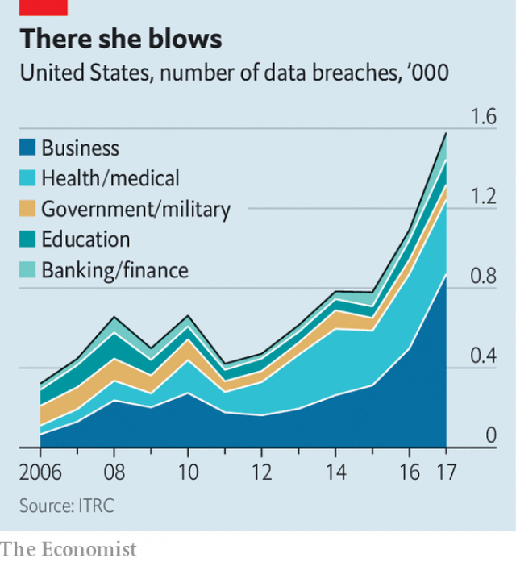

###### Black swans and fat tails

# The market for cyber-insurance is growing 

##### But computer risks are harder to handle than physical ones 

 

> Jan 24th 2019 

 

IT SOUNDS AS if it was named by a seven-year-old boy and looks like a film set. Housed in a sleek black truck, IBM’s “X-Force Command Cyber Tactical Operations Centre” travels from city to city, simulating the experience of falling victim to a cyber-attack. Rows of desks sport monitors and keyboards in a room dominated by three giant video-screens. A control room houses server equipment that allows IBM’s staff to simulate a corporate network—and then throw all manner of digital mischief at it. Teenagers “understand what’s going on straight away”, says Caleb Barlow, who runs the show. Board members at big companies enjoy a visit, too: “It’s so different from what they usually do.” 

But their interest is not merely recreational. Companies are increasingly worried about the threats lurking in their computer systems. A survey in 2018 by KPMG and Harvey Nash, a firm of headhunters, found that only a fifth of IT bosses thought their firm was well prepared for an attack. 

That gloomy assessment is borne out by high-profile hacks. In November Starwood, a hotel chain owned by Marriott International, reported that half a billion customer records had been stolen. Magecart, a hacker group, is the chief suspect in the theft of the credit-card information of customers of Ticketmaster, an American firm, Newegg, a computer retailer, and British Airways. In 2017 WannaCry and NotPetya, two malware programs, scrambled files in organisations across the world. Maersk, a Danish shipping firm, said it had suffered costs of $300m. Snafus can be as damaging as attacks. In April TSB, a British bank, botched a computer upgrade and locked millions of customers out of their accounts. 

Such mishaps are feeding a fast-growing market for specialist cyber-insurance. Solid numbers are in short supply, but Munich Re, a reinsurer, reckons that a market that wrote $4bn of premiums in 2018 could be writing $8bn-9bn by 2020. Rob Smart of Mactavish, a firm that works with big British insurers, says that “almost all” the firms’ clients have inquired about cyber-insurance in the past couple of years. Insurers are scrambling to hire scarce specialists. Two former directors of GCHQ, Britain’s electronic-spying organisation, have found jobs advising the industry. 

The market is most developed in America, says Robert Hannigan, one of those ex-GCHQ bosses, thanks in part to Californian laws passed in 2003 that compel firms to confess to large data breaches. These have been copied by other states. But Europe is catching up, says Joseph Ahern of the Association of British Insurers, partly because of privacy and reporting laws that are now stricter than America’s. The need for robust insurance will only grow as companies become more reliant on computers, hackers get more cunning and regulators take an increasingly dim view of lax security. But the unique nature of cyber-risks makes them hard for the insurance industry to handle. In the worst case, they could blow up the nascent market altogether. 

The policies on offer so far tend to vagueness, says Mr Smart, and vary widely regarding which risks are covered. That makes companies skittish, he says, and some big clients have decided not to buy insurance as a result. As the industry matures, no doubt policies will become clearer and more standard. But other problems are potentially longer-lasting. 

 

That of working out who was behind a particular hack has already made the news. Mondelez, an American food company hit by the NotPetya malware, is suing Zurich, a big insurance firm, for refusing to pay out under a general insurance policy. Zurich cites an exclusion clause for losses related to war, on the ground that the NotPetya attack is thought to have been carried out by Russia. Even a technologically sophisticated government would have trouble proving such a claim to the standard demanded by a court, says Andrew Coburn of Risk Management Solutions, a consultancy. But if Zurich does win, it could cast a chill across the entire market—unless insurers accept that cyber-insurance may involve shouldering the sorts of risks they have previously sought to avoid. 

At the same time, cyber-security risks are inherently tricky to price. All software contains bugs, some of which will cause security weaknesses. But many lurk unknown until a hacker starts exploiting them. Cyber-risks are so new that insurers have only limited data, and the pace of technological change means that what they have quickly goes stale. “In a flood, we know the ways in which water can damage things,” says Shannan Fort of Aon, an insurance broker. “And that’s not likely to change in the next five to ten years. But the way we use technology has changed fundamentally just over the past decade.” 

Perhaps the biggest difficulty for insurers is that the risks posed by cyber-attacks are not independent of each other. If an oil refinery in Texas floods, that does not mean one in Paris is any more likely to do so. Insurers build that independence into their risk models, and depend upon it in their calculations of the maximum they may have to pay out in a single year. But a newly found flaw in software can make all users vulnerable simultaneously. Insurers fret that a single big attack could hit many of their clients at once. In the worst case, the value of claims might be more than they could meet. 

The WannaCry malware of 2017 illustrates the point. Armed with a software vulnerability stolen from the National Security Agency, GCHQ’s American counterpart, it infected a quarter of a million computers in 150 countries in just a few days. Its spread was slowed only by luck. Marcus Hutchins, a security researcher later arrested on an unrelated matter, gained access to the malware’s control system that allowed him to shut it off. Whether the industry can figure out a way to deal with such “risk aggregation” is an open question. As one insider says, it “sort of breaks the whole concept of insurance a bit”. 

-- 

 单词注释:

1.Jan[dʒæn]:n. 一月 

2.sleek[sli:k]:a. 光滑的, 油嘴滑舌的, 线条明快的, 圆滑的, 时髦的 vt. 使光滑, 掩盖 vi. 打扮漂亮, 滑动 

3.cyber['saibә]:a. 网络的, 计算机的 

4.tactical['tæktikl]:a. 战术的, 用兵上的, 策略的 

5.simulate['simjuleit]:vt. 模拟, 假装, 模仿 [法] 伪装的, 模拟的; 假装的, 伪装的, 冒充 

6.server['sә:vә]:n. 服伺者, 上菜用具, 发球员 n. 服务器 [计] 服务器, 服务器启动程序, 服务台程序 

7.corporate['kɒ:pәrit]:a. 社团的, 合伙的, 公司的 [经] 团体的, 法人的, 社团的 

8.mischief['mistʃif]:n. 损害, 伤害, 灾祸, 恶作剧, 淘气 [法] 损害, 伤害, 危害 

9.caleb['kælәb]:n. 迦勒（男子名）；卡莱布（手表品牌）；“天狗”发射装置 

10.Barlow['bɑ:lәu]:n. 巴洛刀(一种坚实而廉价的单面小折刀, 亦作 barlow knife) 

11.recreational[.rekri'eiʃәnәl]:a. 消遣的, 娱乐的 

12.lurk[lә:k]:n. 潜伏, 潜行 vi. 暗藏, 潜伏, 埋伏 [计] 隐匿阅读 

13.KPMG[]:abbr. 毕马威会计事务所 

14.harvey['hɑ:vi]:n. 哈维（男子名） 

15.nash[næʃ]:n. 纳什（姓氏） 

16.headhunter['hedhʌntә]:n. (原始社会中)猎取人头者, 物色人才的人 

17.hack[hæk]:n. 劈, 砍, 砍痕, 出租车, 干咳, 晒架, 鹤嘴锄 vt. 劈, 砍, 出租, 用旧 vi. 劈, 砍, 干咳, 驾驶出租车 a. 出租的 

18.starwood[]:喜达屋国际酒店集团 

19.Marriott[]:n. 马里奥特（美国第二大宴会承包商） 

20.hacker['hækә]:[计] 计算机窃贼, 计算机新技术挑战者, 黑客 

21.ticketmaster[]:[网络] 票务世界；票务大师；特玛捷票务 

22.retailer['ri:teilә]:n. 零售商人, 传播的人 [经] 零售商 

23.airway['єәwei]:n. 空中航线, 风道 [医] 导气管 

24.malware[]:n. 恶意软件; 恶意软件。malware是malicious software的合成形式; 流氓软件 

25.scramble['skræmbl]:n. 攀缘, 爬行, 抢夺, 混乱, 紧急起飞 vi. 攀缘, 杂乱蔓延, 争夺, 拼凑, 匆忙 vt. 攀登, 扰乱, 使混杂 

26.organisation[,ɔ: ^әnaizeiʃən; - ni'z-]:n. 组织, 团体, 体制, 编制 

27.maersk[]:n. 马士基 

28.Danish['deiniʃ]:n. 丹麦文 a. 丹麦的, 丹麦人的, 丹麦文的 

29.snafu[snæ'fu:]:a. 一团槽的, 大混乱的 vt. 使混乱, 使一团槽 n. 混乱 

30.TSB[]:abbr. 信托储蓄银行（Trustee Savings Bank）；技术通报（Technical Service Bulletin）；推力舱增压器（Thrust Section Blower） 

31.botch[bɒtʃ]:v. 拙笨地修补, 糟蹋 n. 拙笨的修补, 难看的补缀 

32.upgrade['ʌpgreid]:n. 上坡, 升级, 上升 adv. 往上 vt. 使升级, 提升, 改良品种 vi. 升级 [计] 升级 

33.mishap['mishæp]:n. 不幸之事, 灾祸, 恶运 

34.Munich['mju:nik]:n. 慕尼黑 

35.re[ri:]:prep. 关于 n. 不动产, 房地产 [计] 赖斯编码 

36.reinsurer[]:n. 再保险人；分保接受人 

37.reckon['rekәn]:vt. 计算, 总计, 估计, 认为, 猜想 vi. 数, 计算, 估计, 依赖, 料想 

38.premium['pri:miәm]:n. 额外补贴, 奖金, 奖赏, 保险费 [医] 保险费 

39.mactavish[]:n. [姓氏]麦克塔威士; [人名] 麦克塔维什 

40.insurer[in'ʃuәrә]:n. 保险公司 [法] 保险人, 承保人, 保险公司 

41.client['klaiәnt]:n. 客户, 顾客, 委托人 [计] 客户, 客户机, 客户机程序 

42.GCHQ[]:abbr. Government Communications Headquarters 国家通信总局( 

43.Robert['rɔbәt]:[法] 警察 

44.Hannigan[]:n. (Hannigan)人名；(英)汉尼根 

45.Californian[.kæli'fɒ:njәn]:n. 加利福尼亚州人 a. 加利福尼亚的 

46.datum['deitәm]:n. 论据, 材料, 资料, 已知数 [医] 材料, 资料, 论据 

47.breach[bri:tʃ]:n. 裂口, 违背, 破坏, 违反, 突破, 破裂 vt. 攻破, 突破 vi. 跳出水面 

48.Joseph['dʒәuzif]:n. 约瑟夫（男子名）；约瑟（圣经中雅各的第十一子） 

49.Ahern[]:n. (Ahern)人名；(西)阿埃伦；(英)埃亨 

50.privacy['praivәsi]:n. 隐私, 隐居, 秘密 [计] 个人保密权 

51.robust[rәu'bʌst]:a. 健康的, 强健的, 要用力气的, 坚定的, 粗野的 [计] 健壮性 

52.reliant[ri'laiәnt]:a. 依赖的, 信赖的 

53.regulator['regjuleitә]:n. 调整者, 校准者, 校准器, 调整器, 标准钟 [化] 调节剂; 调节器 

54.lax[læks]:a. 松的, 不严格的, 腹泻的, 松弛的 n. 腹泻, 松元音 

55.nascent['næsnt]:a. 发生中的, 开始存在的, 初期的 [医] 初发的, 初生的 

56.vagueness['veignis]:n. 含糊, 暧昧 

57.skittish['skitiʃ]:a. 易惊的, 轻佻的, 三心二意的, 不可靠的, 羞怯的, 活泼的, 爱蹦跳的, 活跃的 

58.potentially[pә'tenʃәli]:adv. 可能地, 潜在地 

59.Mondelez[]:[网络] 蒙大利兹；蒙迪里斯 

60.sue[su:]:vt. 控告, 起诉, 请求 vi. 提出诉讼, 提出请求 

61.Zurich['zuәrik]:n. 苏黎士 

62.cite[sait]:vt. 引用, 引证, 表彰 [建] 引证, 指引 

63.exclusion[ik'sklu:ʒәn]:n. 排除, 除外, 逐出 [医] 排除, 除外, 分离术 

64.clause[klɒ:z]:n. 子句, 条款 [计] 子句 

65.technologically[teknә'lɔdʒikәli]:adv. 技术上地；科技地 

66.sophisticate[sә'fistikeit]:n. 久经世故的人, 精于...之道的人 vt. 篡改, 曲解, 使变得世故, 掺合, 弄复杂 vi. 诡辩 

67.andrew['ændru:]:n. 安德鲁（男子名） 

68.Coburn[]:n. (Coburn)人名；(英、西)科伯恩 

69.consultancy[]:n. 商量, 协商, 磋商, 会诊, 与...商量, 咨询, 请教, 找(医生)看病, 查阅, 考虑 [经] 咨询业务, 咨询服务 

70.inherently[in'hiәrәntli]:adv. 内在地, 生来地, 固有地 [计] 固有的 

71.tricky['triki]:a. 狡猾的, 机敏的 

72.bug[bʌg]:n. 错误, 虫, 病菌, 缺陷, 窃听器, 癖好, 防盗报警器, 双座小汽车, 要人 vt. 装防盗报警器, 装窃听器, 激怒 vi. 捉虫, 暴突 [计] 缺点, 错误 

73.technological[.teknә'lɒdʒikl]:a. 技术的 [经] 工艺的, 技术的 

74.quickly['kwikli]:adv. 很快地 

75.shannan[]:n. (Shannan)人名；(阿拉伯)尚南 

76.fort[fɒ:t]:n. 堡垒, 要塞, 易货站 vt. 设要塞保卫 vi. 设要塞 

77.aon[]:[经] 全部 

78.broker['brәukә]:n. 掮客, 经纪人 [经] 经纪人, 掮客 

79.fundamentally[fʌndә'mentәli]:adv. 基础, 首要, 主要, 十分重要, 基本, 根本, 原始, 基频, 基音, 基谐波 

80.refinery[ri'fainәri]:n. 精炼厂 [化] 精炼厂炼糖厂 

81.Texas['teksәs]:n. 德克萨斯 

82.flaw[flɒ:]:n. 缺点, 裂纹, 瑕疵, 一阵狂风 [化] 划痕; 裂缝; 裂纹 

83.vulnerable['vʌlnәrәbl]:a. 易受伤害的, 有弱点的, 易受影响的, 脆弱的, 成局的 [医] 易损的 

84.simultaneously[simәl'teiniәsly; (?@) saim-]:adv. 同时发生, 一齐, 同时, 同时存在 

85.fret[fret]:n. 烦躁, 磨损, 焦急, 网状饰物 vi. 烦恼, 不满, 磨损 vt. 使烦恼, 腐蚀, 使磨损, 使起波纹 

86.vulnerability[.vʌlnәrә'biliti]:n. 易受伤, 易受责难, 易受伤部位 [医] 易损性 

87.counterpart['kauntәpɑ:t]:n. 副本, 复本, 配对物, 相应物 [经] 副本, 正副二份中之一 

88.Marcus['mɑ:kәs]:n. 马库斯（男子名） 

89.hutchin[]: [人名] 哈钦 

90.unrelated[]:[法] 无关的 

91.aggregation[ægri'geiʃәn]:n. 集合, 聚合, 集合体 [化] 聚集; 聚集作用 

92.insider['in'saidә]:n. 内部的人, 权威人士, 知道内情的人 [经] 熟悉内情者 

