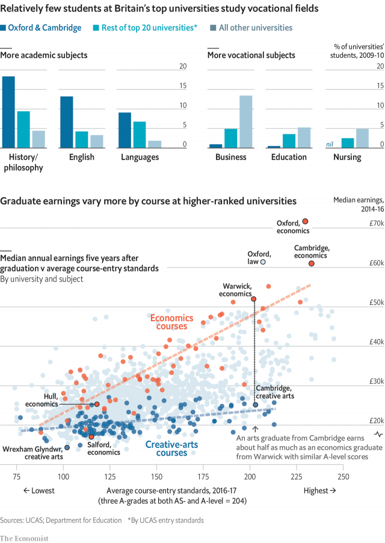

###### British universities

# The cost of studying the arts at Oxbridge 

##### High-scoring students leave £500,000 on the table by eschewing economics 

 

> Jan 26th 2019 

 

SCEPTICS OF HIGHER education often complain that universities offer too many frivolous degrees with little value in the workplace. Since elite universities tend to produce higher-earning graduates than less selective institutions do, you might expect them to teach more practical courses. Yet data from Britain’s department for education show the opposite. Undergraduate students at prestigious universities are more likely to study purely academic fields such as philosophy and classics, whereas those at less choosy ones tend to pick vocational topics such as business or nursing. 

What could explain this seeming contradiction? One reason is that employers treat a degree from a top university as a proxy for intelligence. This means that students at elite institutions can study bookish subjects and still squeak by financially. The median Cambridge graduate in a creative-arts subject—the university’s least lucrative group of courses, including fields such as music—earns around £25,000 ($32,400) at age 26. Economics students from less exalted universities, such as Hull, make a similar amount. 

Yet even though Oxbridge students can pretend to read “Ulysses” for years and still expect a decent salary, they end up paying a large opportunity cost by pursuing the arts. That is because employers reserve the highest starting wages for students who both attended a leading university and also studied a marketable subject. Cambridge creative-arts graduates earn £11,000 more at age 26 than do those from Wrexham Glyndwr University, whose arts alumni are the lowest-earning in Britain. In contrast, Cambridge economics graduates make £44,000 more than do those from the University of Salford, where the economics course is the country’s least remunerative. 

Many gifted arts students would struggle to crunch numbers. But for those who can excel at both, the cost of sticking with the arts, in terms of forgone wages, is steep. Cambridge creative-arts students have A-level scores close to those of economics students at Warwick, but earn about half as much. That is tantamount to giving up an annuity worth £500,000. 

Who can afford such indulgence? The answer is Oxbridge students, who often have rich parents. At most universities, students in courses that lead to high-paying jobs, such as economics and medicine, tend to come from wealthier families, partly because such applicants are more likely to have the examination scores necessary to be accepted. At Oxbridge, however, no such correlation exists. History and philosophy students there come from richer parts of Britain, on average, than their peers studying medicine do. 

-- 

 单词注释:

1.Oxbridge['ɔksbridʒ]:n. 牛津和剑桥大学, 牛津或剑桥大学 

2.eschew[is'tʃu:]:vt. 避开, 远避 

3.Jan[dʒæn]:n. 一月 

4.sceptic['skeptik]:n. 怀疑论者 

5.frivolous['frivәlәs]:a. 轻佻的, 妄动的, 琐碎的 [法] 轻薄的, 轻浮的, 无意义的 

6.elite[ei'li:t]:n. 精华, 精锐, 中坚分子 

7.les[lei]:abbr. 发射脱离系统（Launch Escape System） 

8.selective[si'lektiv]:a. 选择的, 选择性的 [经] 选择的, 选择性的 

9.datum['deitәm]:n. 论据, 材料, 资料, 已知数 [医] 材料, 资料, 论据 

10.prestigious[pre'stidʒiәs]:a. 享有声望的 

11.choosy['tʃu:zi]:a. 慎重选择的, 好挑剔的 

12.vocational[vәu'keiʃәnl]:a. 职业的 [法] 职业上的, 天职的 

13.proxy['prɒksi]:n. 代理, 代理人, 委托书 [经] 代理人, 代表权, 授权书 

14.bookish['bukiʃ]:a. 好读书的, 书呆子的 

15.squeak[skwi:k]:n. 吱吱声, 侥幸 vi. 吱吱叫, 告密, 侥幸成功 vt. 以短促尖声发出 

16.financially[]:adv. 金融上；财政上 

17.median['mi:diәn]:a. 中央的, 中间的, 正中的 n. 正中动脉, 中位数, 中线 

18.Cambridge['keimbridʒ]:n. 剑桥 

19.lucrative['lu:krәtiv]:a. 有利益的, 获利的, 合算的 

20.exalt[ig'zɒ:lt]:vt. 提升, 提高, 赞扬, 使得意 vi. 使人兴奋, 使人得意 

21.hull[hʌl]:n. 壳, 皮, 船体 vt. 去壳 

22.ulysses[ju(:)'lisi:z]:n. 尤里西斯（希腊神话中男子名, 也是爱尔兰意识流文学作家詹姆斯·乔伊斯小说名） 

23.marketable['mɑ:kitәbl]:a. 可销售的, 销路好的, 市场的 [经] 有销路的, 可销售的 

24.Wrexham[]:n. 雷克瑟姆 (英国国会选区) 

25.glyndwr[]: [人名] 格林杜尔 

26.alumni[ә'lʌmni]:pl. 男毕业生, 男校友 

27.Salford['sɔ:lfәd,'sɔl-]:索尔福德[英国英格兰西北部港市] 

28.remunerative[ri'mju:nәreitiv]:a. 有报酬的, 有利可图的, 合算的 

29.crunch[krʌntʃ]:v. 嘎吱嘎吱的咬嚼, 压碎, 嘎吱嘎吱地踏过 n. 咬碎, 咬碎声 

30.excel[ik'sel]:vt. 胜过, 优于, 擅长 vi. 胜过其他 

31.forgo[fɒ:'gәu]:vt. 摒绝, 放弃 

32.warwick['wɔrik]:n. 沃里克（英国英格兰中部沃里克郡城市）；沃里克（美国罗德岛州东部城市, 为纺织业中心）；沃里克（姓氏） 

33.tantamount['tæntәmaunt]:a. 同等的, 相等的, 相当于...的 [法] 相等的, 相当的, 同等的 

34.annuity[ә'nju:iti]:n. 年金, 年金保险, 年金领受权 [医] 年金, 年俸 

35.correlation[.kɒrә'leiʃәn]:n. 相互关系, 相关, 关联 [医] 相关, 联系 

36.peer[piә]:n. 同等的人, 匹敌, 贵族 vi. 凝视, 窥视, 费力地看, 隐现 vt. 与...同等, 封为贵族 

