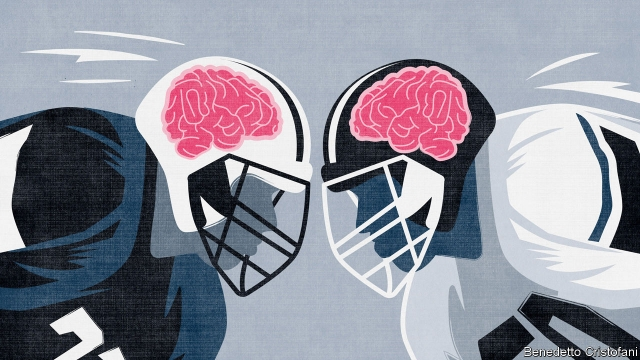
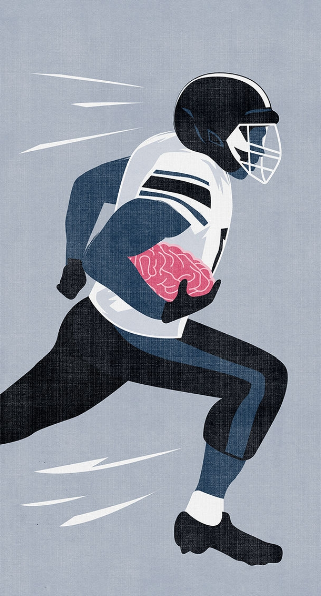

###### Knocking heads together

# Few sports are doing enough to protect athletes from brain damage 

##### Small rule changes can reduce concussions in rugby and American football 

 

> Jan 24th 2019 

 

FANS OF LARGE men colliding with one another are in luck. Next weekend the Six Nations, a rugby contest for the best teams in Europe, gets going in Paris. Two days later the Super Bowl kicks off in Atlanta. Some 115 cameras will beam the final of the National Football League (NFL) to fans around the world, along with advertisements urging viewers to drink beer and eat nachos. It is not a time for healthy living. Yet there is growing awareness that it is not just gluttonous fans who suffer. Contact sports can lead to serious health problems for the players, too. 

An occasional broken limb is an accepted, if unfortunate, part of such games. The big worry is about what they do to the brain. In 2017-18 some 291 concussions were reported in the NFL, the highest number since records began six years ago. The same year English rugby union recorded 18 concussions per 1,000 hours of play, almost one a match, and three times as many as five years earlier. In December last year, Nicolas Chauvin, an 18-year-old rugby player for Stade Francais’s youth team, was killed when a tackle went wrong. He was one of at least four rugby players to die from head injuries in 2018. L’Equipe, a French newspaper, reached a simple conclusion: “Rugby kills”. 

Even when contact sports do not kill, they can still do grave damage. A study in 2017 of 111 deceased NFL players found that 110 had chronic traumatic encephalopathy (CTE), a degenerative disease that may cause erratic behaviour, memory loss and depression, and can be diagnosed definitively only after death. The study was self-selecting because families nominated deceased relatives with symptoms of the disease. But evidence from it and from analysis of collisions in the NFL suggests that 20-45% of professional American footballers may sustain CTE during their careers, a far higher proportion than among the general population, says Thomas Talavage of Purdue University. Last year a study found that retired rugby-league players aged 40 to 65 had significantly worse reaction times and overall cognitive performance than others their age. Suffering a severe concussion also increases an individual’s chance of getting dementia later in life. 

Nevertheless, the rise in reported concussions is not all bad news. Since 2001, when medics ironed out the injury’s definition, there have been improvements in how potential concussions are dealt with. Rather than stoically carrying on, players are more willing to admit to concerns about their heads. Michael Turner of the International Concussion and Head Injury Research Foundation says this is crucial because concussion is far harder to diagnose than most physical injuries, and second impacts—when a player is hit on the head while playing with an undiagnosed concussion—are more likely to lead to lasting damage and even death. “Now that we’re better at diagnosing [concussion] we’re going to see more of it,” he says. 

But there are less reassuring explanations for why concussions are being reported. Paradoxically, one reason for the trend may be improvements in technology designed to keep players safe. In American football better helmets have reduced the risk of skull fractures. They have also changed playing styles, making players more comfortable using their heads as weapons with which to dislodge the ball, notes Dr Talavage. Similarly, an increasingly professional approach to physical conditioning has made collisions more dangerous, as players are stronger, faster and heavier than they used to be. Three decades ago the average rugby player in the New Zealand national team weighed 92kg. Today he weighs 106kg. 

Collisions are not only more explosive, they also happen more often. Modern sports schedules are relentless. A new rugby-union calendar, to be introduced next year, means elite players will compete for 11 months of the year. More women are also playing contact sports, and are twice as likely as men to suffer concussion when doing so, says Dr Turner. 

Other sports also face growing concern about head injuries. In 2014 Phillip Hughes, an Australian cricketer, was killed by a blow to the back of the neck from a ball. Last year a female Australian rules football player was killed after clashing heads with a team mate. Since 2017 four professional boxers have been killed by head injuries sustained during bouts. And one study in 2017 found that four British footballers, known to be frequent headers of the ball, had CTE at the time of their deaths. The Drake Foundation, a charity, is now conducting research to find out how common the disease is among footballers. 

Youth sports have been quickest to make changes. Brains do not finish developing until humans are in their mid-20s, which makes head injuries suffered before then especially dangerous, says Hans Breiter of the Concussion Neuroimaging Consortium, a research group. In America one in seven high-school students reports having sustained at least one concussion during sport or physical activity in the past year. Such findings probably understate the true extent of the problem, since many concussions will pass unnoticed without medical attention at the time of the blow to the head. 

Growing numbers of youth-sport organisations are therefore reconsidering their rules. In America soccer’s governing body has abolished heading for players younger than 11 and ice-hockey leagues have banned body-checking (where players drive their upper bodies into opponents to stop them reaching the puck) for those younger than 13. Meanwhile, the Ivy League American-football competition has moved the kickoff and touchback lines to encourage players to avoid collisions with one another. As a result, the rate of concussions per 1,000 kickoff plays has decreased from 11 to two. 

Some professional sports are beginning to make similar tweaks. In 2014 Major League Baseball amended its rules to prevent base-runners and catchers colliding. The second-tier rugby-union cup in England is currently experimenting with lowering the maximum height at which a tackle is allowed to the armpits of the person being tackled, rather than to below the neck. After the recent deaths in France, the national rugby federation has discussed banning head-to-head tackles, two-man tackles and even all tackles above the waist. 

Changing practice routines is another way to make sport safer. Coaches who insist on competitive conditions in training may end up harming their players. Under Eddie Jones, the England rugby-union coach since 2015, the number of days lost to injuries incurred during skills training has risen fivefold. 

Again, youth sports may show the way forward. The West Lafayette American football team, at a high school in Indiana, uses data to spot the practice drills that involve the most contact between players, and then refines them to reduce the danger of harmful collisions. The side undertakes only one full-contact training session in the entire season (the rest of the time players practise tackling on dummies filled with air). From next season, every player will be fitted with sensors to track blows to the head. “Safety is our number-one priority,” says Shane Fry, the side’s head coach. 

 

Few other sports teams, or associations, can say the same. The NFL has limited contact in training sessions and moved the kickoff line, but lags behind the Ivy League. Soccer does not permit special substitutions for players with concussion at any level, thus encouraging players to continue with head injuries. During the World Cup last year, footballers showing two or more symptoms of concussion were checked by medics just 37% of the time, according to a study by Ajay Premkumar of the Hospital for Special Surgery in New York and colleagues. International cricket has no enforceable guidelines for how to manage players after they have been hit on the head by the ball. Remarkably, taekwondo’s governing body last year decided to change the points system to increase the incentive for fighters to kick opponents in the head. 

Moreover, a lack of funding means that many basic questions about head injuries remain unanswered. It is, for instance, unknown whether CTE is caused by a series of blows to the head or a single powerful one. Few sports associations have stepped in to help. In 2017-18 England’s Professional Footballers Association, a representative group, spent £125,000 ($160,000) on research into head injuries. The same year the organisation’s chief executive took home £2.3m. 

Some experts are pessimistic. Dr Talavage worries that the slow pace of change reflects a belief among those in charge of sports that most fans do not care much about the players’ safety. So far, viewers have not switched off from dangerous sports as awareness of concussion has grown. And there is no strong movement to ban even the most dangerous spectacles, such as boxing and mixed martial arts. 

Yet sports that fail to grapple with the problem may expose themselves to legal peril. In 2015 some 5,000 former players successfully sued the NFL, winning payouts that are expected to come to around $1bn. The money will go to former players suffering from medical conditions related to head trauma, as well as the families of those who have already died from such conditions. Another lawsuit is being brought against the governing body of Australian rules football. Some experts wonder if sports may now be vulnerable even if they do change the rules, as they may still be sued for not having done so sooner. 

And then there is the next generation. The number of children playing high-school American football in America has fallen by 6% in the past decade. In England the proportion of children aged 11-15 playing rugby has dropped by a third since 2011. Fewer enthusiastic young players could eventually lead to fewer lifelong fans. Although contact sports will never be able to completely eliminate on-field tragedies, it is clear that changes to the rules can reduce risk. There would be a small measure of justice if sports that are slow to adapt suffer as a result. 

-- 

 单词注释:

1.concussion[kәn'kʌʃәn]:n. 剧烈摇动, 震荡 [医] 震荡 

2.Jan[dʒæn]:n. 一月 

3.collide[kә'laid]:vi. 碰撞, 互撞, 抵触 

4.atlanta[әt'læntә]:n. 亚特兰大（美国城市） 

5.nfl[]:abbr. （美）全国橄榄球联盟（National Football League） 

6.nacho['nɑ:tʃәj]:n. (墨西哥人食用的)烤干酪辣味玉米片 

7.awareness[ә'weәnis]:n. 意识, 认识 [计] 识别, 议定, 明白 

8.gluttonous['glʌtnәs]:a. 暴食的, 贪吃的, 贪心的 

9.Nicolas['nɪkələs]:n. 尼古拉斯（男子名） 

10.chauvin[]: [地名] [加拿大、美国] 绍文 

11.stade[steid]:(古希腊罗马的)赛跑场(长607英尺, 周围有台阶式看台) 

12.tackle['tækl]:n. 工具, 复滑车, 滑车, 装备, 扭倒 vt. 固定, 处理, 抓住 vi. 扭倒 

13.decease[di'si:s]:n. 死亡 vi. 死亡 

14.chronic['krɒnik]:a. 慢性的, 习惯性的 n. 慢性病患者 

15.traumatic[trɒ:'mætik]:a. 外伤的, 创伤的 [医] 创伤的, 外伤的 

16.encephalopathy[en,sefә'lɔpәθi]:n. 脑病 [医] 脑病 

17.cte[]: [医][=calf thymus extract]小牛胸腺抽提物 

18.degenerative[di'dʒenәrәtiv]:a. 退步的, 退化的, 变质的 [医] 变性的, 退化的, 变质的 

19.erratic[i'rætik]:n. 古怪的人, 漂泊无定的人 a. 不稳定的, 奇怪的 

20.diagnose['daiәgnәuz]:v. 诊断 

21.definitively[dɪ'fɪnətɪvlɪ]:adv. 决定性地, 最后地 

22.nominate['nɒmineit]:vt. 提名, 任命, 命名 [法] 提名...为候选人, 指定, 推荐 

23.footballer['futbɒ:lә]:n. 足球员, 足球选手 

24.thoma[]:n. (Thoma)人名；(阿尔巴、阿拉伯)索玛；(英、德、罗、匈、捷、塞、瑞典)托马 

25.purdue[]:n. 普杜大学（美国一所大学） 

26.significantly[]:adv. 值得注目地；意味深长地 

27.cognitive['kɒgnitiv]:a. 认知的, 认识的 

28.dementia[di'menʃiә]:n. 痴呆 [医] 痴呆 

29.medic['medik]:n. 苜蓿属植物, 医师, 医科学生 

30.stoically['stəuikli]:adv. 坚忍地；恬淡寡欲地 

31.michael['maikl]:n. 迈克尔（男子名） 

32.turner['tә:nә]:n. 车工, 体育协会会员 

33.concussion[kәn'kʌʃәn]:n. 剧烈摇动, 震荡 [医] 震荡 

34.undiagnosed[,ʌn'daiә^nәjzd, 'ʌn,daiә^'n-]:a. 未确诊的,尚未找出原因的 

35.les[lei]:abbr. 发射脱离系统（Launch Escape System） 

36.reassure[.ri:ә'ʃuә]:vt. 使...安心, 向...再保证 [法] 重新保证, 再保险, 使清除疑虑 

37.paradoxically[]:adv. 反论, 荒谬, 自相矛盾, 似非而可能是 

38.skull[skʌl]:n. 头盖骨, 头脑, 好学生 [医] 头颅 

39.fracture['fræktʃә]:n. 破碎, 骨折 v. (使)破碎, (使)破裂 

40.dislodge[dis'lɒdʒ]:vt. 逐出, 使移动, 驱逐 vi. 离开原位 

41.conditioning[kәn'diʃәniŋ]:n. 调节, 条件作用, 整修 [计] 调节; 调整 

42.zealand['zi:lәnd]:n. 西兰岛（丹麦最大的岛） 

43.relentless[ri'lentlis]:a. 无情的, 冷酷的, 残酷的 

44.elite[ei'li:t]:n. 精华, 精锐, 中坚分子 

45.phillip['filip]:n. 菲利普（人名）；爱马的人 

46.hughe[]:[网络] 休斯 

47.cricketer['krikitә]:n. 板球队员, 玩板球者 

48.clash[klæʃ]:n. 冲突, 撞击声, 抵触 vi. 冲突, 抵触 vt. 使发出撞击声 [计] 对撞 

49.boxer['bɒksә]:n. 拳师 

50.bout[baut]:n. 一回, 回合, 较量 [医] 发作 

51.header['hedә]:n. 收割台 n. 顶梁, 域名 [计] 页眉, 域名, 数据头, 电子邮件头 

52.drake[dreik]:n. 公鸭, 蜉蝣类 

53.han[hæn]:n. 汉朝；汉民族 

54.neuroimaging[njʊərɔɪ'mædʒɪŋ]: [医]神经影像 

55.consortium[kәn'sɒ:tjәm]:n. 协会, 合伙, (国际性)财团 [经] 合作, 联合, 财团 

56.understate[.ʌndә'steit]:v. 不完全地陈述, 保守地说, 有意轻描淡写 

57.unnotice[]:[网络] 未被注意的 

58.organisation[,ɔ: ^әnaizeiʃən; - ni'z-]:n. 组织, 团体, 体制, 编制 

59.reconsider[.ri:kәn'sidә]:v. 再考虑, 重新考虑 

60.puck[pʌk]:n. 好恶作剧的小妖精, 淘气小孩, 冰球 

61.ivy['aivi]:n. 常春藤 a. 学院的, 抽象的 

62.kickoff['kikɒf]:n. 开球, 开始, 肇始 

63.touchback['tʌtʃbæk]:n. [美橄]持球触地 

64.tweak[twi:k]:n. 拧, 扭, 焦急 vt. 扭, 开足马力 

65.amend[ә'mend]:vt. 修改, 改善, 改良 vi. 改过自新 

66.catcher['kætʃә]:n. 捕手, 捕捉器 [化] 受器; 接受器 

67.currently['kʌrәntli]:adv. 现在, 当前, 一般, 普通 [计] 当前 

68.armpit['ɑ:mpit]:n. 腋窝 [医] 腋, 腋窝 

69.federation[fedә'reiʃәn]:n. 联邦, 联合, 联盟 [法] 联邦, 联盟, 联邦政府 

70.eddie['edi]:n. 埃迪（男子名） 

71.jones[dʒәunz]:n. 琼斯（姓氏） 

72.incur[in'kә:]:vt. 招致, 蒙受, 遭遇 [经] 招致, 蒙受, 担负 

73.fivefold['faivfәuld]:a. 五重的, 五倍的 adv. 五重地, 五倍地 

74.lafayette[.lɑ:fei'et]:n. 拉斐特（美国印地安纳州西部城市）；老佛爷（法国百货公司）；三刺光鲳 

75.Indiana[.indi'ænә]:n. 印地安那州 

76.datum['deitәm]:n. 论据, 材料, 资料, 已知数 [医] 材料, 资料, 论据 

77.dummy['dʌmi]:n. 傀儡, 假人, 仿制品 a. 虚设的, 假的, 名义上的 

78.sensor['sensә]:n. 传感器 [计] 检测器 

79.shane[ʃein]:n. 谢恩（女子名） 

80.substitution[.sʌbsti'tju:ʃәn]:n. 代替, 替换, 代替物 [计] 置换 

81.ajay[]:阿杰伊 

82.york[jɔ:k]:n. 约克郡；约克王朝 

83.enforceable[in'fɔ: sәbl]:a. 可实施的, 可强行的 

84.guideline['gaidlain]:n. 指导路线, 方针, 指标 [经] 指导路线, 方针, 准则 

85.remarkably[ri'mɑ:kәbli]:adv. 显著地, 引人注目地, 非常地 

86.incentive[in'sentiv]:n. 动机 a. 激励的 

87.unanswered[.ʌn'ɑ:nsәd]:a. 未答复的, 无反应的 

88.sery[]:n. (Sery)人名；(俄)谢雷；(科特)塞里 

89.martial['mɑ:ʃәl]:a. 战争的, 军事的, 尚武的, 威武的 [医] 含铁的 

90.grapple[græpl]:v. 抓住, 掌握 n. 抓住, 系紧, 掌握, 与...扭打 

91.peril['peril]:n. 危险, 冒...之险, 险境, 险因 vt. 置...于险境, 冒险, 危及 

92.sue[su:]:vt. 控告, 起诉, 请求 vi. 提出诉讼, 提出请求 

93.payout['pei'aut]:n. 支出, 付出款项 [经] 付出款项, 花费, 支出 

94.trauma['trɒ:mә]:n. 外伤, 损伤 [医] 创伤, 外伤 

95.lawsuit['lɒ:sju:t]:n. 诉讼 [法] 诉讼, 诉讼案件 

96.vulnerable['vʌlnәrәbl]:a. 易受伤害的, 有弱点的, 易受影响的, 脆弱的, 成局的 [医] 易损的 

97.lifelong['laiflɒŋ]:a. 终身的, 毕生的 

