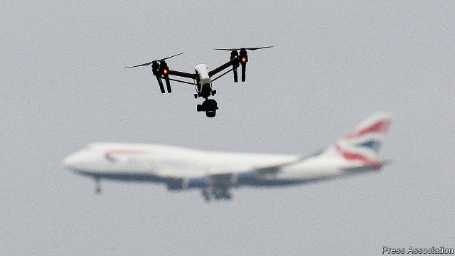

###### Rules for flying robots

# Drones need to be encouraged, and people protected 

##### Tighter regulations will not hamper troublemakers 

 

> Jan 24th 2019 

 

WHILE TESTING a drone to detect sharks off a beach in New South Wales last year, Australian lifeguards spotted two young men struggling to swim in the violent surf. The drone was dispatched to drop an inflatable pod, which the men used to reach the shore safely. Such civilian drones are saviours that have helped rescue mountain-climbers and people trapped by natural disasters. They carry emergency medical supplies and organs for transplant. Apart from saving souls, civilian drones are becoming a good business. Goldman Sachs, a bank, reckons that the market will be worth $100bn by 2020 in areas such as surveying, security and delivery. 

The trouble is that drones also endanger life and cause disruption, as they did on January 22nd when Newark airport near New York closed briefly after a drone was seen nearby. Drone sightings at Gatwick airport near London forced it to shut for 36 hours just before Christmas. Three weeks later a drone closed Heathrow, the world’s third-busiest airport, for an hour. These were hardly the first such incidents. Stockholm’s Arlanda Airport suspended flights in 2017 after spotting a drone. Pilots frequently report near-misses. Because they contain metal parts and potentially explosive lithium-ion batteries, drones can badly damage an aircraft in a collision. They are also used to smuggle contraband across borders and into prisons. In Yemen Houthi rebels recently used a drone to attack the VIP podium of a military parade-ground, reportedly killing six soldiers. 

As with other dual-use technologies, the task for regulators is to encourage the good uses of drones while preventing the bad. The tension between those aims can lead to contradictory impulses. The FBI warned recently that the threat to America from attacks by rogue drones is steadily increasing. The Federal Aviation Administration, meanwhile, is starting to allow some drones to be flown beyond the sight of their operators, which would greatly boost their commercial use. But some in the aviation industry worry that until drones can be incorporated into the air-traffic-control system, the relaxation of safety restrictions could make accidents more likely. 

Rules are needed to ensure that drones are safe, and many countries now have such laws. By and large, professional operators and keen hobbyists will respect them, because they will not want to have their flying permits revoked or their equipment confiscated. Stiff penalties and better information can keep irresponsible users in check. Manufacturers can put safeguards in their drones’ digital-navigation systems to prevent them being flown too high or too close to sensitive sites such as airports. 

But it would be a mistake to pile rules on the industry in order to tackle malicious users, who will simply ignore them. Trouble-makers will not register their drones. They will overcome countermeasures by tampering with safety systems or building their own machines from readily available parts. 

Rather than wrap the drone industry in red tape, the security forces need to take on the rogue operators directly (see article). The first trick is to identify threats quickly. The best hope, already used by some airports, is three-dimensional radar, which, unlike standard airfield radar, can track a drone flying several kilometres away. This can help airports detect if they have a problem, identify the source of the threat and, most important, rapidly determine when it is safe for flights to resume. 

Once a rogue drone has been spotted, it has to be disabled and safely forced down. This comes with risks. Military systems may not be suitable for protecting a big public event or a busy airport surrounded by residential areas. Firing bullets, missiles or lasers risks sending an out-of-control drone crashing into a public place. A better approach is therefore to attempt a “soft kill”, using signal-jamming, which can force a drone to land or seize remote control of it. Signal-jamming has to be careful, though, to ensure that aircraft instruments and airfield-navigation and radio systems are not also affected. 

Investment in counter-drone systems is helping overcome some of these shortcomings. Other countermeasures can be added as better ones come along. But a technological race between malevolent drone operators and the forces of law and order is inevitable. As the countermeasures advance, regulators need to remember that their job is to hobble the bad guys without undermining the many beneficial uses of drones. 

-- 

 单词注释:

1.drone[drәun]:n. 雄蜂, 懒惰者, 嗡嗡的声音, 无人驾驶飞机(或船) vi. 嗡嗡作声, 混日子 vt. 低沉地说 

2.hamper['hæpә]:n. 食篮, 阻碍物, 食盒 vt. 阻碍, 使困累, 妨碍, 牵制 

3.troublemaker['trʌbl.meikә]:n. 惹麻烦的人 

4.Jan[dʒæn]:n. 一月 

5.wale[weil]:n. 隆起的伤痕, 鞭痕, 凸条纹, 精华, 选择 vt. 在...上留下鞭痕, 织成棱纹, 挑选, 撑住 vi. 挑选 

6.lifeguard['laifgɑ:d]:n. 卫兵, 禁卫军, 救生员 

7.surf[sә:f]:n. 海浪, 拍岸浪 vi. 作冲浪运动 

8.dispatch[dis'pætʃ]:vt. 派遣 n. 派遣, 急件 [计] 调度 

9.inflatable[in'fleitәbl]:a. 膨胀的, 得意的, 通货膨胀的 

10.pod[pɒd]:n. 豆荚, (豆荚状的)保护性外壳, 扁豆形矿体 vt. 从豆荚中剥出 vi. 结豆荚 

11.saviour['seivjә]:n. 救助者, 救世主, 救星 

12.goldman[]:n. 高曼（姓氏） 

13.Sachs[zaks]:n. 萨克斯（汽车零配件生产厂商） 

14.reckon['rekәn]:vt. 计算, 总计, 估计, 认为, 猜想 vi. 数, 计算, 估计, 依赖, 料想 

15.endanger[in'deindʒә]:vt. 危及 [法] 使危险, 危及 

16.disruption[dis'rʌpʃәn]:n. 分裂, 崩溃, 瓦解 

17.newark[]:n. 纽瓦克市（美国新泽西州港市） 

18.york[jɔ:k]:n. 约克郡；约克王朝 

19.briefly['brifli]:adv. 简短地, 扼要地, 简明地, 简单地 

20.drone[drәun]:n. 雄蜂, 懒惰者, 嗡嗡的声音, 无人驾驶飞机(或船) vi. 嗡嗡作声, 混日子 vt. 低沉地说 

21.sighting[saitiŋ]:n. 照准；瞄准；视线 

22.GATWICK[]:n. 盖特威克（伦敦第二大机场） 

23.heathrow['hi:θrәj]:n. 希思罗机场（位于英国伦敦） 

24.Arlanda[]:[地名] 阿兰达 ( 瑞典 ) 

25.potentially[pә'tenʃәli]:adv. 可能地, 潜在地 

26.smuggle['smʌgl]:vt. 偷运, 走私, 私运 vi. 走私 

27.contraband['kɒntrәbænd]:n. 违禁品, 走私 a. 禁运的, 非法买卖的 

28.yeman[]:[网络] 也门；叶门；园艺业的普及则始于也门 

29.houthi[]:[网络] 胡塞；也门一侧胡塞；什叶派胡塞 

30.VIP[]:n. 要人, 大人物 [化] 血管活性肠肽 

31.podium['pәudiәm]:n. 墩座, 矮隔墙, 指挥台 [医] 足, 吸足 

32.reportedly[ri'pɒ:tidli]:adv. 根据传说, 根据传闻, 据报道 

33.regulator['regjuleitә]:n. 调整者, 校准者, 校准器, 调整器, 标准钟 [化] 调节剂; 调节器 

34.impulse['impʌls]:n. 冲动, 驱使, 刺激, 推动, 冲力, 建议, 脉冲 vt. 推动 

35.FBI[]:美国联邦调查局 [经] 美国联邦调查局 

36.rogue[rәug]:n. 恶棍, 流氓, 小淘气 vt. 欺骗 vi. 游手好闲 

37.incorporate[in'kɒ:pәreit]:a. 合并的, 组成公司的, 一体化的 vt. 吸收, 合并, 使组成公司, 体现 vi. 合并, 混合, 组成公司 

38.relaxation[.ri:læk'seiʃәn]:n. 松弛, 放松, 减轻, 缓和, 休息, 休养 [化] 松弛; 驰豫 

39.hobbyist['hɔbiist]:n. 有业余癖好者 [计] 业余爱好者 

40.revoke[ri'vәuk]:vt. 撤回, 废除 vi. 藏牌 n. 藏牌 [计] 取消权限程序 

41.confiscate['kɒnfiskeit]:vt. 没收, 把...充公, 查抄 a. 被没收的 

42.penalty['penәlti]:n. 处罚, 刑罚, 罚款, 罚球, 报应, 不利结果, 妨碍 [经] 罚金(款), 违约金 

43.irresponsible[.iri'spɔnsәbl]:a. 不负责任的；不可靠的 

44.safeguard['seifgɑ:d]:n. 保卫, 保护措施, 防护设施 vt. 保卫, 保护 

45.tackle['tækl]:n. 工具, 复滑车, 滑车, 装备, 扭倒 vt. 固定, 处理, 抓住 vi. 扭倒 

46.malicious[mә'liʃәs]:a. 怀恶意的, 恶毒的 

47.countermeasure['kauntә.meʒә]:n. 对策, 反抗手段, 反措施 [法] 对策, 反对手段, 抵制措施 

48.tamper['tæmpә]:vi. 干预, 拨弄, 贿赂, 损害, 篡改 vt. 篡改 n. 捣棒, 打夯机, 填塞者 

49.quickly['kwikli]:adv. 很快地 

50.airfield['єәfi:ld]:n. 飞机场 

51.residential[.rezi'denʃәl]:a. 住宅的, 与居住有关的 [法] 有关居住的, 房产的:居所的, 适于居住的 

52.technological[.teknә'lɒdʒikl]:a. 技术的 [经] 工艺的, 技术的 

53.malevolent[mә'levәlәnt]:a. 有恶意的, 坏心肠的 

54.hobble['hɒbl]:vi. 蹒跚 vt. 使跛行, 阻碍 n. 跛行 

55.undermine[.ʌndә'main]:vt. 在...下面挖, 渐渐破坏, 暗地里破坏 [法] 暗中破坏, 以阴谋中伤伤害 

