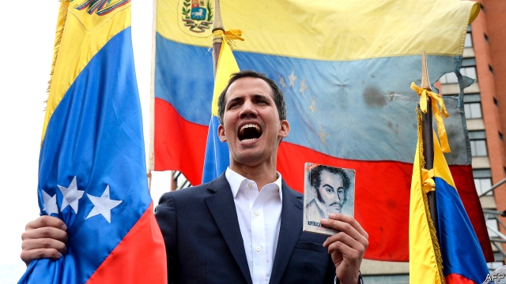

###### The neighbours say enough

# How to hasten the demise of Venezuela’s dictatorship 

##### Recognising an interim president instead of Nicolás Maduro is a start 

 

> Jan 24th 2019 

 

FOR YEARS Venezuela’s socialist regime has seemed on the verge of collapse. It has so mismanaged the economy that GDP has dropped by nearly half since 2013. Inflation last year was thought to be more than 1m per cent. This, plus shortages of food, medicine, running water and electricity, has prompted some 3m Venezuelans, a tenth of the population, to flee the country. Yet its president, Nicolás Maduro, has clung on by flouting the constitution, repressing the opposition and using the country’s dwindling income from oil, almost its only export, to pay off the armed forces that support him. On January 10th Latin America’s most incompetent ruler was sworn in to a second six-year term. 

Yet Mr Maduro’s second inauguration also marked the moment his disastrous presidency lost its formal legitimacy. The election he won in May was an up-and-down fraud. Almost all the members of the Lima group, 14 mostly Latin American countries that worry about Venezuela, declared that they would not recognise him as president. More important, the opposition acquired a young, unifying new leader, Juan Guaidó (pictured), who was sworn in on January 5th as president of the national assembly. That puts him in charge of Venezuela’s last remaining democratically elected institution. 

Suddenly Mr Maduro’s demoralised, divided opponents have been galvanised (see article). Tens of thousands of people across the country demonstrated against the regime on January 23rd, the 61st anniversary of the overthrow of Venezuela’s previous dictatorship. Among them were many poor Venezuelans. They have not lightly turned against a regime founded in 1999 by their hero, the late Hugo Chávez. Before a cheering crowd in Caracas, the capital, Mr Guaidó proclaimed himself the acting president—a role the constitution gives him when the presidency is vacant. In what looked like a co-ordinated move, President Donald Trump immediately recognised Mr Guaidó as Venezuela’s interim leader and most of the Lima group quickly followed. 

That raises two questions. How likely is Mr Maduro to hold on to power? And what can the world do to hasten his departure? Mr Maduro has faced down big protests before, most recently in 2017, when more than 100 people were killed, mostly by forces loyal to the regime. Although two dozen members of the national guard in Caracas rebelled this month, the mutiny was quickly put down. There is no sign yet that the top army commanders will transfer their allegiance to Mr Guaidó. It is their loyalty, not the support of the citizens, that keeps Mr Maduro going. 

Yet Mr Maduro may be running out of road. For the first time since he won a presidential election, in 2013, he faces a single opposition leader who commands wide support. Mr Guaidó must continue to make clear that, should he exercise power, his first act will be to arrange for free elections. Venezuela’s leaders-in-waiting should offer safe passage to Mr Maduro and his cronies to a comfortable refuge, perhaps in Cuba, and a political future to members of the regime who abide by the rules of democracy. 

Much has to go right for Mr Maduro’s wobble to become his downfall. America and the European Union should use all the tools at their disposal to promote peaceful change by boosting Mr Guaidó’s parallel government. That could include putting some of the money paid for oil exports into an account reserved for the national assembly, and using the threat of further sanctions to encourage defections from the regime. The backing of the Lima group will help refute Mr Maduro’s taunts that Mr Guaidó is just a gringo stooge. Should its odious regime finally collapse, Venezuela will need massive international support in the form of humanitarian aid, credit and economic and political help. 

Until this week, the departure of Mr Maduro and the chavista cabal has been at once overdue and also a prospect for the medium term. Today an immiserated, hopelessly misgoverned country may just be on the brink of something better. 

-- 

 单词注释:

1.demise[di'maiz]:n. 崩, 薨, 死亡 vt. 让渡, 遗赠, 转让 

2.dictatorship[dik'teitәʃip]:n. 独裁者之职位, 独裁, 独裁政权 [法] 专攻, 独裁权 

3.interim['intәrim]:a. 暂时的, 临时的, 间歇的 n. 过渡时期 

4.maduro[mә'duәrәu]:a. 色深味浓的烟草做的, (雪茄)色深味浓的 

5.Jan[dʒæn]:n. 一月 

6.regime[rei'ʒi:m]:n. 政权, 当权期间, 政体, 社会制度, 体制, 情态 [医] 制度, 生活制度 

7.verge[vә:dʒ]:n. 边缘, 边界, 起始点 vi. 处在边缘, 接近, 下沉, 趋向 

8.mismanage[mis'mænidʒ]:vt. 处置失当, 对...管理不善 

9.GDP[]:[化] 鸟苷二磷酸 

10.inflation[in'fleiʃәn]:n. 胀大, 夸张, 通货膨胀 [化] 充气吹胀; 膨胀 

11.venezuelan[,venә'zweilәŋ]:a. 委内瑞拉的；委内瑞拉人的 

12.cling[kliŋ]:vi. 粘紧, 附着, 紧贴, 坚持 

13.flout[flaut]:vt. 嘲笑, 愚弄 vi. 表示轻蔑 n. 嘲笑, 愚弄, 轻视 

14.repress[ri'pres]:vt. 镇压, 抑制, 压制 vi. 压制 

15.opposition[.ɒpә'ziʃәn]:n. 反对, 敌对, 相反, 在野党 [医] 对生, 对向, 反抗, 反对症 

16.dwindle['dwindl]:vi. 减少, 缩小, 衰落 vt. 使缩小 

17.incompetent[in'kɒmpitәnt]:a. 无能力的, 无资格的, 机能不全的, 不胜任的 n. 无能力者 

18.inauguration[i,nɔ:^ju'reiʃәn]:n. (美)总统就职, 开幕仪式, 就职典礼, 开始, 开辟, 开创, 为...举行开幕式 [法] 就职, 就职典礼, 创造 

19.disastrous[di'zɑ:strәs]:a. 损失惨重的, 悲伤的 

20.presidency['prezidәnsi]:n. 总统职权, 总裁职位 

21.legitimacy[li'dʒitimәsi]:n. 合法, 正统, 正当 [法] 合法性, 正统性, 婚生 

22.fraud[frɒ:d]:n. 欺骗, 欺诈, 诡计, 骗子 [经] 欺诈, 舞弊, 骗子 

23.lima['li:mә]:n. 利马（秘鲁首都） 

24.Venezuela[,vene'zweilә]:n. 委内瑞拉 

25.unify['ju:nifai]:v. 统一, 使成一体 

26.juan[hwɑ:n]:n. 胡安（男子名） 

27.democratically[.demә'krætikli]:adv. 民主地, 民主主义地 

28.demoralise[di'mɔrәlaiz]:vt. 使士气低落, 使陷入混乱, 使丧失功能, 使道德败坏, 使丧失自尊 

29.galvanise['^ælvәnaiz]:vt. 通电流于, 给...镀锌, 电镀, 刺激, 使兴奋, 激动, 激励, 惊起 

30.tens[]:十位 

31.overthrow[.әuvә'θrәu]:n. 推翻, 瓦解, 倾覆 vt. 打倒, 推翻, 倾覆 

32.hugo['hju:^әu]:n. 雨果（男子名, 等于Hugh） 

33.caracas[kә'rækәs]:n. 加拉加斯（委内瑞拉首都） 

34.donald['dɔnәld]:n. 唐纳德（男子名） 

35.trump[trʌmp]:n. 王牌, 法宝, 喇叭 vt. 打出王牌赢, 胜过 vi. 出王牌, 吹喇叭 

36.quickly['kwikli]:adv. 很快地 

37.mutiny['mju:tini]:n. 叛变, 兵变 vi. 叛变, 反抗, 暴动 

38.allegiance[ә'li:dʒәns]:n. 忠贞, 效忠 

39.presidential[.prezi'denʃәl]:a. 总统制的, 总统的, 首长的, 统辖的 [法] 总统的, 议长的, 总经理的 

40.crony['krәuni]:n. 密友, 亲密伙伴, 好朋友 

41.Cuba['kju:bә]:n. 古巴 

42.abide[ә'baid]:vi. 停留, 遵守, 居留, 继续下去 vt. 忍受, 经受, 屈从于 

43.wobble['wɒbl]:n. 摆动, 摇晃, 不稳定, 抖动 vi. 摇晃, 摇摆, 游移不定 vt. 使摇摆, 使颤动 

44.downfall['daunfɒ:l]:n. 衰败, 大雨 

45.sanction['sæŋkʃәn]:n. 核准, 制裁, 处罚, 约束力 vt. 制定制裁规则, 认可, 核准, 同意 

46.defection[di'fekʃәn]:n. 背叛, 缺乏, 毛病 [法] 缺点, 过失, 背叛 

47.taunt[tɒ:nt]:n. 辱骂, 嘲弄 vt. 嘲弄, 奚落 a. 很高的 

48.gringo['griŋgәu]:n. 外国佬(贬) 

49.stooge[stu:dʒ]:n. 喜剧配角(或丑角), 下手, 助手 vi. 充当配角 

50.odious['әudiәs]:a. 可憎的, 可厌的, 丑恶的 

51.humanitarian[hju:.mæni'tєәriәn]:n. 人道主义者, 博爱者, 基督凡人论者 a. 人道主义的, 博爱的, 凡人论的 

52.chavista[]:[网络] 查维斯派人士；查维兹党人；查维斯主义者 

53.cabal[kә'bæl]:n. 秘密结社, (尤指政治上的)阴谋 vi. 策划阴谋 

54.immiserated[]:[网络] 不客气 

55.hopelessly[]:adv. 绝望地, 无可奈何地 

56.misgovern[mis'gʌvәn]:vt. 管理不当 

57.brink[briŋk]:n. 边缘, 陡岸 

