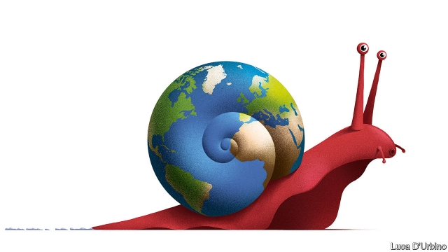

###### Slowbalisation

# The steam has gone out of globalisation 

##### A new pattern of world commerce is becoming clearer—as are its costs 

 

> Jan 24th 2019 

WHEN AMERICA took a protectionist turn two years ago, it provoked dark warnings about the miseries of the 1930s. Today those ominous predictions look misplaced. Yes, China is slowing. And, yes, Western firms exposed to China, such as Apple, have been clobbered. But in 2018 global growth was decent, unemployment fell and profits rose. In November President Donald Trump signed a trade pact with Mexico and Canada. If talks over the next month lead to a deal with Xi Jinping, relieved markets will conclude that the trade war is about political theatre and squeezing a few concessions from China, not detonating global commerce. 

Such complacency is mistaken. Today’s trade tensions are compounding a shift that has been under way since the financial crisis in 2008-09. As we explain, cross-border investment, trade, bank loans and supply chains have all been shrinking or stagnating relative to world GDP (see Briefing). Globalisation has given way to a new era of sluggishness. Adapting a term coined by a Dutch writer, we call it “slowbalisation”. 

The golden age of globalisation, in 1990-2010, was something to behold. Commerce soared as the cost of shifting goods in ships and planes fell, phone calls got cheaper, tariffs were cut and the financial system liberalised. International activity went gangbusters, as firms set up around the world, investors roamed and consumers shopped in supermarkets with enough choice to impress Phileas Fogg. 

Globalisation has slowed from light speed to a snail’s pace in the past decade for several reasons. The cost of moving goods has stopped falling. Multinational firms have found that global sprawl burns money and that local rivals often eat them alive. Activity is shifting towards services, which are harder to sell across borders: scissors can be exported in 20ft-containers, hair stylists cannot. And Chinese manufacturing has become more self-reliant, so needs to import fewer parts. 

This is the fragile backdrop to Mr Trump’s trade war. Tariffs tend to get the most attention. If America ratchets up duties on China in March, as it has threatened, the average tariff rate on all American imports will rise to 3.4%, its highest for 40 years. (Most firms plan to pass the cost on to customers.) Less glaring, but just as pernicious, is that rules of commerce are being rewritten around the world. The principle that investors and firms should be treated equally regardless of their nationality is being ditched. 

Evidence for this is everywhere. Geopolitical rivalry is gripping the tech industry, which accounts for about 20% of world stockmarkets. Rules on privacy, data and espionage are splintering. Tax systems are being bent to patriotic ends—in America to prod firms to repatriate capital, in Europe to target Silicon Valley. America and the EU have new regimes for vetting foreign investment, while China, despite its bluster, has no intention of giving foreign firms a level playing-field. America has weaponised the power it gets from running the world’s dollar-payments system, to punish foreigners such as Huawei. Even humdrum areas such as accounting and antitrust are fragmenting. 

Trade is suffering as firms use up the inventories they had stocked in anticipation of higher tariffs. Expect more of this in 2019. But what really matters is firms’ long-term investment plans, as they begin to lower their exposure to countries and industries that carry high geopolitical risk or face unstable rules. There are now signs that an adjustment is beginning. Chinese investment into Europe and America fell by 73% in 2018. The global value of cross-border investment by multinational companies sank by about 20% in 2018. 

The new world will work differently. Slowbalisation will lead to deeper links within regional blocs. Supply chains in North America, Europe and Asia are sourcing more from closer to home. In Asia and Europe most trade is already intra-regional, and the share has risen since 2011. Asian firms made more foreign sales within Asia than in America in 2017. As global rules decay, a fluid patchwork of regional deals and spheres of influence is asserting control over trade and investment. The European Union is stamping its authority on banking, tech and foreign investment, for example. China hopes to agree on a regional trade deal this year, even as its tech firms expand across Asia. Companies have $30trn of cross-border investment in the ground, some of which may need to be shifted, sold or shut. 

Fortunately, this need not be a disaster for living standards. Continental-sized markets are large enough to prosper. Some 1.2bn people have been lifted out of extreme poverty since 1990, and there is no reason to think that the proportion of paupers will rise again. Western consumers will continue to reap large net benefits from trade. In some cases, deeper integration will take place at a regional level than could have happened at a global one. 

Yet slowbalisation has two big disadvantages. First, it creates new difficulties. In 1990-2010 most emerging countries were able to close some of the gap with developed ones. Now more will struggle to trade their way to riches. And there is a tension between a more regional trading pattern and a global financial system in which Wall Street and the Federal Reserve set the pulse for markets everywhere. Most countries’ interest rates will still be affected by America’s even as their trade patterns become less linked to it, leading to financial turbulence. The Fed is less likely to rescue foreigners by acting as a global lender of last resort, as it did a decade ago. 

Second, slowbalisation will not fix the problems that globalisation created. Automation means there will be no renaissance of blue-collar jobs in the West. Firms will hire unskilled workers in the cheapest places in each region. Climate change, migration and tax-dodging will be even harder to solve without global co-operation. And far from moderating and containing China, slowbalisation will help it secure regional hegemony yet faster. 

Globalisation made the world a better place for almost everyone. But too little was done to mitigate its costs. The integrated world’s neglected problems have now grown in the eyes of the public to the point where the benefits of the global order are easily forgotten. Yet the solution on offer is not really a fix at all. Slowbalisation will be meaner and less stable than its predecessor. In the end it will only feed the discontent. 

For more on slowbalisation, listen to The Economist Asks, our weekly podcast. 

-- 

 单词注释:

1.globalisation[,gləubəlai'zeiʃən]:n. 全球化, =globalization 

2.Jan[dʒæn]:n. 一月 

3.protectionist[prә'tekʃәnist]:n. 贸易保护主义者 a. 贸易保护主义的 

4.provoke[prә'vәuk]:vt. 激怒, 惹起, 诱导 [法] 刺激, 煽动, 激怒 

5.misery['mizәri]:n. 痛苦, 悲惨, 不幸, 穷困 

6.ominous['ɒminәs]:a. 恶兆的, 不吉利的, 预兆的 

7.prediction[pri'dikʃәn]:n. 预言, 预报 [化] 预测 

8.misplace[mis'pleis]:vt. 放错地方 

9.clobber['klɒbә]:n. 衣服, (鞋匠用来掩饰皮革缝的)软膏 vt. 痛打, 击倒, 拉垮 

10.donald['dɔnәld]:n. 唐纳德（男子名） 

11.trump[trʌmp]:n. 王牌, 法宝, 喇叭 vt. 打出王牌赢, 胜过 vi. 出王牌, 吹喇叭 

12.pact[pækt]:n. 契约, 协定, 条约 [化] 合同 

13.xi[sai. zai. ksai. ksi:]:n. 希腊字母的第14个字母；粒子（等于xi particle） 

14.jinping[]:[网络] 锦屏县；习；锦屏网 

15.concession[kәn'seʃәn]:n. 特许, 让步, 认可 [经] 核准, 许可, 特殊(权) 

16.detonate['detәneit]:vt. 引爆, 使爆炸, 使爆裂 vi. 爆炸, 发爆炸声 

17.complacency[kәm'pleisәnsi]:n. 满足, 自鸣得意, 自满 

18.stagnate['stægneit]:v. (使)淤塞, (使)停滞, (使)变萧条 

19.GDP[]:[化] 鸟苷二磷酸 

20.globalisation[,gləubəlai'zeiʃən]:n. 全球化, =globalization 

21.sluggishness['slʌɡɪʃnəs]: 不振, 萧条, 呆滞; 惰性; 滞性; 惯性 

22.Dutch[dʌtʃ]:n. 荷兰人, 荷兰语 a. 荷兰的 

23.behold[bi'hәuld]:vt. 看到, 注视 vi. 看 

24.soar[sɒ:]:n. 高扬, 翱翔 vi. 往上飞舞, 高耸, 翱翔 

25.tariff['tærif]:n. 关税, 关税表, 价格表, 收费表 vt. 课以关税 [计] 价目表 

26.liberalise['lɪbərəlaɪz]:vt. 使自由化 

27.gangbuster['^æŋ,bʌstә(r)]:[法] 取缔流氓组织的执法人员 

28.investor[in'vestә]:n. 投资者 [经] 投资者 

29.roam[rәum]:v. 漫游, 闲逛, 徜徉 n. 漫步, 漫游 

30.philea[]:[网络] 斐利亚；菲力 

31.Fogg[]:福格（人名） 

32.multinational[.mʌlti'næʃәnl]:a. 多国的, 跨国公司的 n. 跨国公司 

33.sprawl[sprɒ:l]:vi. 伸开手足躺, 爬行, 蔓生, 蔓延 vt. 懒散地伸开, 使蔓生, 使不规则地伸展 n. 伸开手足躺卧姿势 

34.scissor['sizә]:vt. 剪, 剪取, 删除, 削减 n. 剪刀 

35.stylist['stailist]:n. 文体学家, 时装设计师 

36.cannot['kænɒt]:aux. 无法, 不能 

37.manufacturing[.mænju'fæktʃәriŋ]:n. 制造业 a. 制造业的 

38.backdrop['bækdrɒp]:n. 背景幕, 背景 

39.ratchet['rætʃit]:n. 棘轮, 棘爪 [机] 棘轮, 棘齿轮 

40.les[lei]:abbr. 发射脱离系统（Launch Escape System） 

41.pernicious[pә'niʃәs]:a. 有害的, 致命的, 恶劣的, 险恶的 [医] 恶性的 

42.equally['i:kwәli]:adv. 相等地, 同样地, 平等地 

43.geopolitical[,dʒi(:)әupә'litikәl]:[计] 地理的 

44.rivalry['raivlri]:n. 竞争, 对抗 [医] 拮抗 

45.tech[tek]:n. 技术学院或学校 

46.stockmarket[s'tɒkmɑ:kɪt]: 证券市场; 证券交易所; 证券行情 

47.privacy['praivәsi]:n. 隐私, 隐居, 秘密 [计] 个人保密权 

48.datum['deitәm]:n. 论据, 材料, 资料, 已知数 [医] 材料, 资料, 论据 

49.espionage[.espiә'nɑ:ʒ]:n. 间谍活动 [法] 间谍活动, 刺探, 间谍 

50.splinter['splintә]:n. 碎片, 尖片, 分裂出来的小派别, 微小的东西 v. 使分裂, (使)破裂 

51.patriotic[.peitri'ɒtik]:a. 爱国的, 有爱国心的 [法] 爱国的, 有爱国心的 

52.prod[prɒd]:n. 刺针, 刺棒, 激励话, 提醒物 vt. 戳, 刺, 刺激 vi. 戳, 刺 

53.repatriate[ri:'pætrieit]:vt. 把...遣返 vi. 回国 n. 被遣返回国者 

54.silicon['silikәn]:n. 硅 [化] 硅Si 

55.EU[]:[化] 富集铀; 浓缩铀 [医] 铕(63号元素) 

56.regime[rei'ʒi:m]:n. 政权, 当权期间, 政体, 社会制度, 体制, 情态 [医] 制度, 生活制度 

57.vet[vet]:n. 兽医 vi. 当兽医 vt. 诊断, 检审 

58.bluster['blʌstә]:vt. 风狂吹, 咆哮, 汹涌 vi. 咆哮着说出, 恐吓 n. 狂风声, 巨浪声, 夸口, 大话 

59.weaponised['wepənaiz]:vt. 把…改装成武器；使…武器化 

60.huawei[]: 华为 

61.humdrum['hʌmdrʌm]:a. 平凡的, 单调的, 令人厌烦的 n. 平凡, 单调, 无聊 vi. 单调令味地进行 

62.antitrust[.ænti'trʌst]:a. 反托拉斯的 [法] 反托拉斯的 

63.inventory['invәntәri]:n. 详细目录, 存货清单 vt. 列入详细目录, 清点存货 [计] 存货清单 

64.anticipation[æn.tisi'peiʃәn]:n. 预期, 预料 [医] 提前出现(如遗传病) 

65.geopolitical[,dʒi(:)әupә'litikәl]:[计] 地理的 

66.multinational[.mʌlti'næʃәnl]:a. 多国的, 跨国公司的 n. 跨国公司 

67.differently['difrentli]:adv. 差异, 不同, 各别, 各种 

68.regional['ri:dʒәnәl]:a. 地方的, 地域性的 [医] 区的, 部位的 

69.bloc[blɒk]:n. 集团 

70.patchwork['pætʃwә:k]:n. 拼缝物, 拼凑物 

71.assert[ә'sә:t]:vt. 主张, 坚称, 断言 [法] 宣称, 断言, 维护 

72.prosper['prɒspә]:vi. 繁荣, 兴隆, 成功 vt. 使成功, 使昌盛 

73.pauper['pɒ:pә]:n. 贫民, 靠救济度日者, 穷人, 乞丐 [法] 贫民, 穷人 

74.integration[.inti'greiʃәn]:n. 综合, 与环境协调的行为, 集成 [化] 集成; 整合 

75.riche[]:n. 暴发户 

76.turbulence['tә:bjulәns]:n. 混乱, 动荡, 骚乱, 紊流 [化] 湍流; 紊流 

77.lender['lendә]:n. 出借人, 贷方 [经] 出借者, 贷方, 贷款人 

78.renaissance[ri'neisәns]:n. 复活, 复兴, 文艺复兴 a. 文艺复兴的 

79.unskilled[.ʌn'skild]:a. 无(特殊)技能的, 不熟练的, 拙劣的 

80.migration[mai'greiʃәn]:n. 移民, 移往, 移动 [计] 迁移 

81.hegemony[hi:'dʒemәni]:n. 霸权, 领导权, 支配权, 拥有支配权的政府 [法] 霸权, 盟主权 

82.mitigate['mitigeit]:vt. 温和, 缓和, 减轻 [医] 缓和, 减轻 

83.meaner[miːn]:vt. 表示…的意思；意思是；作…解释：；意味着；即是： vi. 用意；怀有特定用意；有重要意义；有重要性；有影响： 

84.predecessor[.predi'sesә]:n. 前任, 先辈, 前身 [医] 初牙, 前辈, 祖先 

85.discontent[.diskәn'tent]:n. 不满 

86.economist[i:'kɒnәmist]:n. 经济学者, 经济家 [经] 经济学家 

87.podcast[]:n. 播客 

