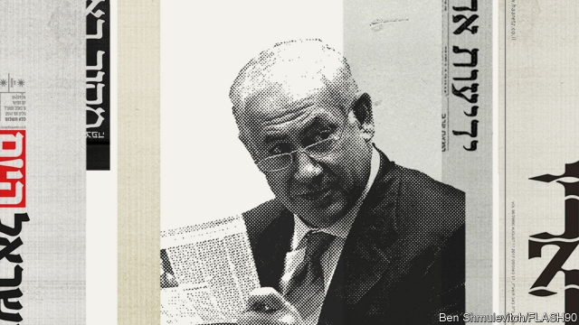

###### “My own media”

# Binyamin Netanyahu’s obsession with the press 

##### The prime minister’s efforts to control the media may lead to his downfall 

 

> Jan 24th 2019 

 

IN OCTOBER 2015 a journalist called Amir Tibon was asked by his editors at Walla!, a popular Israeli news website, to analyse Binyamin Netanyahu’s handling of a wave of shooting and stabbing attacks by Palestinians. The resulting piece was balanced, but included some mild criticism of the prime minister. According to Mr Tibon, the next morning he received a phone call from his editor-in-chief, who said, “We can’t publish this. You know what the circumstances are right now.” 

Other reporters at Walla! now tell similar stories of being censored when their reports were critical of Mr Netanyahu. The police have offered a possible explanation. In December they recommended that Mr Netanyahu and seven other suspects, including the former chairman of Bezeq, a telecommunications company, be indicted for bribery, fraud and breach of trust. In return for positive coverage on Walla!, Mr Netanyahu is alleged to have intervened in regulatory matters to benefit Bezeq, which owns the website. 

Reporters in Israel tend to be secular liberals, but their exposés have brought down politicians of all stripes. Mr Netanyahu, who leads a coalition of nationalist and religious parties, has long believed the press is bent on tarnishing his image, thwarting his plans and removing him from power. He thus set about trying to change the media landscape. He has pushed for laws and rules that would undercut his critics and boost his allies; encouraged his supporters to buy media outlets; and bullied reporters. He may also have broken the law. 

The investigation into Mr Netanyahu’s dealings with Bezeq, known as Case 4000, is one of three that threaten to bring him down. The police have also recommended indicting Mr Netanyahu in Case 2000, in which he is accused of negotiating illicit deals with a newspaper publisher for more favourable coverage. The third, Case 1000, involves Mr Netanyahu’s acceptance of gifts, allegedly worth over $200,000, from Israeli tycoons (indictments were also recommended). Mr Netanyahu denies wrongdoing in all three. The attorney-general will decide soon whether to proceed with them. 

Early in his career, when he was Israel’s dashing young ambassador to the United Nations, Mr Netanyahu benefited from glowing media coverage. Gushing profiles described how the eloquent diplomat was making Israel’s case on the global stage. Reporters, presciently, cast him as a future prime minister. The exposure helped him gain the top spot on the Likud party’s list of candidates when he first ran for the Knesset in 1988. 

But his relations with the press deteriorated. When the Labour government under Yitzhak Rabin signed the Oslo accords with the Palestinians in 1993, most journalists supported it. Mr Netanyahu, who had become leader of Likud, was the treaty’s chief critic. When, two years later, a Jewish zealot murdered Mr Rabin, much of the press accused Mr Netanyahu of whipping up his supporters against the prime minister. 

By the time Likud won at the polls in 1996, Mr Netanyahu’s supporters had begun referring to the “hostile press”. When he lost power in 1999, he blamed reporters for downplaying his accomplishments. Years later, while still in the political wilderness, he told his wealthy patrons, “I need my own media,” and urged them to buy shares in news organisations. Sheldon Adelson, an American casino mogul, went a step further, founding his own freesheet, called Yisrael Hayom, which quickly became Israel’s most widely read newspaper. It is so pro-Netanyahu that it is often called “Bibiton”—a portmanteau of Mr Netanyahu’s nickname, “Bibi”, and the Hebrew word for newspaper, iton. Avigdor Lieberman, an ultranationalist former defence minister, compared it to Pravda. 

The popularity of Yisrael Hayom, which operates at a hefty loss, came at the expense of Israel’s older newspapers, many of which saw their revenues from sales and advertising drop. This, according to the police, led to negotiations between Mr Netanyahu and Arnon Mozes, the publisher of Yedioth Ahronoth, a large newspaper that was critical of the prime minister. The two men were recorded discussing a deal that would have the paper ease up on Mr Netanyahu. “Take down the hostility towards me from 9.5 to 7.5,” he told Mr Mozes. In return, Mr Netanyahu would allow legislation that limited the circulation of popular freesheets, such as Yisrael Hayom. Those discussions form the basis of Case 2000. 

When the deal fell through, Mr Netanyahu reverted to opposing the Yisrael Hayom bill, going so far as to dissolve his government in order to block it. 

Following his fourth election victory in 2015, Mr Netanyahu appointed himself communications minister and allegedly intervened on Bezeq’s behalf. He also changed the regulations on private television broadcasters in ways that drove Channel 10, which was critical of the prime minister, to the brink of bankruptcy. On January 14th the channel merged with Reshet, another private channel. Its main shareholder is now Len Blavatnik, a Soviet-born British-American businessman who has been questioned by the police over his ties to Mr Netanyahu. 

In early 2017, under pressure from the opposition and Israel’s high court, Mr Netanyahu stepped down as communications minister. But he continued to influence the media. Later in the year he sought pre-emptively to muzzle a new public broadcaster by denying it permission to create a news department. Again he threatened to dissolve the government if he did not get his way (he later backed down). Meanwhile, a private station called Channel 20, originally licensed to broadcast religious content, received the government’s blessing to run news programmes. These often cast the prime minister in a positive light. Mr Netanyahu favours it for interviews. 

With Yisrael Hayom and Channel 20, Mr Netanyahu has a growing echo-chamber. But claims that Israel is going the way of Hungary, where Viktor Orban, the prime minister, has throttled the press, are overstated. Channel 20, with dismal ratings, is not nearly as influential as Fox News is in America. Most Israeli journalists remain critical of Mr Netanyahu—and have the backing of their editors and publishers. 

For Mr Netanyahu, that might not be a bad thing. He seems to enjoy playing the victim and has become an astute user of social media. As Israel gears up for an election on April 9th, billboards recently appeared featuring the pictures of four journalists who have published damaging revelations about the prime minister. A slogan on top reads, “They won’t decide” (a Facebook page with the same name was opened). After some confusion over who put them up, Likud took responsibility, adding a note to some of the billboards: “Despite them, Netanyahu!” 

-- 

 单词注释:

1.binyamin[]:本雅明 

2.obsession[әb'seʃәn]:n. 困扰, 困扰人的情绪 [医] 强迫观念 

3.downfall['daunfɒ:l]:n. 衰败, 大雨 

4.Jan[dʒæn]:n. 一月 

5.amir[ә'miә]:n. 埃米尔(穆斯林国家的酋长等称号) 

6.Israeli[iz'reili]:a. 以色列的, 以色列人(语)的 n. 以色列人 

7.Palestinian[,pælis'tiniәn]:[经] 巴勒斯坦的 

8.censor['sensә]:n. 检查员 vt. 检查, 审查, 删改 

9.Netanyahu[]:n. 内塔尼亚胡（人名） 

10.telecommunication['telikәmju:ni'keiʃәn]:n. 电讯, 远距离通讯, 无线电通讯 [计] 远程通信, 电信 

11.indict[in'dait]:vt. 起诉, 控告, 指控 [法] 控告, 揭发, 对...起诉 

12.bribery['braibәri]:n. 贿赂行为, 行贿, 受贿 [经] 行贿, 受贿 

13.fraud[frɒ:d]:n. 欺骗, 欺诈, 诡计, 骗子 [经] 欺诈, 舞弊, 骗子 

14.breach[bri:tʃ]:n. 裂口, 违背, 破坏, 违反, 突破, 破裂 vt. 攻破, 突破 vi. 跳出水面 

15.coverage['kʌvәridʒ]:n. 覆盖的范围, 保险总额, 新闻报导 [化] 可达范围; 覆盖度 

16.allege[ә'ledʒ]:vt. 宣称, 主张, 提出, 断言 [法] 断言, 指称, 指证 

17.intervene[.intә'vi:n]:vi. 插入, 调停, 干涉 [经] 进场干预 

18.regulatory['regjulәtәri]:a. 受控制的, 统制的, 调整的 [经] 规则的 

19.Israel['izreil]:n. 以色列, 以色列后裔, 犹太人 

20.secular['sekjulә]:n. 修道院外的教士 a. 世俗的, 现世的, 长期的 

21.coalition[.kәuә'liʃәn]:n. 结合体, 结合, 联合 [经] 联合, 联盟 

22.nationalist['næʃәnәlist]:n. 国家主义者, 民族主义者 

23.tarnish['tɑ:niʃ]:n. 失泽, 失泽膜, 污点 vt. 使失去光泽, 玷污 vi. 失去光泽, 被玷污 

24.thwart[θwɒ:t]:a. 横放的 vt. 反对, 阻挠, 横过 prep. 横过 adv. 横过 

25.landscape['lændskeip]:n. 风景, 山水, 风景画 vi. 从事景观美化 vt. 美化...景观 [计] 横向 

26.undercut['ʌndәkʌt]:n. 底切, 牛腰部下侧嫩肉, 下口, 下旋削球 vt. 廉价出售, 底切, 雕出, 下旋削球 vi. 切除底部 

27.ally['ælai. ә'lai]:n. 同盟者, 同盟国, 助手 vt. 使联盟, 使联合, 使有关系 vi. 结盟 

28.supporter[sә'pɒ:tә]:n. 支持者, 后盾, 迫随者, 护身织物 [法] 支持者, 赡养者, 抚养者 

29.bully['buli]:n. 欺凌弱小者, 土霸 vt. 威胁, 恐吓, 欺负 vi. 欺负 a. 特好的, 第一流的 adv. 十分 

30.dealing['di:liŋ]:n. 经营行为, 行为, 交易 [法] 待遇, 处置, 行为 

31.illicit[i'lisit]:a. 不法的, 不正当的, 禁止的 [法] 违法的, 违禁的, 被禁止的 

32.publisher['pʌbliʃә]:n. 出版者, 发行人 [法] 发行人, 出版者, 报刊发行者 

33.allegedly[ә'ledʒidli]:adv. 依其申述 

34.tycoon[tai'ku:n]:n. 企业界大亨, 将军 [经] 企业界巨头, 企业家 

35.indictment[in'daitmәnt]:n. 起诉, 控告, 起诉状 [经] 起诉书 

36.wrongdoing['rɒŋ'du:iŋ]:n. 干坏事, 坏事 

37.gush[gʌʃ]:n. 涌出, 滔滔不绝地讲话 v. 涌出, 迸出, 滔滔不绝的讲话 

38.profile['prәufail]:n. 侧面, 轮廓, 传略 vt. 描绘...轮廓, 写...的传略 [计] 提问档; 剖面图法; 剖面法 

39.eloquent['elәkwәnt]:a. 雄辩的, 有口才的, 有说服力的 

40.diplomat['diplәmæt]:n. 外交官, 有外交手腕的人 [法] 外交家, 外交官, 有权谋的人 

41.presciently[]:adv. 预见性地 

42.Likud[li:'ku:d]:n. 利库德集团(以色列右翼党派的政治联盟,长期为以色列执政党) 

43.Knesset['kneset]:n. (以色列)议会 

44.deteriorate[di'tiәriәreit]:v. (使)恶化 

45.Yitzhak[]:n. (Yitzhak)人名；(以)伊扎克 

46.Rabin[]:n. 拉宾（希伯来姓氏） 

47.Oslo['ɒzlәu]:n. 奥斯陆 

48.zealot['zelәt]:n. 热心者, 狂热者, 犹太教狂热信徒 [法] 狂热分子, 激烈分子 

49.downplay['daunplei]:vt. 不予重视 

50.accomplishment[ә'kʌmpliʃmәnt]:n. 成就, 完成 

51.wilderness['wildәnis]:n. 荒野, 荒地, 大量 

52.patron['peitrәn]:n. 赞助人, 顾客, 保护人 [法] 保护人, 庇护人, 赞助人 

53.organisation[,ɔ: ^әnaizeiʃən; - ni'z-]:n. 组织, 团体, 体制, 编制 

54.sheldon['ʃeldәn]:n. 谢尔登（男子名） 

55.adelson[]:[网络] 主席阿德尔森；拉斯维加斯金沙集团艾德森；金沙集团董事长阿德尔森 

56.casino[kә'si:nәu]:n. 卡西诺赌场, 卡西诺牌戏 

57.mogul[mәu'^ʌl, 'mәu^ʌl]:n. 大人物, 有权势的人 

58.freesheet['fri:ʃi:t]:n. (以广告收入支付开支的)免费报纸,赠阅报纸 

59.Yisrael[]:[网络] 以色列；以色列人 

60.HaYom[]:[网络] 今天 

61.quickly['kwikli]:adv. 很快地 

62.portmanteau[pɒ:t'mæntәu]:n. 手提箱 a. 多用的, 混合的 

63.nickname['nikneim]:n. 绰号, 昵称 vt. 给...取绰号, 叫错名字 [计] 绰号 

64.bibi[]:n. 周笔畅 

65.Hebrew['hi:bru:]:n. 希伯来人, 希伯来语, 犹太人 a. 希伯来人的, 希伯来语的 

66.iton[]:[网络] 亿通；伊藤；雷达之星 

67.avigdor[]:n. (Avigdor)人名；(法)阿维格多尔；(英、以)阿维格多 

68.Lieberman[]:利伯曼（人名） 

69.ultranationalist[,ʌltrә'næʃәnәlist]:n. 极端民族主义者, 狭隘民族主义者 [法] 极端民族主义份子 

70.Pravda['prɑ:vdә]:n. 真理报 

71.popularity[.pɒpju'læriti]:n. 名声, 受大众欢迎, 流行 

72.hefty['hefti]:a. 重的, 肌肉发达的 

73.advertising['ædvәtaiziŋ]:n. 广告业, 广告 a. 广告的 [计] 发广告 

74.negotiation[ni.gәuʃi'eiʃәn]:n. 谈判, 磋商, 交涉 [经] 谈判, 协商 

75.arnon[]:n. (Arnon)人名；(法、葡、以、科特、英)阿尔农 

76.Mozes[]:[网络] 泽斯 

77.ahronoth[]:[网络] 哈龙 

78.hostility[hɒs'tiliti]:n. 敌意, 敌对, 反对 

79.circulation[.sә:kju'leiʃәn]:n. 流通, 循环, 发行量 [化] 环流 

80.revert[ri'vә:t]:vi. 恢复, 复归, 回复, 还原 vt. 使回复原状, 使回转 n. 恢复原信仰的人 [计] 还原 

81.broadcaster['brɒ:dkæstә]:n. 播送者, 广播装置, 播种机 

82.brink[briŋk]:n. 边缘, 陡岸 

83.bankruptcy['bæŋkrәptsi]:n. 破产者 [经] 破产, 倒闭 

84.merge[mә:dʒ]:vt. 使合并, 使消失, 吞没 vi. 合并, 渐渐消失 [计] 合并 

85.Reshet[]:[网络] 罗塞特；雷谢特 

86.shareholder['ʃєә.hәuldә]:n. 股东 [法] 股东, 股票持有人 

87.len[]:n. 伦恩（男子名） 

88.opposition[.ɒpә'ziʃәn]:n. 反对, 敌对, 相反, 在野党 [医] 对生, 对向, 反抗, 反对症 

89.muzzle['mʌzl]:n. 动物之鼻口, 口套, 枪口 vt. 戴口套于, 使缄默 

90.originally[ә'ridʒәnli]:adv. 本来, 原来, 最初, 就起源而论, 独创地 

91.Hungary['hʌŋgәri]:n. 匈牙利 

92.Viktor[]:维克托（人名） 

93.orban[]: [人名] 奥尔班 

94.throttle['θrɒtl]:n. 节流阀, 节气阀, 喉咙 vt. 扼喉咙, 使窒息, 压制, 使节流 vi. 窒息, 节流, 减速 

95.overstate[.әuvә'steit]:vt. 夸大的叙述, 夸张, 过分强调 [经] 多计, 高估 

96.dismal['dizmәl]:a. 阴沉的, 凄凉的, 令人忧郁的 n. 低落的情绪, 沼泽 

97.rating['reitiŋ]:n. 等级, 额定功率, 责骂 [经] 等级评定 

98.astute[ә'stju:t]:a. 敏锐的, 狡猾的 

99.billboard['bilbɒ:d]:n. 广告牌, 布告板 vt. 宣传 

100.revelation[.revi'leiʃәn]:n. 揭露, 泄露, 发觉, 默示, 启示 

101.facebook[]:n. 脸谱网 

