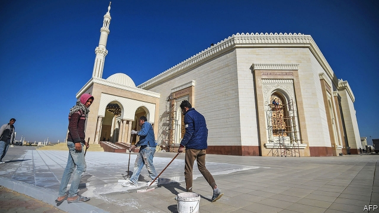

###### An elephant in the desert

# Egypt prepares to open its grand new capital 

##### But the people who are meant to live there may not be able to afford it 

 

> Jan 24th 2019 

 

CAIRO IS KNOWN as the city of a thousand minarets. Its replacement started with just four, the spindly white towers of the Fattah al-Aleem mosque (pictured), a showpiece project in the new purpose-built capital rising in the desert 49km east of Cairo. Abdel-Fattah al-Sisi, the president, unveiled the mosque this month. But no one lives in the city yet. Students from Cairo University, vetted by the government, were bused in for the first Friday prayers on January 18th. Like the mosque, Egypt’s still-nameless new capital is grandiose, empty and tightly controlled. 

Mr Sisi is not the first Egyptian ruler to move the capital. The pharaohs had Thebes and Memphis, to name just two. Alexandria was the heart of Greco-Roman Egypt. The modern capital dates back to 969AD, when Fatimid conquerors commissioned a walled city to mark their triumph. A millennium later the “city victorious”, as it is known, has become a city tumultuous: a congested sprawl of 23m people. In his later years Hosni Mubarak, the dictator deposed in 2011, preferred to govern from the idyllic Sinai resort of Sharm el-Sheikh. 

Five years after he took power in a coup, Mr Sisi is preparing his own move. When (and if) it is finished the new city will stretch over 700 square kilometres, about the size of Singapore. Instead of Cairo’s teeming slums and cramped alleys it features wide boulevards and neat rows of high-rises. Alongside the mosque is the region’s largest cathedral. A state-run Chinese firm is building a business district with Africa’s tallest skyscraper. The city is meant to ease the pressure on Cairo—and, some say, boost Mr Sisi’s ego. 

No one knows what all of this will cost (the initial estimate was $45bn) or how Egypt will pay for it. The project has been plagued by financial problems since its start in 2015. Contract talks have stalled with Emaar, a Dubai property giant, and with a second Chinese firm meant to build $20bn worth of facilities. As ever in Egypt the army stepped into the breach. It owns 51% of the firm overseeing the project, with the rest controlled by the housing ministry. 

A modest first phase opens this year. Parliament hopes to move as early as this summer. About 50,000 bureaucrats (less than 1% of public-sector workers) will soon follow. But foreign embassies are reluctant to move while the city is still deserted. They also worry that, confined to a city with an army “command centre”, they will be cut off from what remains of civil society. Mr Sisi’s government warns that it cannot (or will not) secure embassies in Cairo. 

The bigger question is whether Egyptians themselves will move. Since the 1970s the government has littered the desert with planned cities meant to ease congestion. One called New Cairo, east of old Cairo, was supposed to attract up to 5m residents. It has less than one-tenth of that. The new cities often lack jobs to draw residents. Many have become havens for rich Egyptians fleeing Cairo’s traffic and pollution. 

The new capital will have jobs, but few civil servants can afford to live there. On average they earn 1,247 Egyptian pounds ($70) a week. Last year the housing ministry listed apartment prices in the city at more than 11,000 pounds per square metre. State employees will receive a discount, and plans call for 285,000 low-cost housing units. Neither will provide adequate housing for the 2.1m bureaucrats in Cairo or the other workers needed to run the city. 

On January 25th Egyptians mark the anniversary of the revolution that overthrew Mr Mubarak. His longtime foreign minister, Ahmed Aboul Gheit, recalled watching the unrest from his office window. Soon Cairenes will have further to travel if they want to confront the government. That was undoubtedly part of the plan. 

-- 

 单词注释:

1.Egypt['i:dʒipt]:n. 埃及 

2.Jan[dʒæn]:n. 一月 

3.Cairo['kaiәrәu]:n. 开罗 

4.minaret[.minә'ret]:n. 光塔 

5.replacement[ri'pleismәnt]:n. 归还, 更换, 代替者 [医] 复位, 置换 

6.spindly['spindli]:a. 纺锤形的, 细长的 

7.Fattah[]:[网络] 法塔赫 

8.mosque[mɒsk]:n. 清真寺 

9.showpiece['ʃәupi:s]:n. 展出品, 样品 

10.Cairo['kaiәrәu]:n. 开罗 

11.unveil[.ʌn'veil]:vt. 揭开, 揭幕, 除去...的面纱 vi. 显露, 除去面纱 

12.vet[vet]:n. 兽医 vi. 当兽医 vt. 诊断, 检审 

13.buse[]: [人名] 布斯 

14.grandiose['grændiәus]:a. 宏伟的, 壮丽的, 夸张的 [医] 夸大的 

15.tightly['taitli]:adv. 紧紧地, 坚固地 

16.sisi[]:n. (Sisi)人名；(意)西西 abbr. 短增量敏感指数（short increment sensitivity index） 

17.pharaoh['færәu]:n. 法老, 暴君 [法] 法老, 暴君 

18.thebe['θeibe,'te-]:n. 木卫十四；忒拜（地名）；塞柏（博茨瓦纳一地名） 

19.Memphis['memfis]:n. 孟菲斯 

20.alexandria[,æli^'zɑ:ndriә]:n. 亚历山大港（位于埃及）；亚历山大市（美国弗吉尼亚一城市）；亚历山大大帝 

21.fatimid[ˈfætəˌmɪd]:n. 法蒂玛（穆罕墨德之女）王朝君主, 法蒂玛的后裔 

22.conqueror['kɒŋkәrә]:n. 征服者, 胜利者 

23.millennium[mi'leniәm]:n. 千禧年, 一千年 

24.congest[kәn'dʒest]:vt. 使充满, 使拥塞, 使充血 vi. 充塞, 充血, 拥挤 

25.sprawl[sprɒ:l]:vi. 伸开手足躺, 爬行, 蔓生, 蔓延 vt. 懒散地伸开, 使蔓生, 使不规则地伸展 n. 伸开手足躺卧姿势 

26.Hosni[]:n. (Hosni)人名；(阿拉伯)胡斯尼 

27.Mubarak[]:n. 穆巴拉克（姓氏） 

28.dictator['dikteitә]:n. 命令者, 独裁者 

29.depose[di'pәuz]:vt. 免职, 废黜, 作证 vi. 作证, 供证 

30.idyllic[ai'dilik]:a. 田园诗的, 牧歌的, 悠闲的 

31.sinai['sainai]:n. 西奈 

32.sharm[]: [地名] 港口（阿拉伯语） 

33.coup['ku:]:n. 砰然的一击, 妙计, 出乎意料的行动, 政变 [医] 发作, 中, 击 

34.Singapore[.siŋgә'pɒ:]:n. 新加坡 

35.teem[ti:m]:vi. 充满, 充足, 倾注 vt. 倒出 

36.cramp[kræmp]:n. 痉挛, 腹部绞痛, 铁夹钳 a. 狭窄的, 难认的 vt. 使抽筋, 以铁箍扣紧, 束缚 

37.boulevard['bu:lәvɑ:d]:n. 林荫大道 

38.ego['egәu. 'i:gәu]:n. 自我 [医] 自我 

39.plague[pleig]:n. 瘟疫, 天罚, 麻烦, 灾祸 vt. 折磨, 使苦恼, 使得灾祸 

40.stall[stɒ:l]:n. 厩, 停车处, 牧师职位, 货摊, 托辞, 拖延 vt. 关入厩, 停顿, 推托, 支吾, 使陷于泥中 vi. 被关在厩内, 陷于泥中, 停止, 支吾 

41.emaar[]:[网络] 艾玛尔；埃玛尔地产；房地产公司艾玛尔 

42.dubai['dju:bai]:n. 迪拜（阿拉伯联合酋长国的酋长国之一）；迪拜港（阿拉伯联合酋长国港市） 

43.breach[bri:tʃ]:n. 裂口, 违背, 破坏, 违反, 突破, 破裂 vt. 攻破, 突破 vi. 跳出水面 

44.oversee[.әuvә'si:]:vt. 向下看, 了望, 监督, 偷看到 [法] 监察, 监督, 俯瞰 

45.bureaucrat['bjuәrәukræt]:n. 官僚作风的人, 官僚, 官僚主义者 [法] 官僚, 官僚作风的人 

46.les[lei]:abbr. 发射脱离系统（Launch Escape System） 

47.cannot['kænɒt]:aux. 无法, 不能 

48.congestion[kәn'dʒestʃәn]:n. 拥挤, 充血 [计] 拥挤, 拥塞 

49.haven['heivn]:n. 港, 避难所, 安息所 vt. 安置...于港中, 庇护, 入港 

50.overthrow[.әuvә'θrәu]:n. 推翻, 瓦解, 倾覆 vt. 打倒, 推翻, 倾覆 

51.longtime['lɔŋtaim;'lɔ:ŋ-]:a. (已持续)长时间的,为时甚久的 adv. 长久 

52.ahmed[]:n. 艾哈迈德（男子名） 

53.aboul[]:[网络] abo 

54.Cairene['kaiәri:n]:n. & adj.(埃及首都)开罗(的), 开罗人(的) 

55.confront[kәn'frʌnt]:vt. 使面对, 对抗, 遭遇, 使对质, 比较 [法] 对证, 使对质, 比较 

