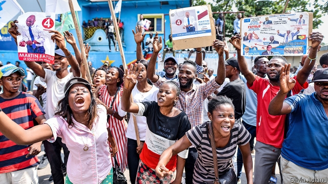

###### The man who won the count

# Félix Tshisekedi’s presidency of Congo begins inauspiciously 

##### It may not get better 

 

> Jan 24th 2019 

 

AGAINST ALL the odds, and the laws of arithmetic, Félix Tshisekedi was due to become the Democratic Republic of Congo’s fifth president as The Economist went to press. A few weeks ago he was trailing in the polls. Experts predicted that the election in December would either be won by Martin Fayulu, a popular opposition candidate, or rigged in favour of the ruling-party candidate, Emmanuel Ramazani Shadary. 

Somehow, Mr Tshisekedi “won”, although data leaked from the electoral commission and a count by 40,000 Catholic volunteers suggest that in fact Mr Fayulu won 60% of the vote. Many suspect a secret deal between the new president and the old one, Joseph Kabila, whose business interests Mr Fayulu had vowed to investigate. 

Mr Fayulu filed a petition before the constitutional court, stacked with Mr Kabila’s appointees. He expected it to fail, and it did. He hoped that street protests would keep up the pressure. “The Congolese people will not accept the result, there may be an uprising,” he said. But few turned out at what was supposed to be his first big public appearance since the court ruling, perhaps because so many armed police did. A small crowd waved photographs of Mr Fayulu. Two hours later the police were lounging in plastic chairs at a nearby restaurant and most people had gone home. Mr Fayulu decided not to show up. 

Mr Tshisekedi’s victory marks the first time an African opposition candidate has been rigged into power, says Nic Cheeseman, an expert on African elections. (Mr Shadary, the ruling party’s candidate, won so few votes that it would have been exceptionally hard to pretend that he won.) 

The new president represents the country’s oldest opposition party. His father, Étienne, challenged corrupt, despotic regimes for decades until his death two years ago. Many hope that his son has inherited his principles. They yearn for a leader who will halt the looting that has lasted longer than most Congolese can remember, under two President Kabilas (father and son) and the kleptocrat Mobutu Sese Seko. With all its minerals, Congo should be rich, but annual income per head is a pathetic $400, 42% less than it was in 1990. 

Mr Tshisekedi has promised, absurdly, to raise incomes tenfold. He has also vowed to restore stability in the east, where dozens of warring militias have brought misery. To do so, he will need to bring the army to heel and take on the elite that plundered Congo on Mr Kabila’s watch. Optimists hope that he will ditch whatever deal he had with his predecessor and strike out on his own. For a precedent, they point to João Lourenço, who shoved aside his predecessor’s family and allies after taking power in neighbouring Angola in 2017. Mr Tshisekedi’s virtues do not include loyalty; he withdrew from a pact to endorse Mr Fayulu last year only a day after signing up. 

Yet Mr Tshisekedi is weak. Few Congolese think him legitimate: leaked electoral commission data suggest that he won less than a fifth of the vote. Because Mr Kabila’s coalition won a big majority in the national assembly (possibly by cheating), Mr Tshisekedi does not have the power to appoint his own cabinet. Nor can he count on the goodwill of Congo’s most important neighbours. Although the leaders of South Africa and Kenya raced to congratulate him, Paul Kagame, Rwanda’s president, has hung back. He and Mr Lourenço were said to be largely responsible for an African Union statement questioning the election and urging a delay in his inauguration. 

Neither Mr Kagame nor Mr Lourenço is likely to help Congo’s new president as long as Mr Kabila—whom they detest—retains influence over him. Yet their acquiescence is vital. Rwanda has invaded Congo in the past. Angola sent troops to save both Mr Kabila (from his own mutinous troops in 2006) and his father (from Rwandan invaders in 1998). Probably neither Kabila would have survived as long without Angolan assistance. But a maritime border dispute and an influx of refugees into Angola from a rebellion in Congo’s Kasai region have soured relations. Rwanda or Angola could easily destabilise Congo again if they wished to. Mr Tshisekedi, an inexperienced and unpopular leader in hock to a crooked and dysfunctional old regime, may not be able to stop them. 

-- 

 单词注释:

1.Félix[]:[地名] 费利克斯 ( 法、西 ) 

2.presidency['prezidәnsi]:n. 总统职权, 总裁职位 

3.Congo['kɔŋ^әu]:n. 刚果, 刚果河, 工夫茶 [建] 刚果, 直接刚果红 

4.inauspiciously[,inɔ:s'piʃəsli]:adv. 不吉利地；不祥地 

5.Jan[dʒæn]:n. 一月 

6.odds[ɒdz]:n. 可能性, 几率, 机会, 胜算, 不平等 

7.tshisekedi[]:齐塞克迪 

8.economist[i:'kɒnәmist]:n. 经济学者, 经济家 [经] 经济学家 

9.Martin['mɑ:tin]:n. 马丁, 圣马丁鸟 

10.opposition[.ɒpә'ziʃәn]:n. 反对, 敌对, 相反, 在野党 [医] 对生, 对向, 反抗, 反对症 

11.rig[rig]:n. 装备, 帆装 vt. 装配, 装扮, 给船装帆, 垄断, 操纵 

12.emmanuel[i'mænjuәl]:n. 以马内利（耶稣基督的别称）；伊曼纽尔（男子名, 等于Immanuel） 

13.ramazani[]:[网络] 拉马扎尼 

14.datum['deitәm]:n. 论据, 材料, 资料, 已知数 [医] 材料, 资料, 论据 

15.electoral[i'lektәrәl]:a. 选举人的, 选举的, (有关)选举的 [法] 选举的, 选举人的, 由选举人组成的 

16.Joseph['dʒәuzif]:n. 约瑟夫（男子名）；约瑟（圣经中雅各的第十一子） 

17.kabila[]:[网络] 卡比拉 

18.vow[vau]:n. 誓约, 誓言, 许愿 vi. 起誓, 发誓, 郑重宣言 vt. 立誓, 起誓要, 郑重地宣布 

19.petition[pi'tiʃәn]:n. 请愿, 诉状, 陈情书, 申请, 祈求, 祷文 v. 正式请求, 恳求, 请愿 

20.constitutional[.kɒnsti'tju:ʃәnl]:a. 宪法的, 立宪的, 体质的 [医] 全身的; 体质的 

21.appointee[ә.pɒin'ti:]:n. 被任命者 [法] 被指定的人, 被任命者 

22.Congolese[,kɔŋ^ә'li:z]:n. 刚果人, 刚果语 a. 刚果的, 刚果语的, 刚果人的 

23.uprise[ʌp'raiz]:n. 升起, 起立, 上山坡, 出现 vi. 上升, 起义, 出现 

24.NIC[nik]:[计] 网络接口卡, 网络信息中心 

25.cheeseman[]: [人名] [英格兰人姓氏] 奇斯曼职业名称，干酪制作者或销售者，来源于古英语，含义是“干酪+人”(cheese+man) 

26.exceptionally[]:adv. 特殊地；异常地；例外地 

27.despotic[de'spɒtik]:a. 专制的, 专横的, 暴虐的 [法] 专制的, 专横的 

28.regime[rei'ʒi:m]:n. 政权, 当权期间, 政体, 社会制度, 体制, 情态 [医] 制度, 生活制度 

29.yearn[jә:n]:vi. 渴望, 想念, 怀念, 同情 

30.loot[lu:t]:n. 赃物, 洗劫, 抢夺 v. 洗劫, 抢夺 

31.kleptocrat[]:贪官污吏 腐败政客 

32.Mobutu[]:n. (Mobutu)人名；(刚(金))蒙博托 

33.sese[]: [医]觉 

34.seko[]:[网络] 赛高；西科；新功 

35.pathetic[pә'θetik]:a. 悲哀的, 可怜的, 感伤的, 差劲的 [医] 感情的 

36.les[lei]:abbr. 发射脱离系统（Launch Escape System） 

37.absurdly[әb'sә:dli]:adv. 荒谬地, 荒唐地, 愚蠢地 

38.tenfold['tenfәuld]:a. 十倍的, 十重的 adv. 十倍地, 十重地 

39.warring['wɔ:riŋ]:a. 交战的, 敌对的, 冲突的 [法] 战争, 敌对行为 

40.militia[mi'liʃә]:n. 义勇军, 民兵组织, 国民军 

41.misery['mizәri]:n. 痛苦, 悲惨, 不幸, 穷困 

42.elite[ei'li:t]:n. 精华, 精锐, 中坚分子 

43.plunder['plʌndә]:n. 抢夺, 掠夺品, 战利品 v. 掠夺, 抢劫, 抢夺 

44.optimist['ɔptimist]:n. 乐观者, 乐观主义者 

45.predecessor[.predi'sesә]:n. 前任, 先辈, 前身 [医] 初牙, 前辈, 祖先 

46.precedent['presidәnt]:n. 先例, 前例 a. 在先的, 在前的 

47.shove[ʃʌv]:n. 推, 挤 vt. 推挤, 猛推, 强使 vi. 推 

48.ally['ælai. ә'lai]:n. 同盟者, 同盟国, 助手 vt. 使联盟, 使联合, 使有关系 vi. 结盟 

49.Angola[æŋ'^әulә]:[经] 安哥拉 

50.pact[pækt]:n. 契约, 协定, 条约 [化] 合同 

51.endorse[in'dɒ:s]:vt. 支持, 赞同, 背书于, 签署 [经] 赞成, 背书 

52.coalition[.kәuә'liʃәn]:n. 结合体, 结合, 联合 [经] 联合, 联盟 

53.goodwill[^jd'wil]:n. 友好, 好意, 善意, 亲善, (企业享有的)信誉, 声誉 [经] (企业的)商誉, 信誉 

54.Kenya['kenjә]:n. 肯尼亚 

55.paul[pɔ:l]:n. 保罗（男子名） 

56.kagame[]:[网络] 卡加梅；卡加梅总统；卡根 

57.inauguration[i,nɔ:^ju'reiʃәn]:n. (美)总统就职, 开幕仪式, 就职典礼, 开始, 开辟, 开创, 为...举行开幕式 [法] 就职, 就职典礼, 创造 

58.acquiescence[.ækwi'esәns]:n. 默许, 默认 [法] 默许, 默认 

59.rwanda[rj'ændә]:n. 卢旺达（东非国家）；卢旺达语 

60.mutinous['mju:tinәs]:a. 暴动的, 反抗的 

61.Rwandan[rj'ɑ:ndәn, -'æn-]:a. 卢旺达的 

62.invader[in'veidә]:n. 侵略者 [化] 侵入物 

63.Angolan[æŋ'^әjlәn]:[经] 安哥拉 

64.maritime['mæritaim]:a. 海的, 海上的, 海事的, 沿海的, 海员的 [经] 海事的, 海上的, 海员的 

65.influx['inflʌks]:n. 流入, 河口, 汇集 [医] 注入, 流入 

66.refugee[.refju'dʒi:]:n. 难民, 流亡者 [法] 避难者, 流亡者, 难民 

67.kasai[kə'sai]:n. 开赛（刚果民主共和国中南部地区）；开赛河（非洲中南部河流） 

68.destabilise[di:'steɪbɪlaɪz]:vt. 破坏政府的稳定 

69.inexperience[.inik'spiәriәns]:n. 无经验, 不熟练 

70.unpopular['ʌn'pɔpjulә]:a. 不得人心的, 不受欢迎的, 不流行的 

71.hock[hɒk]:n. 踝关节, 德国产白葡萄酒, 服刑所 vt. 典当, 割断踝腱使成残废 

72.crook[kruk]:n. 钩, 弯曲部分, 坏蛋 vt. 使弯曲, 诈骗 vi. 弯曲 

73.dysfunctional[dɪsˈfʌŋkʃənl]:a. 功能失调的 

