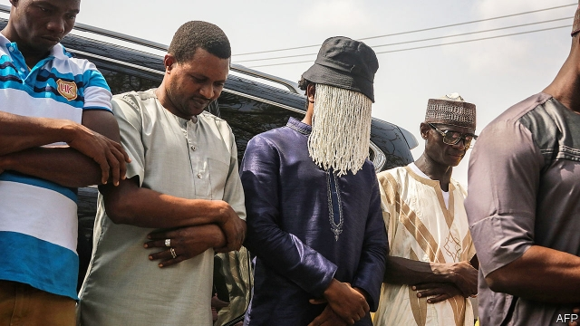

###### Sword 1, Pen 0

# The murder of an investigative journalist shakes Ghana 

##### A politician offered to pay to have him beaten. Someone went even further 

 

> Jan 24th 2019 

 

AHMED HUSSEIN-SUALE DIVELA was stuck in traffic in Ghana’s capital, Accra, when two men on a motorbike shot him three times. The investigative journalist died before his friends could get him to hospital. His killing has shaken this vibrant democracy with its boisterous, muckraking media. 

Mr Divela had no shortage of enemies. He worked for Tiger Eye Private Investigations, a company that mixes award-winning undercover journalism with corporate sleuthing. Three years ago it exposed corruption in Ghana’s judiciary with hidden-camera footage showing judges taking bribes. A dozen were sacked from the high court. 

Last year it blew the whistle on graft at FIFA, football’s global governing body. A documentary showing match-fixing led to the dissolution of Ghana’s football association and the banning or suspension of more than 60 referees and officials. It was this probe that probably led to his death, says Anas Aremeyaw Anas, who founded the company and is Ghana’s most celebrated journalist. Mr Anas, who keeps his identity secret by concealing his face with a veil of beads when appearing in public, has broken stories by disguising himself and pretending to be a janitor in a brothel, a taxi driver and a rock star. But after the football story came out members of his team started getting death threats. 

The most explicit of these menaces was made by Kennedy Agyapong, a ruling-party member of parliament who was implicated in the scandal. He threatened to reveal the identity of Mr Anas, saying he should be hanged. Then he appeared on television with a photo of Mr Divela and told his supporters where he lived in Accra. “I’m telling you, beat him...Whatever happens, I’ll pay.” 

Mr Agyapong has been questioned by police, but he denies any involvement in the murder. Opposition parties have called for him to be punished for inciting violence. Yet instead of condemning him, the ruling New Patriotic Party says that he should be given police protection. A spokesman for the party told a local radio station that Mr Agyapong could not be blamed for the killing since he had only called for Mr Divela’s beating, not his death. 

Mr Anas and Tiger Eye have started an investigation of their own into the murder. “We will not sleep,” says Mr Anas. “We will not surrender.” 

-- 

 单词注释:

1.investigative[in'vestigeitiv]:a. 审查的, 调查的, 好研究的 [法] 调查的, 审查的, 受调查研究的 

2.Ghana['gɑ:nә]:n. 加纳 

3.Jan[dʒæn]:n. 一月 

4.ahmed[]:n. 艾哈迈德（男子名） 

5.Accra[ә'krɑ:]:n. 阿克拉(加纳首都) 

6.vibrant['vaibrәnt]:a. 振动的, 战栗的, 响亮的, 活跃的 

7.boisterous['bɒistәrәs]:a. 猛烈的, 喧闹的, 狂暴的 

8.muckrake['mʌkreik]:n. 揭发丑闻 vi. 探听丑闻, 揭发丑闻 

9.undercover[.ʌndә'kʌvә]:a. 秘密从事的, 秘密的, 从事间谍活动的 [法] 暗中从事的, 秘密的 

10.journalism['dʒә:nәlizm]:n. 新闻业, 报章杂志 [法] 报刊, 新闻业, 新闻出版 

11.corporate['kɒ:pәrit]:a. 社团的, 合伙的, 公司的 [经] 团体的, 法人的, 社团的 

12.sleuthing[ˈslu:θɪŋ]:n. （非警方人员所做的）调查, 侦察 

13.corruption[kә'rʌpʃәn]:n. 腐败, 堕落, 贪污 [计] 论误 

14.judiciary[dʒu:'diʃiәri]:a. 司法的, 法院的, 法官的 n. 司法部, 司法系统, 法官 

15.footage['futidʒ]:n. 英尺长度, 英板尺, (影片的)连续镜头 

16.bribe[braib]:n. 贿赂 vt. 贿赂, 收买 vi. 行贿 

17.graft[grɑ:ft]:n. 嫁接, 贪污 v. 嫁接, 移植, 贪污 

18.FIFA['fi:fә]:abbr. 国际足球联盟（Federation Internationale de Football Association） 

19.documentary[.dɒkju'mentәri]:n. 记录片 a. 文件的 

20.dissolution[.disә'lu:ʃәn]:n. 分解, 溶解, 解散, 结束 [化] 溶解; 溶解作用 

21.probe[prәub]:n. 探索, 调查, 探针, 探测器 v. 用探针探测, 调查, 探索 

22.ana['ɑ:nә]:n. 言论集, 语录, 轶事 [计] 自动数值分析 

23.bead[bi:d]:n. 珠子, 滴 vt. 用珠装饰 vi. 形成珠 [计] 珠 

24.janitor['dʒænitә]:n. 守卫, 门警, 管理人 [医] 幽门 

25.brothel['brɒθәl]:n. 妓院 [法] 妓院 

26.menace['menis]:n. 威胁, 胁迫 v. 威吓, 胁迫 

27.kennedy['kenidi]:n. 肯尼迪（姓氏, 美国第35任总统） 

28.implicate['implikeit]:vt. 涉及, 含意, 暗示, 牵连 n. 包含的东西 

29.supporter[sә'pɒ:tә]:n. 支持者, 后盾, 迫随者, 护身织物 [法] 支持者, 赡养者, 抚养者 

30.involvement[in'vɔlvmәnt]:n. 卷入, 牵连, 包含, 困窘 [经] 财政困难, 经济上的困窘 

31.opposition[.ɒpә'ziʃәn]:n. 反对, 敌对, 相反, 在野党 [医] 对生, 对向, 反抗, 反对症 

32.incite[in'sait]:vt. 刺激, 激励, 引诱 [法] 鼓动, 煽动 

33.patriotic[.peitri'ɒtik]:a. 爱国的, 有爱国心的 [法] 爱国的, 有爱国心的 

34.spokesman['spәuksmәn]:n. 发言人, 代言者 

