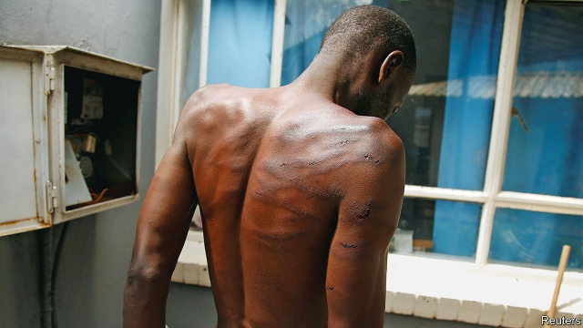

###### Blood on their hands

# Zimbabwe sees its worst state violence in a decade 

##### Is the vice-president plotting against the president, or with him? 

 

> Jan 24th 2019 

 

LAST YEAR Emmerson Mnangagwa strutted around the World Economic Forum (WEF) declaring his country “open for business”. This year Zimbabwe’s president did not even make it to Davos. Instead, on January 21st, having cut short a foreign jaunt that was meant to end at the WEF, he arrived home to a country in chaos. 

Since January 12th, when Mr Mnangagwa sparked protests by announcing a 167% rise in the price of petrol, Zimbabwe’s security forces have meted out violence on a scale not seen for a decade. In the days after the price hike soldiers, police and militiamen from Zanu-PF, the ruling party, went house to house across the country beating, shooting or letting slip dogs on residents as young as 11. 

Over the past week the violence has become more targeted, but no less brutal. Opposition activists have suffered from a campaign of “systematic torture”, according to the Zimbabwe Human Rights Commission. A doctor from another NGO says that it knows of 12 killings, 78 cases of gunshot wounds and hundreds of assaults, but that these are a “fraction” of the total. 

Prisons are bursting. At least 11 opposition MPs have been arrested, as well as the leaders of three of the biggest trade unions. So has Pastor Evan Mawarire, a Christian activist. Hundreds of ordinary folk, including children, are also in jail. 

Upon his return Mr Mnangagwa promised an investigation into the violence. “If required, heads will roll,” he wrote on Twitter. Few believe he cares about the truth. An inquiry last year into the killings of six civilians after elections in July was a whitewash. And he has never explained his own role as Robert Mugabe’s intelligence chief in the massacre of thousands of people in the Matabeleland region in the 1980s. 

Zimbabweans are familiar with police violence and intimidation. But many are scratching their heads as to why this time it has been so harsh. One theory is that Constantino Chiwenga, Zimbabwe’s vice-president, saw an opportunity to cause chaos while Mr Mnangagwa was out of the country and make it seem that the president was not up to the job. Mr Chiwenga, a former head of the armed forces, is widely thought to want to be president, and was angry that in December Mr Mnangagwa secured the support of Zanu-PF to run again in 2023. He also has financial interests to protect. 

A second theory is that, rather than there being a split at the top, Mr Mnangagwa and Mr Chiwenga are engaging in a macabre game of good cop, bad cop. In this version of events the president’s absence is convenient: he can return home, after opponents of his regime have been vanquished, and claim to be cleaning house. 

Both theories have their merits. Zanu-PF is fractious and filled with people who thirst after power and loot. If an opportunity arose for Mr Chiwenga to amass more power, logic dictates that he would happily seize it. 

But it is also implausible that the president was not party to the decision to send the police and army onto the streets. When he announced the rise in fuel prices he warned protesters that “politically motivated activities will not be tolerated.” Mr Mnangagwa was met off the plane by Mr Chiwenga, his comrade of many decades, whom one of the president’s daughters has described as “a brother to Dad”. 

Whatever the truth about the causes of the violence, one thing is certain: ordinary Zimbabweans are suffering. As the economic crisis worsens, the temptation to thump opponents will intensify. On January 23rd soldiers were beating minibus drivers into lowering fares that had risen because of the higher fuel price. 

Western governments have condemned the atrocities of the past fortnight. But their influence is limited. South Africa, home to perhaps millions of Zimbabweans, is more important. Yet Cyril Ramaphosa, the president, is tone-deaf. He told reporters in Davos that Zimbabwe has “embarked on democracy and a path of real recovery”. In this he follows his predecessors, who turned a blind eye to abuses in Zimbabwe and hoped things would improve in time. The protests, fuel queues and collapsing economy suggest a new approach is needed. 

-- 

 单词注释:

1.Zimbabwe[zim'bɑ:bwei]:n. 津巴布韦 

2.Jan[dʒæn]:n. 一月 

3.Emmerson[]:n. (Emmerson)人名；(英)埃默森 

4.Mnangagwa[]:[网络] 南加格瓦 

5.strut[strʌt]:n. 高视阔步, 支柱, 压杆 vi. 趾高气扬地走, 肿胀 vt. 用支柱支撑, 炫耀 

6.forum['fɒ:rәm]:n. 论坛, 公开讨论的广场, 法庭, 讨论会 [法] 讨论会, 专题讨论, 公共论坛 

7.wef[]:abbr. with effect from 有…的影响（或作用，效果） 

8.davo[]:abbr. Dynamic Analogue of Vocal Tract 声道动态模拟（设备） 

9.jaunt[dʒɒ:nt]:n. 远足, 徒步旅游 vi. 远足, 徒步旅游 

10.chao[]:n. 钞（货币） 

11.mete[mi:t]:vt. 量, 测量, 分配 n. 边界, 界石 

12.hike[haik]:n. 徒步旅行, 远足, 涨价, 提高 vi. 步行, 徒步旅行, 上升 vt. 使高涨, 拉起 

13.militiaman[mi'liʃәmәn]:n. 国民兵, 民兵 

14.les[lei]:abbr. 发射脱离系统（Launch Escape System） 

15.brutal['bru:tәl]:a. 残忍的, 野蛮的, 不讲理的 

16.opposition[.ɒpә'ziʃәn]:n. 反对, 敌对, 相反, 在野党 [医] 对生, 对向, 反抗, 反对症 

17.activist['æktivist]:n. 激进主义分子 

18.ngo[]:abbr. 民间组织；非政府组织（Non-Governmental Organization） 

19.killing['kiliŋ]:n. 谋杀, 杀戮 a. 杀害的, 疲惫的, 迷人的 

20.gunshot['gʌnʃɒt]:n. 枪弹, (枪炮)射击, 炮击, 射程 a. 射击的 

21.assault[ә'sɒ:t]:n. 攻击, 袭击 vt. 袭击, 攻击 vi. 发动攻击 

22.opposition[.ɒpә'ziʃәn]:n. 反对, 敌对, 相反, 在野党 [医] 对生, 对向, 反抗, 反对症 

23.MP[]:国会议员, 下院议员 [计] 宏处理程序, 维护程序, 线性规划, 微程序, 多处理器 

24.pastor['pæstә]:n. 牧师 

25.evan['evən]:n. 埃文（男子名） 

26.twitter['twitә]:n. 啁啾, 唧唧喳喳声 vi. 啭, 啁啾, 颤抖 vt. 嘁嘁喳喳地讲, 抖动 

27.Robert['rɔbәt]:[法] 警察 

28.massacre['mæsәkә]:n. 大屠杀 vt. 大屠杀, 残杀 

29.matabeleland[]: [地名] [津巴布韦] 马塔贝莱兰（地区） 

30.Zimbabwean[zim'bɑ:bwiәn]:n. 津巴布韦人 

31.intimidation[in,timi'deiʃәn]:n. 恐吓, 威胁 [法] 恐吓, 威胁 

32.constantino[]:n. (Constantino)人名；(西、意、葡)康斯坦丁诺 

33.macabre[mә'kɑ:brә]:a. 以死亡为主题的, 可怕的 

34.cop[kɒp]:n. 警官 vt. 抓住 

35.regime[rei'ʒi:m]:n. 政权, 当权期间, 政体, 社会制度, 体制, 情态 [医] 制度, 生活制度 

36.vanquish['væŋkwiʃ]:vt. 打败, 征服, 克服 [法] 征服, 战胜, 击败 

37.fractious['frækʃәs]:a. 易怒的, 倔强的, 脾气不好的 

38.loot[lu:t]:n. 赃物, 洗劫, 抢夺 v. 洗劫, 抢夺 

39.amass[ә'mæs]:vt. 积聚, 堆积 

40.implausible[im'plɒ:zәbl]:a. 难以置信的, 不象真实的 

41.protester[]:n. 抗议者, 持异议者, 拒付者 [经] 反对者 

42.politically[]:adv. 政治上 

43.worsen['wә:sn]:vt. 使更坏, 使恶化 vi. 变得更坏, 恶化 

44.thump[θʌmp]:n. 重打, 重击声 v. 重打, 撞击, 痛打 

45.intensify[in'tensifai]:vt. 加强 vi. 强化 

46.atrocity[ә'trɒsiti]:n. 残暴, 凶恶, 暴行 [法] 暴行, 残酷, 残忍 

47.cyril['siril]:n. 西里尔（男子名） 

48.ramaphosa[]:[网络] 拉马福萨；拉马弗萨 

49.embark[im'bɑ:k]:vi. 乘船, 着手, 从事, 上飞机 vt. 使上船, 使上飞机, 使从事 

50.predecessor[.predi'sesә]:n. 前任, 先辈, 前身 [医] 初牙, 前辈, 祖先 

