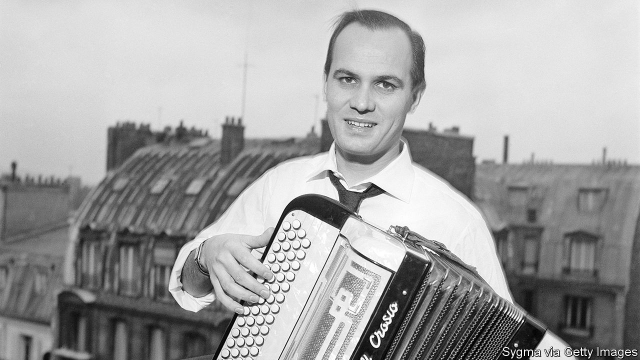

###### To the heights of Parnassus

# Obituary: Marcel Azzola died on January 21st 

##### France’s most doughty champion of the accordion was 91 

 

> Jan 24th 2019 

 

THE HISTORY of the accordion is not a happy one. For decades serious musicians have mocked it as the discordant, breathy, vulgar voice of peasants, clowns and fairground hucksters: an endlessly jovial or sentimental repertoire of folksy tunes. The wheeze of this “piano with braces” has become the sound people dread to hear in restaurants or at railway stations, accompanied by the hopeful chink of coins in a hat. So when Marcel Azzola was asked, in September 1968, to play his accordion to accompany Jacques Brel, the great Belgian chansonnier, at a recording of his song “Vesoul” (listen here), he was hardly surprised by a line in the lyrics: “I can’t stand accordions.” 

But of course he played, because he liked Brel, with whom he sometimes drank a beer or two after recordings. And he unleashed such a torrent of notes, at such speed, to illustrate the potential of his own instrument to dazzle as well as annoy, that Brel was astonished. “Chauffe, Marcel, chauffe!” he cried, in that voice raddled with ennui and four packs of cigarettes a day. Hot it up, take it away. The phrase passed into the language, and after that Mr Azzola, to his surprise, found himself famous. 

He had always been a great player, but in the background way of many accordionists, in concerts or in film. His playing accompanied Edith Piaf in “Sous le Ciel de Paris”, especially in “L’Accordéoniste”, where “this strange little guy” with his “long wiry fingers” got under the singer’s skin; and Jacques Tati, as Mr Hulot, riding his Solex in “Mon Oncle”. His sound, therefore, had already woven itself into the consciousness of France. But apart from “Vesoul”, which he later turned into a solo concert piece, he was not a grandstanding player. His style was modest, impulsive and intense, full of concentration, but also touched with wonder, as though the instrument he played every day could still surprise him. He was less fond of its festive, glittery mood than of its quieter register. Although he was friends for 60 years with André Verchuren, “the king of the accordion” in its street guise, that sharp, discordant quality, “anti-musical” to his ears, did not truly appeal to him. His aim was to take the accordion very much higher up the slopes of Parnassus, towards serious respect. 

“Noble” was a good word: the noble tradition, since the 19th century, of Italian immigrants settling in France, bringing their accordions with them and setting up workshops to make more. His own family were immigrants, from a village near Bergamo. His father, a builder, was also a once-a-week mandolin-player, and put young Marcel on the violin first, like his sisters. But accordions were plentiful in the mean streets of the 20th arrondissement, and he soon switched over. Some of his favourite instruments, Crosios and Cavalognos, came from the old workshops. His teachers, too, Attilio Bonhommi and Médard Ferrero, were Italian émigrés. Ferrero’s method for accordionists was as celebrated as Czerny’s for the piano, and he found in him all the seriousness of classical musicianship, even without a classical repertoire. Ferrero dedicated to him his “Mazurka du Diable”, as if he already anticipated breathtaking turns from him. 

Nonetheless, the main point of a young man learning the accordion (as his father kept telling him) was to earn a living, and this he just about did round the brasseries and dancings of Paris, becoming a player of the people’s accordion despite himself. He grew expert at transposing favourite classical pieces to the accordion, as drunken customers requested them. For years his recordings on the Barclay label were of popular tunes and chansons; his producers told him that customers expected only that from his box of bellows and reeds. But he never ceased taking in other, more fascinating styles. From the jazz clubs he frequented he soaked up bebop, swing and a whole new universe of improvisation for the accordion, until he was playing for Django Reinhardt and with Stéphane Grappelli. A stand-in gig led to a chance encounter with tango, which so enchanted him that he bought a bandoneon, though he could barely afford it, to study it himself. 

The accordion and its variants, he often pointed out, were honoured more in Argentina than anywhere else in the world. But he fought his corner in France, and it paid off. As a professor for 20 years at the national music school in Orsay, he campaigned mightily for accordion to be included as a course at the Paris Conservatoire. He had the delight not only of achieving that, in 2002, but of sitting on the jury that chose the first prof d’accordéon. 

If anyone felt that was not quite right and proper, he had only to show them his collection. He possessed dozens of accordions, many rich and rare. Most came from Parisian antique shops, some were presents; one, a small Crosio, was given to him by a taxi driver who would take it to play while he waited for customers. He displayed them in brass-framed glass cabinets, and online he gave virtual tours. All the latent nobility of the instrument was on display there: its ancient lineage, from Laotian and Chinese metal-reed pipes, and its aristocratic birth in the early 19th century, as an instrument for fashionable drawing rooms. These accordions had bodies of rosewood, tortoiseshell and walnut, inlaid with ivory, copper and gold; they bore mythical scenes and bas-reliefs of great composers. He would walk among them marvelling, stroke them, play them carefully, overjoyed and moved to make music on them. 

Many were decorated with pearls, a fashion that lasted. Other early pieces had marine motifs. Something both he and Brel had noticed, for Brel too had a great tenderness for the accordion, was the connection between this instrument and the sea. It carried within it somehow the mood of ports and oceans, the throb of the waves; music seemed to flow and be drawn out across it. On Brel’s last sea-tinged album, “Les Marquises”, Mr Azzola played again, this time in a different mode. His accordion could still sting, but was often softer, naturally taking its place within and alongside the woodwinds and the strings. And that was as it should be. 

-- 

 单词注释:

1.Parnassus[pɑ:'næsәs]:n. (希腊)帕纳塞斯山, 诗人们, 诗坛 

2.marcel[mɑ:'sel]:n. 波浪形鬈发 vt. 把...烫成波浪形 vi. 烫发 

3.doughty['dauti]:a. 强悍的, 勇敢的, 刚强的 

4.accordion[ә'kɒ:djәn]:n. 手风琴 a. 可折叠的 

5.Jan[dʒæn]:n. 一月 

6.mock[mɒk]:n. 嘲笑, 戏弄, 模仿 a. 假的, 伪造的, 模拟的 adv. 虚伪地 vt. 嘲弄, 模仿, 使失望, 欺骗, 挫败 vi. 嘲弄 

7.discordant[dis'kɒ:dәnt]:a. 不调和的, 不和的 

8.breathy['breθi]:a. 带呼吸声的 

9.vulgar['vʌlgә]:a. 粗俗的, 庸俗的, 普通的, 通俗的, 方言的 [法] 庸俗的, 卑下的, 粗俗的 

10.clown[klaun]:n. 小丑, 乡下人 

11.fairground['fєәgraund]:n. 举行赛会的场所, 露天市场 

12.endlessly['endlisli]:adv. 不断地, 无穷尽地 

13.jovial['dʒәuviәl]:a. 快活的, 高兴的, 愉快的 [计] 国际算法语言的朱尔斯文本 

14.sentimental[.senti'mentl]:a. 感伤的, 感情用事的 

15.repertoire['repәtwɑ:]:n. 全部剧目, 全部技能, 全部节目, 全部作品 

16.folksy['fәuksi]:a. 和气的, 有民间风味的 

17.wheeze[hwi:z]:vi. 喘气 vt. 喘息着说 n. 喘气声, 喘息 

18.brace[breis]:n. 支柱, 曲柄, 支撑, 一对 vt. 紧缚, 支撑, 激励 vi. 打起精神 [计] 花括号 

19.chink[tʃiŋk]:n. 裂口, 裂缝, 弱点, 叮当声 vt. 使叮当响 vi. 堵裂缝, 叮当响 

20.jacque[]:n. (Jacque)人名；(法、西)雅克 

21.brel[]:abbr. British Rail Engineering Limited 英国铁路工程公司 

22.Belgian['beldʒәn]:n. 比利时人 a. 比利时的 

23.chansonnier[ʃɔŋsɔ'njei]:n. 歌手 

24.Vesoul[]:[地名] 沃苏勒 ( 法 ) 

25.recording[ri'kɒ:diŋ]:a. 记录的, 记录用的 n. 录音 

26.unleash[.ʌn'li:ʃ]:vt. 解开...的皮带, 发出, 发动 

27.dazzle['dæzl]:v. (使)眼花, 炫耀 n. 耀眼 

28.chauffe[]:[网络] 司机 

29.raddle['rædl]:n. 代赭石, 编篱笆用的细枝条 vt. 涂红赭色, 涂胭脂色, 把...交织, 编篱笆 

30.ennui['ɒnwi:]:n. 倦怠, 厌倦 [医] 厌倦 

31.alway['ɔ:lwei]:adv. 永远；总是（等于always） 

32.accordionist[ә'kɒ:djәnist]:n. 手风琴师 

33.edith['i:diθ]:n. 伊迪丝（女子名） 

34.Piaf[]:n. (Piaf)人名；(法)皮亚夫 abbr. 心房颤动药物介入（pharmacological intervention in atrial fibrillation） 

35.sou[su:]:n. 苏（昔日法国之一种铜币）；无价值之物 

36.LE[]:[计] 小于或等于 

37.ciel[si:l]:n. 天蓝色 

38.de[di:]:[化] 非对映体过量 [医] 铥(69号元素铥的别名,1916年Eder离得的假想元素) 

39.wiry['waiәri]:a. 金属线制的, 瘦长结实的 [医] 弦样的(指脉搏) 

40.tati[]:n. (Tati)人名；(法、刚(布)、意、印尼)塔蒂 

41.hulot[]:n. (Hulot)人名；(法)于洛 

42.solex[]: 索莱克斯 

43.mon[mәun]:abbr. 发动机辛烷值（Motor Octsne Number）；星期一（Monday） 

44.oncle[]:[网络] 。 

45.solo['sәulәu]:n. 独奏, 独唱, 单独表演 a. 单独的, 独奏的, 独唱的 vi. 放单飞 

46.grandstand['grændstænd]:n. 正面看台, 观众 

47.impulsive[im'pʌlsiv]:a. 冲动的, 受感情驱使的, 任性的 [医] 冲动的 

48.les[lei]:abbr. 发射脱离系统（Launch Escape System） 

49.festive['festiv]:a. 庆祝的, 喜庆的, 欢乐的 

50.glittery['glitәri]:a. 闪光的, 闪烁的 

51.guise[gaiz]:n. 相似, 外观, 伪装 v. 穿戴, 伪装 

52.Bergamo['beә^әmәu]:贝加莫(意大利北部的一个城市) 

53.builder['bildә]:n. 建立者 [机] 组份 

54.arrondissement[,ærɔn'di:s'mɑ:ŋ]:n. 法国的行政区, 郡 

55.attilio[]:阿蒂利奥 

56.Ferrero[]:n. 费列罗（全球第四大巧克力制造商） 

57.seriousness['siәriәsnis]:n. 严肃, 认真, 严重性 

58.musicianship[mju:'ziʃәnʃip]:n. 音乐技巧,音乐感,音乐才能,音乐修养, 音乐鉴赏力 

59.dedicate['dedikeit]:vt. 献出, 贡献 

60.mazurka[mә'zә:kә, -'zuәkә]:n. 玛祖卡舞(波兰一种节奏轻快的舞蹈), 玛祖卡舞曲 

61.diable[]:[网络] 食人魔；炽烈焰魔；迪亚布勒 

62.breathtaking['breθ.teikiŋ]:a. 惊人的, 惊险的 

63.nonetheless[,nʌnðә'les]:conj. 然而, 尽管, 不过 adv. 不过, 仍然, 尽管如此, 然而 

64.dancing['dænsiŋ]:n. 舞蹈 [建] 跳动的 

65.transpose[træns'pәuz]:vt. 调换, 颠倒顺序, 移项 vi. 互换位置 [计] 转置 

66.drunken['drʌŋkәn]:a. 酒醉的 

67.barclay['bɑ:kli]:n. 巴克利（姓氏, 男子名） 

68.chanson['ʃænsәn]:n<法>歌曲,歌谣,小调 

69.producer[prә'dju:sә]:n. 生产者, 制作者, 制作人 [化] 发生器; (炉煤气)发生炉; 制气炉; 生产者 

70.bellow['belәu]:v. 怒吼 

71.fascinate['fæsineit]:vt. 令人入神, 使着迷 vi. 入迷 

72.bebop['bi:bɒp]:n. 博普爵士乐 

73.improvisation[.imprәvai'zeiʃәn]:n. 即兴而作, 即席演奏, 即席作品 

74.django[]:迪亚戈（电影名） 

75.Reinhardt[]:莱因哈特（人名） 

76.Grappelli[]:n. (Grappelli)人名；(法、意)格拉佩利 

77.gig[gig]:n. 旋转物, 轻便双轮马车, 赛艇, 鱼叉, 记过, 爵士乐演奏会 vi. 乘轻便双轮马车, 乘快艇, (用鱼叉)叉鱼 vt. (用鱼叉)叉, 刺激, 记过 

78.tango['tæŋgәu]:n. 探戈舞, 探戈舞曲 vi. 跳探戈舞 

79.enchant[in'tʃænt]:vt. 施魔法, 使入迷 

80.bandoneon[]:班多钮 

81.variant['vєәriәnt]:n. 变体, 异体 a. 不同的, 有差别的 [计] 变体型 

82.Argentina[.ɑ:dʒәn'ti:nә]:n. 阿根廷 

83.orsay[]: [地名] [法国] 奥尔赛 

84.mightily['maitili]:adv. 强烈地, 非常地 

85.conservatoire[kәn'sә:vәtwɑ:]:n. 公立艺术学校 

86.Prof[prɒf]:n. 教授 

87.Parisian[pә'rizjәn]:n. 巴黎人 a. 巴黎的, 巴黎人的 

88.online[]:[计] 联机 

89.latent['leitnt]:a. 潜伏性的, 隐藏的 n. 隐约指纹 

90.nobility[nәu'biliti]:n. 贵族, 高尚, 贵族阶级 

91.lineage['liniidʒ]:n. 血统, 直系 [法] 血统, 世系 

92.Laotian[lei'әuʃiәn]:n. 老挝的, 老挝人, 老挝语 

93.aristocratic[æristә'krætik]:a. 贵族的, 主张贵族统绐的, 有贵族气派的 

94.rosewood['rәuzwud]:n. 红木 

95.tortoiseshell['tɔ:tәʃel]:n. 龟甲, 玳瑁壳, 龟板, 玳瑁色 

96.inlay['inlei]:vt. 嵌入, 镶嵌, 装帧 n. 镶嵌物, 镶嵌工艺, 镶补 

97.ivory['aivәri]:n. 象牙, 乳白色 a. 象牙制的, 乳白色的 

98.mythical['miθikә l]:a. 神话的, 存在于神话中的, 神话式的, 不真实的, 虚构的, 幻想出来的 

99.composer[kәm'pәuzә]:n. 作曲家, 作家, 调停者 

100.marvel['mɑ:vl]:n. 奇异事物, 罕见例子 vt. 惊异于 vi. 惊异 

101.carefully['kєәfuli]:adv. 小心地, 谨慎地 

102.overjoy[.әuvә'dʒɒi]:vt. 使大喜 

103.motif[mәu'ti:f]:n. 主题, 基调, 动机, 基本图案 [法] 主旨, 主题, 动机 

104.tenderness['tendәnis]:n. 柔软, 亲切, 柔和, 敏感, 易触痛 [医] 触痛 

105.throb[θrɒb]:n. 跳动, 搏动 vi. 博动, 抽动, 颤动 

106.marquise[mɑ:'ki:z]:n. 侯爵夫人 

107.woodwind['wudwind]:n. 木管乐器 

