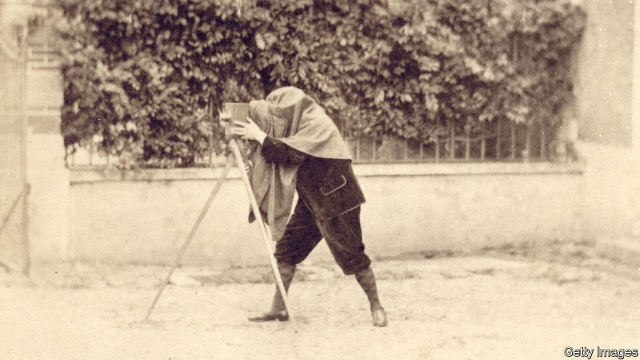
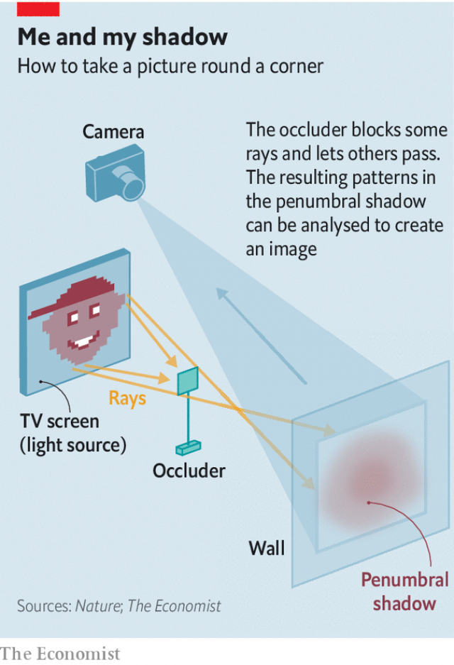

###### Trick photography

# A camera that can see round corners 

##### No flashy lasers are involved. Just an awful lot of computing power 

 

> Jan 24th 2019 

 

CAMERAS THAT look round corners already exist. But they rely on specialised lasers which blink on and off trillions of times a second, and light detectors sensitive enough to track individual photons. Something simpler and more robust would be desirable. And, as they describe in Nature, a team at Boston University in Massachusetts, led by Vivek Goyal, think they have the makings of one. 

In their prototype, Dr Goyal and his colleagues placed an opaque object called an occluder in front of a TV screen that was hidden around the corner from a digital camera (see diagram). Illuminated by the screen, the occluder cast a partial shadow, known as a penumbra, on a wall that the camera could see. Run through appropriate algorithms, patterns within the penumbra, invisible to the eye but recorded by the camera, could be used to reconstruct cartoon faces, university logos and arrangements of stripes that the screen had displayed. 

 

The crucial part of the system was the occluder. Because its shadow was only partial, the wall reflected some light from the screen, but not all of it. In this case the old saying that absence of evidence is not evidence of absence is incorrect. If the size and shape of the occluder are known, it is possible, using sufficiently dizzying maths, to calculate from the pattern of the penumbra what light has been blocked—and thus what the image on the screen looked like. 

Having to know the size and shape of the occluder is, admittedly, quite a restriction on the implementation of Dr Goyal’s method. But these are early days. Future algorithms could include more unknowns about the occluder. That would slow things down computationally (and the prototype is not, in any case, that rapid; it takes 48 seconds to produce an image from the data). But, as computers get faster, this problem should eventually be surmounted. 

If it can be surmounted to the point where occluders of arbitrary shape, such as rocks, trees or parked vehicles, can be used, and the definition of a “wall” is similarly flexible, then round-the-corner imaging of the sort Dr Goyal describes might find wide application. Soldiers would love it, to help avoid nasty, hidden surprises. And self-driving cars that could see down side streets would be much safer. At that point a second old saw would have been proved wrong. Out of sight would no longer necessarily be out of mind. 

-- 

 单词注释:

1.photography[fә'tɒgrәfi]:n. 摄影, 摄影术 [化] 照相术 

2.flashy['flæʃi]:a. 闪光的, 一瞬间的, 浮华的 

3.computing[kәm'pju:tiŋ]:[计] 计算 

4.Jan[dʒæn]:n. 一月 

5.specialise['speʃә,laiz]:vt. 特加指明, 列举, 使专门化, 限定...的范围 vt.vi. (使)特化, (使)专化 vi. 成为专家, 专务, 专攻, 专门研究, 逐条详述 

6.blink[bliŋk]:vi. 眨眼, 闪亮 vt. 眨眼, 使闪亮 n. 眨眼, 瞬间, 闪光, 闪烁 [计] 闪烁 

7.trillion['triljәn]:n. 大量 [经] 兆 

8.detector[di'tektә]:n. 发现者, 检验器, 检波器 [计] 检波器; 检测器 

9.photon['fәutɒn]:n. 光子, 光量子, 光度 [化] 光量子; 光子 

10.robust[rәu'bʌst]:a. 健康的, 强健的, 要用力气的, 坚定的, 粗野的 [计] 健壮性 

11.Boston['bɒstәn]:n. 波士顿 

12.Massachusetts[.mæsә'tʃu:sits]:n. 麻萨诸塞州 

13.vivek[]:[网络] 维维克；维韦克；翻译者李奕廷 

14.goyal[]:[网络] 戈雅尔；亚尔；戈伊尔 

15.making['meikiŋ]:n. 制造, (手工)制造业, 制作, 形成, 发展, 要素, 内在因素, 赚头, 制造物 

16.prototype['prәutәtaip]:n. 原型 [计] 样机; 原型 

17.opaque[әu'peik]:n. 不透明物 a. 不透明的, 不传热的, 不传导的, 阴暗的 [计] 白底 

18.occluder[]:[医] Ж器, 咬合器 

19.illuminate[i'lju:mineit]:vt. 照明, 用灯装饰, 阐明, 说明, 使灿烂 vi. 照亮, 用灯装饰 

20.penumbra[pi'nʌmbrә]:n. 半影, 明暗交界部分, 边缘部分, 周围的气氛 [化] 半影 

21.algorithm['ælgәriðm]:n. 算法 [计] 算法 

22.reconstruct[.ri:kәns'trʌkt]:vt. 重建, 改造 [化] 按原样修复 

23.logo['lәugәu]:n. 连合活字, 商标, 徽标 [计] 徽标 

24.admittedly[әd'mitidli]:adv. 公认地, 诚然 

25.implementation[.implimen'teiʃәn]:n. 安装启用, 实行, 履行 [计] 实施; 实现 

26.computationally[]:adv. computational的变形 

27.datum['deitәm]:n. 论据, 材料, 资料, 已知数 [医] 材料, 资料, 论据 

28.surmount[sә:'maunt]:vt. 战胜, 超越, 克服 

